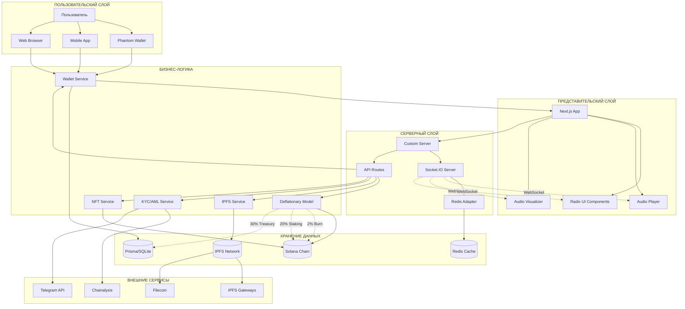
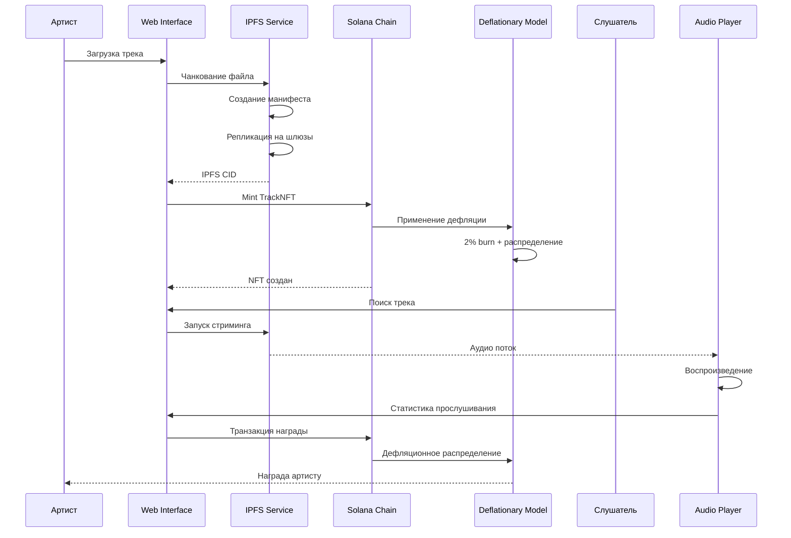
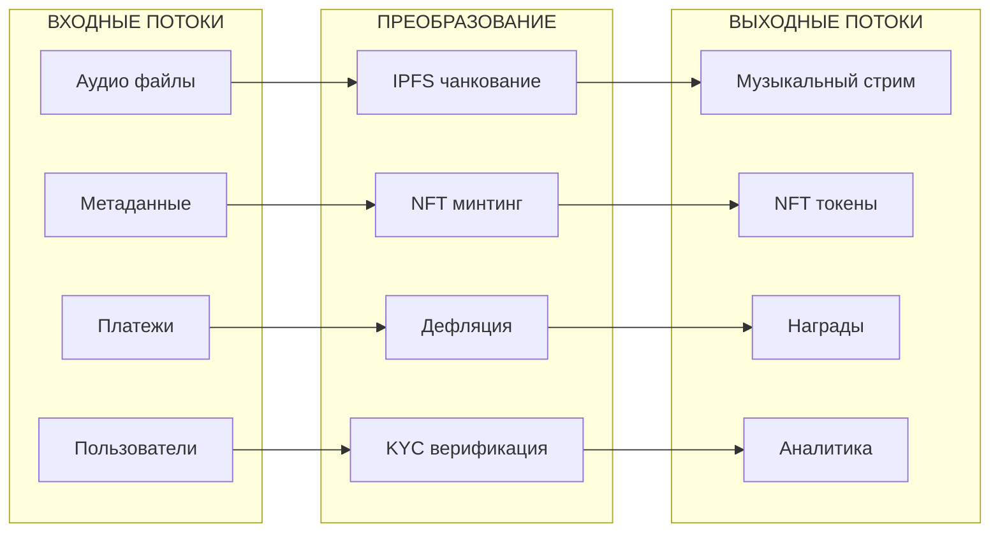
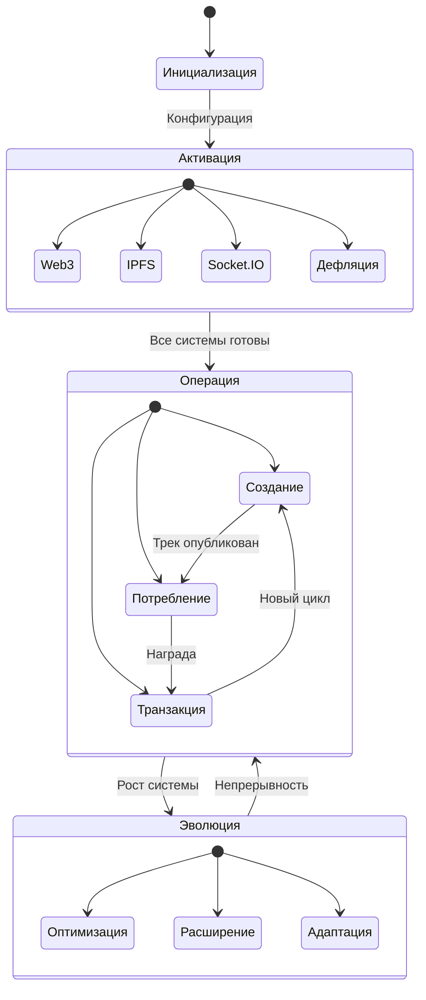

# АРХИТЕКТУРНАЯ ВИЗУАЛИЗАЦИЯ: СИНЕРГИЯ ПОТОКОВ

## МЕРМАЙД-ДИАГРАММА: СТРУКТУРНАЯ ТОПОЛОГИЯ

## ПОТОКОВАЯ ДИАГРАММА: ЖИЗНЕННЫЙ ЦИКЛ ТРЕКА

## АРХИТЕКТУРНАЯ МАТРИЦА: СЛОИ И ОТВЕТСТВЕННОСТИ

| Слой | Компонент | Технология | Ответственность |
|------|------------|------------|----------------|
| **Презентационный** | Next.js App | React/TypeScript | UI рендеринг, маршрутизация |
| **Интерфейсный** | Radix UI | React Components | Доступность, дизайн-система |
| **Аудио** | Audio Player | Web Audio API | Воспроизведение, эквалайзер |
| **Сетевой** | Socket.IO | WebSocket | Реальное время, события |
| **Бизнес-логика** | Wallet Service | Solana Web3.js | Транзакции, подписи |
| **Экономический** | Deflationary Model | Custom Algorithm | Burn, стейкинг, казна |
| **Хранилище** | IPFS Service | Helia/JS-IPFS | Децентрализованное хранение |
| **База данных** | Prisma ORM | SQLite | Реляционные данные |
| **Блокчейн** | Solana Programs | Anchor/Rust | Смарт-контракты |
| **Безопасность** | KYC/AML | Chainalysis | Верификация, комплаенс |

## ЭНЕРГЕТИЧЕСКАЯ КАРТА: ТОЧКИ ВХОДА/ВЫХОДА

## ТЕМПОРАЛЬНАЯ ДИАГРАММА: РИТМ ПЛАТФОРМЫ

```mermaid
gantt
    title Жизненный цикл платформы
    dateFormat X
    axisFormat %s
    
    section Создание
    Загрузка трека     :0, 100
    IPFS обработка     :100, 300
    NFT минтинг       :300, 500
    
    section Распространение
    Репликация        :500, 800
    Индексация        :800, 1000
    Публикация        :1000, 1200
    
    section Потребление
    Стриминг          :1200, 5000
    Интерактив        :1200, 5000
    Аналитика         :1200, 5000
    
    section Трансформация
    Дефляция         :5000, 5200
    Награждение       :5200, 5400
    Эволюция         :5400, 6000
```

## КВАНТОВАЯ СУПЕРПОЗИЦИЯ: СОСТОЯНИЯ СИСТЕМЫ

---

## АРХИТЕКТУРНЫЕ ПРИНЦИПЫ В ВИЗУАЛИЗАЦИИ

### 1. **Модульность через изоляцию**
Каждый компонент имеет чёткие границы и единую точку входа

### 2. **Асинхронность через потоки**
Все взаимодействия происходят через асинхронные потоки данных

### 3. **Избыточность через репликацию**
Критические данные дублируются на нескольких уровнях

### 4. **Эволюция через расширяемость**
Архитектура поддерживает добавление новых компонентов без нарушения целостности

### 5. **Безопасность через верификацию**
Каждая точка входа имеет многоуровневую проверку

Эта визуализация представляет не статическую архитектуру, а живой, дышащий организм, где каждый компонент выполняет свою функцию в общей симфонии децентрализованной музыкальной экосистемы.