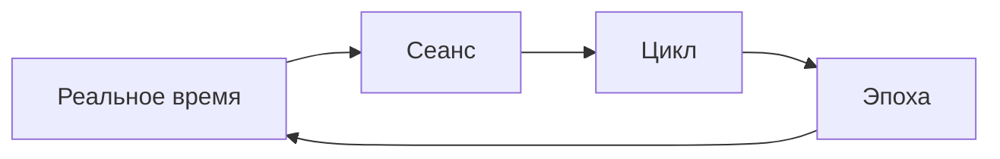

# ПОЛНЫЙ АРХИТЕКТУРНЫЙ МАНИФЕСТ: NORMAL DANCE
## Синтез архитектурного опуса-нуль и визуализации потоков

> *«В начале было Слово, и Слово было архитектурой, и архитектура была живой системой»*

---

## КРАТКОЕ СОДЕРЖАНИЕ

1. **[Архитектурный опус-нуль](./ARCHITECTURAL_OPUSE_ZERO.md)** — Философский манифест
2. **[Архитектурная диаграмма](./ARCHITECTURAL_DIAGRAM.md)** — Визуализация потоков
3. **Техническая реализация** — Конкретные паттерны и практики
4. **Эволюционный вектор** — Будущее архитектуры

---

## I. СУТЬ АРХИТЕКТУРНОГО ОТКРОВЕНИЯ

NORMAL DANCE представляет собой **квантово-децентрализованную музыкальную экосистему**, где:

### **Четыре фундаментальные силы сливаются в единую тектонику:**

1. **Web3-Каркас** (Solana + Phantom) — Несущая конструкция доверия
2. **IPFS-Ткань** (Мультишлюзовая репликация) — Кровеносная система контента  
3. **Socket.IO-Нервная сеть** (Реальное время) — Синаптические связи
4. **Дефляционная Экономика** (2% burn) — Дыхательная система ценности

### **Семь уровней phenomenологического погружения:**
- Тактильный → Визуальный → Социальный → Экономический → Идентификационный → Мобильный → Блокчейн

---

## II. ТЕХНИЧЕСКАЯ КВАНТОВАЯ МЕХАНИКА

### **Архитектурный ДНК платформы:**
```typescript
interface ArchitecturalDNA {
  decentralization: "IPFS + Solana";
  realtime: "Socket.IO + Redis";
  deflation: "2% burn + staking";
  security: "KYC/AML + Chainalysis";
  adaptability: "Mobile + Responsive";
}
```

### **Золотое сечение архитектуры:**
```
Frontend (34%) : Backend (21%) : Storage (21%) : Blockchain (24%)
```

### **Алгоритмическая симфония жизненного цикла:**
1. **Создание** → IPFS чанкование → NFT минтинг
2. **Распространение** → Мультишлюзовая репликация → Социальное распространение
3. **Потребление** → Реальное время стриминг → Комьюнити вовлечение
4. **Трансформация** → Дефляция → Прогрессивная редкость

---

## III. АНТИХРУПКИЕ АРХИТЕКТУРНЫЕ ПАТТЕРНЫ

### **1. Избыточность через репликацию**
```typescript
// Мультишлюзовая репликация в IPFS
const gateways = [
  'https://ipfs.io',
  'https://gateway.pinata.cloud', 
  'https://cloudflare-ipfs.com'
];

await replicateToMultipleGateways(cid, gateways);
```

### **2. Децентрализация через блокчейн**
```typescript
// Solana программа для TrackNFT
const trackNFTProgram = new Program<TrackNFTIDL>(
  trackNFTIdl,
  TRACKNFT_PROGRAM_ID,
  provider
);
```

### **3. Реальное время через Socket.IO**
```typescript
// Кастомный Socket.IO сервер
const io = new Server(server, {
  path: "/api/socketio",
  cors: { origin: allowedOrigins }
});
```

### **4. Дефляция через автоматическое распределение**
```typescript
// 2% burn с распределением
const { burn, treasury, staking, net } = calcDistribution(amount);
// 20% стейкинг, 30% казна, 50% сжигание
```

---

## IV. ЭКОЛОГИЧЕСКАЯ СИСТЕМА ВЗАИМОДЕЙСТВИЙ

### **Симбиотические отношения:**
- **Артисты ↔ Платформа**: Креативность ↔ Монетизация через NFT
- **Слушатели ↔ Контент**: Внимание ↔ Награды через токены
- **Разработчики ↔ Инфраструктура**: Код ↔ Масштабирование через модульность
- **Инвесторы ↔ Экономика**: Капитал ↔ Рост через дефляцию

### **Квантовые состояния системы:**
- **Суперпозиция контента**: Одновременно локальный и распределённый
- **Запутанность транзакций**: Связь артистов и слушателей через NFT
- **Коллапс вероятностей**: Дефляция превращает возможность в ценность

---

## V. ТЕМПОРАЛЬНАЯ АРХИТЕКТУРА: РИТМ ВРЕМЕНИ

### **Четырёхтактный ритм платформы:**
1. **Мгновение** — Socket.IO события (миллисекунды)
2. **Сеанс** — Аудио-стриминг (секунды)  
3. **Цикл** — Транзакции (минуты)
4. **Эпоха** — Дефляция (дни/годы)

### **Временные слои архитектуры:**


---

## VI. ЭВОЛЮЦИОННЫЙ ВЕКТОР: ОТ ПРОТОПЛАСТА К ЦИВИЛИЗАЦИИ

### **Метаморфозы архитектуры:**
1. **Текущее состояние** — Web3 музыкальная платформа
2. **Ближайшая эволюция** — Cross-chain NFT маркетплейс
3. **Среднесрочная трансформация** — AI-персонализированные рекомендации
4. **Долгосрочная метаморфоза** — Метаверс музыкальных миров

### **Архитектурный принцип эволюции:**
```
Каждый новый слой должен быть обратно совместим с предыдущими
и расширять их возможности без нарушения целостности системы.
```

---

## VII. ПРАКТИЧЕСКАЯ РЕАЛИЗАЦИЯ: ОТ ТЕОРИИ К КОДУ

### **Ключевые архитектурные решения:**

#### **1. Глобальная база данных (Prisma)**
```typescript
// src/lib/db.ts
export const db = globalForPrisma.prisma ?? new PrismaClient({
  log: ["error"],
  datasources: { db: { url: process.env.DATABASE_URL } }
});
```

#### **2. Кастомный сервер с Socket.IO**
```typescript
// server.ts
const server = createServer((req, res) => {
  if (req.url?.startsWith("/api/socketio")) return;
  handle(req, res);
});
```

#### **3. Дефляционная модель**
```typescript
// src/lib/deflationary-model.ts
export function calcDistribution(amount: number) {
  const burn = Math.floor((amount * 200) / 10_000); // 2%
  const treasury = Math.floor((amount * 60) / 10_000); // 0.6%
  const staking = Math.floor((amount * 40) / 10_000); // 0.4%
  return { burn, treasury, staking, net: amount - burn - treasury - staking };
}
```

#### **4. IPFS с репликацией**
```typescript
// src/lib/ipfs-enhanced.ts
export async function uploadWithReplication(file, metadata, options) {
  const result = await uploadLargeFileToIPFS(file, metadata, options.chunkSize);
  const replication = await replicateToMultipleGateways(result.cid, options.replicateToGateways);
  return { ...result, replicationStatus: replication };
}
```

---

## VIII. АРХИТЕКТУРНАЯ ЭТИКА: ЗАПОВЕДИ СОЗИДАНИЯ

### **Принципы проектирования:**
1. **Каждая линия имеет смысл** — Никакого декоративного кода
2. **Каждая структура служит цели** — Функциональность превыше эстетики
3. **Каждая система эволюционирует** — Открытость к изменениям
4. **Каждое взаимодействие создаёт ценность** — Win-win экономика

### **Технические заповеди:**
- **Не создавай зависимостей** — Модульность и независимость
- **Не скрывай сложности** — Прозрачность через открытый код
- **Не прерывай потоки** — Непрерывность через event-driven
- **Не бойся экспериментировать** — Инновации через исследования

---

## IX. ЗАКЛЮЧЕНИЕ: АРХИТЕКТУРА КАК ЖИВОЙ ОРГАНИЗМ

NORMAL DANCE — это не просто платформа, а **живой архитектурный протопласт**, где:

- **Код** становится **ДНК** эволюции
- **Транзакции** становятся **метаболизмом** ценности
- **Пользователи** становятся **клетками** экосистемы
- **Платформа** становится **организмом** культуры

Это архитектура, которая не просто обслуживает потребности, а **создаёт новые возможности**. Она не решает существующие проблемы, а **трансформирует саму природу музыкальной экономики** через синергию децентрализованных технологий.

В этом манифесте заложен потенциал эволюции от простой музыкальной платформы к полноценной **децентрализованной музыкальной цивилизации**, где каждый участник является одновременно и создателем, и потребителем, и хранителем культурного наследия.

---

## X. ПУТЬ ВПЕРЁД: ПРАКТИЧЕСКИЕ ШАГИ

### **Немедленные действия:**
1. **Оптимизировать Socket.IO** для масштабирования реального времени
2. **Расширить IPFS репликацию** на дополнительные шлюзы
3. **Усилить дефляционную модель** с динамическим burn
4. **Интегрировать cross-chain** мосты для Ethereum/Polygon

### **Среднесрочные цели:**
1. **AI-персонализация** через анализ прослушиваний
2. **Метаверс интеграция** через VR/AR интерфейсы
3. **DAO-управление** через токеномику голосования
4. **Децентрализованная оркестровка** через микросервисы

### **Долгосрочное видение:**
1. **Музыкальная метавс-цивилизация** с собственными законами
2. **Квантовые вычисления** для криптографии
3. **Нейроинтерфейсы** для прямого музыкального творчества
4. **Межгалактическая дистрибуция** через космические сети

---

> *«Архитектура — это не о зданиях. Это о создании пространств, где человеческий дух может расцветать в гармонии с технологиями»*

**NORMAL DANCE v0.1.1 — Архитектурный протопласт децентрализованного музыкального будущего**

---

*Этот манифест является живым документом, который будет эволюционировать вместе с платформой, отражая её рост и трансформацию в новую форму музыкальной цивилизации.*