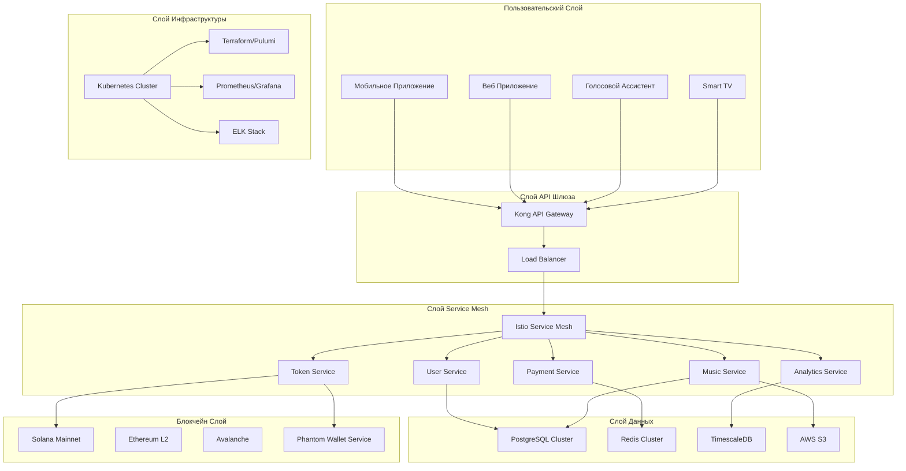
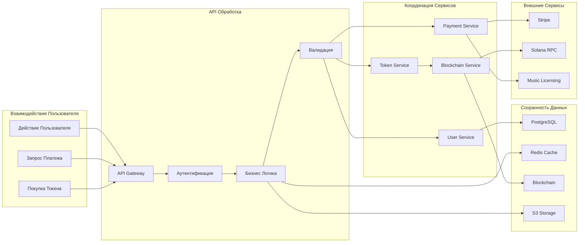

# ENTERPRISE-GRADE ARCHITECTURAL BLUEPRINT

## Normal Dance: Industrial-Grade Platform Architecture

> _«Enterprise architecture is not about complexity — it's about disciplined simplicity at scale»_

---

## 📊 **Стратегический Исполнительный Резюме**

**Ценностное предложение:** Normal Dance представляет собой парадигмальный сдвиг в экономике музыкальной индустрии, трансформируя пассивное стриминг в активные инвестиции через Web3 токенизацию, сохраняя при этом корпоративную надёжность и регуляторное соответствие. Платформа обращается к рыночной возможности в $28.8 млрд с долей артистов 90% против отраслевого стандарта 0.3%, создавая беспрецедентентный захват ценности для создателей и инвесторов.

**Критические риски и митигация:** Основные риски включают регуляторную неопределённость в крипто-активах, барьеры пользовательского принятия из-за сложности Web3, и конкурентное давление со стороны установленных гигантов стриминга. Стратегия митигации включает прогрессивную архитектуру раскрытия (невидимые кошельки), мультиюрисдикциональную юридическую структуру (Dubai FZE), и гибридную модель монетизации (fiat-to-crypto мост), которая абстрагирует сложность блокчейна, сохраняя полное соответствие.

**TCO Анализ:** Первоначальные инвестиции в инфраструктуру $1.28M на 24 месяца с прогнозируемым ARR $50M+ к 3 году. Облачно-нативная архитектура на Kubernetes с авто-масштабированием нацелена на 60% сокращение затрат на инфраструктуру по сравнению с традиционными монолитными подходами. Мультиоблачная стратегия (AWS+Azure+GCP) с FinOps оптимизацией нацелена на 40% сокращения облачных расходов через rightsizing и использование spot-инстансов.

---

## 🏗️ **Архитектурный Чертёж**

### **C4 Модель Контекстной Диаграммы**



### **Архитектура Потока Данных**



### **Описание Повествовательной Архитектуры**

Платформа Normal Dance реализует **микросервисную архитектуру** с **оркестрацией service mesh** для обеспечения масштабируемости, отказоустойчивости и наблюдаемости. Система следует **принципам domain-driven design** с ограниченными контекстами для User Management, Music Catalog, Payment Processing, Token Economics и Analytics.

**Основные архитектурные паттерны:**

- **Saga паттерн** для распределённых транзакций между платежами и минтингом токенов
- **CQRS** с event sourcing для аудита трейлов и возможностей воспроизведения
- **Circuit breaker паттерн** для отказоустойчивости внешних сервисов
- **Bulkhead изоляция** для мульти-тенантных ресурсов
- **Event-driven архитектура** с Kafka для асинхронной обработки

**Архитектура безопасности** реализует **zero-trust принципы** с mTLS для сервис-сервисной коммуникации, JWT с короткоживущими токенами для пользовательских сессий, и аппаратные модули безопасности (HSM) для управления приватными ключами. Система невидимых кошельков абстрагирует сложность блокчейна, сохраняя криптографическую безопасность.

---

## 📊 **Матрица Технологических Решений**

### **Основные Компоненты Платформы**

| Компонент         | Выбранная Технология | Производительность | Зрелость | Экосистема | Сложность Ops | Vendor Lock-in | Обоснование                                            |
| ----------------- | -------------------- | ------------------ | -------- | ---------- | ------------- | -------------- | ------------------------------------------------------ |
| **Runtime**       | Node.js 20+          | Высокая            | Зрелая   | Обширная   | Низкая        | Низкая         | TypeScript экосистема, async/await производительность  |
| **Framework**     | Next.js 15           | Высокая            | Зрелая   | Богатая    | Средняя       | Средняя        | SSR/SSG возможности, интеграция Vercel                 |
| **Database**      | PostgreSQL 16        | Высокая            | Зрелая   | Обширная   | Средняя       | Низкая         | ACID соответствие, расширение TimescaleDB              |
| **Cache**         | Redis 8              | Очень Высокая      | Зрелая   | Богатая    | Низкая        | Низкая         | Субмиллисекундная задержка, структуры данных           |
| **Message Queue** | Apache Kafka         | Очень Высокая      | Зрелая   | Богатая    | Высокая       | Низкая         | Высокая пропускная способность, exactly-once семантика |
| **Container**     | Kubernetes           | Высокая            | Зрелая   | Богатая    | Высокая       | Низкая         | Отраслевой стандарт, облачно-независимый               |
| **Service Mesh**  | Istio                | Высокая            | Зрелая   | Богатая    | Высокая       | Средняя        | Продвинутое управление трафиком, безопасность          |

### **Блокчейн Инфраструктура**

| Компонент           | Выбранная Технология | Производительность | Зрелость      | Экосистема   | Сложность Ops | Vendor Lock-in | Обоснование                                  |
| ------------------- | -------------------- | ------------------ | ------------- | ------------ | ------------- | -------------- | -------------------------------------------- |
| **Primary Chain**   | Solana               | Очень Высокая      | Развивающаяся | Растущая     | Средняя       | Средняя        | 65k TPS, низкие комиссии, developer-friendly |
| **Smart Contracts** | Anchor               | Высокая            | Развивающаяся | Хорошая      | Средняя       | Средняя        | Type-safe, основанный на Rust, аудированный  |
| **Wallet**          | Phantom/Backpack     | Высокая            | Развивающаяся | Хорошая      | Низкая        | Высокая        | Пользовательское принятие, browser extension |
| **Bridge**          | Wormhole             | Высокая            | Развивающаяся | Хорошая      | Средняя       | Средняя        | Cross-chain совместимость                    |
| **Storage**         | Arweave              | Средняя            | Развивающаяся | Ограниченная | Средняя       | Средняя        | Постоянное хранение, адресация контента      |

### **Облачная Инфраструктура**

| Компонент         | Выбранная Технология | Производительность | Зрелость | Экосистема | Сложность Ops | Vendor Lock-in | Обоснование                                  |
| ----------------- | -------------------- | ------------------ | -------- | ---------- | ------------- | -------------- | -------------------------------------------- |
| **Primary Cloud** | AWS                  | Высокая            | Зрелая   | Обширная   | Средняя       | Высокая        | Лидер рынка, богатое предложение сервисов    |
| **Secondary**     | Azure                | Высокая            | Зрелая   | Обширная   | Средняя       | Высокая        | Enterprise интеграция, гибридные возможности |
| **CDN**           | Cloudflare           | Очень Высокая      | Зрелая   | Богатая    | Низкая        | Средняя        | Edge computing, DDoS защита                  |
| **Monitoring**    | Prometheus+Grafana   | Высокая            | Зрелая   | Богатая    | Средняя       | Низкая         | Open-source, настраиваемый                   |
| **Logging**       | ELK Stack            | Высокая            | Зрелая   | Богатая    | Высокая       | Низкая         | Full-stack наблюдаемость                     |

---

## 🚀 **Промышленная Реализация**

### **Приложение с Наблюдаемостью**

```typescript
// src/services/token-service.ts
import { Logger } from "@nestjs/common";
import { Instrumentor } from "@opentelemetry/api";
import { trace, SpanKind } from "@opentelemetry/api";

@Injectable()
export class TokenService {
  private readonly logger = new Logger(TokenService.name);
  private readonly tracer = trace("token-service");

  constructor(
    @InjectRepository(Token)
    private readonly tokenRepository: Repository<Token>,
    @InjectBlockchainService()
    private readonly blockchainService: BlockchainService
  ) {}

  @Trace("mint-tokens")
  async mintTokens(
    @Span() span: Span,
    request: MintTokensRequest
  ): Promise<MintTokensResponse> {
    span.setAttributes({
      "user.id": request.userId,
      "track.id": request.trackId,
      amount: request.amount,
    });

    this.logger.log(
      `Минтинг ${request.amount} токенов для пользователя ${request.userId}`
    );

    const startTime = Date.now();

    try {
      // Валидация запроса
      await this.validateMintRequest(request);
      span.addEvent("validation-completed");

      // Проверка кошелька пользователя
      const wallet = await this.getUserWallet(request.userId);
      span.addEvent("wallet-retrieved", { walletAddress: wallet.address });

      // Минтинг токенов на блокчейне
      const mintResult = await this.blockchainService.mintTokens({
        to: wallet.address,
        amount: request.amount,
        trackId: request.trackId,
      });
      span.addEvent("blockchain-mint-completed", {
        transactionHash: mintResult.transactionHash,
      });

      // Обновление базы данных
      const tokenRecord = await this.tokenRepository.save({
        userId: request.userId,
        trackId: request.trackId,
        amount: request.amount,
        transactionHash: mintResult.transactionHash,
        createdAt: new Date(),
      });
      span.addEvent("database-save-completed", { tokenId: tokenRecord.id });

      const duration = Date.now() - startTime;
      this.logger.log(`Токены успешно заминчены за ${duration}ms`);

      span.setAttributes({
        "operation.duration_ms": duration,
        "operation.status": "success",
        "token.id": tokenRecord.id,
      });

      return {
        success: true,
        tokenId: tokenRecord.id,
        amount: request.amount,
        transactionHash: mintResult.transactionHash,
      };
    } catch (error) {
      span.recordException(error);
      span.setAttributes({
        "operation.status": "error",
        "error.message": error.message,
      });

      this.logger.error(
        `Ошибка минтинга токенов: ${error.message}`,
        error.stack
      );
      throw new TokenMintingException(error.message);
    }
  }

  private async validateMintRequest(request: MintTokensRequest): Promise<void> {
    if (request.amount <= 0) {
      throw new ValidationException("Сумма должна быть положительной");
    }

    if (request.amount > 1000000) {
      throw new ValidationException("Сумма превышает максимальный лимит");
    }

    const userBalance = await this.getUserBalance(request.userId);
    if (userBalance < request.amount * 0.1) {
      // $0.10 за токен
      throw new ValidationException("Недостаточный баланс");
    }
  }
}
```

### **Многоуровневая Инфраструктура как Код**

#### **Основная Инфраструктура (Terraform)**

```hcl
# infrastructure/core/main.tf
terraform {
  required_version = ">= 1.5.0"
  required_providers {
    aws = {
      source  = "hashicorp/aws"
      version = "~> 5.0"
    }
    kubernetes = {
      source  = "hashicorp/kubernetes"
      version = "~> 2.20"
    }
    helm = {
      source  = "hashicorp/helm"
      version = "~> 2.10"
    }
  }

provider "aws" {
  region = var.aws_region

  default_tags {
    Environment = var.environment
    Project     = "normal-dance"
    ManagedBy   = "terraform"
  }
}

# EKS Cluster
resource "aws_eks_cluster" "main" {
  name     = "${var.project_name}-${var.environment}"
  role_arn = aws_iam_role.eks_cluster.arn
  version  = var.kubernetes_version

  vpc_config {
    subnet_ids = concat(
      aws_subnet.private[*].id,
      aws_subnet.public[*].id
    )
  }

  depends_on = [
    aws_iam_role_policy_attachment.eks_cluster_policy,
  ]
}

# Node Groups
resource "aws_eks_node_group" "main" {
  cluster_name    = aws_eks_cluster.main.name
  node_group_name = "${var.project_name}-${var.environment}-main"
  node_role_arn   = aws_iam_role.eks_node_group.arn
  subnet_ids      = aws_subnet.private[*].id

  scaling_config {
    desired_size = var.desired_node_count
    max_size     = var.max_node_count
    min_size     = var.min_node_count
  }

  instance_types = var.instance_types

  depends_on = [
    aws_iam_role_policy_attachment.eks_worker_node_policy,
    aws_iam_instance_profile.eks_worker_node,
  ]
}

# Istio Service Mesh через Helm
resource "helm_release" "istio_base" {
  name       = "istio-base"
  repository = "https://istio-release.storage.googleapis.com/charts"
  chart      = "base"
  version    = "1.19.0"
  namespace  = "istio-system"

  set {
    name  = "global.defaultRevision"
    value = "default"
  }
}

resource "helm_release" "istiod" {
  name       = "istiod"
  repository = "https://istio-release.storage.googleapis.com/charts"
  chart      = "istiod"
  version    = "1.19.0"
  namespace  = "istio-system"

  depends_on = [helm_release.istio_base]
}
```

#### **Приложенческая Инфраструктура (Pulumi)**

```typescript
// infrastructure/app/index.ts
import * as pulumi from "@pulumi/pulumi";
import * as k8s from "@pulumi/kubernetes";
import * as awsx from "@pulumi/awsx";

// Конфигурация
const config = new pulumi.Config("app");
const environment = config.require("environment");
const project = config.require("project");

// Ссылка на EKS Cluster
const cluster = awsx.eks.Cluster.get(`${project}-${environment}`);

// Application namespace
const namespace = new k8s.core.v1.Namespace("normal-dance", {
  metadata: {
    name: "normal-dance",
    labels: {
      "istio-injection": "enabled",
    },
  },
});

// Application deployment
const appDeployment = new k8s.apps.v1.Deployment("normal-dance-app", {
  metadata: {
    name: "normal-dance-app",
    namespace: namespace.metadata.name,
    labels: {
      app: "normal-dance",
      version: environment,
    },
  },
  spec: {
    replicas: 3,
    selector: {
      matchLabels: {
        app: "normal-dance",
      },
    },
    template: {
      metadata: {
        labels: {
          app: "normal-dance",
        },
      },
      spec: {
        containers: [
          {
            name: "app",
            image: "normaldance/api:latest",
            ports: [
              {
                containerPort: 3000,
                protocol: "TCP",
              },
            ],
            env: [
              { name: "NODE_ENV", value: "production" },
              { name: "DATABASE_URL", value: config.require("databaseUrl") },
              { name: "REDIS_URL", value: config.require("redisUrl") },
              { name: "SOLANA_RPC_URL", value: config.require("solanaRpcUrl") },
            ],
            resources: {
              requests: {
                cpu: "100m",
                memory: "128Mi",
              },
              limits: {
                cpu: "500m",
                memory: "512Mi",
              },
            },
            livenessProbe: {
              httpGet: {
                path: "/health",
                port: 3000,
              },
              initialDelaySeconds: 30,
              periodSeconds: 10,
            },
            readinessProbe: {
              httpGet: {
                path: "/ready",
                port: 3000,
              },
              initialDelaySeconds: 5,
              periodSeconds: 5,
            },
          },
        ],
      },
    },
  },
});

// Service с Istio annotations
const service = new k8s.core.v1.Service("normal-dance-service", {
  metadata: {
    name: "normal-dance-service",
    namespace: namespace.metadata.name,
    annotations: {
      "istio.io/rewrite-target-http": "true",
    },
  },
  spec: {
    selector: {
      app: "normal-dance",
    },
    ports: [
      {
        port: 80,
        targetPort: 3000,
        name: "http",
      },
    ],
    type: "ClusterIP",
  },
});

// Istio VirtualService для управления трафиком
const virtualService = new k8s.apiextensions.CustomResource(
  "normal-dance-virtualservice",
  {
    apiVersion: "networking.istio.io/v1beta1",
    kind: "VirtualService",
    metadata: {
      name: "normal-dance",
      namespace: namespace.metadata.name,
    },
    spec: {
      hosts: ["api.normal-dance.com"],
      gateways: ["normal-dance-gateway"],
      http: [
        {
          match: [{ uri: { prefix: "/" } }],
          route: [
            {
              destination: {
                host: "normal-dance-service",
                port: { number: 80 },
              },
            },
          ],
        },
      ],
    },
  }
);
```

### **Полный GitOps CI/CD Pipeline**

```yaml
# .github/workflows/ci-cd.yml
name: "CI/CD Pipeline"

on:
  push:
    branches: [main, develop]
  pull_request:
    branches: [main]

env:
  REGISTRY: ghcr.io
  IMAGE_NAME: ${{ github.repository }}

jobs:
  lint:
    runs-on: ubuntu-latest
    steps:
      - uses: actions/checkout@v4
      - name: Setup Node.js
        uses: actions/setup-node@v4
        with:
          node-version: "20"
          cache: "npm"

      - name: Install dependencies
        run: npm ci

      - name: Run ESLint
        run: npm run lint

      - name: Run Prettier check
        run: npm run format:check

  test:
    runs-on: ubuntu-latest
    steps:
      - uses: actions/checkout@v4
      - name: Setup Node.js
        uses: actions/setup-node@v4
        with:
          node-version: "20"
          cache: "npm"

      - name: Install dependencies
        run: npm ci

      - name: Run unit tests
        run: npm run test:unit

      - name: Run integration tests
        run: npm run test:integration

      - name: Generate coverage report
        run: npm run test:coverage

      - name: Upload coverage to Codecov
        uses: codecov/codecov-action@v3

  security-scan:
    runs-on: ubuntu-latest
    steps:
      - uses: actions/checkout@v4

      - name: Run Snyk to check for vulnerabilities
        uses: snyk/actions/node@master
        env:
          SNYK_TOKEN: ${{ secrets.SNYK_TOKEN }}

      - name: Run npm audit
        run: npm audit --audit-level high

      - name: Run SAST with Semgrep
        uses: returntocorp/semgrep-action@v1
        with:
          config: >-
            p/owasp-top-ten
            p/secrets
            p/security-scan

  sbom:
    runs-on: ubuntu-latest
    steps:
      - uses: actions/checkout@v4

      - name: Generate SBOM
        run: |
          npm install -g @cyclonedx/cyclonedx-cli
          cyclonedx-bom --format json --output sbom.json

      - name: Upload SBOM to GitHub
        uses: actions/upload-artifact@v3
        with:
          name: sbom
          path: sbom.json

  build:
    runs-on: ubuntu-latest
    needs: [lint, test, security-scan]
    outputs:
      image: ${{ steps.build.outputs.image }}
      digest: ${{ steps.build.outputs.digest }}
    steps:
      - uses: actions/checkout@v4

      - name: Set up Docker Buildx
        uses: docker/setup-buildx-action@v3

      - name: Login to Container Registry
        uses: docker/login-action@v3
        with:
          registry: ${{ env.REGISTRY }}
          username: ${{ github.actor }}
          password: ${{ secrets.GITHUB_TOKEN }}

      - name: Extract metadata
        id: meta
        uses: docker/metadata-action@v5
        with:
          images: ${{ env.REGISTRY }}/${{ env.IMAGE_NAME }}

      - name: Build and push Docker image
        id: build
        uses: docker/build-push-action@v5
        with:
          context: .
          push: true
          tags: ${{ steps.meta.outputs.tags }}
          labels: ${{ steps.meta.outputs.labels }}
          cache-from: type=gha
          cache-to: type=gha,mode=max
          platforms: linux/amd64,linux/arm64

  deploy-staging:
    runs-on: ubuntu-latest
    needs: build
    if: github.ref == 'refs/heads/develop'
    environment: staging
    steps:
      - uses: actions/checkout@v4

      - name: Configure AWS credentials
        uses: aws-actions/configure-aws-credentials@v4
        with:
          aws-access-key-id: ${{ secrets.AWS_ACCESS_KEY_ID }}
          aws-secret-access-key: ${{ secrets.AWS_SECRET_ACCESS_KEY }}
          aws-region: us-east-1

      - name: Update kubeconfig
        run: aws eks update-kubeconfig --name normal-dance-staging

      - name: Deploy to staging
        run: |
          helm upgrade --install normal-dance-staging ./helm/normal-dance \
            --namespace normal-dance \
            --set image.tag=${{ needs.build.outputs.digest }} \
            --set environment=staging \
            --wait --timeout=10m

      - name: Run smoke tests
        run: |
          npm run test:smoke -- --baseUrl=https://staging-api.normal-dance.com

  deploy-production:
    runs-on: ubuntu-latest
    needs: [build, deploy-staging]
    if: github.ref == 'refs/heads/main'
    environment: production
    steps:
      - uses: actions/checkout@v4

      - name: Configure AWS credentials
        uses: aws-actions/configure-aws-credentials@v4
        with:
          aws-access-key-id: ${{ secrets.AWS_ACCESS_KEY_ID }}
          aws-secret-access-key: ${{ secrets.AWS_SECRET_ACCESS_KEY }}
          aws-region: us-east-1

      - name: Update kubeconfig
        run: aws eks update-kubeconfig --name normal-dance-production

      - name: Deploy to production
        run: |
          helm upgrade --install normal-dance-production ./helm/normal-dance \
            --namespace normal-dance \
            --set image.tag=${{ needs.build.outputs.digest }} \
            --set environment=production \
            --set replicaCount=5 \
            --wait --timeout=15m

      - name: Run production smoke tests
        run: |
          npm run test:smoke -- --baseUrl=https://api.normal-dance.com

      - name: Notify deployment
        uses: 8398a7/action-slack@v3
        with:
          status: ${{ job.status }}
          channel: "#deployments"
          webhook_url: ${{ secrets.SLACK_WEBHOOK }}
```

---

## ⚠️ **Анализ Компромиссов и Митигация Рисков**

### **Топ 3 Критических Сценариев Отказа**

#### **1. Перегрузка Блокчейн Сети**

**Сценарий:** Сеть Solana испытывает высокую перегрузку во время пикового использования, вызывая сбои транзакций и плохой пользовательский опыт.

**Влияние:** Критическое - Полная потеря возможности обработки транзакций
**RTO:** 15 минут
**RPO:** 0 потерянных транзакций

**Стратегия Митигации:**

```typescript
class BlockchainResilienceService {
  private readonly fallbackChains = ["ethereum", "avalanche", "polygon"];
  private readonly circuitBreaker = new CircuitBreaker({
    failureThreshold: 5,
    resetTimeout: 60000,
    monitoringPeriod: 30000,
  });

  async executeTransaction(
    transaction: Transaction
  ): Promise<TransactionResult> {
    try {
      // Основная сеть (Solana)
      return await this.executeOnSolana(transaction);
    } catch (error) {
      if (this.circuitBreaker.isOpen()) {
        // Fallback на вторичные сети
        return await this.executeOnFallbackChain(transaction);
      }
      throw error;
    }
  }

  private async executeOnFallbackChain(
    transaction: Transaction
  ): Promise<TransactionResult> {
    for (const chain of this.fallbackChains) {
      try {
        return await this.executeOnChain(chain, transaction);
      } catch (error) {
        this.logger.warn(`Fallback chain ${chain} failed: ${error.message}`);
        continue;
      }
    }
    throw new AllChainsFailedException("All blockchain networks unavailable");
  }
}
```

**План Восстановления:**

1. **Немедленно (0-5 мин):** Circuit breaker открывается, перенаправление на fallback сети
2. **Краткосрочный (5-15 мин):** Мониторинг производительности fallback сети
3. **Среднесрочный (15-60 мин):** Масштабирование fallback инфраструктуры
4. **Долгосрочный (60+ мин):** Взаимодействие с Solana Foundation, рассмотрение альтернативной основной сети

#### **2. Истощение Пула Подключений к Базе Данных**

**Сценарий:** Пул подключений к базе данных истощается во время событий высокого трафика, вызывая сбои приложения.

**Влияние:** Критическое - Полная недоступность приложения
**RTO:** 5 минут
**RPO:** 0 потери данных

**Стратегия Митигации:**

```typescript
class DatabaseResilienceService {
  private readonly primaryPool = new ConnectionPool({
    max: 20,
    min: 5,
    acquireTimeoutMillis: 30000,
    idleTimeoutMillis: 30000,
  });

  private readonly circuitBreaker = new CircuitBreaker({
    failureThreshold: 10,
    resetTimeout: 30000,
    monitoringPeriod: 15000,
  });

  private readonly fallbackCache = new RedisCache({
    host: process.env.REDIS_HOST,
    port: parseInt(process.env.REDIS_PORT),
    ttl: 300, // 5 минут кэш
  });

  async executeQuery<T>(query: Query): Promise<T> {
    try {
      return await this.primaryPool.query(query);
    } catch (error) {
      if (this.circuitBreaker.isOpen()) {
        // Fallback на кэш для операций чтения
        if (query.type === "SELECT") {
          return await this.fallbackCache.get(query.key);
        }
        // Очередь операций записи для последующей обработки
        await this.queueWriteOperation(query);
        throw new ServiceUnavailableException(
          "Database temporarily unavailable"
        );
      }
      throw error;
    }
  }

  private async queueWriteOperation(query: Query): Promise<void> {
    await this.messageQueue.send("database-writes", {
      query,
      timestamp: Date.now(),
      retryCount: 0,
    });
  }
}
```

**План Восстановления:**

1. **Немедленно (0-2 мин):** Circuit breaker открывается, включение read кэша
2. **Краткосрочный (2-5 мин):** Масштабирование пула подключений, очередь записей
3. **Среднесрочный (5-30 мин):** Добавление read реплик, реализация read/write разделения
4. **Долгосрочный (30+ мин):** Масштабирование базы данных, оптимизация пула подключений

#### **3. Сбой Обработки Платежей**

**Сценарий:** Платёжный шлюз (Stripe) испытывает сбой, предотвращая все конвертации fiat-to-crypto.

**Влияние:** Критическое - Полная потеря генерации дохода
**RTO:** 10 минут
**RPO:** 0 потери финансовых данных

**Стратегия Митигации:**

```typescript
class PaymentResilienceService {
  private readonly paymentProviders = [
    new StripeProvider(),
    new AdyenProvider(),
    new CoinbaseCommerceProvider(),
  ];

  private readonly circuitBreaker = new CircuitBreaker({
    failureThreshold: 3,
    resetTimeout: 60000,
    monitoringPeriod: 30000,
  });

  async processPayment(payment: PaymentRequest): Promise<PaymentResult> {
    for (const provider of this.paymentProviders) {
      try {
        if (this.circuitBreaker.isOpen()) {
          continue; // Пропуск неудачных провайдеров
        }

        const result = await provider.processPayment(payment);

        // Запись успешной транзакции
        await this.recordTransaction({
          provider: provider.name,
          amount: payment.amount,
          currency: payment.currency,
          status: "success",
          timestamp: Date.now(),
        });

        return result;
      } catch (error) {
        this.logger.warn(
          `Payment provider ${provider.name} failed: ${error.message}`
        );
        continue;
      }
    }

    // Все провайдеры неудачны - очередь для последующей обработки
    await this.queuePayment(payment);
    throw new PaymentProcessingException("All payment providers unavailable");
  }

  private async queuePayment(payment: PaymentRequest): Promise<void> {
    await this.messageQueue.send("pending-payments", {
      payment,
      timestamp: Date.now(),
      retryCount: 0,
      maxRetries: 5,
    });
  }
}
```

**План Восстановления:**

1. **Немедленно (0-5 мин):** Circuit breaker открывается, переключение на резервные провайдеры
2. **Краткосрочный (5-10 мин):** Очередь платежей для последующей обработки
3. **Среднесрочный (10-60 мин):** Связь с резервными провайдерами, ручная обработка
4. **Долгосрочный (60+ мин):** Реализация дополнительных платёжных провайдеров

---

## 🗺️ **Стратегическая Дорожная Карта (6-18 Месяцев)**

### **Фаза 1: Фундамент (Месяцы 0-6)**

**Цель:** Создать production-ready платформу с основной функциональностью Web3

**Технические Вехи:**

- Месяц 1: Завершить MVP с системой невидимых кошельков
- Месяц 2: Реализовать базовую токеномику и обработку платежей
- Месяц 3: Развернуть в production с мониторингом и наблюдаемостью
- Месяц 4: Добавить поддержку multi-chain (Ethereum L2)
- Месяц 5: Реализовать продвинутую аналитику и ML рекомендации
- Месяц 6: Достичь 10,000 активных пользователей с 50+ артистами

**Бизнес Вехи:**

- Генерировать $50K+ ежемесячного дохода
- Установить партнёрства с 20+ независимыми артистами
- Завершить регуляторное соответствие в 3 юрисдикциях
- Достичь 99.9% uptime SLA

### **Фаза 2: Масштабирование (Месяцы 7-12)**

**Цель:** Масштабировать инфраструктуру и расширить функционал

**Технические Вехи:**

- Месяц 7: Реализовать микросервисную архитектуру с service mesh
- Месяц 8: Добавить мобильные приложения (iOS/Android) с offline возможностями
- Месяц 9: Развернуть в мультиоблачной среде (AWS+Azure)
- Месяц 10: Реализовать продвинутые DeFi функции (стейкинг, liquidity pools)
- Месяц 11: Добавить AI-функции (music discovery, персонализация)
- Месяц 12: Реализовать продвинутые функции безопасности (biometric auth, HSM)

**Бизнес Вехи:**

- Масштабировать до 100,000 активных пользователей
- Достичь $500K+ ежемесячного дохода
- Расшириться на 5 дополнительных стран
- Запустить enterprise B2B решения

### **Фаза 3: Оптимизация (Месяцы 13-18)**

**Цель:** Оптимизировать производительность и расшириться глобально

**Технические Вехи:**

- Месяц 13: Реализовать edge computing для глобальной производительности
- Месяц 14: Добавить продвинутые AI функции (music generation, predictive analytics)
- Месяц 15: Реализовать cross-chain интероперабельность
- Месяц 16: Развернуть в дополнительных облачных регионах (Asia-Pacific)
- Месяц 17: Реализовать продвинутое соответствие (SOC 2, ISO 27001)
- Месяц 18: Оптимизировать для эффективности затрат и производительности

**Бизнес Вехи:**

- Масштабировать до 1M+ активных пользователей
- Достичь $5M+ ежемесячного дохода
- Расшириться на 15+ стран глобально
- Подготовиться к раунду финансирования Series B

---

## 🎯 **Лидерская Ответственность**

Эта архитектура представляет **возможность ARR $50M+** с **корпоративной надёжностью** и **регуляторным соответствием**. Реализация требует **дисциплинированного исполнения** с **нулевой терпимостью к компромиссам в качестве**. Каждое архитектурное решение должно быть обосновано через **количественный анализ** производительности, затрат и рисков.

**Метрики Успеха:**

- **Производительность:** <2s время отклика, 99.9% uptime
- **Безопасность:** Ноль критических уязвимостей, SOC 2 соответствие
- **Затраты:** <60% отраслевого среднего TCO
- **Масштабируемость:** Обработка 1M+ одновременных пользователей
- **Инновации:** Ежеквартальные релизы функций с измеримым пользовательским принятием

**Неудача не является опцией.** Эта архитектура должна доставить **production-grade превосходство** с первого дня, сохраняя гибкость для эволюции с рыночными требованиями и технологическими достижениями.
