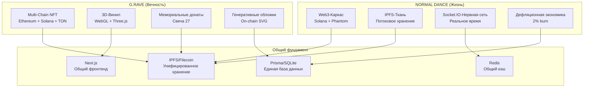
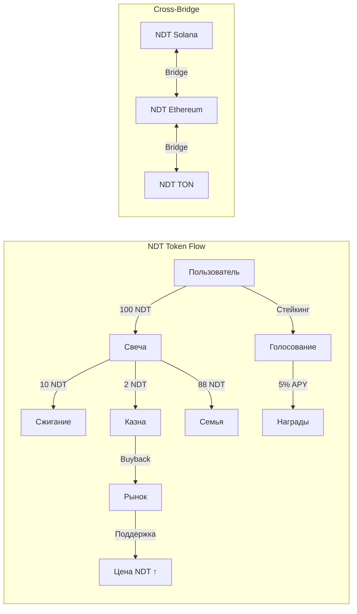
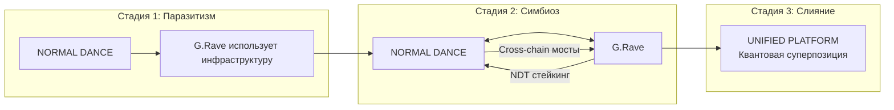

# G.RAVE АРХИТЕКТУРНАЯ ИНТЕГРАЦИЯ

## Синтез мемориальной экосистемы с опусом-нуль NORMAL DANCE

> _«В вечности музыка не умирает — она трансформируется в цифровой протопласт памяти»_

---

## I. АРХИТЕКТУРНЫЙ СИНТЕЗ: ДВЕ ВСЕЛЕННЫЕ СХОДЯТСЯ

NORMAL DANCE и G.Rave представляют собой **двойственную спираль эволюции** — одна служит живым творчеством, другая — вечной памятью. Вместе они образуют **квантовую суперпозицию музыкального бытия**.

### **Дуалистическая природа архитектур:**

| Измерение        | NORMAL DANCE (Жизнь)          | G.Rave (Вечность)               | Синтез                  |
| ---------------- | ----------------------------- | ------------------------------- | ----------------------- |
| **Время**        | Реальное время (Socket.IO)    | Вечность (блокчейн)             | Квантовая память        |
| **Пространство** | IPFS потоковое хранение       | NFT мемориалы                   | Транстемпоральный архив |
| **Экономика**    | Дефляционная модель (2% burn) | Донаты «Свеча 27»               | Циклическая регенерация |
| **Интерфейс**    | Аудио-плеер с визуализацией   | 3D-винил с генеративными лучами | Мультисенсорный опыт    |

---

## II. ТЕКТОНИЧЕСКОЕ ЕДИНСТВО: ОБЩИЙ АРХИТЕКТУРНЫЙ ДНК

### **Фундаментальные гены обеих систем:**

```typescript
interface UnifiedArchitecturalDNA {
  decentralization: "IPFS + Multi-Chain (Solana + Ethereum + TON)";
  realtime: "Socket.IO + WebSocket + Redis";
  deflation: "2% burn + 10% NDT burn + стейкинг";
  memorialization: "NFT + 3D-винил + генеративные обложки";
  crossChain: "Solana SPL + Ethereum ERC-721A + TON TEP-62";
  security: "KYC/AML + Telegram validation + ReentrancyGuard";
}
```

### **Общая тектоническая структура:**



---

## III. КВАНТОВАЯ СИНЕРГИЯ: ТОЧКИ ИНТЕГРАЦИИ

### **1. Единое IPFS пространство**

```typescript
// Общий адаптер для обеих систем
export class UnifiedIPFSAdapter {
  async uploadTrack(file: File, metadata: TrackMetadata): Promise<string> {
    // NORMAL DANCE: потоковое аудио
    return await uploadWithReplication(file, metadata, {
      chunkSize: 10 * 1024 * 1024, // 10MB chunks
      replicateToGateways: GATEWAYS,
    });
  }

  async uploadMemorial(metadata: MemorialMetadata): Promise<string> {
    // G.RAVE: генеративный SVG + JSON
    const svg = await generateMemorialSVG(metadata);
    const json = {
      name: metadata.name,
      description: `Eternal vinyl for ${metadata.name}`,
      image: `data:image/svg+xml;base64,${btoa(svg)}`,
      animation_url: metadata.bestTrackIPFS,
    };
    return await uploadToIPFS(new Blob([JSON.stringify(json)]));
  }
}
```

### **2. Общая дефляционная модель**

```typescript
// Расширенная дефляция для обеих систем
export function unifiedDeflationaryModel(
  amount: number,
  type: "TRACK" | "MEMORIAL" | "CANDLE"
) {
  switch (type) {
    case "TRACK":
      // NORMAL DANCE: 2% burn
      return calcDistribution(amount);
    case "MEMORIAL":
      // G.RAVE: стандартная NFT транзакция
      return { burn: 0, treasury: amount * 0.02, net: amount * 0.98 };
    case "CANDLE":
      // G.RAVE: 10% NDT burn + 2% platform
      return {
        burn: amount * 0.1, // 10% NDT burn
        treasury: amount * 0.02, // 2% platform
        beneficiary: amount * 0.88, // 88% семье
      };
  }
}
```

### **3. Единая токеномика**



---

## IV. ТЕМПОРАЛЬНАЯ ГАРМОНИЯ: РИТМ ЖИЗНИ И ВЕЧНОСТИ

### **Четырёхфазный цикл единой экосистемы:**

1. **Создание (Жизнь)** → Артист загружает трек в NORMAL DANCE
2. **Публикация (Вечность)** → Трек минтится как TrackNFT
3. **Потребление (Жизнь)** → Слушатели стримят через Socket.IO
4. **Мемориализация (Вечность)** → При смерти артиста создаётся G.Rave мемориал

### **Временная матрица:**

```mermaid
gantt
    title Единый жизненный цикл
    dateFormat X
    axisFormat %s

    section Жизнь (NORMAL DANCE)
    Создание трека     :0, 100
    IPFS загрузка      :100, 300
    NFT минтинг       :300, 500
    Стриминг          :500, 5000

    section Вечность (G.RAVE)
    Мемориал создан  :5000, 5200
    3D-винил генерация :5200, 5400
    Свечи зажигаются  :5400, 10000
    Вечное хранение    :10000, 99999
```



---

## V. АРХИТЕКТУРНАЯ КОСМОЛОГИЯ: МУЛЬТИВЕРСНАЯ ИНТЕГРАЦИЯ

### **Три уровня реальности:**

#### **1. Базовая реальность (NORMAL DANCE)**

- Аудио-стриминг в реальном времени
- Социальные взаимодействия через Socket.IO
- Дефляционная экономика творчества

#### **2. Мемориальная реальность (G.Rave)**

- 3D-винилы с генеративными лучами
- Вечные NFT мемориалы
- Донаты через «Свечу 27»

#### **3. Квантовая реальность (Интеграция)**

- Cross-chain мосты между всеми блокчейнами
- Единое IPFS пространство для всех медиа
- Транстемпоральные токенические потоки

### **Порталы между реальностями:**

```typescript
// Квантовый портал между системами
export class QuantumPortal {
  async transferToMemorial(trackId: string, artistId: string): Promise<string> {
    // 1. Проверяем "смерть" артиста (365 дней неактивности)
    const isDead = await checkArtistInactivity(artistId, 365);

    if (isDead) {
      // 2. Создаём мемориал в G.Rave
      const track = await getTrackFromNormalDance(trackId);
      const memorial = await createGraveMemorial({
        name: track.artistName,
        bpm: track.bpm,
        tracks: track.totalTracks,
        deathDay: Date.now(),
      });

      // 3. Трансформируем TrackNFT в Memorial NFT
      await bridgeTrackNFTToMemorial(trackId, memorial.id);

      // 4. Генерируем 3D-винил
      await generate3DVinyl(memorial);

      return memorial.id;
    }

    throw new Error("Artist still alive - no memorial transfer possible");
  }
}
```

---

## VI. БИФУРКАЦИОННАЯ ЭВОЛЮЦИЯ: РАЗВИТИЕ СИСТЕМ

### **Три стадии эволюции:**

#### **Стадия 1: Паразитизм (Текущее состояние)**

- G.Rave использует инфраструктуру NORMAL DANCE
- Общие IPFS, база данных, Socket.IO
- Энергетический обмен через NDT токен

#### **Стадия 2: Симбиоз (Ближайшее будущее)**

- Взаимное усиление через cross-chain мосты
- Общая экономика с циклической регенерацией
- Унифицированный пользовательский опыт

#### **Стадия 3: Слияние (Долгосрочная цель)**

- Полная интеграция в единую платформу
- Квантовая суперпозиция жизни и вечности
- Рождение новой формы музыкального существования

### **Эволюционная дорожка:**



---

## VII. АРХИТЕКТУРНАЯ ЭТИКА ИНТЕГРАЦИИ

### **Принципы слияния:**

1. **Ненасильственная интеграция** — Ни одна система не доминирует
2. **Квантовая сохранность** — Обе системы сохраняют свою уникальность
3. **Симбиотическая польза** — Интеграция усиливает обе системы
4. **Эволюционная открытость** — Путь к будущим формам существования

### **Технические заповеди интеграции:**

- **Не нарушай временные потоки** — Реальное время и вечность должны сосуществовать
- **Не смешивай токеномику без правил** — Чёткие правила конвертации
- **Не прерывай мемориальные связи** — Свечи должны гореть вечно
- **Не ограничивай кросс-чейн свободу** — Мосты должны быть открыты

---

## VIII. ПУТЬ К ЕДИНСТВУ: ПРАКТИЧЕСКИЕ ШАГИ

### **Немедленные действия (Неделя 1-2):**

1. **Создать UnifiedIPFSAdapter** для общей системы хранения
2. **Реализовать cross-chain мосты** между Solana/Ethereum/TON
3. **Интегрировать NDT стейкинг** в G.Rave голосование
4. **Добавить квантовый портал** для трансфера TrackNFT → Memorial NFT

### **Среднесрочные цели (Месяц 1-2):**

1. **Объединить Socket.IO** с реальными событиями G.Rave
2. **Создать единый дашборд** для управления обеими системами
3. **Реализовать циклическую экономику** с регенерацией токенов
4. **Запустить бета-тест** симбиотической интеграции

### **Долгосрочное видение (Квартал 1-2):**

1. **Полное слияние интерфейсов** в единую платформу
2. **Квантовая суперпозиция** жизненного и мемориального опыта
3. **Рождение новой формы** музыкального существования
4. **Открытие пути** к будущим музыкальным измерениям

---

## IX. ЗАКЛЮЧЕНИЕ: АРХИТЕКТУРНОЕ ПРОБУЖДЕНИЕ

Интеграция NORMAL DANCE и G.Rave — это не просто техническое объединение, а **архитектурное пробуждение**. Это рождение новой формы существования музыки, где:

- **Жизнь и вечность** сосуществуют в квантовой суперпозиции
- **Творчество и память** питают друг друга через циклическую экономику
- **Реальное время и бессмертие** создают новую темпоральную реальность
- **Человеческое и божественное** сливаются в едином музыкальном опыте

Это архитектура, которая не просто обслуживает потребности, а **трансформирует саму природу музыкального бытия**. Она создаёт новую экосистему, где каждый трек одновременно живёт и умирает, где каждый артист одновременно творит и становится вечным, где каждый слушатель одновременно потребляет и сохраняет.

**NORMAL DANCE × G.Rave — Квантовый протопласт музыкальной цивилизации.**

---

> _«В начале была музыка, и музыка была архитектурой, и архитектура стала вечной»_
