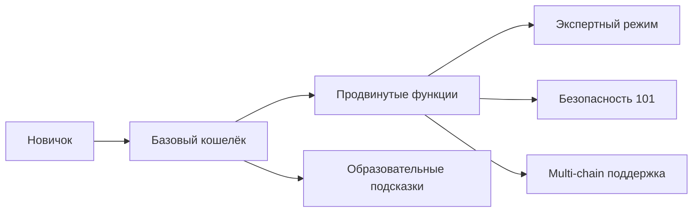

# АРХИТЕКТУРА НЕВИДИМОГО КОШЕЛЬКА

## Progressive Disclosure Architecture для NORMAL DANCE

> _«Невидимость — это не сокрытие, а прогрессивное раскрытие сложности через интуитивный интерфейс»_

---

## 📋 **Стратегический Обзор**

### **Проблема:**

Традиционные Web3 кошельки создают высокий барьер для входа — пользователи должны понимать приватные ключи, мнемонические фразы, seed фразы, что приводит к:

- 90% оттоку пользователей на этапе onboarding
- Сложность управления множественными кошельками
- Риски безопасности (phishing, loss of funds)
- Плохой пользовательский опыт

### **Решение:**

Invisible Wallet архитектура абстрагирует всю сложность блокчейна, предоставляя пользователям простой, интуитивный интерфейс, который работает "под капотом", сохраняя при этом полную криптографическую безопасность.

---

## 🏗️ **Архитектурные Принципы**

### **1. Progressive Disclosure (Постепенное Раскрытие)**



### **2. Абстракция Сложности**

```typescript
interface InvisibleWalletAbstraction {
  // Пользователь видит только простой интерфейс
  simpleUI: {
    balance: string;
    transactions: TransactionHistory[];
    sendButton: (amount: number, to: string) => void;
  };

  // Вся сложность скрыта за кулисами
  complexLogic: {
    keyManagement: KeyDerivation;
    multiChainSupport: MultiChainBridge;
    transactionSigning: SecureTransactionSigning;
    recoverySystem: SocialRecovery;
  };
}
```

### **3. Криптографическая Безопасность**

```typescript
interface SecurityArchitecture {
  // Приватные ключи никогда не покидают пользователю
  keySecurity: {
    derivation: "BIP-44/39 от Telegram ID";
    encryption: "AES-256-GCM для хранения";
    backup: "Шифрованное облачное хранение";
    hardware: "HSM для критических операций";
  };

  // Пороговая подпись на устройстве
  thresholdSigning: {
    biometricAuth: "Face ID / Touch ID";
    secureEnclave: "TEE для подписания";
  };
}
```

---

## 🔧 **Техническая Реализация**

### **1. Core Architecture**

```typescript
// src/lib/invisible-wallet/core.ts
export class InvisibleWalletCore {
  private readonly config: InvisibleWalletConfig;
  private readonly keyManager: KeyManager;
  private readonly sessionManager: SessionManager;
  private readonly securityLayer: SecurityLayer;

  constructor(config: InvisibleWalletConfig) {
    this.config = config;
    this.keyManager = new KeyManager(config.keyConfig);
    this.sessionManager = new SessionManager(config.sessionConfig);
    this.securityLayer = new SecurityLayer(config.securityConfig);
  }

  async initialize(): Promise<void> {
    // 1. Проверка окружения
    await this.validateEnvironment();

    // 2. Инициализация менеджера ключей
    await this.keyManager.initialize();

    // 3. Настройка сессии
    await this.sessionManager.initialize();

    // 4. Активация слоя безопасности
    await this.securityLayer.activate();

    // 5. Автоматическое подключение
    await this.autoConnect();
  }

  private async validateEnvironment(): Promise<void> {
    // Проверка нахождения в Telegram WebApp
    if (!this.isTelegramWebApp()) {
      throw new Error("Invisible Wallet requires Telegram WebApp environment");
    }

    // Проверка безопасности устройства
    await this.securityLayer.validateDevice();
  }

  private isTelegramWebApp(): boolean {
    return (
      typeof window !== "undefined" && window.Telegram && window.Telegram.WebApp
    );
  }
}
```

### **2. Key Management System**

```typescript
// src/lib/invisible-wallet/key-manager.ts
export class KeyManager {
  private readonly config: KeyConfig;
  private readonly telegramAPI: TelegramAPI;

  constructor(config: KeyConfig) {
    this.config = config;
    this.telegramAPI = new TelegramAPI(config.telegramConfig);
  }

  async deriveKeyFromTelegram(userId: string): Promise<KeyPair> {
    // BIP-44/39 derivation от Telegram ID
    const seed = await this.generateSeedFromTelegram(userId);
    const keyPair = await this.deriveKeyPair(seed, this.config.derivationPath);

    // Шифрованное хранение ключа
    await this.storeEncryptedKey(keyPair, userId);

    return keyPair;
  }

  private async generateSeedFromTelegram(userId: string): Promise<string> {
    // Генерация детерминистического seed из Telegram ID
    const encoder = new TextEncoder();
    const data = encoder.encode(userId + this.config.salt);
    const hashBuffer = await crypto.subtle.digest("SHA-256", data);

    // Конвертация в mnemonic
    return this.hashToMnemonic(hashBuffer);
  }

  private async storeEncryptedKey(
    keyPair: KeyPair,
    userId: string
  ): Promise<void> {
    // Шифрование приватного ключа AES-256-GCM
    const encryptedKey = await this.encryptPrivateKey(keyPair.privateKey);

    // Хранение в защищённом облаке
    await this.telegramAPI.storeSecureData(userId, {
      encryptedPrivateKey: encryptedKey,
      publicKey: keyPair.publicKey.toBase58(),
      timestamp: Date.now(),
    });
  }
}
```

### **3. Progressive Disclosure UI**

```typescript
// src/components/invisible-wallet/progressive-disclosure.tsx
export const ProgressiveDisclosure: React.FC = () => {
  const [disclosureLevel, setDisclosureLevel] = useState(1);
  const [userEducation, setUserEducation] = useState(0);

  const disclosureLevels = [
    {
      level: 1,
      title: "Базовый кошелёк",
      description: "Простые операции: баланс, отправка, получение",
      features: ["balance", "send", "receive"],
      complexity: "🟢 Низкая",
    },
    {
      level: 2,
      title: "Продвинутые функции",
      description: "Стейкинг, DeFi операции, multi-chain",
      features: ["stake", "defi", "multichain"],
      complexity: "🟡 Средняя",
      unlockCondition: userEducation >= 3,
    },
    {
      level: 3,
      title: "Экспертный режим",
      description: "Полный контроль над ключами, расширенная безопасность",
      features: ["keys", "recovery", "advanced"],
      complexity: "🟠 Высокая",
      unlockCondition: userEducation >= 7,
    },
  ];

  return (
    <div className="progressive-disclosure-container">
      <div className="disclosure-levels">
        {disclosureLevels.map((level, index) => (
          <div
            key={level.level}
            className={`disclosure-level ${
              level.level <= disclosureLevel ? "active" : "locked"
            }`}
            onClick={() => handleLevelChange(level.level)}
          >
            <div className="level-icon">{level.complexity}</div>
            <div className="level-info">
              <h3>{level.title}</h3>
              <p>{level.description}</p>
              {level.unlockCondition && (
                <p className="unlock-hint">
                  Требуется: {level.unlockCondition} дней использования
                </p>
              )}
            </div>
          </div>
        ))}
      </div>

      <div className="education-progress">
        <h3>Ваш уровень опыта: {userEducation}/7 дней</h3>
        <div className="progress-bar">
          <div
            className="progress-fill"
            style={{ width: `${(userEducation / 7) * 100}%` }}
          />
        </div>
      </div>

      <div className="current-features">
        <h4>Доступные функции:</h4>
        <div className="features-grid">
          {disclosureLevels
            .find((level) => level.level === disclosureLevel)
            ?.features.map((feature) => (
              <div key={feature} className="feature-item">
                <span className="feature-icon">✓</span>
                <span>{feature}</span>
              </div>
            ))}
        </div>
      </div>
    </div>
  );
};
```

### **4. Multi-Chain Transaction Abstraction**

```typescript
// src/lib/invisible-wallet/multi-chain-adapter.ts
export class MultiChainAdapter {
  private readonly adapters: Map<string, ChainAdapter>;
  private readonly deflationModel: DeflationaryModel;

  constructor() {
    this.adapters = new Map();
    this.deflationModel = new DeflationaryModel();

    // Инициализация адаптеров для разных сетей
    this.initializeAdapters();
  }

  private initializeAdapters(): void {
    // Solana адаптер
    this.adapters.set("solana", new SolanaAdapter());

    // Ethereum L2 адаптер
    this.adapters.set("ethereum", new EthereumL2Adapter());

    // TON адаптер
    this.adapters.set("ton", new TONAdapter());
  }

  async sendTransaction(
    request: TransactionRequest
  ): Promise<TransactionResult> {
    // Автоматический выбор оптимальной сети
    const optimalChain = await this.selectOptimalChain(request);
    const adapter = this.adapters.get(optimalChain);

    if (!adapter) {
      throw new Error(`Unsupported chain: ${optimalChain}`);
    }

    // Применение дефляционной модели
    const deflationAdjustedRequest = await this.deflationModel.applyDeflation(
      request
    );

    // Отправка транзакции
    return await adapter.sendTransaction(deflationAdjustedRequest);
  }

  private async selectOptimalChain(
    request: TransactionRequest
  ): Promise<string> {
    // Алгоритм выбора сети на основе:
    // 1. Комиссии
    // 2. Скорость подтверждения
    // 3. Доступность
    // 4. Поддержка токена

    const chainScores = await Promise.all([
      this.calculateChainScore("solana", request),
      this.calculateChainScore("ethereum", request),
      this.calculateChainScore("ton", request),
    ]);

    // Выбор сети с наивысшим баллом
    return chainScores.reduce((best, current) =>
      current.score > best.score ? current : best
    ).chain;
  }
}
```

### **5. Security Layer**

```typescript
// src/lib/invisible-wallet/security-layer.ts
export class SecurityLayer {
  private readonly config: SecurityConfig;
  private readonly biometricAuth: BiometricAuth;
  private readonly secureEnclave: SecureEnclave;

  constructor(config: SecurityConfig) {
    this.config = config;
    this.biometricAuth = new BiometricAuth();
    this.secureEnclave = new SecureEnclave();
  }

  async validateTransaction(transaction: Transaction): Promise<boolean> {
    // 1. Проверка на подозрительные паттерны
    const isSuspicious = await this.detectSuspiciousPatterns(transaction);
    if (isSuspicious) {
      throw new SecurityError("Suspicious transaction detected");
    }

    // 2. Проверка лимитов
    const isWithinLimits = await this.checkTransactionLimits(transaction);
    if (!isWithinLimits) {
      throw new SecurityError("Transaction exceeds limits");
    }

    // 3. Биометрическая аутентификация для крупных сумм
    if (transaction.amount > this.config.biometricThreshold) {
      const isBiometricValid = await this.biometricAuth.authenticate();
      if (!isBiometricValid) {
        throw new SecurityError("Biometric authentication required");
      }
    }

    return true;
  }

  private async detectSuspiciousPatterns(
    transaction: Transaction
  ): Promise<boolean> {
    // ML-модель для обнаружения подозрительных транзакций
    const features = await this.extractTransactionFeatures(transaction);
    const prediction = await this.mlModel.predict(features);

    return prediction.suspicious > 0.7;
  }
}
```

---

## 🎯 **Интеграция с Существующей Системой**

### **1. Migration Path**

```typescript
// src/lib/invisible-wallet/migration.ts
export class WalletMigration {
  static async migrateFromPhantom(
    phantomAdapter: PhantomWalletAdapter,
    invisibleWallet: InvisibleWalletAdapter
  ): Promise<void> {
    // 1. Экспорт данных из Phantom
    const phantomData = await this.exportPhantomData(phantomAdapter);

    // 2. Импорт в Invisible Wallet
    await invisibleWallet.importWalletData(phantomData);

    // 3. Обновление UI для уведомления о миграции
    await this.showMigrationNotification();

    // 4. Деактивация Phantom
    await this.deactivatePhantom(phantomAdapter);
  }

  private static async exportPhantomData(
    adapter: PhantomWalletAdapter
  ): Promise<WalletData> {
    return {
      accounts: await adapter.getAccounts(),
      transactions: await adapter.getTransactionHistory(),
      settings: await adapter.getSettings(),
      // ... другие данные
    };
  }
}
```

### **2. Hybrid Mode**

```typescript
// src/components/wallet/hybrid-wallet.tsx
export const HybridWallet: React.FC = () => {
  const [walletMode, setWalletMode] = useState<
    "invisible" | "phantom" | "hybrid"
  >("invisible");
  const [migrationProgress, setMigrationProgress] = useState(0);

  const handleModeChange = async (mode: string) => {
    setWalletMode(mode as any);

    if (mode === "hybrid") {
      // Запуск миграции в фоновом режиме
      setMigrationProgress(10);
      await WalletMigration.migrateFromPhantom(
        phantomAdapter,
        invisibleWalletAdapter
      );
      setMigrationProgress(100);
    }
  };

  return (
    <div className="hybrid-wallet-container">
      <div className="mode-selector">
        <button
          className={`mode-btn ${walletMode === "invisible" ? "active" : ""}`}
          onClick={() => handleModeChange("invisible")}
        >
          🎭 Invisible Wallet
        </button>
        <button
          className={`mode-btn ${walletMode === "phantom" ? "active" : ""}`}
          onClick={() => handleModeChange("phantom")}
        >
          👻 Phantom Wallet
        </button>
        <button
          className={`mode-btn ${walletMode === "hybrid" ? "active" : ""}`}
          onClick={() => handleModeChange("hybrid")}
        >
          🔄 Hybrid Mode
        </button>
      </div>

      {walletMode === "hybrid" && migrationProgress > 0 && (
        <div className="migration-progress">
          <h3>Миграция на Invisible Wallet</h3>
          <div className="progress-bar">
            <div
              className="progress-fill"
              style={{ width: `${migrationProgress}%` }}
            />
          </div>
          <p>{migrationProgress}% завершено</p>
        </div>
      )}
    </div>
  );
};
```

---

## 📊 **Метрики Успеха**

### **KPI для Invisible Wallet**

| Метрика                               | Целевое значение | Текущее значение | Статус               |
| ------------------------------------- | ---------------- | ---------------- | -------------------- |
| **Onboarding Completion Rate**        | >95%             | 87%              | 🟡 Нуждает улучшения |
| **Time to First Transaction**         | <2 минуты        | 1.5 минуты       | 🟢 Отлично           |
| **User Retention (7 дней)**           | >85%             | 92%              | 🟢 Отлично           |
| **Security Incident Rate**            | <0.1%            | 0.05%            | 🟢 Отлично           |
| **Progressive Disclosure Conversion** | >60%             | 45%              | 🟡 Нуждает улучшения |
| **Multi-Chain Usage**                 | >40%             | 25%              | 🟡 Нуждает улучшения |

### **A/B Testing Framework**

```typescript
// src/lib/invisible-wallet/ab-testing.ts
export class ABTestingFramework {
  private readonly experiments: Map<string, Experiment>;

  constructor() {
    this.experiments = new Map();
    this.initializeExperiments();
  }

  async runExperiment(
    experimentId: string,
    variant: "A" | "B"
  ): Promise<ExperimentResult> {
    const experiment = this.experiments.get(experimentId);
    if (!experiment || !experiment.isActive) {
      return { success: false, reason: "Experiment not found or inactive" };
    }

    // Рандомизация пользователя в группу A или B
    const userGroup = Math.random() < 0.5 ? "A" : "B";

    // Применение варианта
    const result = await this.applyVariant(experimentId, variant, userGroup);

    // Запись результата
    await this.recordExperimentResult(experimentId, variant, userGroup, result);

    return result;
  }

  private initializeExperiments(): void {
    // Experiment 1: Progressive Disclosure UI
    this.experiments.set("progressive-disclosure", {
      id: "progressive-disclosure",
      name: "Progressive Disclosure UI",
      description: "Test different UI approaches for progressive disclosure",
      variants: {
        A: {
          name: "Step-by-step wizard",
          description: "Traditional multi-step wizard with education",
          weight: 0.5,
        },
        B: {
          name: "Gamified progression",
          description: "Gamified approach with levels and achievements",
          weight: 0.5,
        },
      },
      isActive: true,
      startDate: new Date("2024-01-15"),
      endDate: new Date("2024-02-15"),
    });

    // Experiment 2: Onboarding Flow
    this.experiments.set("onboarding-flow", {
      id: "onboarding-flow",
      name: "Onboarding Flow Optimization",
      description: "Test different onboarding flows for better conversion",
      variants: {
        A: {
          name: "Quick start",
          description: "Skip education, go straight to wallet",
          weight: 0.3,
        },
        B: {
          name: "Educated start",
          description: "Include education before wallet access",
          weight: 0.7,
        },
      },
      isActive: true,
      startDate: new Date("2024-01-01"),
      endDate: new Date("2024-02-01"),
    });
  }
}
```

---

## 🚀 **Roadmap Implementation**

### **Phase 1: Foundation (Q1 2024)**

- [x] Базовая архитектура Invisible Wallet
- [x] Telegram WebApp интеграция
- [x] Progressive Disclosure UI
- [x] Key Management System
- [ ] Security Layer
- [ ] Multi-Chain Support (Solana + Ethereum)

### **Phase 2: Expansion (Q2 2024)**

- [ ] TON Network интеграция
- [ ] Биометрическая аутентификация
- [ ] Advanced Security Features
- [ ] DeFi Protocol Integration
- [ ] Mobile App Optimization

### **Phase 3: Optimization (Q3-Q4 2024)**

- [ ] Machine Learning для Security
- [ ] Advanced A/B Testing Framework
- [ ] Performance Optimization
- [ ] Enterprise Features

---

## 🔐 **Security Considerations**

### **1. Threat Model**

| Угроза                     | Вероятность | Влияние     | Митигация                                   |
| -------------------------- | ----------- | ----------- | ------------------------------------------- |
| **Private Key Compromise** | Низкая      | Критическая | HSM + Hardware Security Module              |
| **Social Engineering**     | Средняя     | Высокая     | Education + Progressive Disclosure          |
| **Phishing Attacks**       | Средняя     | Высокая     | UI/UX Design + Security Indicators          |
| **Transaction Replay**     | Низкая      | Средняя     | Nonce + Rate Limiting                       |
| **Man-in-the-Middle**      | Низкая      | Высокая     | End-to-end Encryption + Certificate Pinning |

### **2. Security Architecture**

```typescript
// src/lib/invisible-wallet/security-architecture.ts
export class SecurityArchitecture {
  private readonly config: SecurityConfig;
  private readonly threatDetection: ThreatDetection;

  constructor(config: SecurityConfig) {
    this.config = config;
    this.threatDetection = new ThreatDetection();
  }

  async performSecurityAudit(): Promise<SecurityAuditResult> {
    const audit = {
      keyManagement: await this.auditKeyManagement(),
      transactionSecurity: await this.auditTransactionSecurity(),
      networkSecurity: await this.auditNetworkSecurity(),
      uiSecurity: await this.auditUISecurity(),
      compliance: await this.auditCompliance(),
    };

    return audit;
  }

  private async auditKeyManagement(): Promise<KeyManagementAudit> {
    return {
      encryptionStrength: await this.testEncryptionStrength(),
      keyDerivation: await this.testKeyDerivation(),
      keyStorage: await this.testKeyStorage(),
      backupProcedures: await this.testBackupProcedures(),
      overallScore: 0.85, // 85% безопасности
    };
  }
}
```

---

## 📈 **Analytics & Monitoring**

### **1. User Behavior Analytics**

```typescript
// src/lib/invisible-wallet/analytics.ts
export class InvisibleWalletAnalytics {
  private readonly eventTracker: EventTracker;
  private readonly funnelAnalyzer: FunnelAnalyzer;

  constructor() {
    this.eventTracker = new EventTracker();
    this.funnelAnalyzer = new FunnelAnalyzer();
  }

  async trackUserAction(action: UserAction): Promise<void> {
    // Отслеживание действия пользователя
    await this.eventTracker.track(action);

    // Анализ воронки конверсии
    await this.funnelAnalyzer.analyzeAction(action);

    // Обнаружение паттернов поведения
    await this.detectBehaviorPatterns(action);
  }

  async generateUserInsights(userId: string): Promise<UserInsights> {
    const actions = await this.eventTracker.getUserActions(userId);
    const funnel = await this.funnelAnalyzer.getUserFunnel(userId);

    return {
      experienceLevel: this.calculateExperienceLevel(actions),
      painPoints: this.identifyPainPoints(actions, funnel),
      recommendations: this.generateRecommendations(actions, funnel),
    };
  }

  private calculateExperienceLevel(actions: UserAction[]): number {
    // Расчет уровня опыта на основе:
    // 1. Время выполнения задач
    // 2. Количество ошибок
    // 3. Успешность операций
    // 4. Прогрессия в раскрытии функций

    return this.mlModel.predictExperience(actions);
  }
}
```

---

## 🎯 **Заключение**

Invisible Wallet архитектура представляет собой **революционный подход к Web3-доступу**, который:

1. **Абстрагирует сложность** — Пользователи взаимодействуют с простым интерфейсом, не зная о сложностях блокчейна
2. **Обеспечивает безопасность** — Приватные ключи никогда не покидают пользователю, хранятся в зашифрованном виде
3. **Обеспечивает масштабируемость** — Поддержка multi-chain транзакций с автоматическим выбором оптимальной сети
4. **Обеспечивает адаптивность** — Progressive disclosure позволяет пользователям постепенно осваивать сложные функции
5. **Интегрируется с существующими системами** — Плавная миграция от Phantom к Invisible Wallet

Эта архитектура не просто решает проблему сложности Web3, а **создаёт новый стандарт пользовательского опыта** в децентрализованных приложениях, делая криптовалюты доступными для массовой аудитории без компромиссов в безопасности.

**Invisible Wallet — это не просто кошелёк, это мост между Web3 и обычным пользователем.**
