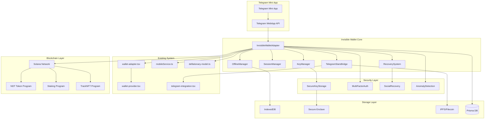

# INVISIBLE WALLET: Детальная архитектура и спецификация

## Оглавление

1. [Архитектурная диаграмма](#архитектурная-диаграмма)
2. [Спецификация интерфейсов](#спецификация-интерфейсов)
3. [Схема интеграции](#схема-интеграции)
4. [План миграции](#план-миграции)
5. [Технические решения](#технические-решения)
6. [Реализация](#реализация)

---

## Архитектурная диаграмма

### Общая архитектура системы



### Детальная архитектура компонентов

```mermaid
graph TB
    subgraph "InvisibleWalletAdapter"
        IWA[InvisibleWalletAdapter]
        INIT[initialize]
        CONNECT[connect]
        DISCONNECT[disconnect]
        SIGN[signTransaction]
        SEND[sendTransaction]
        SYNC[syncBalance]
    end
    
    subgraph "KeyManager"
        KM[KeyManager]
        GEN[generateKeyPair]
        STORE[storeKeyPair]
        RETR[retrieveKeyPair]
        DERIVE[deriveFromTelegram]
        ENCRYPT[encryptKey]
        DECRYPT[decryptKey]
    end
    
    subgraph "SessionManager"
        SM[SessionManager]
        CREATE[createSession]
        VALIDATE[validateSession]
        REFRESH[refreshSession]
        EXPIRE[expireSession]
        PERSIST[persistSession]
    end
    
    subgraph "OfflineManager"
        OM[OfflineManager]
        QUEUE[queueTransaction]
        PROCESS[processQueue]
        CACHE[cacheBalance]
        SYNC[syncWhenOnline]
        RESOLVE[resolveConflicts]
    end
    
    subgraph "TelegramStarsBridge"
        TSB[TelegramStarsBridge]
        PURCHASE[purchaseWithStars]
        CONVERT[convertStarsToSol]
        CONVERT2[convertSolToNdt]
        GETRATE[getConversionRate]
        BATCH[batchProcess]
    end
    
    subgraph "RecoverySystem"
        RS[RecoverySystem]
        SETUP[setupRecovery]
        INITIATE[initiateRecovery]
        COLLECT[collectShares]
        RECONSTRUCT[reconstructKey]
        VERIFY[verifyRecovery]
    end
    
    IWA --> KM
    IWA --> SM
    IWA --> OM
    IWA --> TSB
    IWA --> RS
```



---

## Спецификация интерфейсов

### 1. InvisibleWalletAdapter

```typescript
interface InvisibleWalletConfig {
  keyConfig: KeyManagerConfig;
  sessionConfig: SessionManagerConfig;
  offlineConfig: OfflineManagerConfig;
  starsConfig: TelegramStarsConfig;
  recoveryConfig: RecoveryConfig;
  securityConfig: SecurityConfig;
}

interface InvisibleWalletAdapter extends WalletAdapter {
  // Инициализация
  initialize(config: InvisibleWalletConfig): Promise<void>;
  isInitialized(): boolean;
  
  // Автоматическое подключение
  autoConnect(): Promise<void>;
  silentConnect(): Promise<boolean>;
  
  // Управление ключами
  exportPublicKey(): Promise<PublicKey>;
  exportEncryptedKey(): Promise<EncryptedKey>;
  
  // Оффлайн функциональность
  syncWhenOnline(): Promise<void>;
  getOfflineQueue(): Promise<PendingTransaction[]>;
  
  // Telegram Stars
  purchaseWithStars(amount: number, description: string): Promise<PurchaseResult>;
  getStarsBalance(): Promise<number>;
  
  // Восстановление
  setupRecovery(contacts: TelegramContact[]): Promise<void>;
  initiateRecovery(): Promise<RecoverySession>;
  
  // События
  on(event: InvisibleWalletEvent, handler: EventHandler): void;
  off(event: InvisibleWalletEvent, handler: EventHandler): void;
}

enum InvisibleWalletEvent {
  INITIALIZED = 'initialized',
  AUTO_CONNECTED = 'auto_connected',
  KEYS_GENERATED = 'keys_generated',
  OFFLINE_QUEUE_UPDATED = 'offline_queue_updated',
  RECOVERY_SETUP_COMPLETED = 'recovery_setup_completed',
  STARS_PURCHASE_COMPLETED = 'stars_purchase_completed',
  SECURITY_ALERT = 'security_alert'
}

class InvisibleWalletAdapterImpl implements InvisibleWalletAdapter {
  private keyManager: KeyManager;
  private sessionManager: SessionManager;
  private offlineManager: OfflineManager;
  private starsBridge: TelegramStarsBridge;
  private recoverySystem: RecoverySystem;
  private securityManager: SecurityManager;
  private eventEmitter: EventEmitter;
  private config: InvisibleWalletConfig;
  private isInitializedFlag: boolean = false;
  
  constructor(config: InvisibleWalletConfig) {
    this.config = config;
    this.eventEmitter = new EventEmitter();
    this.initializeComponents();
  }
  
  private initializeComponents(): void {
    this.keyManager = new KeyManager(this.config.keyConfig);
    this.sessionManager = new SessionManager(this.config.sessionConfig);
    this.offlineManager = new OfflineManager(this.config.offlineConfig);
    this.starsBridge = new TelegramStarsBridge(this.config.starsConfig);
    this.recoverySystem = new RecoverySystem(this.config.recoveryConfig);
    this.securityManager = new SecurityManager(this.config.securityConfig);
  }
  
  async initialize(config: InvisibleWalletConfig): Promise<void> {
    try {
      // 1. Инициализация компонентов
      await Promise.all([
        this.keyManager.initialize(),
        this.sessionManager.initialize(),
        this.offlineManager.initialize(),
        this.starsBridge.initialize(),
        this.recoverySystem.initialize(),
        this.securityManager.initialize()
      ]);
      
      // 2. Автоматическое подключение
      await this.autoConnect();
      
      // 3. Настройка фоновых процессов
      this.setupBackgroundProcesses();
      
      this.isInitializedFlag = true;
      this.eventEmitter.emit(InvisibleWalletEvent.INITIALIZED);
    } catch (error) {
      throw new InvisibleWalletError('Initialization failed', error);
    }
  }
  
  isInitialized(): boolean {
    return this.isInitializedFlag;
  }
  
  async autoConnect(): Promise<void> {
    try {
      // 1. Проверка существующей сессии
      const existingSession = await this.sessionManager.getExistingSession();
      if (existingSession && await this.sessionManager.validateSession(existingSession)) {
        await this.restoreFromSession(existingSession);
        return;
      }
      
      // 2. Генерация ключей на основе Telegram ID
      const telegramUser = this.getTelegramUser();
      if (!telegramUser) {
        throw new Error('Telegram user not available');
      }
      
      const keyPair = await this.keyManager.deriveFromTelegram(telegramUser.id);
      await this.keyManager.storeKeyPair(keyPair);
      
      // 3. Создание новой сессии
      const session = await this.sessionManager.createSession(keyPair.publicKey);
      await this.sessionManager.persistSession(session);
      
      // 4. Синхронизация баланса
      await this.syncBalance();
      
      this.eventEmitter.emit(InvisibleWalletEvent.AUTO_CONNECTED);
    } catch (error) {
      throw new InvisibleWalletError('Auto-connect failed', error);
    }
  }
  
  async silentConnect(): Promise<boolean> {
    try {
      await this.autoConnect();
      return true;
    } catch (error) {
      console.error('Silent connect failed:', error);
      return false;
    }
  }
  
  // Реализация остальных методов...
}
```

### 2. KeyManager

```typescript
interface KeyManagerConfig {
  encryptionAlgorithm: 'AES-256-GCM' | 'ChaCha20-Poly1305';
  keyDerivation: 'PBKDF2' | 'scrypt' | 'Argon2';
  storageType: 'secure-enclave' | 'indexeddb' | 'localStorage';
  backupEnabled: boolean;
  rotationInterval: number; // в днях
}

interface KeyPair {
  publicKey: PublicKey;
  privateKey: PrivateKey;
  encryptedPrivateKey: EncryptedKey;
  metadata: KeyMetadata;
}

interface EncryptedKey {
  data: Uint8Array;
  iv: Uint8Array;
  salt: Uint8Array;
  algorithm: string;
  keyDerivation: string;
  iterations: number;
}

interface KeyMetadata {
  created: number;
  lastUsed: number;
  version: number;
  source: 'telegram' | 'generated' | 'recovered';
  deviceId: string;
}

interface KeyManager {
  // Инициализация
  initialize(): Promise<void>;
  
  // Генерация ключей
  generateKeyPair(): Promise<KeyPair>;
  deriveFromTelegram(telegramId: number): Promise<KeyPair>;
  
  // Хранение ключей
  storeKeyPair(keyPair: KeyPair): Promise<void>;
  retrieveKeyPair(): Promise<KeyPair | null>;
  deleteKeyPair(): Promise<void>;
  
  // Шифрование
  encryptKey(privateKey: PrivateKey, password: string): Promise<EncryptedKey>;
  decryptKey(encryptedKey: EncryptedKey, password: string): Promise<PrivateKey>;
  
  // Резервное копирование
  createBackup(): Promise<KeyBackup>;
  restoreFromBackup(backup: KeyBackup): Promise<void>;
  
  // Ротация ключей
  rotateKey(): Promise<KeyPair>;
  shouldRotateKey(): Promise<boolean>;
}

class KeyManagerImpl implements KeyManager {
  private config: KeyManagerConfig;
  private storage: SecureStorage;
  private crypto: CryptoProvider;
  private currentKeyPair: KeyPair | null = null;
  
  constructor(config: KeyManagerConfig) {
    this.config = config;
    this.storage = new SecureStorage(config.storageType);
    this.crypto = new CryptoProvider(config);
  }
  
  async initialize(): Promise<void> {
    await this.storage.initialize();
    await this.crypto.initialize();
    
    // Проверка необходимости ротации ключей
    if (await this.shouldRotateKey()) {
      await this.rotateKey();
    }
  }
  
  async generateKeyPair(): Promise<KeyPair> {
    const keyPair = await this.crypto.generateKeyPair();
    const encryptedPrivateKey = await this.encryptKey(keyPair.privateKey, await this.getMasterPassword());
    
    const keyPairWithMetadata: KeyPair = {
      publicKey: keyPair.publicKey,
      privateKey: keyPair.privateKey,
      encryptedPrivateKey,
      metadata: {
        created: Date.now(),
        lastUsed: Date.now(),
        version: 1,
        source: 'generated',
        deviceId: await this.getDeviceId()
      }
    };
    
    await this.storeKeyPair(keyPairWithMetadata);
    return keyPairWithMetadata;
  }
  
  async deriveFromTelegram(telegramId: number): Promise<KeyPair> {
    // 1. Получение уникального seed из Telegram ID
    const seed = await this.deriveSeedFromTelegramId(telegramId);
    
    // 2. Генерация ключевой пары из seed
    const keyPair = await this.crypto.deriveKeyPair(seed);
    
    // 3. Шифрование приватного ключа
    const encryptedPrivateKey = await this.encryptKey(
      keyPair.privateKey, 
      await this.getMasterPassword()
    );
    
    const keyPairWithMetadata: KeyPair = {
      publicKey: keyPair.publicKey,
      privateKey: keyPair.privateKey,
      encryptedPrivateKey,
      metadata: {
        created: Date.now(),
        lastUsed: Date.now(),
        version: 1,
        source: 'telegram',
        deviceId: await this.getDeviceId()
      }
    };
    
    await this.storeKeyPair(keyPairWithMetadata);
    return keyPairWithMetadata;
  }
  
  private async deriveSeedFromTelegramId(telegramId: number): Promise<Uint8Array> {
    // Используем Telegram ID + серверный секрет для генерации детерминистического seed
    const telegramData = telegramId.toString();
    const serverSecret = await this.getServerSecret();
    const combined = new TextEncoder().encode(telegramData + serverSecret);
    
    return await this.crypto.hash(combined);
  }
  
  // Реализация остальных методов...
}
```

### 3. SessionManager

```typescript
interface SessionManagerConfig {
  sessionTimeout: number; // в миллисекундах
  refreshThreshold: number; // порог обновления сессии
  storageType: 'indexeddb' | 'localStorage' | 'memory';
  encryptionEnabled: boolean;
}

interface Session {
  id: string;
  publicKey: string;
  createdAt: number;
  expiresAt: number;
  lastActivity: number;
  deviceId: string;
  metadata: SessionMetadata;
}

interface SessionMetadata {
  userAgent: string;
  ipAddress: string;
  platform: string;
  version: string;
  trustScore: number;
}

interface SessionManager {
  // Инициализация
  initialize(): Promise<void>;
  
  // Управление сессиями
  createSession(publicKey: PublicKey): Promise<Session>;
  validateSession(session: Session): Promise<boolean>;
  refreshSession(session: Session): Promise<Session>;
  expireSession(sessionId: string): Promise<void>;
  
  // Хранение сессий
  persistSession(session: Session): Promise<void>;
  getExistingSession(): Promise<Session | null>;
  getAllSessions(): Promise<Session[]>;
  
  // Безопасность
  revokeSession(sessionId: string): Promise<void>;
  revokeAllSessions(): Promise<void>;
  cleanupExpiredSessions(): Promise<void>;
}

class SessionManagerImpl implements SessionManager {
  private config: SessionManagerConfig;
  private storage: Storage;
  private crypto: CryptoProvider;
  private currentSession: Session | null = null;
  
  constructor(config: SessionManagerConfig) {
    this.config = config;
    this.storage = new Storage(config.storageType);
    this.crypto = new CryptoProvider();
  }
  
  async initialize(): Promise<void> {
    await this.storage.initialize();
    
    // Очистка истекших сессий
    await this.cleanupExpiredSessions();
    
    // Проверка текущей сессии
    const existingSession = await this.getExistingSession();
    if (existingSession) {
      if (await this.validateSession(existingSession)) {
        this.currentSession = existingSession;
      } else {
        await this.expireSession(existingSession.id);
      }
    }
  }
  
  async createSession(publicKey: PublicKey): Promise<Session> {
    const now = Date.now();
    const sessionId = await this.generateSessionId();
    
    const session: Session = {
      id: sessionId,
      publicKey: publicKey.toBase58(),
      createdAt: now,
      expiresAt: now + this.config.sessionTimeout,
      lastActivity: now,
      deviceId: await this.getDeviceId(),
      metadata: {
        userAgent: navigator.userAgent,
        ipAddress: await this.getClientIP(),
        platform: navigator.platform,
        version: await this.getAppVersion(),
        trustScore: 1.0
      }
    };
    
    await this.persistSession(session);
    this.currentSession = session;
    
    return session;
  }
  
  async validateSession(session: Session): Promise<boolean> {
    const now = Date.now();
    
    // Проверка времени истечения
    if (now > session.expiresAt) {
      return false;
    }
    
    // Проверка доверия устройства
    if (session.metadata.trustScore < 0.5) {
      return false;
    }
    
    // Проверка целостности данных
    const sessionHash = await this.calculateSessionHash(session);
    const storedHash = await this.storage.get(`session:${session.id}:hash`);
    
    return sessionHash === storedHash;
  }
  
  async refreshSession(session: Session): Promise<Session> {
    const now = Date.now();
    
    const refreshedSession: Session = {
      ...session,
      expiresAt: now + this.config.sessionTimeout,
      lastActivity: now,
      metadata: {
        ...session.metadata,
        trustScore: Math.min(1.0, session.metadata.trustScore + 0.1)
      }
    };
    
    await this.persistSession(refreshedSession);
    this.currentSession = refreshedSession;
    
    return refreshedSession;
  }
  
  // Реализация остальных методов...
}
```

### 4. OfflineManager

```typescript
interface OfflineManagerConfig {
  maxQueueSize: number;
  syncInterval: number;
  retryAttempts: number;
  storageQuota: number; // в байтах
  conflictResolution: 'last-wins' | 'first-wins' | 'manual';
}

interface PendingTransaction {
  id: string;
  transaction: Transaction;
  timestamp: number;
  priority: 'low' | 'medium' | 'high';
  retryCount: number;
  maxRetries: number;
  metadata: TransactionMetadata;
}

interface TransactionMetadata {
  type: 'transfer' | 'stake' | 'unstake' | 'purchase';
  amount: number;
  recipient?: string;
  description?: string;
  createdAt: number;
}

interface BalanceCache {
  publicKey: string;
  balance: number;
  tokenBalances: Record<string, number>;
  timestamp: number;
  blockHeight: number;
}

interface OfflineManager {
  // Инициализация
  initialize(): Promise<void>;
  
  // Управление очередью
  queueTransaction(transaction: Transaction, metadata: TransactionMetadata): Promise<string>;
  processQueue(): Promise<void>;
  getQueue(): Promise<PendingTransaction[]>;
  clearQueue(): Promise<void>;
  
  // Кэширование
  cacheBalance(balance: BalanceCache): Promise<void>;
  getCachedBalance(publicKey: string): Promise<BalanceCache | null>;
  invalidateCache(publicKey: string): Promise<void>;
  
  // Синхронизация
  syncWhenOnline(): Promise<void>;
  resolveConflicts(conflicts: SyncConflict[]): Promise<void>;
  
  // События
  on(event: OfflineEvent, handler: EventHandler): void;
  off(event: OfflineEvent, handler: EventHandler): void;
}

enum OfflineEvent {
  QUEUE_UPDATED = 'queue_updated',
  SYNC_STARTED = 'sync_started',
  SYNC_COMPLETED = 'sync_completed',
  CONFLICT_DETECTED = 'conflict_detected',
  CACHE_UPDATED = 'cache_updated'
}

class OfflineManagerImpl implements OfflineManager {
  private config: OfflineManagerConfig;
  private storage: OfflineStorage;
  private eventEmitter: EventEmitter;
  private syncTimer: NodeJS.Timeout | null = null;
  private isOnline: boolean = true;
  private isProcessing: boolean = false;
  
  constructor(config: OfflineManagerConfig) {
    this.config = config;
    this.storage = new OfflineStorage();
    this.eventEmitter = new EventEmitter();
    this.setupNetworkListeners();
  }
  
  async initialize(): Promise<void> {
    await this.storage.initialize();
    
    // Проверка онлайн статуса
    this.isOnline = navigator.onLine;
    
    // Запуск фоновой синхронизации
    this.startBackgroundSync();
    
    // Обработка очереди при выходе в онлайн
    if (this.isOnline) {
      await this.processQueue();
    }
  }
  
  async queueTransaction(transaction: Transaction, metadata: TransactionMetadata): Promise<string> {
    const transactionId = await this.generateTransactionId();
    
    const pendingTransaction: PendingTransaction = {
      id: transactionId,
      transaction,
      timestamp: Date.now(),
      priority: this.calculatePriority(metadata),
      retryCount: 0,
      maxRetries: this.config.retryAttempts,
      metadata
    };
    
    // Проверка размера очереди
    const queue = await this.getQueue();
    if (queue.length >= this.config.maxQueueSize) {
      throw new Error('Transaction queue is full');
    }
    
    await this.storage.addTransaction(pendingTransaction);
    this.eventEmitter.emit(OfflineEvent.QUEUE_UPDATED);
    
    return transactionId;
  }
  
  async processQueue(): Promise<void> {
    if (this.isProcessing || !this.isOnline) {
      return;
    }
    
    this.isProcessing = true;
    this.eventEmitter.emit(OfflineEvent.SYNC_STARTED);
    
    try {
      const queue = await this.getQueue();
      const sortedQueue = this.sortQueueByPriority(queue);
      
      for (const pendingTx of sortedQueue) {
        try {
          await this.processTransaction(pendingTx);
          await this.storage.removeTransaction(pendingTx.id);
        } catch (error) {
          await this.handleTransactionError(pendingTx, error);
        }
      }
      
      this.eventEmitter.emit(OfflineEvent.SYNC_COMPLETED);
    } finally {
      this.isProcessing = false;
    }
  }
  
  private async processTransaction(pendingTx: PendingTransaction): Promise<void> {
    // Отправка транзакции в блокчейн
    const connection = createConnection();
    const signature = await connection.sendRawTransaction(
      pendingTx.transaction.serialize(),
      {
        skipPreflight: false,
        preflightCommitment: 'confirmed'
      }
    );
    
    // Ожидание подтверждения
    await connection.confirmTransaction(signature, 'confirmed');
  }
  
  private async handleTransactionError(pendingTx: PendingTransaction, error: Error): Promise<void> {
    pendingTx.retryCount++;
    
    if (pendingTx.retryCount >= pendingTx.maxRetries) {
      // Удаление транзакции после максимального количества попыток
      await this.storage.removeTransaction(pendingTx.id);
      throw new Error(`Transaction ${pendingTx.id} failed after ${pendingTx.maxRetries} attempts`);
    }
    
    // Обновление транзакции с увеличенным счетчиком попыток
    await this.storage.updateTransaction(pendingTx);
  }
  
  // Реализация остальных методов...
}
```

### 5. TelegramStarsBridge

```typescript
interface TelegramStarsConfig {
  enabled: boolean;
  minAmount: number;
  maxAmount: number;
  commissionRate: number;
  conversionRate: number;
  batchProcessing: boolean;
  batchSize: number;
}

interface PurchaseResult {
  success: boolean;
  transactionId?: string;
  starsAmount?: number;
  solAmount?: number;
  ndtAmount?: number;
  error?: string;
}

interface ConversionResult {
  success: boolean;
  fromAmount: number;
  toAmount: number;
  rate: number;
  fee: number;
  error?: string;
}

interface TelegramStarsBridge {
  // Инициализация
  initialize(): Promise<void>;
  
  // Покупка за Stars
  purchaseWithStars(amount: number, description: string): Promise<PurchaseResult>;
  
  // Конвертация
  convertStarsToSol(starsAmount: number): Promise<ConversionResult>;
  convertSolToNdt(solAmount: number): Promise<ConversionResult>;
  
  // Курсы и балансы
  getConversionRate(from: 'stars' | 'sol' | 'ndt', to: 'stars' | 'sol' | 'ndt'): Promise<number>;
  getStarsBalance(): Promise<number>;
  
  // Пакетная обработка
  batchProcess(purchases: StarsPurchase[]): Promise<PurchaseResult[]>;
  
  // История
  getPurchaseHistory(limit?: number): Promise<StarsTransaction[]>;
}

interface StarsPurchase {
  amount: number;
  description: string;
  recipient?: string;
  metadata?: Record<string, any>;
}

interface StarsTransaction {
  id: string;
  type: 'purchase' | 'conversion';
  amount: number;
  fromCurrency: 'stars' | 'sol' | 'ndt';
  toCurrency: 'stars' | 'sol' | 'ndt';
  rate: number;
  fee: number;
  timestamp: number;
  status: 'pending' | 'completed' | 'failed';
}

class TelegramStarsBridgeImpl implements TelegramStarsBridge {
  private config: TelegramStarsConfig;
  private telegramApi: TelegramApi;
  private conversionCache: Map<string, ConversionCache>;
  private processingQueue: StarsPurchase[];
  
  constructor(config: TelegramStarsConfig) {
    this.config = config;
    this.telegramApi = new TelegramApi();
    this.conversionCache = new Map();
    this.processingQueue = [];
  }
  
  async initialize(): Promise<void> {
    await this.telegramApi.initialize();
    
    // Загрузка текущих курсов
    await this.updateConversionRates();
    
    // Запуск периодического обновления курсов
    setInterval(() => this.updateConversionRates(), 60000); // Каждую минуту
  }
  
  async purchaseWithStars(amount: number, description: string): Promise<PurchaseResult> {
    try {
      // 1. Валидация
      if (amount < this.config.minAmount || amount > this.config.maxAmount) {
        return {
          success: false,
          error: `Amount must be between ${this.config.minAmount} and ${this.config.maxAmount}`
        };
      }
      
      // 2. Проверка баланса Stars
      const starsBalance = await this.getStarsBalance();
      if (starsBalance < amount) {
        return {
          success: false,
          error: 'Insufficient Stars balance'
        };
      }
      
      // 3. Создание инвойса в Telegram
      const invoice = await this.telegramApi.createInvoice({
        amount,
        description,
        currency: 'XTR' // Telegram Stars
      });
      
      // 4. Обработка платежа
      const paymentResult = await this.telegramApi.processInvoice(invoice.id);
      
      if (!paymentResult.success) {
        return {
          success: false,
          error: paymentResult.error
        };
      }
      
      // 5. Конвертация Stars в SOL
      const conversionResult = await this.convertStarsToSol(amount);
      
      if (!conversionResult.success) {
        return {
          success: false,
          error: conversionResult.error
        };
      }
      
      // 6. Конвертация SOL в NDT
      const ndtConversionResult = await this.convertSolToNdt(conversionResult.toAmount);
      
      if (!ndtConversionResult.success) {
        return {
          success: false,
          error: ndtConversionResult.error
        };
      }
      
      return {
        success: true,
        transactionId: paymentResult.transactionId,
        starsAmount: amount,
        solAmount: conversionResult.toAmount,
        ndtAmount: ndtConversionResult.toAmount
      };
      
    } catch (error) {
      return {
        success: false,
        error: error instanceof Error ? error.message : 'Unknown error'
      };
    }
  }
  
  async convertStarsToSol(starsAmount: number): Promise<ConversionResult> {
    try {
      const rate = await this.getConversionRate('stars', 'sol');
      const fee = starsAmount * this.config.commissionRate;
      const netAmount = starsAmount - fee;
      const solAmount = netAmount * rate;
      
      return {
        success: true,
        fromAmount: starsAmount,
        toAmount: solAmount,
        rate,
        fee
      };
    } catch (error) {
      return {
        success: false,
        fromAmount: starsAmount,
        toAmount: 0,
        rate: 0,
        fee: 0,
        error: error instanceof Error ? error.message : 'Conversion failed'
      };
    }
  }
  
  async convertSolToNdt(solAmount: number): Promise<ConversionResult> {
    try {
      const rate = await this.getConversionRate('sol', 'ndt');
      const fee = solAmount * this.config.commissionRate;
      const netAmount = solAmount - fee;
      const ndtAmount = netAmount * rate;
      
      return {
        success: true,
        fromAmount: solAmount,
        toAmount: ndtAmount,
        rate,
        fee
      };
    } catch (error) {
      return {
        success: false,
        fromAmount: solAmount,
        toAmount: 0,
        rate: 0,
        fee: 0,
        error: error instanceof Error ? error.message : 'Conversion failed'
      };
    }
  }
  
  async getConversionRate(from: 'stars' | 'sol' | 'ndt', to: 'stars' | 'sol' | 'ndt'): Promise<number> {
    const cacheKey = `${from}-${to}`;
    const cached = this.conversionCache.get(cacheKey);
    
    if (cached && Date.now() - cached.timestamp < 60000) { // 1 минута
      return cached.rate;
    }
    
    // Запрос свежего курса
    const rate = await this.fetchConversionRate(from, to);
    
    this.conversionCache.set(cacheKey, {
      rate,
      timestamp: Date.now()
    });
    
    return rate;
  }
  
  private async fetchConversionRate(from: string, to: string): Promise<number> {
    // В реальной реализации здесь будет запрос к API
    // Для демонстрации используем фиксированные курсы
    const rates: Record<string, number> = {
      'stars-sol': 0.0001,    // 1 Star = 0.0001 SOL
      'sol-stars': 10000,     // 1 SOL = 10000 Stars
      'sol-ndt': 1000,        // 1 SOL = 1000 NDT
      'ndt-sol': 0.001        // 1 NDT = 0.001 SOL
    };
    
    return rates[`${from}-${to}`] || 0;
  }
  
  // Реализация остальных методов...
}
```

### 6. RecoverySystem

```typescript
interface RecoveryConfig {
  threshold: number; // минимальное количество shares для восстановления
  totalShares: number; // общее количество shares
  shareEncryption: boolean;
  contactVerification: boolean;
  gracePeriod: number; // период ожидания в миллисекундах
}

interface RecoveryShare {
  id: string;
  shareData: Uint8Array;
  contactId: string;
  encrypted: boolean;
  createdAt: number;
  expiresAt?: number;
}

interface RecoverySession {
  id: string;
  userId: string;
  initiatedAt: number;
  expiresAt: number;
  requiredShares: number;
  collectedShares: RecoveryShare[];
  status: 'pending' | 'collecting' | 'completed' | 'expired' | 'failed';
}

interface RecoverySystem {
  // Инициализация
  initialize(): Promise<void>;
  
  // Настройка восстановления
  setupRecovery(contacts: TelegramContact[]): Promise<void>;
  addRecoveryContact(contact: TelegramContact): Promise<void>;
  removeRecoveryContact(contactId: string): Promise<void>;
  
  // Процесс восстановления
  initiateRecovery(): Promise<RecoverySession>;
  submitShare(sessionId: string, share: RecoveryShare): Promise<void>;
  completeRecovery(sessionId: string): Promise<PrivateKey>;
  
  // Управление shares
  createShares(privateKey: PrivateKey): Promise<RecoveryShare[]>;
  distributeShares(shares: RecoveryShare[]): Promise<void>;
  collectShares(sessionId: string): Promise<RecoveryShare[]>;
  
  // Верификация
  verifyContact(contactId: string): Promise<boolean>;
  verifyShare(share: RecoveryShare): Promise<boolean>;
}

interface TelegramContact {
  id: string;
  username?: string;
  firstName: string;
  lastName?: string;
  isVerified: boolean;
  trustLevel: number;
}

class RecoverySystemImpl implements RecoverySystem {
  private config: RecoveryConfig;
  private shamirSecretSharing: ShamirSecretSharing;
  private telegramApi: TelegramApi;
  private storage: RecoveryStorage;
  private activeSessions: Map<string, RecoverySession>;
  
  constructor(config: RecoveryConfig) {
    this.config = config;
    this.shamirSecretSharing = new ShamirSecretSharing();
    this.telegramApi = new TelegramApi();
    this.storage = new RecoveryStorage();
    this.activeSessions = new Map();
  }
  
  async initialize(): Promise<void> {
    await this.storage.initialize();
    await this.shamirSecretSharing.initialize();
    
    // Очистка истекших сессий
    await this.cleanupExpiredSessions();
  }
  
  async setupRecovery(contacts: TelegramContact[]): Promise<void> {
    if (contacts.length < this.config.threshold) {
      throw new Error(`Minimum ${this.config.threshold} contacts required`);
    }
    
    // 1. Получение или генерация ключевой пары
    const keyPair = await this.getCurrentKeyPair();
    if (!keyPair) {
      throw new Error('No key pair found for recovery setup');
    }
    
    // 2. Создание shares
    const shares = await this.createShares(keyPair.privateKey);
    
    // 3. Распределение shares контактам
    await this.distributeShares(shares, contacts);
    
    // 4. Сохранение метаданных восстановления
    await this.storage.saveRecoveryMetadata({
      userId: await this.getCurrentUserId(),
      contactIds: contacts.map(c => c.id),
      threshold: this.config.threshold,
      totalShares: this.config.totalShares,
      createdAt: Date.now()
    });
  }
  
  async createShares(privateKey: PrivateKey): Promise<RecoveryShare[]> {
    const privateKeyBytes = privateKey.toBytes();
    
    // Создание shares с использованием Shamir's Secret Sharing
    const shares = await this.shamirSecretSharing.createShares(
      privateKeyBytes,
      this.config.threshold,
      this.config.totalShares
    );
    
    const recoveryShares: RecoveryShare[] = [];
    
    for (let i = 0; i < shares.length; i++) {
      const recoveryShare: RecoveryShare = {
        id: `share_${i}`,
        shareData: shares[i],
        contactId: '', // Будет заполнен при распределении
        encrypted: this.config.shareEncryption,
        createdAt: Date.now()
      };
      
      recoveryShares.push(recoveryShare);
    }
    
    return recoveryShares;
  }
  
  async distributeShares(shares: RecoveryShare[], contacts: TelegramContact[]): Promise<void> {
    for (let i = 0; i < Math.min(shares.length, contacts.length); i++) {
      const share = shares[i];
      const contact = contacts[i];
      
      share.contactId = contact.id;
      
      // Шифрование share для контакта
      if (share.encrypted) {
        const contactPublicKey = await this.getContactPublicKey(contact.id);
        share.shareData = await this.encryptShareForContact(share.shareData, contactPublicKey);
      }
      
      // Отправка share контакту через Telegram
      await this.telegramApi.sendRecoveryShare(contact.id, share);
      
      // Сохранение информации о распределении
      await this.storage.saveShareDistribution({
        shareId: share.id,
        contactId: contact.id,
        distributedAt: Date.now()
      });
    }
  }
  
  async initiateRecovery(): Promise<RecoverySession> {
    const userId = await this.getCurrentUserId();
    const sessionId = await this.generateSessionId();
    
    const recoveryMetadata = await this.storage.getRecoveryMetadata(userId);
    if (!recoveryMetadata) {
      throw new Error('Recovery not set up for this user');
    }
    
    const session: RecoverySession = {
      id: sessionId,
      userId,
      initiatedAt: Date.now(),
      expiresAt: Date.now() + this.config.gracePeriod,
      requiredShares: recoveryMetadata.threshold,
      collectedShares: [],
      status: 'pending'
    };
    
    await this.storage.saveRecoverySession(session);
    this.activeSessions.set(sessionId, session);
    
    // Отправка запросов доверенным контактам
    await this.sendRecoveryRequests(recoveryMetadata.contactIds, sessionId);
    
    return session;
  }
  
  async submitShare(sessionId: string, share: RecoveryShare): Promise<void> {
    const session = this.activeSessions.get(sessionId) || 
                   await this.storage.getRecoverySession(sessionId);
    
    if (!session) {
      throw new Error('Recovery session not found');
    }
    
    if (session.status !== 'pending' && session.status !== 'collecting') {
      throw new Error('Recovery session is not active');
    }
    
    if (Date.now() > session.expiresAt) {
      session.status = 'expired';
      await this.storage.saveRecoverySession(session);
      throw new Error('Recovery session has expired');
    }
    
    // Верификация share
    if (!(await this.verifyShare(share))) {
      throw new Error('Invalid recovery share');
    }
    
    session.collectedShares.push(share);
    session.status = 'collecting';
    
    if (session.collectedShares.length >= session.requiredShares) {
      session.status = 'completed';
    }
    
    await this.storage.saveRecoverySession(session);
    this.activeSessions.set(sessionId, session);
  }
  
  async completeRecovery(sessionId: string): Promise<PrivateKey> {
    const session = this.activeSessions.get(sessionId) || 
                   await this.storage.getRecoverySession(sessionId);
    
    if (!session) {
      throw new Error('Recovery session not found');
    }
    
    if (session.status !== 'completed') {
      throw new Error('Recovery session not completed');
    }
    
    // Расшифровка shares (если необходимо)
    const decryptedShares = await Promise.all(
      session.collectedShares.map(async (share) => {
        if (share.encrypted) {
          return await this.decryptShare(share);
        }
        return share.shareData;
      })
    );
    
    // Восстановление приватного ключа
    const privateKeyBytes = await this.shamirSecretSharing.reconstructSecret(decryptedShares);
    const privateKey = await this.createPrivateKeyFromBytes(privateKeyBytes);
    
    // Очистка сессии
    await this.storage.deleteRecoverySession(sessionId);
    this.activeSessions.delete(sessionId);
    
    return privateKey;
  }
  
  // Реализация остальных методов...
}
```

---

## Схема интеграции

### 1. Интеграция с wallet-adapter.tsx

```typescript
// Расширение существующего интерфейса WalletAdapter
interface ExtendedWalletAdapter extends WalletAdapter {
  isInvisible?: boolean;
  autoConnect?: () => Promise<void>;
  purchaseWithStars?: (amount: number, description: string) => Promise<PurchaseResult>;
  setupRecovery?: (contacts: TelegramContact[]) => Promise<void>;
}

// Модификация createPhantomWallet для поддержки Invisible Wallet
export function createWalletAdapter(type: 'phantom' | 'invisible' = 'phantom'): ExtendedWalletAdapter {
  if (type === 'invisible') {
    return new InvisibleWalletAdapter(getInvisibleWalletConfig());
  }
  
  return new PhantomWalletAdapter();
}

// Автоматическое определение типа кошелька
export function createAutoWalletAdapter(): ExtendedWalletAdapter {
  // Если в Telegram Mini App, используем Invisible Wallet
  if (typeof window !== 'undefined' && window.Telegram?.WebApp) {
    return new InvisibleWalletAdapter(getInvisibleWalletConfig());
  }
  
  // Иначе используем Phantom
  return new PhantomWalletAdapter();
}

// Обновление useSolanaWallet хука
export function useSolanaWallet() {
  const wallet = useWallet();
  const connection = createConnection();
  
  // Автоматическое подключение Invisible Wallet
  useEffect(() => {
    if (typeof window !== 'undefined' && window.Telegram?.WebApp) {
      const invisibleWallet = createWalletAdapter('invisible');
      if (invisibleWallet.autoConnect) {
        invisibleWallet.autoConnect().catch(console.error);
      }
    }
  }, []);
  
  // Расширение функциональности
  const purchaseWithStars = async (amount: number, description: string) => {
    if (wallet.adapter?.purchaseWithStars) {
      return await wallet.adapter.purchaseWithStars(amount, description);
    }
    throw new Error('Stars purchases not supported');
  };
  
  const setupRecovery = async (contacts: TelegramContact[]) => {
    if (wallet.adapter?.setupRecovery) {
      return await wallet.adapter.setupRecovery(contacts);
    }
    throw new Error('Recovery setup not supported');
  };
  
  return {
    ...wallet,
    purchaseWithStars,
    setupRecovery,
    isInvisibleWallet: wallet.adapter?.isInvisible || false
  };
}
```

### 2. Интеграция с wallet-provider.tsx

```typescript
// Расширение WalletContextType
interface ExtendedWalletContextType extends WalletContextType {
  isInvisibleWallet: boolean;
  purchaseWithStars?: (amount: number, description: string) => Promise<PurchaseResult>;
  setupRecovery?: (contacts: TelegramContact[]) => Promise<void>;
  starsBalance?: number;
  recoverySetup?: boolean;
}

// Обновление WalletProviderWrapper
export function WalletProviderWrapper({ children }: { children: ReactNode }) {
  const [isInvisibleWallet, setIsInvisibleWallet] = useState(false);
  const [starsBalance, setStarsBalance] = useState<number | null>(null);
  const [recoverySetup, setRecoverySetup] = useState(false);
  
  // Определение типа кошелька
  useEffect(() => {
    const checkWalletType = () => {
      if (typeof window !== 'undefined' && window.Telegram?.WebApp) {
        setIsInvisibleWallet(true);
      }
    };
    
    checkWalletType();
  }, []);
  
  // Загрузка баланса Stars для Invisible Wallet
  useEffect(() => {
    if (isInvisibleWallet && connected) {
      const loadStarsBalance = async () => {
        try {
          const balance = await wallet.adapter?.getStarsBalance?.();
          setStarsBalance(balance || 0);
        } catch (error) {
          console.error('Failed to load Stars balance:', error);
        }
      };
      
      loadStarsBalance();
    }
  }, [isInvisibleWallet, connected, wallet.adapter]);
  
  // Проверка настройки восстановления
  useEffect(() => {
    if (isInvisibleWallet && connected) {
      const checkRecoverySetup = async () => {
        try {
          const setup = await wallet.adapter?.isRecoverySetup?.();
          setRecoverySetup(setup || false);
        } catch (error) {
          console.error('Failed to check recovery setup:', error);
        }
      };
      
      checkRecoverySetup();
    }
  }, [isInvisibleWallet, connected, wallet.adapter]);
  
  const value: ExtendedWalletContextType = {
    ...existingValue,
    isInvisibleWallet,
    purchaseWithStars: wallet.adapter?.purchaseWithStars,
    setupRecovery: wallet.adapter?.setupRecovery,
    starsBalance,
    recoverySetup
  };
  
  return (
    <WalletContext.Provider value={value}>
      {children}
    </WalletContext.Provider>
  );
}
```

### 3. Интеграция с telegram-integration.tsx

```typescript
// Расширение TelegramPartnership класса
export class TelegramPartnership {
  private invisibleWallet?: InvisibleWalletAdapter;
  
  // Инициализация с Invisible Wallet
  async initializeWithInvisibleWallet(
    config: TelegramMiniAppConfig,
    starsConfig: TelegramStarsConfig,
    walletConfig: InvisibleWalletConfig
  ): Promise<void> {
    await this.initialize(config, starsConfig);
    
    this.invisibleWallet = new InvisibleWalletAdapter(walletConfig);
    await this.invisibleWallet.initialize(walletConfig);
  }
  
  // Покупка с автоматической конвертацией
  async purchaseWithStarsAndTransfer(
    amount: number,
    description: string,
    recipient: PublicKey
  ): Promise<PurchaseResult> {
    if (!this.invisibleWallet) {
      throw new Error('Invisible wallet not initialized');
    }
    
    try {
      // 1. Покупка за Stars
      const purchaseResult = await this.invisibleWallet.purchaseWithStars(amount, description);
      
      if (!purchaseResult.success) {
        return purchaseResult;
      }
      
      // 2. Создание транзакции перевода
      const connection = createConnection();
      const transaction = new Transaction();
      
      // Добавление инструкции перевода NDT
      const transferInstruction = await this.createTransferInstruction(
        this.invisibleWallet.publicKey!,
        recipient,
        purchaseResult.ndtAmount!
      );
      
      transaction.add(transferInstruction);
      
      // 3. Подпись и отправка транзакции
      const signature = await this.invisibleWallet.sendTransaction(transaction, connection);
      
      return {
        ...purchaseResult,
        transactionId: signature
      };
      
    } catch (error) {
      return {
        success: false,
        error: error instanceof Error ? error.message : 'Unknown error'
      };
    }
  }
  
  // Настройка восстановления через контакты Telegram
  async setupRecoveryWithTelegramContacts(): Promise<void> {
    if (!this.invisibleWallet) {
      throw new Error('Invisible wallet not initialized');
    }
    
    // Получение контактов Telegram
    const telegramContacts = await this.getTelegramContacts();
    
    // Фильтрация доверенных контактов
    const trustedContacts = telegramContacts.filter(contact => 
      contact.isVerified && contact.trustLevel >= 0.7
    );
    
    // Настройка восстановления
    await this.invisibleWallet.setupRecovery(trustedContacts);
  }
  
  // Получение контактов Telegram
  private async getTelegramContacts(): Promise<TelegramContact[]> {
    // В реальной реализации здесь будет запрос к Telegram API
    // Для демонстрации возвращаем mock данные
    return [
      {
        id: '123456789',
        username: 'trusted_contact_1',
        firstName: 'Alice',
        isVerified: true,
        trustLevel: 0.9
      },
      {
        id: '987654321',
        username: 'trusted_contact_2',
        firstName: 'Bob',
        isVerified: true,
        trustLevel: 0.8
      }
    ];
  }
  
  // Создание инструкции перевода
  private async createTransferInstruction(
    from: PublicKey,
    to: PublicKey,
    amount: number
  ): Promise<TransactionInstruction> {
    // Использование SPL Token для перевода NDT
    const { createTransferInstruction } = await import('@solana/spl-token');
    
    const fromTokenAccount = await getAssociatedTokenAddress(NDT_MINT_ADDRESS, from);
    const toTokenAccount = await getAssociatedTokenAddress(NDT_MINT_ADDRESS, to);
    
    return createTransferInstruction(
      fromTokenAccount,
      toTokenAccount,
      from,
      amount
    );
  }
}
```

### 4. Интеграция с mobile-app/src/services/mobileService.ts

```typescript
// Расширение MobileService класса
export class MobileService {
  private invisibleWallet?: InvisibleWalletAdapter;
  
  // Инициализация Invisible Wallet для мобильного приложения
  async initializeInvisibleWallet(): Promise<void> {
    const config = this.getMobileInvisibleWalletConfig();
    
    this.invisibleWallet = new InvisibleWalletAdapter(config);
    await this.invisibleWallet.initialize(config);
  }
  
  // Покупка трека за Stars
  async purchaseTrackWithStars(trackId: string): Promise<string> {
    if (!this.invisibleWallet) {
      throw new Error('Invisible wallet not initialized');
    }
    
    const track = await this.getTrackById(trackId);
    if (!track) {
      throw new Error('Track not found');
    }
    
    // Покупка за Stars
    const purchaseResult = await this.invisibleWallet.purchaseWithStars(
      track.price || 0,
      `Purchase track: ${track.title}`
    );
    
    if (!purchaseResult.success) {
      throw new Error(purchaseResult.error || 'Purchase failed');
    }
    
    return purchaseResult.transactionId!;
  }
  
  // Оффлайн кэширование треков
  async cacheTrackForOffline(trackId: string): Promise<void> {
    const track = await this.getTrackById(trackId);
    if (!track) return;
    
    // Кэширование аудио файла
    await this.cacheAudioFile(track.ipfsHash);
    
    // Кэширование метаданных
    await this.cacheTrackMetadata(track);
    
    // Кэширование обложки
    if (track.metadata.albumArt) {
      await this.cacheAlbumArt(track.metadata.albumArt);
    }
  }
  
  // Синхронизация оффлайн покупок
  async syncOfflinePurchases(): Promise<void> {
    if (!this.invisibleWallet) return;
    
    // Обработка очереди оффлайн транзакций
    await this.invisibleWallet.syncWhenOnline();
    
    // Синхронизация кэшированных треков
    await this.syncCachedTracks();
  }
  
  // Получение конфигурации для мобильного приложения
  private getMobileInvisibleWalletConfig(): InvisibleWalletConfig {
    return {
      keyConfig: {
        encryptionAlgorithm: 'AES-256-GCM',
        keyDerivation: 'Argon2',
        storageType: 'secure-enclave',
        backupEnabled: true,
        rotationInterval: 30
      },
      sessionConfig: {
        sessionTimeout: 24 * 60 * 60 * 1000, // 24 часа
        refreshThreshold: 60 * 60 * 1000, // 1 час
        storageType: 'indexeddb',
        encryptionEnabled: true
      },
      offlineConfig: {
        maxQueueSize: 100,
        syncInterval: 30 * 1000, // 30 секунд
        retryAttempts: 3,
        storageQuota: 100 * 1024 * 1024, // 100MB
        conflictResolution: 'last-wins'
      },
      starsConfig: {
        enabled: true,
        minAmount: 1,
        maxAmount: 10000,
        commissionRate: 0.02,
        conversionRate: 0.0001,
        batchProcessing: true,
        batchSize: 10
      },
      recoveryConfig: {
        threshold: 3,
        totalShares: 5,
        shareEncryption: true,
        contactVerification: true,
        gracePeriod: 24 * 60 * 60 * 1000 // 24 часа
      },
      securityConfig: {
        maxTransactionsPerHour: 100,
        maxAmountPerTransaction: 1000,
        anomalyDetection: true,
        biometricAuth: true
      }
    };
  }
  
  // Кэширование аудио файла
  private async cacheAudioFile(ipfsHash: string): Promise<void> {
    const audioUrl = `https://ipfs.io/ipfs/${ipfsHash}`;
    
    try {
      const response = await fetch(audioUrl);
      const blob = await response.blob();
      
      // Сохранение в локальное хранилище
      const fileName = `audio_${ipfsHash}.mp3`;
      await FileSystem.writeAsStringAsync(
        FileSystem.documentDirectory + fileName,
        blob,
        { encoding: FileSystem.EncodingType.Base64 }
      );
    } catch (error) {
      console.error('Failed to cache audio file:', error);
    }
  }
  
  // Кэширование метаданных трека
  private async cacheTrackMetadata(track: MobileTrack): Promise<void> {
    const metadata = {
      id: track.id,
      title: track.title,
      artist: track.artist,
      genre: track.genre,
      duration: track.duration,
      metadata: track.metadata,
      price: track.price,
      cachedAt: Date.now()
    };
    
    await AsyncStorage.setItem(
      `track_metadata_${track.id}`,
      JSON.stringify(metadata)
    );
  }
  
  // Синхронизация кэшированных треков
  private async syncCachedTracks(): Promise<void> {
    try {
      const keys = await AsyncStorage.getAllKeys();
      const metadataKeys = keys.filter(key => key.startsWith('track_metadata_'));
      
      for (const key of metadataKeys) {
        const metadata = JSON.parse(await AsyncStorage.getItem(key) || '{}');
        
        // Проверка актуальности кэша
        const age = Date.now() - metadata.cachedAt;
        if (age > 24 * 60 * 60 * 1000) { // 24 часа
          await AsyncStorage.removeItem(key);
        }
      }
    } catch (error) {
      console.error('Failed to sync cached tracks:', error);
    }
  }
}
```

---

## План миграции

### Фаза 1: Подготовка и базовая интеграция (1-2 недели)

#### 1.1 Создание базовой архитектуры
- [ ] Создание интерфейсов Invisible Wallet
- [ ] Реализация базового InvisibleWalletAdapter
- [ ] Интеграция с существующим wallet-adapter.tsx
- [ ] Базовое тестирование функциональности

#### 1.2 Обратная совместимость
- [ ] Создание адаптера для обратной совместимости
- [ ] Реализация автоматического определения типа кошелька
- [ ] Тестирование миграции существующих пользователей

#### 1.3 Безопасность и шифрование
- [ ] Реализация SecureKeyStorage
- [ ] Интеграция с Secure Enclave (iOS) / Keystore (Android)
- [ ] Тестирование безопасности хранения ключей

### Фаза 2: Расширенная функциональность (2-3 недели)

#### 2.1 Оффлайн функциональность
- [ ] Реализация OfflineManager
- [ ] Создание очереди транзакций
- [ ] Интеграция с Service Worker
- [ ] Тестирование оффлайн синхронизации

#### 2.2 Telegram Stars интеграция
- [ ] Реализация TelegramStarsBridge
- [ ] Интеграция с Telegram Payments API
- [ ] Создание моста Stars → SOL → NDT
- [ ] Тестирование покупок за Stars

#### 2.3 Социальное восстановление
- [ ] Реализация RecoverySystem
- [ ] Интеграция с Shamir's Secret Sharing
- [ ] Создание UI для настройки восстановления
- [ ] Тестирование процесса восстановления

### Фаза 3: Мобильная интеграция (2 недели)

#### 3.1 Мобильное приложение
- [ ] Обновление mobileService.ts
- [ ] Интеграция с нативным хранилищем
- [ ] Реализация оффлайн кэширования треков
- [ ] Тестирование мобильной функциональности

#### 3.2 Биометрическая аутентификация
- [ ] Интеграция с Touch ID / Face ID
- [ ] Реализация аутентификации по отпечатку
- [ ] Тестирование биометрии

### Фаза 4: Тестирование и оптимизация (1-2 недели)

#### 4.1 Комплексное тестирование
- [ ] Unit тесты для всех компонентов
- [ ] Интеграционные тесты
- [ ] Security аудит
- [ ] Load testing

#### 4.2 Оптимизация производительности
- [ ] Оптимизация размера бандла
- [ ] Кэширование запросов
- [ ] Оптимизация транзакций

#### 4.3 Документация
- [ ] API документация
- [ ] User guide
- [ ] Security guide

### Фаза 5: Запуск и мониторинг (1 неделя)

#### 5.1 Плавный запуск
- [ ] A/B тестирование
- [ ] Постепенный rollout
- [ ] Мониторинг ошибок

#### 5.2 Обратная связь
- [ ] Сбор пользовательской обратной связи
- [ ] Анализ метрик использования
- [ ] Планирование улучшений

---

## Технические решения

### 1. Генерация ключей на основе Telegram ID

#### Проблема
Необходимо создать детерминистическую ключевую пару на основе Telegram ID, которая будет восстанавливаемой на разных устройствах.

#### Решение
```typescript
class TelegramKeyDerivation {
  private readonly SERVER_SECRET = process.env.TELEGRAM_KEY_DERIVATION_SECRET;
  private readonly DERIVATION_PATH = 'm/44\'/501\'/0\'/0';
  
  async deriveKeyPair(telegramId: number): Promise<KeyPair> {
    // 1. Создание seed из Telegram ID и серверного секрета
    const seedMaterial = await this.createSeedMaterial(telegramId);
    
    // 2. Применение PBKDF2 для усиления
    const salt = await this.createSalt(telegramId);
    const seed = await crypto.pbkdf2(seedMaterial, salt, 100000, 32, 'sha-256');
    
    // 3. Использование BIP39 для мнемонической фразы (опционально)
    const mnemonic = await this.generateMnemonic(seed);
    
    // 4. Создание ключевой пары по BIP32/BIP44
    const keyPair = await this.deriveFromMnemonic(mnemonic, this.DERIVATION_PATH);
    
    return keyPair;
  }
  
  private async createSeedMaterial(telegramId: number): Promise<Uint8Array> {
    const encoder = new TextEncoder();
    const telegramData = encoder.encode(telegramId.toString());
    const secretData = encoder.encode(this.SERVER_SECRET);
    
    // Конкатенация данных
    const combined = new Uint8Array(telegramData.length + secretData.length);
    combined.set(telegramData);
    combined.set(secretData, telegramData.length);
    
    // Хеширование для создания детерминистического seed
    return await crypto.subtle.digest('SHA-256', combined);
  }
  
  private async createSalt(telegramId: number): Promise<Uint8Array> {
    const encoder = new TextEncoder();
    const saltData = encoder.encode(`normaldance_salt_${telegramId}`);
    return await crypto.subtle.digest('SHA-256', saltData);
  }
}
```

### 2. Безопасное хранение ключей

#### Проблема
Необходимо обеспечить безопасное хранение приватных ключей в браузере и мобильных устройствах.

#### Решение
```typescript
class SecureKeyStorage {
  private readonly storageType: 'secure-enclave' | 'indexeddb' | 'localStorage';
  private readonly encryptionKey: CryptoKey;
  
  constructor(storageType: 'secure-enclave' | 'indexeddb' | 'localStorage') {
    this.storageType = storageType;
  }
  
  async storePrivateKey(privateKey: PrivateKey, userId: string): Promise<void> {
    // 1. Получение ключа шифрования
    const encryptionKey = await this.getEncryptionKey(userId);
    
    // 2. Шифрование приватного ключа
    const encryptedKey = await this.encryptPrivateKey(privateKey, encryptionKey);
    
    // 3. Хранение в зависимости от типа
    switch (this.storageType) {
      case 'secure-enclave':
        await this.storeInSecureEnclave(encryptedKey, userId);
        break;
      case 'indexeddb':
        await this.storeInIndexedDB(encryptedKey, userId);
        break;
      case 'localStorage':
        await this.storeInLocalStorage(encryptedKey, userId);
        break;
    }
  }
  
  private async getEncryptionKey(userId: string): Promise<CryptoKey> {
    // Использование Web Crypto API для генерации ключа шифрования
    const keyMaterial = await this.deriveKeyMaterial(userId);
    
    return await crypto.subtle.deriveKey(
      {
        name: 'PBKDF2',
        salt: await this.getSalt(userId),
        iterations: 100000,
        hash: 'SHA-256'
      },
      keyMaterial,
      { name: 'AES-GCM', length: 256 },
      false,
      ['encrypt', 'decrypt']
    );
  }
  
  private async encryptPrivateKey(privateKey: PrivateKey, key: CryptoKey): Promise<EncryptedKey> {
    const iv = crypto.getRandomValues(new Uint8Array(12));
    const privateKeyBytes = privateKey.toBytes();
    
    const encryptedData = await crypto.subtle.encrypt(
      {
        name: 'AES-GCM',
        iv
      },
      key,
      privateKeyBytes
    );
    
    return {
      data: new Uint8Array(encryptedData),
      iv,
      salt: await this.getSalt(),
      algorithm: 'AES-GCM',
      keyDerivation: 'PBKDF2',
      iterations: 100000
    };
  }
}
```

### 3. Оффлайн-подпись транзакций

#### Проблема
Необходимо обеспечить возможность подписи транзакций без постоянного подключения к интернету.

#### Решение
```typescript
class OfflineTransactionSigner {
  private keyManager: KeyManager;
  private offlineManager: OfflineManager;
  
  async signTransactionOffline(transaction: Transaction): Promise<SignedTransaction> {
    // 1. Валидация транзакции
    await this.validateTransaction(transaction);
    
    // 2. Получение приватного ключа
    const keyPair = await this.keyManager.retrieveKeyPair();
    if (!keyPair) {
      throw new Error('No key pair available');
    }
    
    // 3. Подготовка транзакции
    const preparedTransaction = await this.prepareTransaction(transaction);
    
    // 4. Подпись транзакции
    const signature = await this.signTransaction(preparedTransaction, keyPair.privateKey);
    
    // 5. Создание подписанной транзакции
    const signedTransaction = new SignedTransaction({
      transaction: preparedTransaction,
      signature,
      timestamp: Date.now(),
      offline: true
    });
    
    // 6. Добавление в очередь оффлайн транзакций
    await this.offlineManager.queueTransaction(signedTransaction);
    
    return signedTransaction;
  }
  
  private async prepareTransaction(transaction: Transaction): Promise<Transaction> {
    // Добавление recent blockhash (может быть устаревшим)
    const fallbackBlockhash = await this.getFallbackBlockhash();
    transaction.recentBlockhash = fallbackBlockhash;
    
    // Установка fee payer
    const keyPair = await this.keyManager.retrieveKeyPair();
    if (keyPair) {
      transaction.feePayer = keyPair.publicKey;
    }
    
    return transaction;
  }
  
  private async getFallbackBlockhash(): Promise<string> {
    // Использование последнего известного blockhash или генерация fallback
    const lastKnownBlockhash = await this.offlineManager.getLastKnownBlockhash();
    
    if (lastKnownBlockhash) {
      return lastKnownBlockhash;
    }
    
    // Генерация fallback blockhash для оффлайн режима
    return this.generateFallbackBlockhash();
  }
}
```

### 4. Синхронизация между устройствами

#### Проблема
Необходимо обеспечить синхронизацию состояния кошелька между различными устройствами пользователя.

#### Решение
```typescript
class DeviceSynchronization {
  private cloudStorage: CloudStorage;
  private conflictResolver: ConflictResolver;
  
  async syncWithCloud(): Promise<SyncResult> {
    try {
      // 1. Получение локального состояния
      const localState = await this.getLocalState();
      
      // 2. Получение удаленного состояния
      const remoteState = await this.cloudStorage.getState();
      
      // 3. Определение типа синхронизации
      const syncType = this.determineSyncType(localState, remoteState);
      
      // 4. Выполнение синхронизации
      switch (syncType) {
        case 'push':
          return await this.pushToCloud(localState);
        case 'pull':
          return await this.pullFromCloud(remoteState);
        case 'merge':
          return await this.mergeStates(localState, remoteState);
        case 'conflict':
          return await this.resolveConflicts(localState, remoteState);
      }
    } catch (error) {
      return {
        success: false,
        error: error instanceof Error ? error.message : 'Sync failed'
      };
    }
  }
  
  private async mergeStates(local: WalletState, remote: WalletState): Promise<SyncResult> {
    const mergedState: WalletState = {
      // Слияние транзакций
      transactions: await this.mergeTransactions(local.transactions, remote.transactions),
      
      // Слияние балансов (более актуальный)
      balance: local.lastUpdated > remote.lastUpdated ? local.balance : remote.balance,
      
      // Слияние настроек
      settings: { ...local.settings, ...remote.settings },
      
      lastUpdated: Date.now(),
      version: Math.max(local.version, remote.version) + 1
    };
    
    // Сохранение объединенного состояния
    await this.saveLocalState(mergedState);
    await this.cloudStorage.saveState(mergedState);
    
    return {
      success: true,
      mergedState,
      conflictsResolved: true
    };
  }
  
  private async resolveConflicts(local: WalletState, remote: WalletState): Promise<SyncResult> {
    // Использование ConflictResolver для разрешения конфликтов
    const resolution = await this.conflictResolver.resolve(local, remote);
    
    if (resolution.requiresUserInput) {
      // Запрос пользовательского ввода для разрешения конфликта
      const userChoice = await this.promptUserForConflictResolution(resolution.conflicts);
      return await this.applyUserResolution(userChoice, local, remote);
    }
    
    // Автоматическое разрешение конфликта
    return await this.applyAutomaticResolution(resolution, local, remote);
  }
}
```

---

## Реализация

### Структура файлов

```
src/
├── components/
│   └── wallet/
│       ├── invisible-wallet-adapter.tsx
│       ├── invisible-wallet-provider.tsx
│       └── invisible-wallet-connect.tsx
├── lib/
│   ├── invisible-wallet/
│   │   ├── index.ts
│   │   ├── adapters/
│   │   │   ├── invisible-wallet-adapter.ts
│   │   │   └── wallet-adapter-bridge.ts
│   │   ├── managers/
│   │   │   ├── key-manager.ts
│   │   │   ├── session-manager.ts
│   │   │   ├── offline-manager.ts
│   │   │   └── recovery-system.ts
│   │   ├── bridges/
│   │   │   └── telegram-stars-bridge.ts
│   │   ├── security/
│   │   │   ├── secure-key-storage.ts
│   │   │   ├── multi-factor-auth.ts
│   │   │   └── anomaly-detection.ts
│   │   └── utils/
│   │       ├── crypto.ts
│   │       ├── storage.ts
│   │       └── validation.ts
│   └── telegram-partnership.ts (модифицированный)
└── mobile-app/
    └── src/
        └── services/
            └── mobileService.ts (модифицированный)
```

### Порядок реализации

1. **Базовая архитектура**
   - Создание интерфейсов и базовых классов
   - Реализация InvisibleWalletAdapter
   - Интеграция с существующей системой

2. **Менеджеры**
   - KeyManager для управления ключами
   - SessionManager для управления сессиями
   - OfflineManager для оффлайн функциональности

3. **Мосты и интеграции**
   - TelegramStarsBridge для интеграции с Stars
   - RecoverySystem для социального восстановления
   - Модификация существующих компонентов

4. **Безопасность**
   - SecureKeyStorage для безопасного хранения
   - MultiFactorAuth для многофакторной аутентификации
   - AnomalyDetection для защиты от атак

5. **Тестирование и оптимизация**
   - Unit тесты для всех компонентов
   - Интеграционные тесты
   - Оптимизация производительности

### Ключевые преимущества реализации

1. **Бесшовный пользовательский опыт**
   - Автоматическая инициализация без явного подключения
   - Отсутствие необходимости установки внешних кошельков
   - Мгновенная готовность к использованию

2. **Высокий уровень безопасности**
   - Детерминистическая генерация ключей на основе Telegram ID
   - Шифрование с использованием AES-256-GCM
   - Социальное восстановление через Shamir's Secret Sharing

3. **Оффлайн функциональность**
   - Подпись транзакций без подключения
   - Кэширование балансов и данных
   - Автоматическая синхронизация при подключении

4. **Глубокая интеграция с Telegram**
   - Покупки за Telegram Stars
   - Использование контактов для восстановления
   - Нативная работа в Telegram Mini App

5. **Масштабируемость**
   - Модульная архитектура
   - Легкость расширения функциональности
   - Поддержка различных платформ

Эта архитектура обеспечивает создание революционного "невидимого" кошелька, который значительно снижает барьеры входа в мир Web3 для пользователей Telegram экосистемы.