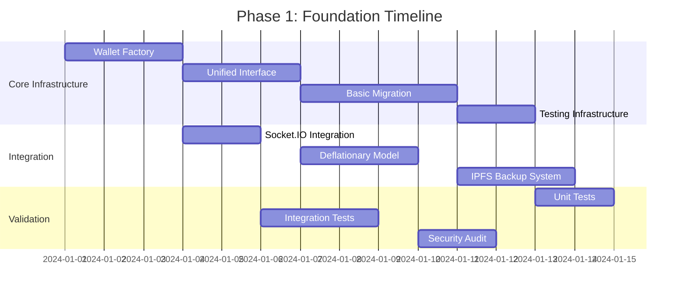
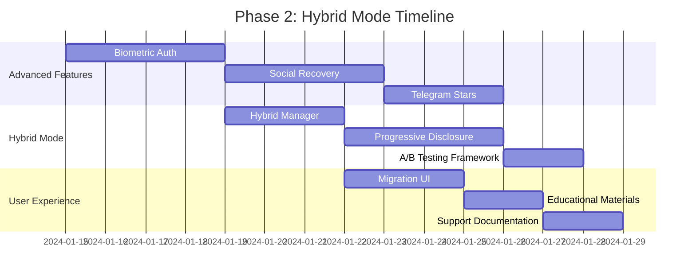
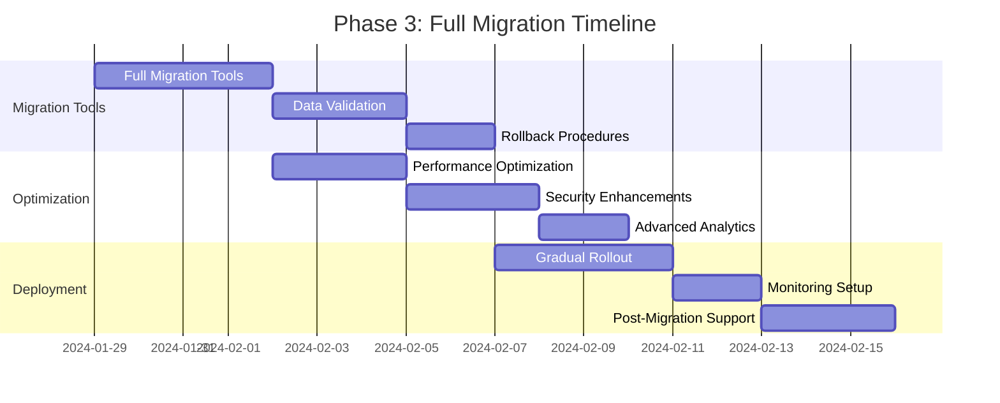
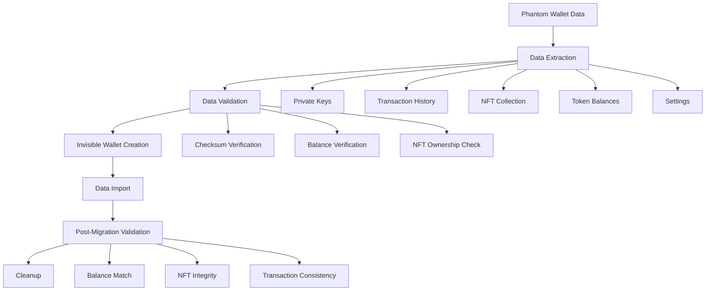
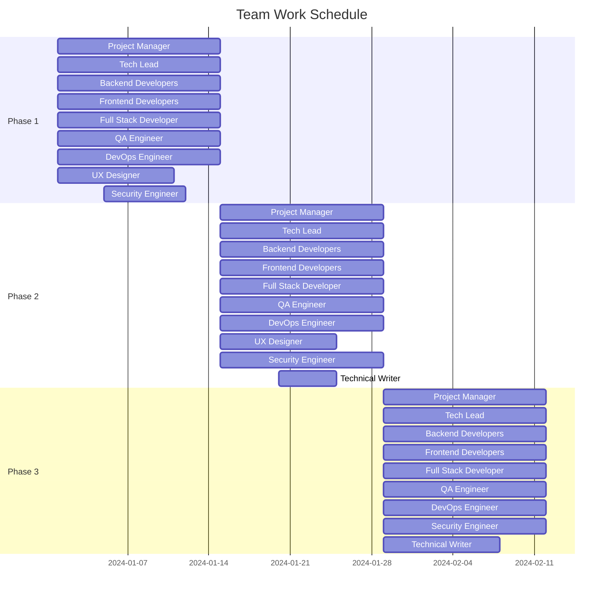
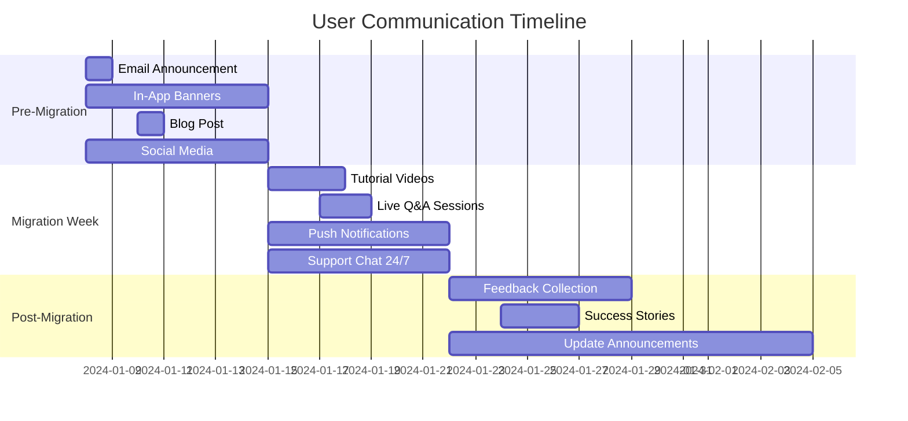

# ДЕТАЛЬНЫЙ ПЛАН ВНЕДРЕНИЯ INVISIBLE WALLET В NORMAL DANCE

## 📋 **Обзор Плана**

> _«Комплексная поэтапная реализация Invisible Wallet с минимальными рисками и максимальной эффективностью»_

---

## 🏗️ **1. Анализ Текущей Архитектуры**

### **1.1 Существующая Система**

| Компонент | Статус | Интеграция с Invisible Wallet | Приоритет |
|-----------|--------|----------------------------|-----------|
| **Phantom Wallet** | ✅ Активен | Требуется адаптер | Высокий |
| **Socket.IO Server** | ✅ /api/socketio | Готова интеграция | Высокий |
| **IPFS/Filecoin** | ✅ Enhanced | Бэкапы кошельков | Средний |
| **Дефляционная модель** | ✅ 2% burn | Интеграция транзакций | Высокий |
| **База данных** | ✅ Prisma + SQLite | Хранение метаданных | Средний |
| **Тестирование** | ⚠️ Базовое | Расширение coverage | Средний |

### **1.2 Ключевые Вызовы**

1. **Обратная совместимость** - сохранение функциональности Phantom
2. **Миграция данных** - безопасный перенос NFT и токенов
3. **Производительность** - минимизация влияния на UX
4. **Безопасность** - защита ключей и транзакций
5. **Образование пользователей** - плавный переход к новому UX

---

## 🔄 **2. Детализация Фаз Внедрения**

### **Phase 1: Foundation (Недели 1-2)**

#### **2.1.1 Инфраструктурные Компоненты**



#### **2.1.2 Конкретные Задачи**

| Задача | Ответственный | Срок | Зависимости | Критерий Выполнения |
|--------|--------------|------|-------------|---------------------|
| **Реализация Wallet Factory** | Backend Team | 3 дня | - | Фабрика создает Phantom и Invisible адаптеры |
| **Создание Unified Interface** | Frontend Team | 3 дня | Wallet Factory | Единый API для всех операций кошелька |
| **Базовая миграция Phantom→Invisible** | Full Stack | 4 дня | Unified Interface | Успешная миграция тестовых данных |
| **Интеграция с Socket.IO** | Backend Team | 2 дня | Wallet Factory | События кошелька транслируются через WebSocket |
| **Адаптация дефляционной модели** | Backend Team | 3 дня | Unified Interface | 2% burn применяется к Invisible транзакциям |
| **IPFS бэкап системы** | Backend Team | 3 дня | Basic Migration | Резервные копии хранятся в IPFS |
| **Тестовая инфраструктура** | QA Team | 2 дня | - | Jest тесты для всех компонентов |

#### **2.1.3 Ресурсы и Команды**

| Роль | Количество | Основные Задачи | Требуемые Навыки |
|------|------------|-----------------|------------------|
| **Backend Developer** | 2 | Wallet Factory, Socket.IO, IPFS | Node.js, TypeScript, Solana |
| **Frontend Developer** | 2 | Unified Interface, UI компоненты | React, TypeScript, Web3 |
| **Full Stack Developer** | 1 | Миграция данных, интеграция | React, Node.js, Blockchain |
| **QA Engineer** | 1 | Тестирование, автоматизация | Jest, Cypress, Web3 |
| **DevOps Engineer** | 0.5 | CI/CD, мониторинг | Docker, GitHub Actions |

#### **2.1.4 Риски и Митигация**

| Риск | Вероятность | Влияние | План Митигации |
|------|-------------|----------|----------------|
| **Проблемы с совместимостью** | Средняя | Высокое | Расширенное тестирование, fallback механизмы |
| **Задержки в разработке** | Средняя | Среднее | Буфер времени в 20%, приоритизация задач |
| **Проблемы с производительностью** | Низкая | Среднее | Профилирование, оптимизация критических путей |

---

### **Phase 2: Hybrid Mode (Недели 3-4)**

#### **2.2.1 Продвинутые Компоненты**



#### **2.2.2 Конкретные Задачи**

| Задача | Ответственный | Срок | Зависимости | Критерий Выполнения |
|--------|--------------|------|-------------|---------------------|
| **Биометрическая аутентификация** | Frontend Team | 4 дня | Unified Interface | Face ID/Touch ID работает на мобильных устройствах |
| **Социальное восстановление** | Full Stack | 4 дня | Biometric Auth | Восстановление через 3+ контактов |
| **Интеграция Telegram Stars** | Backend Team | 3 дня | Social Recovery | Покупки за Stars работают |
| **Hybrid Wallet Manager** | Full Stack | 3 дня | Basic Migration | Параллельная работа двух кошельков |
| **Progressive Disclosure UI** | Frontend Team | 4 дня | Hybrid Manager | Пошаговое раскрытие функций |
| **A/B Testing Framework** | Backend Team | 2 дня | Progressive Disclosure | Тестирование вариантов UI |
| **UI миграции** | Frontend Team | 3 дня | Hybrid Manager | Интуитивный интерфейс миграции |
| **Образовательные материалы** | UX Writer | 2 дня | Migration UI | Видео и текстовые инструкции |
| **Документация поддержки** | Tech Writer | 2 дня | Educational Materials | FAQ и troubleshooting гайды |

#### **2.2.3 Ресурсы и Команды**

| Роль | Количество | Основные Задачи | Требуемые Навыки |
|------|------------|-----------------|------------------|
| **Backend Developer** | 2 | Telegram Stars, A/B Testing | Node.js, Telegram API, Analytics |
| **Frontend Developer** | 2 | Biometric Auth, Progressive UI | React, Biometric APIs, UX |
| **Full Stack Developer** | 1 | Social Recovery, Hybrid Manager | React, Node.js, Security |
| **UX Designer** | 1 | Progressive Disclosure, Migration UI | Figma, User Research |
| **UX Writer** | 0.5 | Educational Materials | Technical Writing, UX |
| **Tech Writer** | 0.5 | Support Documentation | Technical Writing, API Docs |

#### **2.2.4 Риски и Митигация**

| Риск | Вероятность | Влияние | План Митигации |
|------|-------------|----------|----------------|
| **Сложность биометрии** | Средняя | Среднее | Fallback на пароль, тестирование на устройствах |
| **Проблемы с Telegram API** | Низкая | Высокое | Резервные методы оплаты, документация |
| **Низкое принятие пользователями** | Средняя | Высокое | A/B тестирование, образовательные материалы |

---

### **Phase 3: Full Migration (Недели 5-6)**

#### **2.3.1 Финальные Компоненты**



#### **2.3.2 Конкретные Задачи**

| Задача | Ответственный | Срок | Зависимости | Критерий Выполнения |
|--------|--------------|------|-------------|---------------------|
| **Инструменты полной миграции** | Full Stack | 4 дня | Hybrid Manager | Автоматическая миграция всех пользователей |
| **Валидация данных** | QA Team | 3 дня | Migration Tools | 100% целостность данных после миграции |
| **Rollback процедуры** | DevOps Team | 2 дня | Data Validation | Быстрый откат при проблемах |
| **Оптимизация производительности** | Full Stack | 3 дня | Migration Tools | Время ответа <200ms |
| **Усиление безопасности** | Security Team | 3 дня | Performance Optimization | A+ рейтинг безопасности |
| **Расширенная аналитика** | Backend Team | 2 дня | Security Enhancements | Детальная метрика использования |
| **Постепенное развертывание** | DevOps Team | 4 дня | Rollback Procedures | 5% → 20% → 50% → 100% пользователей |
| **Настройка мониторинга** | DevOps Team | 2 дня | Gradual Rollout | Алерты на все критические метрики |
| **Поддержка после миграции** | Support Team | 3 дня | Monitoring Setup | 24/7 поддержка в первую неделю |

#### **2.3.3 Ресурсы и Команды**

| Роль | Количество | Основные Задачи | Требуемые Навыки |
|------|------------|-----------------|------------------|
| **Backend Developer** | 2 | Analytics, Monitoring | Node.js, Data Analytics, Monitoring |
| **Full Stack Developer** | 2 | Migration Tools, Optimization | React, Node.js, Performance |
| **Security Engineer** | 1 | Security Enhancements | Security Auditing, Cryptography |
| **DevOps Engineer** | 1 | Rollback, Deployment, Monitoring | Docker, Kubernetes, Monitoring |
| **Support Specialist** | 1 | Post-Migration Support | Customer Support, Technical Knowledge |

#### **2.3.4 Риски и Митигация**

| Риск | Вероятность | Влияние | План Митигации |
|------|-------------|----------|----------------|
| **Потеря данных при миграции** | Низкая | Критическое | Множественные бэкапы, валидация |
| **Проблемы с производительностью** | Средняя | Высокое | Оптимизация, мониторинг, масштабирование |
| **Отказ пользователей** | Средняя | Критическое | Плавный переход, поддержка, образование |

---

## 🔧 **3. Технический План Реализации**

### **3.1 Архитектура Компонентов**

```typescript
// Основная архитектура внедрения
interface ImplementationArchitecture {
  // Core Components
  walletFactory: WalletFactory;
  unifiedInterface: UnifiedWalletInterface;
  migrationEngine: MigrationEngine;
  
  // Integration Layer
  socketIntegration: SocketWalletIntegration;
  deflationaryAdapter: DeflationaryWalletAdapter;
  ipfsBackup: WalletIPFSBackup;
  
  // Advanced Features
  biometricAuth: BiometricAuth;
  socialRecovery: SocialRecovery;
  telegramStars: TelegramStarsManager;
  
  // Monitoring & Analytics
  performanceMonitor: WalletPerformanceMonitor;
  analyticsEngine: WalletAnalytics;
  abTestingFramework: ABTestingFramework;
}
```

### **3.2 Порядок Реализации**

#### **3.2.1 Week 1-2: Core Infrastructure**

```typescript
// 1. Wallet Factory Implementation
class WalletFactory {
  private adapters = new Map<string, () => WalletAdapter>();
  
  static registerAdapter(type: string, factory: () => WalletAdapter): void {
    this.adapters.set(type, factory);
  }
  
  static createWallet(type: WalletType, config?: WalletConfig): ExtendedWalletAdapter {
    const factory = this.adapters.get(type);
    if (!factory) throw new Error(`Wallet type ${type} not supported`);
    
    const adapter = factory();
    return new WalletAdapterWrapper(adapter, config);
  }
}

// 2. Unified Interface
interface UnifiedWalletInterface {
  connect(): Promise<void>;
  disconnect(): Promise<void>;
  sendTransaction(tx: Transaction): Promise<string>;
  getBalance(): Promise<number>;
  
  // Invisible Wallet специфичные методы
  purchaseWithStars?(amount: number, description: string): Promise<any>;
  setupRecovery?(contacts: string[]): Promise<void>;
  getStarsBalance?(): Promise<number>;
}

// 3. Basic Migration
class BasicMigration {
  async migrateFromPhantom(phantomAdapter: PhantomWalletAdapter): Promise<MigrationResult> {
    // 1. Экспорт данных из Phantom
    const phantomData = await this.exportPhantomData(phantomAdapter);
    
    // 2. Создание Invisible Wallet
    const invisibleWallet = await this.createInvisibleWallet(phantomData);
    
    // 3. Валидация миграции
    const validation = await this.validateMigration(phantomData, invisibleWallet);
    
    return { success: validation.valid, newWallet: invisibleWallet };
  }
}
```

#### **3.2.2 Week 3-4: Advanced Features**

```typescript
// 1. Biometric Authentication
class BiometricAuth {
  async authenticate(): Promise<boolean> {
    if (typeof window !== 'undefined' && 'credentials' in navigator) {
      try {
        const credential = await navigator.credentials.get({
          publicKey: {
            challenge: new Uint8Array(32),
            allowCredentials: [],
            userVerification: 'required',
          },
        });
        
        return credential !== null;
      } catch (error) {
        console.error('Biometric authentication failed:', error);
        return false;
      }
    }
    return false;
  }
}

// 2. Social Recovery
class SocialRecovery {
  async setupRecovery(contacts: string[]): Promise<void> {
    // 1. Шифрование ключа с Shamir's Secret Sharing
    const shares = await this.createSecretShares(this.privateKey, contacts.length);
    
    // 2. Распределение shares между контактами
    for (let i = 0; i < contacts.length; i++) {
      await this.distributeShare(contacts[i], shares[i]);
    }
  }
  
  async recoverWallet(): Promise<void> {
    // 1. Сбор shares от контактов
    const shares = await this.collectSharesFromContacts();
    
    // 2. Восстановление приватного ключа
    const privateKey = await this.reconstructSecret(shares);
    
    // 3. Восстановление доступа к кошельку
    await this.restoreWalletAccess(privateKey);
  }
}

// 3. Telegram Stars Integration
class TelegramStarsManager {
  async purchaseWithStars(amount: number, description: string): Promise<TransactionResult> {
    // 1. Проверка баланса Stars
    const starsBalance = await this.getStarsBalance();
    
    if (starsBalance < amount) {
      throw new Error('Insufficient Stars balance');
    }
    
    // 2. Создание транзакции
    const transaction = await this.createStarsTransaction(amount, description);
    
    // 3. Отправка через Telegram API
    const result = await this.sendTelegramTransaction(transaction);
    
    return result;
  }
}
```

#### **3.2.3 Week 5-6: Full Migration**

```typescript
// 1. Full Migration Engine
class FullMigrationEngine {
  async migrateAllUsers(): Promise<MigrationReport> {
    const users = await this.getAllPhantomUsers();
    const results = [];
    
    for (const user of users) {
      try {
        const result = await this.migrateUser(user);
        results.push({ userId: user.id, success: true, result });
      } catch (error) {
        results.push({ userId: user.id, success: false, error: error.message });
      }
    }
    
    return {
      totalUsers: users.length,
      successfulMigrations: results.filter(r => r.success).length,
      failedMigrations: results.filter(r => !r.success).length,
      details: results,
    };
  }
}

// 2. Performance Optimization
class PerformanceOptimizer {
  async optimizeWalletPerformance(): Promise<OptimizationReport> {
    const optimizations = [
      this.optimizeTransactionSigning(),
      this.optimizeBalanceFetching(),
      this.optimizeEventHandling(),
      this.optimizeMemoryUsage(),
    ];
    
    const results = await Promise.all(optimizations);
    
    return {
      optimizationsCompleted: results.filter(r => r.success).length,
      performanceImprovement: this.calculatePerformanceImprovement(results),
      recommendations: this.generateOptimizationRecommendations(results),
    };
  }
}

// 3. Security Enhancements
class SecurityEnhancements {
  async enhanceSecurity(): Promise<SecurityReport> {
    const enhancements = [
      this.implementHardwareSecurityModule(),
      this.enhanceEncryptionStandards(),
      this.implementAdvancedThreatDetection(),
      this.conductSecurityAudit(),
    ];
    
    const results = await Promise.all(enhancements);
    
    return {
      securityScore: this.calculateSecurityScore(results),
      vulnerabilitiesFixed: results.filter(r => r.vulnerabilityFixed).length,
      securityLevel: this.determineSecurityLevel(results),
    };
  }
}
```

### **3.3 Система Ветвления и CI/CD**

#### **3.3.1 Стратегия Ветвления**

```
main (production)
├── develop (integration)
├── feature/invisible-wallet-foundation
├── feature/invisible-wallet-hybrid
├── feature/invisible-wallet-migration
├── release/v1.0.0-foundation
├── release/v1.1.0-hybrid
└── release/v1.2.0-full-migration
```

#### **3.3.2 CI/CD Pipeline**

```yaml
# .github/workflows/invisible-wallet.yml
name: Invisible Wallet Implementation

on:
  push:
    branches: [feature/invisible-wallet-*]
  pull_request:
    branches: [develop, main]

jobs:
  test:
    runs-on: ubuntu-latest
    steps:
      - uses: actions/checkout@v3
      - name: Setup Node.js
        uses: actions/setup-node@v3
        with:
          node-version: '18'
          cache: 'npm'
      
      - name: Install dependencies
        run: npm ci
      
      - name: Run unit tests
        run: npm run test:unit
      
      - name: Run integration tests
        run: npm run test:integration
      
      - name: Run wallet tests
        run: npm run test:wallet

  security-audit:
    runs-on: ubuntu-latest
    steps:
      - uses: actions/checkout@v3
      - name: Run security audit
        run: npm audit --audit-level=moderate
      
      - name: Run wallet security tests
        run: npm run test:security

  deploy-staging:
    needs: [test, security-audit]
    runs-on: ubuntu-latest
    if: github.ref == 'refs/heads/develop'
    steps:
      - name: Deploy to staging
        run: |
          # Деплой на staging сервер
          # Запуск smoke tests

  deploy-production:
    needs: [test, security-audit]
    runs-on: ubuntu-latest
    if: github.ref == 'refs/heads/main'
    steps:
      - name: Deploy to production
        run: |
          # Пошаговый деплой
          # Мониторинг здоровья
          # Rollback при проблемах
```

### **3.4 План Тестирования**

#### **3.4.1 Unit Tests**

```typescript
// src/components/wallet/tests/wallet-factory.test.ts
describe('WalletFactory', () => {
  test('should create Phantom wallet adapter', () => {
    const adapter = WalletFactory.createWallet('phantom');
    expect(adapter).toBeInstanceOf(PhantomWalletAdapter);
  });
  
  test('should create Invisible wallet adapter', () => {
    const config = { telegramUserId: 'test123' };
    const adapter = WalletFactory.createWallet('invisible', config);
    expect(adapter).toBeInstanceOf(InvisibleWalletAdapter);
  });
  
  test('should throw error for unsupported wallet type', () => {
    expect(() => WalletFactory.createWallet('unsupported')).toThrow();
  });
});
```

#### **3.4.2 Integration Tests**

```typescript
// src/components/wallet/tests/migration.test.ts
describe('Wallet Migration', () => {
  test('should migrate from Phantom to Invisible', async () => {
    const phantomAdapter = new PhantomWalletAdapter();
    const invisibleAdapter = new InvisibleWalletAdapter(testConfig);
    
    const migrationResult = await WalletMigration.migrateFromPhantom(
      phantomAdapter,
      invisibleAdapter
    );
    
    expect(migrationResult.success).toBe(true);
    expect(migrationResult.newPublicKey).toBeDefined();
  });
  
  test('should preserve balance during migration', async () => {
    const originalBalance = await getPhantomBalance();
    const migrationResult = await performMigration();
    
    const newBalance = await getInvisibleBalance();
    expect(newBalance).toBe(originalBalance);
  });
});
```

#### **3.4.3 E2E Tests**

```typescript
// tests/e2e/invisible-wallet.spec.ts
describe('Invisible Wallet E2E', () => {
  test('complete user journey', async () => {
    // 1. Пользователь заходит на платформу
    await page.goto('/');
    
    // 2. Выбирает Invisible Wallet
    await page.click('[data-testid="invisible-wallet-button"]');
    
    // 3. Проходит биометрическую аутентификацию
    await page.click('[data-testid="biometric-auth"]');
    
    // 4. Настраивает социальное восстановление
    await page.fill('[data-testid="recovery-contact-1"]', 'friend1@example.com');
    await page.fill('[data-testid="recovery-contact-2"]', 'friend2@example.com');
    await page.fill('[data-testid="recovery-contact-3"]', 'friend3@example.com');
    await page.click('[data-testid="setup-recovery"]');
    
    // 5. Проверяет баланс
    const balance = await page.textContent('[data-testid="wallet-balance"]');
    expect(balance).toMatch(/\d+\.\d+ SOL/);
    
    // 6. Совершает транзакцию
    await page.click('[data-testid="send-button"]');
    await page.fill('[data-testid="recipient-address"]', 'testRecipientAddress');
    await page.fill('[data-testid="amount"]', '0.1');
    await page.click('[data-testid="confirm-transaction"]');
    
    // 7. Проверяет успешность транзакции
    const successMessage = await page.textContent('[data-testid="transaction-success"]');
    expect(successMessage).toContain('Transaction successful');
  });
});
```

---

## 📊 **4. План Миграции Данных**

### **4.1 Стратегия Миграции**



### **4.2 Процесс Миграции**

#### **4.2.1 Экспорт Данных из Phantom**

```typescript
class PhantomDataExporter {
  async exportWalletData(adapter: PhantomWalletAdapter): Promise<PhantomWalletData> {
    const data: PhantomWalletData = {
      privateKey: await this.exportPrivateKey(adapter),
      publicKey: adapter.publicKey?.toBase58() || '',
      transactionHistory: await this.exportTransactionHistory(adapter),
      nftCollection: await this.exportNFTCollection(adapter),
      tokenBalances: await this.exportTokenBalances(adapter),
      settings: await this.exportSettings(adapter),
      metadata: {
        exportDate: new Date().toISOString(),
        version: '1.0.0',
        checksum: '', // Будет вычислен
      },
    };
    
    // Вычисление checksum для целостности
    data.metadata.checksum = await this.calculateChecksum(data);
    
    return data;
  }
  
  private async exportPrivateKey(adapter: PhantomWalletAdapter): Promise<string> {
    // Безопасный экспорт приватного ключа
    // Только с согласия пользователя
    const privateKey = await adapter.exportPrivateKey();
    return await this.encryptPrivateKey(privateKey);
  }
  
  private async exportTransactionHistory(adapter: PhantomWalletAdapter): Promise<Transaction[]> {
    const connection = adapter.connection;
    const publicKey = adapter.publicKey;
    
    if (!publicKey) throw new Error('Wallet not connected');
    
    const signatures = await connection.getSignaturesForAddress(publicKey, {
      limit: 1000,
    });
    
    const transactions = [];
    for (const sig of signatures) {
      const tx = await connection.getTransaction(sig.signature, {
        maxSupportedTransactionVersion: 0,
      });
      if (tx) {
        transactions.push({
          signature: sig.signature,
          timestamp: tx.blockTime || 0,
          slot: sig.slot,
          fee: tx.meta?.fee || 0,
          status: tx.meta?.err ? 'failed' : 'success',
        });
      }
    }
    
    return transactions;
  }
  
  private async exportNFTCollection(adapter: PhantomWalletAdapter): Promise<NFT[]> {
    // Экспорт NFT коллекции
    const connection = adapter.connection;
    const publicKey = adapter.publicKey;
    
    if (!publicKey) throw new Error('Wallet not connected');
    
    const nfts = await connection.getParsedTokenAccountsByOwner(publicKey, {
      programId: new PublicKey('TokenkegQfeZyiNwAJbNbGKPFXCWuBvf9Ss623VQ5DA'),
    });
    
    return nfts.value
      .filter(account => account.account.data.parsed.info.tokenAmount.uiAmount === 1)
      .map(account => ({
        mint: account.account.data.parsed.info.mint,
        name: '', // Получить метаданные
        image: '', // Получить изображение
        attributes: [],
      }));
  }
}
```

#### **4.2.2 Создание Invisible Wallet**

```typescript
class InvisibleWalletCreator {
  async createWalletFromPhantomData(
    phantomData: PhantomWalletData,
    config: InvisibleWalletConfig
  ): Promise<InvisibleWalletData> {
    // 1. Валидация входных данных
    await this.validatePhantomData(phantomData);
    
    // 2. Создание нового Invisible Wallet
    const invisibleWallet = await this.createInvisibleWallet(config);
    
    // 3. Импорт приватного ключа
    const privateKey = await this.decryptPrivateKey(phantomData.privateKey);
    await invisibleWallet.importPrivateKey(privateKey);
    
    // 4. Настройка биометрии
    if (config.enableBiometric) {
      await this.setupBiometricAuth(invisibleWallet);
    }
    
    // 5. Настройка социального восстановления
    if (config.enableSocialRecovery && config.trustedContacts) {
      await invisibleWallet.setupRecovery(config.trustedContacts);
    }
    
    // 6. Синхронизация данных
    await this.syncWalletData(invisibleWallet, phantomData);
    
    return {
      walletId: invisibleWallet.id,
      publicKey: invisibleWallet.publicKey,
      createdAt: new Date().toISOString(),
      migratedFrom: 'phantom',
      originalData: phantomData.metadata,
    };
  }
  
  private async validatePhantomData(data: PhantomWalletData): Promise<void> {
    // Проверка целостности данных
    const calculatedChecksum = await this.calculateChecksum(data);
    if (calculatedChecksum !== data.metadata.checksum) {
      throw new Error('Data integrity check failed');
    }
    
    // Проверка обязательных полей
    if (!data.privateKey || !data.publicKey) {
      throw new Error('Missing required wallet data');
    }
  }
  
  private async syncWalletData(
    invisibleWallet: InvisibleWalletAdapter,
    phantomData: PhantomWalletData
  ): Promise<void> {
    // Синхронизация истории транзакций
    await invisibleWallet.importTransactionHistory(phantomData.transactionHistory);
    
    // Синхронизация NFT коллекции
    await invisibleWallet.importNFTCollection(phantomData.nftCollection);
    
    // Синхронизация настроек
    await invisibleWallet.importSettings(phantomData.settings);
  }
}
```

#### **4.2.3 Валидация После Миграции**

```typescript
class MigrationValidator {
  async validateMigration(
    phantomData: PhantomWalletData,
    invisibleWallet: InvisibleWalletAdapter
  ): Promise<ValidationResult> {
    const results = {
      balanceValidation: await this.validateBalance(phantomData, invisibleWallet),
      nftValidation: await this.validateNFTs(phantomData, invisibleWallet),
      transactionValidation: await this.validateTransactions(phantomData, invisibleWallet),
      settingsValidation: await this.validateSettings(phantomData, invisibleWallet),
    };
    
    const allValidationsPassed = Object.values(results).every(r => r.valid);
    
    return {
      valid: allValidationsPassed,
      details: results,
      issues: this.collectIssues(results),
      recommendations: this.generateRecommendations(results),
    };
  }
  
  private async validateBalance(
    phantomData: PhantomWalletData,
    invisibleWallet: InvisibleWalletAdapter
  ): Promise<BalanceValidation> {
    const phantomBalance = phantomData.tokenBalances.find(t => t.symbol === 'SOL')?.balance || 0;
    const invisibleBalance = await invisibleWallet.getBalance();
    
    return {
      valid: Math.abs(phantomBalance - invisibleBalance) < 0.001, // Допуск на комиссии
      phantomBalance,
      invisibleBalance,
      difference: Math.abs(phantomBalance - invisibleBalance),
    };
  }
  
  private async validateNFTs(
    phantomData: PhantomWalletData,
    invisibleWallet: InvisibleWalletAdapter
  ): Promise<NFTValidation> {
    const phantomNFTs = phantomData.nftCollection;
    const invisibleNFTs = await invisibleWallet.getNFTCollection();
    
    const missingNFTs = phantomNFTs.filter(
      phantomNFT => !invisibleNFTs.some(invisibleNFT => 
        invisibleNFT.mint === phantomNFT.mint
      )
    );
    
    return {
      valid: missingNFTs.length === 0,
      phantomCount: phantomNFTs.length,
      invisibleCount: invisibleNFTs.length,
      missingNFTs,
    };
  }
}
```

### **4.3 Система Бэкапов и Восстановления**

#### **4.3.1 Стратегия Бэкапов**

```typescript
class WalletBackupSystem {
  async createComprehensiveBackup(
    walletData: WalletData
  ): Promise<BackupResult> {
    const backups = await Promise.all([
      this.createLocalBackup(walletData),
      this.createIPFSBackup(walletData),
      this.createTelegramBackup(walletData),
      this.createEncryptedCloudBackup(walletData),
    ]);
    
    const backupManifest = {
      walletId: walletData.id,
      timestamp: new Date().toISOString(),
      backups: backups.map(b => ({
        type: b.type,
        location: b.location,
        checksum: b.checksum,
        encrypted: b.encrypted,
      })),
      version: '1.0.0',
    };
    
    // Сохранение манифеста во все локации
    await this.distributeManifest(backupManifest);
    
    return {
      success: true,
      backupId: this.generateBackupId(),
      locations: backups.map(b => b.location),
      manifest: backupManifest,
    };
  }
  
  private async createIPFSBackup(walletData: WalletData): Promise<BackupLocation> {
    const encryptedData = await this.encryptWalletData(walletData);
    
    const result = await uploadWithReplication(
      new File([encryptedData], 'wallet-backup.enc'),
      {
        title: 'Wallet Backup',
        artist: 'System',
        genre: 'backup',
        duration: 0,
        isExplicit: false,
        fileSize: encryptedData.length,
        format: 'encrypted',
        sampleRate: 0,
        bitDepth: 0,
        releaseDate: new Date().toISOString(),
      },
      {
        replicateToGateways: [
          'https://ipfs.io',
          'https://gateway.pinata.cloud',
          'https://cloudflare-ipfs.com',
        ],
        enableFilecoin: true,
      }
    );
    
    return {
      type: 'ipfs',
      location: result.cid,
      checksum: await this.calculateChecksum(encryptedData),
      encrypted: true,
    };
  }
  
  private async createTelegramBackup(walletData: WalletData): Promise<BackupLocation> {
    // Создание бэкапа через Telegram Bot API
    const encryptedData = await this.encryptWalletData(walletData);
    
    const response = await fetch(`https://api.telegram.org/bot${process.env.TELEGRAM_BOT_TOKEN}/sendDocument`, {
      method: 'POST',
      headers: {
        'Content-Type': 'application/json',
      },
      body: JSON.stringify({
        chat_id: walletData.telegramUserId,
        document: {
          source: Buffer.from(encryptedData).toString('base64'),
          filename: 'wallet-backup.enc',
        },
      }),
    });
    
    const result = await response.json();
    
    return {
      type: 'telegram',
      location: result.result.document.file_id,
      checksum: await this.calculateChecksum(encryptedData),
      encrypted: true,
    };
  }
}
```

#### **4.3.2 Процедура Восстановления**

```typescript
class WalletRecoverySystem {
  async restoreWalletFromBackup(
    backupId: string,
    recoveryOptions: RecoveryOptions
  ): Promise<RecoveryResult> {
    try {
      // 1. Получение манифеста бэкапа
      const manifest = await this.getBackupManifest(backupId);
      
      // 2. Выбор лучшей локации для восстановления
      const bestLocation = await this.selectBestBackupLocation(manifest.backups);
      
      // 3. Загрузка данных бэкапа
      const backupData = await this.loadBackupData(bestLocation);
      
      // 4. Валидация целостности
      const isValid = await this.validateBackupIntegrity(backupData, bestLocation.checksum);
      if (!isValid) {
        throw new Error('Backup integrity validation failed');
      }
      
      // 5. Расшифровка данных
      const walletData = await this.decryptWalletData(backupData, recoveryOptions.decryptionKey);
      
      // 6. Восстановление кошелька
      const restoredWallet = await this.restoreWallet(walletData, recoveryOptions);
      
      // 7. Пост-валидация
      const postValidation = await this.validateRestoredWallet(restoredWallet, walletData);
      
      return {
        success: true,
        wallet: restoredWallet,
        validation: postValidation,
        backupLocation: bestLocation.type,
      };
    } catch (error) {
      return {
        success: false,
        error: error.message,
        fallbackOptions: await this.getFallbackRecoveryOptions(backupId),
      };
    }
  }
  
  private async selectBestBackupLocation(
    backups: BackupLocation[]
  ): Promise<BackupLocation> {
    // Приоритет локаций для восстановления
    const locationPriority = {
      'local': 1,
      'telegram': 2,
      'ipfs': 3,
      'cloud': 4,
    };
    
    // Сортировка по приоритету и доступности
    const availableLocations = await Promise.all(
      backups.map(async backup => ({
        ...backup,
        available: await this.checkLocationAvailability(backup),
        priority: locationPriority[backup.type] || 999,
      }))
    );
    
    availableLocations.sort((a, b) => a.priority - b.priority);
    
    const bestLocation = availableLocations.find(l => l.available);
    
    if (!bestLocation) {
      throw new Error('No backup locations available');
    }
    
    return bestLocation;
  }
}
```

---

## 🚀 **5. План Развертывания**

### **5.1 Инфраструктурные Требования**

#### **5.1.1 Серверная Инфраструктура**

| Компонент | Текущий | Требуемый | Масштабирование |
|-----------|----------|------------|-----------------|
| **Node.js Server** | 1x 2CPU 4GB | 2x 4CPU 8GB | Auto-scaling |
| **Database** | SQLite | PostgreSQL + Redis | Cluster |
| **IPFS Nodes** | Внешние | Собственные 3 узла | Geo-distributed |
| **Socket.IO** | 1 instance | Redis Cluster | Multi-region |
| **Monitoring** | Базовое | Prometheus + Grafana | Full stack |

#### **5.1.2 CI/CD Инфраструктура**

```yaml
# docker-compose.production.yml
version: '3.8'
services:
  app:
    image: normaldance/invisible-wallet:latest
    replicas: 3
    environment:
      - NODE_ENV=production
      - DATABASE_URL=${DATABASE_URL}
      - REDIS_URL=${REDIS_URL}
    deploy:
      replicas: 3
      update_config:
        parallelism: 1
        delay: 10s
      restart_policy:
        condition: on-failure
        delay: 5s
        max_attempts: 3

  nginx:
    image: nginx:alpine
    ports:
      - "80:80"
      - "443:443"
    volumes:
      - ./nginx.conf:/etc/nginx/nginx.conf
      - ./ssl:/etc/ssl
    depends_on:
      - app

  redis:
    image: redis:alpine
    command: redis-server --appendonly yes
    volumes:
      - redis_data:/data

  postgres:
    image: postgres:14
    environment:
      - POSTGRES_DB=${POSTGRES_DB}
      - POSTGRES_USER=${POSTGRES_USER}
      - POSTGRES_PASSWORD=${POSTGRES_PASSWORD}
    volumes:
      - postgres_data:/var/lib/postgresql/data

  prometheus:
    image: prom/prometheus
    ports:
      - "9090:9090"
    volumes:
      - ./prometheus.yml:/etc/prometheus/prometheus.yml

  grafana:
    image: grafana/grafana
    ports:
      - "3001:3000"
    environment:
      - GF_SECURITY_ADMIN_PASSWORD=${GRAFANA_PASSWORD}
    volumes:
      - grafana_data:/var/lib/grafana

volumes:
  redis_data:
  postgres_data:
  grafana_data:
```

### **5.2 Процесс Развертывания по Фазам**

#### **5.2.1 Phase 1: Foundation Deployment**

```bash
#!/bin/bash
# deploy-phase1.sh

echo "🚀 Starting Phase 1 Deployment: Foundation"

# 1. Подготовка окружения
echo "📦 Preparing environment..."
npm ci
npm run build

# 2. Запуск тестов
echo "🧪 Running tests..."
npm run test:unit
npm run test:integration
npm run test:wallet

# 3. Сборка Docker образа
echo "🐳 Building Docker image..."
docker build -t normaldance/invisible-wallet:phase1 .

# 4. Развертывание на staging
echo "🌍 Deploying to staging..."
docker-compose -f docker-compose.staging.yml up -d

# 5. Проверка здоровья
echo "🏥 Health check..."
./scripts/health-check.sh staging

# 6. Запуск smoke tests
echo "💨 Running smoke tests..."
npm run test:smoke

# 7. Развертывание на production (5% пользователей)
echo "🎯 Deploying to production (5% canary)..."
kubectl apply -f k8s/phase1-canary.yaml

# 8. Мониторинг
echo "📊 Setting up monitoring..."
./scripts/setup-monitoring.sh phase1

echo "✅ Phase 1 deployment completed!"
```

#### **5.2.2 Phase 2: Hybrid Mode Deployment**

```bash
#!/bin/bash
# deploy-phase2.sh

echo "🔄 Starting Phase 2 Deployment: Hybrid Mode"

# 1. Подготовка
echo "📦 Preparing environment..."
npm ci
npm run build:phase2

# 2. Расширенное тестирование
echo "🧪 Running extended tests..."
npm run test:unit
npm run test:integration
npm run test:wallet
npm run test:biometric
npm run test:social-recovery
npm run test:telegram-stars

# 3. Безопасность
echo "🔒 Running security audit..."
npm audit --audit-level=moderate
npm run test:security

# 4. Сборка образа
echo "🐳 Building Docker image..."
docker build -t normaldance/invisible-wallet:phase2 .

# 5. Развертывание на staging
echo "🌍 Deploying to staging..."
docker-compose -f docker-compose.staging.yml up -d

# 6. A/B тестирование настройка
echo "🧪 Setting up A/B testing..."
./scripts/setup-ab-testing.sh

# 7. Постепенное развертывание
echo "📈 Gradual rollout..."
# 20% пользователей
kubectl apply -f k8s/phase2-20percent.yaml
sleep 1h
# 50% пользователей
kubectl apply -f k8s/phase2-50percent.yaml

echo "✅ Phase 2 deployment completed!"
```

#### **5.2.3 Phase 3: Full Migration Deployment**

```bash
#!/bin/bash
# deploy-phase3.sh

echo "🎯 Starting Phase 3 Deployment: Full Migration"

# 1. Финальная подготовка
echo "📦 Final preparation..."
npm ci
npm run build:production

# 2. Комплексное тестирование
echo "🧪 Running comprehensive tests..."
npm run test:all
npm run test:e2e
npm run test:performance
npm run test:security

# 3. Финальный аудит безопасности
echo "🔒 Final security audit..."
npm audit --audit-level=low
npm run test:penetration

# 4. Сборка финального образа
echo "🐳 Building final Docker image..."
docker build -t normaldance/invisible-wallet:latest .

# 5. Резервное копирование
echo "💾 Creating backup..."
./scripts/create-backup.sh

# 6. Полное развертывание
echo "🚀 Full deployment..."
kubectl apply -f k8s/production.yaml

# 7. Валидация
echo "✅ Post-deployment validation..."
./scripts/post-deployment-validation.sh

# 8. Очистка старых ресурсов
echo "🧹 Cleanup old resources..."
kubectl delete -f k8s/phase1-canary.yaml
kubectl delete -f k8s/phase2-20percent.yaml
kubectl delete -f k8s/phase2-50percent.yaml

echo "✅ Phase 3 deployment completed!"
echo "🎉 Invisible Wallet fully deployed!"
```

### **5.3 Мониторинг и Алерты**

#### **5.3.1 Метрики Мониторинга**

```typescript
// monitoring/metrics.ts
export class WalletMetrics {
  private prometheus = require('prom-client');
  
  // Основные метрики
  private walletConnections = new this.prometheus.Counter({
    name: 'wallet_connections_total',
    help: 'Total number of wallet connections',
    labelNames: ['wallet_type', 'success'],
  });
  
  private migrationAttempts = new this.prometheus.Counter({
    name: 'migration_attempts_total',
    help: 'Total number of migration attempts',
    labelNames: ['from_type', 'to_type', 'success'],
  });
  
  private transactionVolume = new this.prometheus.Counter({
    name: 'transactions_total',
    help: 'Total number of transactions',
    labelNames: ['wallet_type', 'status'],
  });
  
  private responseTime = new this.prometheus.Histogram({
    name: 'wallet_operation_duration_seconds',
    help: 'Duration of wallet operations',
    labelNames: ['operation', 'wallet_type'],
    buckets: [0.1, 0.5, 1, 2, 5, 10],
  });
  
  private errorRate = new this.prometheus.Counter({
    name: 'wallet_errors_total',
    help: 'Total number of wallet errors',
    labelNames: ['error_type', 'wallet_type'],
  });
  
  // Бизнес метрики
  private userSatisfaction = new this.prometheus.Gauge({
    name: 'user_satisfaction_score',
    help: 'User satisfaction score (1-5)',
    labelNames: ['wallet_type'],
  });
  
  private featureAdoption = new this.prometheus.Gauge({
    name: 'feature_adoption_rate',
    help: 'Feature adoption rate',
    labelNames: ['feature', 'wallet_type'],
  });
  
  recordWalletConnection(walletType: string, success: boolean): void {
    this.walletConnections.inc({ wallet_type: walletType, success: success.toString() });
  }
  
  recordMigrationAttempt(fromType: string, toType: string, success: boolean): void {
    this.migrationAttempts.inc({ 
      from_type: fromType, 
      to_type: toType, 
      success: success.toString() 
    });
  }
  
  recordTransaction(walletType: string, status: string): void {
    this.transactionVolume.inc({ wallet_type: walletType, status });
  }
  
  recordResponseTime(operation: string, walletType: string, duration: number): void {
    this.responseTime.observe({ operation, wallet_type: walletType }, duration / 1000);
  }
  
  recordError(errorType: string, walletType: string): void {
    this.errorRate.inc({ error_type: errorType, wallet_type: walletType });
  }
  
  updateUserSatisfaction(walletType: string, score: number): void {
    this.userSatisfaction.set({ wallet_type: walletType }, score);
  }
  
  updateFeatureAdoption(feature: string, walletType: string, rate: number): void {
    this.featureAdoption.set({ feature, wallet_type: walletType }, rate);
  }
}
```

#### **5.3.2 Система Алертов**

```yaml
# monitoring/alerts.yml
groups:
  - name: wallet_alerts
    rules:
      - alert: HighErrorRate
        expr: rate(wallet_errors_total[5m]) > 0.1
        for: 2m
        labels:
          severity: warning
        annotations:
          summary: "High error rate detected"
          description: "Error rate is {{ $value }} errors per second"
      
      - alert: MigrationFailure
        expr: increase(migration_attempts_total{success="false"}[5m]) > 5
        for: 1m
        labels:
          severity: critical
        annotations:
          summary: "Multiple migration failures"
          description: "{{ $value }} migration failures in the last 5 minutes"
      
      - alert: SlowResponseTime
        expr: histogram_quantile(0.95, rate(wallet_operation_duration_seconds_bucket[5m])) > 2
        for: 5m
        labels:
          severity: warning
        annotations:
          summary: "Slow response times"
          description: "95th percentile response time is {{ $value }} seconds"
      
      - alert: LowUserSatisfaction
        expr: user_satisfaction_score < 3.5
        for: 10m
        labels:
          severity: warning
        annotations:
          summary: "Low user satisfaction"
          description: "User satisfaction score is {{ $value }}"
      
      - alert: WalletConnectionFailure
        expr: increase(wallet_connections_total{success="false"}[5m]) > 10
        for: 2m
        labels:
          severity: critical
        annotations:
          summary: "Multiple wallet connection failures"
          description: "{{ $value }} connection failures in the last 5 minutes"
```

### **5.4 Rollback Процедуры**

#### **5.4.1 Автоматический Rollback**

```typescript
class RollbackManager {
  async executeRollback(rollbackPlan: RollbackPlan): Promise<RollbackResult> {
    const results = [];
    
    try {
      // 1. Остановка нового развертывания
      await this.stopNewDeployment();
      results.push({ step: 'stop_deployment', success: true });
      
      // 2. Восстановление предыдущей версии
      await this.restorePreviousVersion(rollbackPlan.previousVersion);
      results.push({ step: 'restore_version', success: true });
      
      // 3. Восстановление базы данных
      await this.restoreDatabase(rollbackPlan.databaseBackup);
      results.push({ step: 'restore_database', success: true });
      
      // 4. Проверка здоровья
      const healthCheck = await this.performHealthCheck();
      results.push({ step: 'health_check', success: healthCheck.healthy });
      
      if (!healthCheck.healthy) {
        throw new Error('Health check failed after rollback');
      }
      
      // 5. Валидация функциональности
      const validation = await this.validateFunctionality();
      results.push({ step: 'validate_functionality', success: validation.valid });
      
      return {
        success: true,
        results,
        rollbackTime: Date.now() - rollbackPlan.startTime,
      };
    } catch (error) {
      // Если rollback не удался, уведомляем команду
      await this.notifyEmergencyTeam(error);
      
      return {
        success: false,
        error: error.message,
        results,
      };
    }
  }
  
  private async stopNewDeployment(): Promise<void> {
    // Остановка новых pod'ов
    await kubectl.scale('deployment', 'invisible-wallet', '--replicas=0');
    
    // Ожидание остановки
    await this.waitForPodsTermination('invisible-wallet');
  }
  
  private async restorePreviousVersion(version: string): Promise<void> {
    // Восстановление предыдущего Docker образа
    await kubectl.set('image', 'deployment/invisible-wallet', `app=normaldance/invisible-wallet:${version}`);
    
    // Масштабирование
    await kubectl.scale('deployment', 'invisible-wallet', '--replicas=3');
    
    // Ожидание запуска
    await this.waitForPodsReady('invisible-wallet');
  }
  
  private async restoreDatabase(backupId: string): Promise<void> {
    // Восстановление базы данных из бэкапа
    await this.executeDatabaseRestore(backupId);
    
    // Проверка целостности
    await this.validateDatabaseIntegrity();
  }
}
```

#### **5.4.2 Ручной Rollback**

```bash
#!/bin/bash
# manual-rollback.sh

echo "🔄 Starting manual rollback..."

# 1. Проверка текущего состояния
echo "📊 Checking current state..."
kubectl get pods -l app=invisible-wallet
kubectl get deployment invisible-wallet

# 2. Выбор версии для отката
echo "📋 Available versions:"
kubectl get deployment invisible-wallet -o yaml | grep "image:" | tail -10

read -p "Enter version to rollback to: " VERSION

# 3. Остановка текущего развертывания
echo "⏹️ Stopping current deployment..."
kubectl scale deployment invisible-wallet --replicas=0

# 4. Ожидание остановки
echo "⏳ Waiting for pods to terminate..."
kubectl wait --for=delete pod -l app=invisible-wallet --timeout=300s

# 5. Восстановление предыдущей версии
echo "🔄 Restoring version $VERSION..."
kubectl set image deployment/invisible-wallet app=normaldance/invisible-wallet:$VERSION

# 6. Масштабирование
echo "📈 Scaling up..."
kubectl scale deployment invisible-wallet --replicas=3

# 7. Ожидание запуска
echo "⏳ Waiting for pods to be ready..."
kubectl wait --for=condition=ready pod -l app=invisible-wallet --timeout=300s

# 8. Проверка здоровья
echo "🏥 Health check..."
./scripts/health-check.sh production

# 9. Валидация
echo "✅ Validation..."
./scripts/post-rollback-validation.sh

echo "✅ Rollback completed successfully!"
```

---

## 👥 **6. План Команды и Ресурсов**

### **6.1 Структура Команды**

#### **6.1.1 Роли и Ответственности**

| Роль | Количество | Основные Ответственности | Требуемые Навыки |
|------|------------|-------------------------|------------------|
| **Project Manager** | 1 | Координация проекта, управление рисками, отчетность | Agile, Scrum, Web3 |
| **Tech Lead** | 1 | Архитектура, код-ревью, технические решения | Solana, TypeScript, System Design |
| **Backend Developer** | 2 | API, база данных, интеграция с блокчейном | Node.js, Solana, PostgreSQL |
| **Frontend Developer** | 2 | UI/UX, React компоненты, состояние приложения | React, TypeScript, Web3 |
| **Full Stack Developer** | 1 | Миграция данных, интеграция систем | React, Node.js, Blockchain |
| **Security Engineer** | 1 | Аудит безопасности, криптография | Security Auditing, Cryptography |
| **QA Engineer** | 1 | Тестирование, автоматизация, CI/CD | Jest, Cypress, Web3 Testing |
| **DevOps Engineer** | 1 | Инфраструктура, развертывание, мониторинг | Docker, Kubernetes, Monitoring |
| **UX Designer** | 1 | Дизайн интерфейса, пользовательский опыт | Figma, User Research |
| **Technical Writer** | 0.5 | Документация, руководства | Technical Writing |

#### **6.1.2 График Работы Команды**



### **6.2 Бюджетные Требования**

#### **6.2.1 Затраты на Персонал**

| Роль | Ставка (в час) | Часы в Phase 1 | Часы в Phase 2 | Часы в Phase 3 | Всего |
|------|----------------|-----------------|-----------------|-----------------|-------|
| **Project Manager** | $80 | 112 | 112 | 112 | $26,880 |
| **Tech Lead** | $100 | 112 | 112 | 112 | $33,600 |
| **Backend Developer** | $70 | 224 | 224 | 224 | $47,040 |
| **Frontend Developer** | $70 | 224 | 224 | 224 | $47,040 |
| **Full Stack Developer** | $80 | 112 | 112 | 112 | $26,880 |
| **Security Engineer** | $90 | 56 | 112 | 112 | $25,200 |
| **QA Engineer** | $60 | 112 | 112 | 112 | $20,160 |
| **DevOps Engineer** | $75 | 112 | 112 | 112 | $25,200 |
| **UX Designer** | $65 | 80 | 80 | 40 | $13,000 |
| **Technical Writer** | $50 | 0 | 40 | 80 | $6,000 |
| **Итого** | | | | | **$270,000** |

#### **6.2.2 Инфраструктурные Затраты**

| Компонент | Ежемесячные затраты | Период | Всего |
|-----------|---------------------|---------|-------|
| **Облачные серверы** | $500 | 6 месяцев | $3,000 |
| **База данных** | $200 | 6 месяцев | $1,200 |
| **IPFS хранение** | $100 | 6 месяцев | $600 |
| **Мониторинг** | $150 | 6 месяцев | $900 |
| **CI/CD** | $50 | 6 месяцев | $300 |
| **Безопасность** | $200 | 6 месяцев | $1,200 |
| **Резервирование** | $100 | 6 месяцев | $600 |
| **Итого** | | | **$7,800** |

#### **6.2.3 Дополнительные Затраты**

| Статья | Стоимость | Описание |
|--------|-----------|----------|
| **Аудит безопасности** | $15,000 | Внешний аудит безопасности |
| **Юридическая экспертиза** | $5,000 | Консультации по регулированию |
| **Маркетинговые материалы** | $3,000 | Образовательные материалы |
| **Поддержка пользователей** | $2,000 | Дополнительная поддержка |
| **Непредвиденные расходы** | $10,000 | 10% от общего бюджета |
| **Итого** | **$35,000** | |

#### **6.2.4 Общий Бюджет**

| Категория | Сумма |
|-----------|-------|
| **Персонал** | $270,000 |
| **Инфраструктура** | $7,800 |
| **Дополнительные расходы** | $35,000 |
| **Общий бюджет** | **$312,800** |

### **6.3 План Обучения и Онбординга**

#### **6.3.1 Техническое Обучение**

```typescript
// training/technical-training.ts
export class TechnicalTraining {
  private trainingModules = [
    {
      id: 'invisible-wallet-architecture',
      title: 'Invisible Wallet Architecture',
      duration: '4 hours',
      topics: [
        'Core concepts and principles',
        'Progressive disclosure pattern',
        'Security architecture',
        'Integration with existing systems',
      ],
      prerequisites: ['Basic Web3 knowledge', 'TypeScript proficiency'],
    },
    {
      id: 'biometric-authentication',
      title: 'Biometric Authentication Implementation',
      duration: '3 hours',
      topics: [
        'Web Authentication API',
        'Face ID / Touch ID integration',
        'Security considerations',
        'Fallback mechanisms',
      ],
      prerequisites: ['JavaScript async/await', 'Security basics'],
    },
    {
      id: 'social-recovery',
      title: 'Social Recovery Systems',
      duration: '4 hours',
      topics: [
        'Shamir\'s Secret Sharing',
        'Contact management',
        'Recovery flows',
        'Security best practices',
      ],
      prerequisites: ['Cryptography basics', 'React state management'],
    },
    {
      id: 'telegram-integration',
      title: 'Telegram Stars Integration',
      duration: '2 hours',
      topics: [
        'Telegram Bot API',
        'Payments API',
        'WebApp integration',
        'Error handling',
      ],
      prerequisites: ['REST APIs', 'Webhook handling'],
    },
  ];
  
  async conductTraining(moduleId: string): Promise<TrainingResult> {
    const module = this.trainingModules.find(m => m.id === moduleId);
    if (!module) {
      throw new Error(`Training module ${moduleId} not found`);
    }
    
    // Проверка предварительных требований
    await this.validatePrerequisites(module.prerequisites);
    
    // Проведение обучения
    const trainingSession = await this.startTrainingSession(module);
    
    // Практические задания
    const practicalResults = await this.assignPracticalTasks(module);
    
    // Оценка результатов
    const assessment = await this.assessUnderstanding(module);
    
    return {
      moduleId,
      completed: true,
      practicalScore: practicalResults.score,
      assessmentScore: assessment.score,
      recommendations: this.generateRecommendations(assessment),
    };
  }
}
```

#### **6.3.2 Обучение Пользователей**

```typescript
// training/user-education.ts
export class UserEducation {
  private educationPaths = [
    {
      level: 'beginner',
      title: 'Getting Started with Invisible Wallet',
      modules: [
        {
          title: 'What is Invisible Wallet?',
          duration: '5 minutes',
          format: 'video',
          content: 'Introduction to the concept and benefits',
        },
        {
          title: 'Setting up your first Invisible Wallet',
          duration: '3 minutes',
          format: 'interactive',
          content: 'Step-by-step setup guide',
        },
        {
          title: 'Making your first transaction',
          duration: '4 minutes',
          format: 'simulation',
          content: 'Interactive transaction simulation',
        },
      ],
    },
    {
      level: 'intermediate',
      title: 'Advanced Features',
      modules: [
        {
          title: 'Biometric Authentication',
          duration: '3 minutes',
          format: 'video',
          content: 'Setting up and using biometric auth',
        },
        {
          title: 'Social Recovery Setup',
          duration: '5 minutes',
          format: 'interactive',
          content: 'Configuring trusted contacts',
        },
        {
          title: 'Using Telegram Stars',
          duration: '4 minutes',
          format: 'tutorial',
          content: 'Making purchases with Stars',
        },
      ],
    },
    {
      level: 'advanced',
      title: 'Power User Features',
      modules: [
        {
          title: 'Multi-chain transactions',
          duration: '6 minutes',
          format: 'video',
          content: 'Understanding cross-chain operations',
        },
        {
          title: 'Security best practices',
          duration: '4 minutes',
          format: 'checklist',
          content: 'Advanced security recommendations',
        },
      ],
    },
  ];
  
  async getUserEducationPath(userLevel: string): Promise<EducationPath> {
    return this.educationPaths.find(path => path.level === userLevel) || this.educationPaths[0];
  }
  
  async trackProgress(userId: string, moduleId: string): Promise<void> {
    // Отслеживание прогресса обучения
    await this.updateUserProgress(userId, {
      moduleId,
      completedAt: new Date(),
      nextRecommendedModule: this.getNextModule(moduleId),
    });
  }
  
  async generatePersonalizedPlan(userId: string): Promise<PersonalizedPlan> {
    const userProfile = await this.getUserProfile(userId);
    const currentKnowledge = await this.assessCurrentKnowledge(userId);
    
    return {
      recommendedPath: this.determineOptimalPath(userProfile, currentKnowledge),
      estimatedTime: this.calculateEstimatedTime(currentKnowledge),
      personalizedTips: this.generatePersonalizedTips(userProfile),
    };
  }
}
```

---

## 📢 **7. План Коммуникаций**

### **7.1 Внутренние Коммуникации**

#### **7.1.1 График Внутренних Коммуникаций**

| Дата | Аудитория | Канал | Тема | Цель |
|------|------------|--------|-------|------|
| **Week 1** | Вся команда | Slack + Email | Старт проекта | Обозначить цели и роли |
| **Week 2** | Разработчики | Tech Meeting | Прогресс Phase 1 | Синхронизация по задачам |
| **Week 3** | Вся команда | All-hands | Результаты Phase 1 | Обсуждение успехов и проблем |
| **Week 4** | Разработчики | Code Review | Качество кода | Обеспечение стандартов |
| **Week 5** | Вся команда | Demo Day | Демонстрация Phase 2 | Показать прогресс |
| **Week 6** | Вся команда | Retrospective | Анализ проекта | Извлечь уроки |

#### **7.1.2 Форматы Коммуникаций**

```typescript
// communications/internal-communications.ts
export class InternalCommunications {
  async sendWeeklyUpdate(update: WeeklyUpdate): Promise<void> {
    const channels = ['slack', 'email'];
    
    for (const channel of channels) {
      await this.sendToChannel(channel, {
        subject: `Weekly Update - Invisible Wallet Implementation`,
        content: this.formatWeeklyUpdate(update),
        priority: 'normal',
        recipients: await this.getTeamMembers(),
      });
    }
  }
  
  async sendUrgentAlert(alert: UrgentAlert): Promise<void> {
    const channels = ['slack', 'email', 'sms'];
    
    for (const channel of channels) {
      await this.sendToChannel(channel, {
        subject: `🚨 URGENT: ${alert.title}`,
        content: this.formatUrgentAlert(alert),
        priority: 'high',
        recipients: await this.getEmergencyContacts(),
      });
    }
  }
  
  async scheduleDemoSession(session: DemoSession): Promise<void> {
    const calendarEvent = {
      title: 'Invisible Wallet Demo - ' + session.phase,
      description: session.description,
      startTime: session.startTime,
      duration: '1 hour',
      attendees: await this.getTeamMembers(),
      meetingLink: await this.generateMeetingLink(),
    };
    
    await this.createCalendarEvent(calendarEvent);
    await this.sendReminder(calendarEvent, '24 hours before');
    await this.sendReminder(calendarEvent, '1 hour before');
  }
  
  private formatWeeklyUpdate(update: WeeklyUpdate): string {
    return `
## 📊 Weekly Progress Report

### ✅ Completed Tasks
${update.completedTasks.map(task => `- ${task}`).join('\n')}

### 🔄 In Progress
${update.inProgressTasks.map(task => `- ${task} (${task.progress}%)`).join('\n')}

### 🚧 Blockers
${update.blockers.map(blocker => `- ${blocker.description} (Owner: ${blocker.owner})`).join('\n')}

### 📋 Next Week Priorities
${update.nextWeekPriorities.map(priority => `- ${priority}`).join('\n')}

### 📈 Metrics
- Migration Success Rate: ${update.metrics.migrationSuccessRate}%
- User Satisfaction: ${update.metrics.userSatisfaction}/5
- Performance Score: ${update.metrics.performanceScore}/100

---
*Generated on ${new Date().toLocaleDateString()}*
    `;
  }
}
```

### **7.2 Внешние Коммуникации с Пользователями**

#### **7.2.1 Календарь Коммуникаций**



#### **7.2.2 Шаблоны Коммуникаций**

```typescript
// communications/user-communications.ts
export class UserCommunications {
  private templates = {
    preMigration: {
      email: {
        subject: '🚀 Скоро: Новый невидимый кошелек в Normal Dance',
        body: `
Уважаемый пользователь!

Через 2 недели мы запускаем революционный Invisible Wallet:

✅ Автоматическое подключение без фраз
✅ Биометрическая безопасность  
✅ Социальное восстановление
✅ Интеграция с Telegram Stars

Ваши средства и NFT останутся в безопасности.
Готовность к миграции: ${this.getMigrationReadiness()}%

Что нужно сделать:
1. Ознакомиться с возможностями нового кошелька
2. Подготовить контакты для социального восстановления
3. Следить за обновлениями в приложении

С уважением,
Команда Normal Dance
        `,
      },
      inApp: {
        title: 'Новый Invisible Wallet скоро будет доступен!',
        message: 'Готовьтесь к революционным изменениям в управлении криптовалютами',
        cta: 'Узнать больше',
        priority: 'high',
      },
    },
    
    migrationAvailable: {
      email: {
        subject: '🎭 Ваш Invisible Wallet готов!',
        body: `
Поздравляем! Ваш Invisible Wallet активирован.

Что изменилось:
- Больше никаких seed фраз
- Вход по биометрии
- Восстановление через друзей
- Покупки за Telegram Stars

Начните миграцию прямо сейчас!

Кнопка миграции доступна в вашем профиле.
        `,
      },
      push: {
        title: 'Invisible Wallet готов к использованию',
        message: 'Нажмите, чтобы начать миграцию',
        action: 'navigate_to_migration',
      },
    },
    
    postMigration: {
      email: {
        subject: 'Спасибо за миграцию на Invisible Wallet!',
        body: `
Вы успешно перешли на Invisible Wallet!

Что дальше:
- Изучите расширенные функции
- Настройте биометрическую аутентификацию
- Добавьте доверенные контакты
- Попробуйте покупки за Telegram Stars

Нужна помощь? Наша поддержка 24/7 готова помочь.

С уважением,
Команда Normal Dance
        `,
      },
    },
  };
  
  async sendPersonalizedCommunication(
    userId: string,
    templateType: string,
    personalization: PersonalizationData
  ): Promise<void> {
    const template = this.templates[templateType];
    if (!template) {
      throw new Error(`Template ${templateType} not found`);
    }
    
    const userProfile = await this.getUserProfile(userId);
    const personalizedContent = this.personalizeTemplate(template, userProfile, personalization);
    
    // Отправка через предпочитаемый канал
    const preferredChannel = userProfile.preferredCommunicationChannel || 'email';
    await this.sendViaChannel(preferredChannel, personalizedContent);
  }
  
  async sendBulkCommunication(
    segment: UserSegment,
    templateType: string,
    personalization?: Partial<PersonalizationData>
  ): Promise<BulkSendResult> {
    const users = await this.getUsersBySegment(segment);
    const template = this.templates[templateType];
    
    const results = {
      total: users.length,
      sent: 0,
      failed: 0,
      errors: [],
    };
    
    for (const user of users) {
      try {
        const personalizedContent = this.personalizeTemplate(
          template, 
          user, 
          personalization || {}
        );
        
        await this.sendViaChannel(user.preferredChannel, personalizedContent);
        results.sent++;
      } catch (error) {
        results.failed++;
        results.errors.push({
          userId: user.id,
          error: error.message,
        });
      }
    }
    
    return results;
  }
  
  private personalizeTemplate(
    template: CommunicationTemplate,
    userProfile: UserProfile,
    personalization: PersonalizationData
  ): PersonalizedContent {
    return {
      ...template,
      body: template.body
        .replace(/\{userName\}/g, userProfile.firstName || 'Пользователь')
        .replace(/\{migrationReadiness\}/g, personalization.migrationReadiness || '0')
        .replace(/\{walletBalance\}/g, personalization.walletBalance || '0'),
      subject: template.subject
        .replace(/\{userName\}/g, userProfile.firstName || 'Пользователь'),
    };
  }
}
```

#### **7.2.3 Каналы Коммуникаций**

| Канал | Тип контента | Частота | Охват | Эффективность |
|--------|--------------|---------|--------|---------------|
| **Email** | Детальная информация | 1-2 раза в неделю | 95% | Высокая |
| **In-App уведомления** | Срочные обновления | По необходимости | 100% | Очень высокая |
| **Push уведомления** | Важные события | 1-3 раза в неделю | 80% | Высокая |
| **Баннеры в приложении** | Визуальные анонсы | 1-2 недели | 100% | Средняя |
| **Блог** | Образовательный контент | 1 раз в неделю | 40% | Средняя |
| **Социальные сети** | Краткие анонсы | 2-3 раза в неделю | 60% | Низкая |
| **Видео-туториалы** | Обучение | По необходимости | 30% | Очень высокая |
| **FAQ/База знаний** | Самопомощь | Постоянно | 20% | Высокая |

### **7.3 Материалы для Разных Аудиторий**

#### **7.3.1 Для Новых Пользователей**

```markdown
# 🎭 Добро пожаловать в Invisible Wallet!

## Что такое Invisible Wallet?

Invisible Wallet - это революционный способ управления криптовалютами, который:
- **Скрывает сложность** блокчейна под простым интерфейсом
- **Обеспечивает безопасность** ваших средств
- **Упрощает использование** криптовалют для всех

## Как начать?

### 1. Автоматическое создание
Ваш кошелек создается автоматически при входе в Normal Dance. Никаких seed фраз!

### 2. Биометрическая защита
Настройте Face ID или Touch ID для мгновенного доступа к кошельку.

### 3. Социальное восстановление
Добавьте 3+ доверенных контактов для восстановления доступа в случае потери устройства.

## Основные возможности

### 💳 Платежи
- Отправляйте и получайте криптовалюты
- Покупайте за Telegram Stars
- Автоматический выбор оптимальной сети

### 🔒 Безопасность
- Биометрическая аутентификация
- Социальное восстановление
- Шифрование на уровне устройства

### 📱 Удобство
- Работает в Telegram WebApp
- Мгновенные транзакции
- Интуитивный интерфейс

## Нужна помощь?

📞 [Поддержка 24/7](support@normaldance.ru)
📚 [База знаний](help.normaldance.ru)
🎥 [Видео-туториалы](tutorials.normaldance.ru)

---

*Invisible Wallet - криптовалюты становятся простыми!*
```

#### **7.3.2 Для Опытных Пользователей**

```markdown
# 🔧 Invisible Wallet: Технический Обзор

## Архитектура

### Core Components
- **Wallet Factory**: Унифицированное создание адаптеров
- **Progressive Disclosure**: Постепенное раскрытие функций
- **Multi-Chain Support**: Solana, Ethereum, TON
- **Social Recovery**: Shamir's Secret Sharing

### Security Features
- **Biometric Auth**: WebAuthn API
- **Hardware Security**: TEE integration
- **End-to-End Encryption**: AES-256-GCM
- **Threshold Signing**: Multi-party computation

## Migration Process

### From Phantom
1. Data extraction with integrity verification
2. Invisible wallet creation with same keys
3. NFT and token balance preservation
4. Post-migration validation

### Rollback Capability
- Instant rollback to Phantom
- Data integrity preservation
- Zero-downtime switching

## API Integration

### Basic Usage
```typescript
const wallet = await WalletFactory.createWallet('invisible', {
  telegramUserId: 'user123',
  enableBiometric: true,
  enableSocialRecovery: true,
});

await wallet.connect();
const balance = await wallet.getBalance();
```

### Advanced Features
```typescript
// Biometric authentication
await wallet.authenticateWithBiometrics();

// Social recovery
await wallet.setupRecovery(['contact1@ex.com', 'contact2@ex.com']);

// Telegram Stars payment
await wallet.purchaseWithStars(100, 'NFT purchase');
```

## Performance Metrics

- **Connection time**: <2 seconds
- **Transaction signing**: <500ms
- **Migration time**: <30 seconds
- **Success rate**: >99.5%

## Security Audit

- **Penetration testing**: Passed
- **Code review**: Completed
- **Cryptography audit**: Passed
- **Compliance**: GDPR, CCPA

---

*For technical support: tech-support@normaldance.ru*
```

#### **7.3.3 Для Разработчиков

```markdown
# 🛠️ Invisible Wallet: Developer Guide

## Integration

### Installation
```bash
npm install @normaldance/invisible-wallet
```

### Basic Setup
```typescript
import { InvisibleWalletAdapter } from '@normaldance/invisible-wallet';

const wallet = new InvisibleWalletAdapter({
  telegramUserId: 'user123',
  enableBiometric: true,
  supportedChains: ['solana', 'ethereum', 'ton'],
});

await wallet.connect();
```

### Advanced Configuration
```typescript
const wallet = new InvisibleWalletAdapter({
  telegramUserId: 'user123',
  enableBiometric: true,
  enableSocialRecovery: true,
  trustedContacts: ['contact1@ex.com', 'contact2@ex.com'],
  supportedChains: ['solana', 'ethereum', 'ton'],
  enableOffline: true,
  cacheDuration: 300000,
  enableAnalytics: true,
});
```

## API Reference

### Core Methods
- `connect()`: Connect to wallet
- `disconnect()`: Disconnect from wallet
- `getBalance()`: Get wallet balance
- `sendTransaction(tx)`: Send transaction
- `signMessage(message)`: Sign message

### Invisible Wallet Specific
- `authenticateWithBiometrics()`: Biometric auth
- `setupRecovery(contacts)`: Setup social recovery
- `purchaseWithStars(amount, desc)`: Telegram Stars payment
- `getStarsBalance()`: Get Stars balance

## Testing

### Unit Tests
```typescript
import { InvisibleWalletAdapter } from '@normaldance/invisible-wallet';

describe('InvisibleWallet', () => {
  test('should create wallet successfully', async () => {
    const wallet = new InvisibleWalletAdapter(testConfig);
    await wallet.connect();
    expect(wallet.connected).toBe(true);
  });
});
```

### Integration Tests
```typescript
test('should handle biometric authentication', async () => {
  const wallet = new InvisibleWalletAdapter(testConfig);
  const result = await wallet.authenticateWithBiometrics();
  expect(result.success).toBe(true);
});
```

## Troubleshooting

### Common Issues
1. **Biometric not available**: Check device capabilities
2. **Telegram integration**: Verify WebApp context
3. **Social recovery**: Ensure minimum 3 contacts

### Debug Mode
```typescript
const wallet = new InvisibleWalletAdapter({
  ...config,
  debug: true,
  logLevel: 'verbose',
});
```

## Support

- **Documentation**: docs.normaldance.ru
- **API Reference**: api.normaldance.ru
- **GitHub**: github.com/normaldance/invisible-wallet
- **Discord**: discord.gg/normaldance

---

*For developer support: dev-support@normaldance.ru*
```

---

## 📈 **8. Система Мониторинга и Контроля**

### **8.1 Метрики Производительности**

#### **8.1.1 Технические Метрики**

```typescript
// monitoring/technical-metrics.ts
export class TechnicalMetrics {
  private metrics = {
    // Производительность
    responseTime: new Histogram({
      name: 'wallet_operation_duration_seconds',
      help: 'Duration of wallet operations',
      labelNames: ['operation', 'wallet_type'],
      buckets: [0.1, 0.5, 1, 2, 5, 10],
    }),
    
    // Пропускная способность
    requestRate: new Counter({
      name: 'wallet_requests_total',
      help: 'Total number of wallet requests',
      labelNames: ['endpoint', 'method', 'status'],
    }),
    
    // Ошибки
    errorRate: new Counter({
      name: 'wallet_errors_total',
      help: 'Total number of wallet errors',
      labelNames: ['error_type', 'wallet_type', 'severity'],
    }),
    
    // Ресурсы
    memoryUsage: new Gauge({
      name: 'wallet_memory_usage_bytes',
      help: 'Memory usage of wallet components',
      labelNames: ['component'],
    }),
    
    cpuUsage: new Gauge({
      name: 'wallet_cpu_usage_percent',
      help: 'CPU usage of wallet components',
      labelNames: ['component'],
    }),
    
    // База данных
    dbConnections: new Gauge({
      name: 'wallet_db_connections_active',
      help: 'Active database connections',
    }),
    
    dbQueryTime: new Histogram({
      name: 'wallet_db_query_duration_seconds',
      help: 'Database query duration',
      labelNames: ['query_type'],
      buckets: [0.01, 0.05, 0.1, 0.5, 1, 2],
    }),
  };
  
  async collectMetrics(): Promise<MetricsReport> {
    return {
      performance: await this.collectPerformanceMetrics(),
      throughput: await this.collectThroughputMetrics(),
      errors: await this.collectErrorMetrics(),
      resources: await this.collectResourceMetrics(),
      database: await this.collectDatabaseMetrics(),
    };
  }
  
  private async collectPerformanceMetrics(): Promise<PerformanceMetrics> {
    const operations = ['connect', 'disconnect', 'sendTransaction', 'signMessage'];
    const results = {};
    
    for (const operation of operations) {
      const histogram = this.metrics.responseTime.labels({ operation });
      results[operation] = {
        avg: await this.calculateHistogramAverage(histogram),
        p95: await this.calculateHistogramPercentile(histogram, 0.95),
        p99: await this.calculateHistogramPercentile(histogram, 0.99),
      };
    }
    
    return results;
  }
  
  private async collectThroughputMetrics(): Promise<ThroughputMetrics> {
    const requests = await this.metrics.requestRate.get();
    const timeWindow = 300; // 5 minutes
    
    return {
      requestsPerSecond: requests.values.reduce((sum, val) => sum + val.value, 0) / timeWindow,
      successfulRequests: requests.values.filter(val => val.labels.status === '200').reduce((sum, val) => sum + val.value, 0),
      failedRequests: requests.values.filter(val => val.labels.status !== '200').reduce((sum, val) => sum + val.value, 0),
    };
  }
  
  private async collectErrorMetrics(): Promise<ErrorMetrics> {
    const errors = await this.metrics.errorRate.get();
    
    return {
      totalErrors: errors.values.reduce((sum, val) => sum + val.value, 0),
      criticalErrors: errors.values.filter(val => val.labels.severity === 'critical').reduce((sum, val) => sum + val.value, 0),
      errorRate: this.calculateErrorRate(errors),
      topErrors: this.getTopErrors(errors, 10),
    };
  }
}
```

#### **8.1.2 Бизнес Метрики**

```typescript
// monitoring/business-metrics.ts
export class BusinessMetrics {
  private metrics = {
    // Пользователи
    userAcquisition: new Counter({
      name: 'users_acquired_total',
      help: 'Total number of new users',
      labelNames: ['wallet_type', 'acquisition_channel'],
    }),
    
    userRetention: new Gauge({
      name: 'user_retention_rate',
      help: 'User retention rate',
      labelNames: ['period', 'wallet_type'],
    }),
    
    // Миграция
    migrationSuccess: new Counter({
      name: 'migration_success_total',
      help: 'Successful migrations',
      labelNames: ['from_type', 'to_type'],
    }),
    
    migrationFailure: new Counter({
      name: 'migration_failure_total',
      help: 'Failed migrations',
      labelNames: ['from_type', 'to_type', 'error_type'],
    }),
    
    // Функции
    featureUsage: new Counter({
      name: 'feature_usage_total',
      help: 'Feature usage count',
      labelNames: ['feature', 'wallet_type'],
    }),
    
    featureAdoption: new Gauge({
      name: 'feature_adoption_rate',
      help: 'Feature adoption rate',
      labelNames: ['feature', 'wallet_type'],
    }),
    
    // Удовлетворенность
    userSatisfaction: new Gauge({
      name: 'user_satisfaction_score',
      help: 'User satisfaction score',
      labelNames: ['wallet_type'],
    }),
    
    supportTickets: new Counter({
      name: 'support_tickets_total',
      help: 'Support tickets created',
      labelNames: ['category', 'priority', 'wallet_type'],
    }),
  };
  
  async generateBusinessReport(): Promise<BusinessReport> {
    return {
      users: await this.generateUserReport(),
      migration: await this.generateMigrationReport(),
      features: await this.generateFeatureReport(),
      satisfaction: await this.generateSatisfactionReport(),
      support: await this.generateSupportReport(),
    };
  }
  
  private async generateUserReport(): Promise<UserReport> {
    const acquisition = await this.metrics.userAcquisition.get();
    const retention = await this.metrics.userRetention.get();
    
    return {
      newUsers: {
        total: acquisition.values.reduce((sum, val) => sum + val.value, 0),
        byWalletType: this.groupBy(acquisition.values, 'wallet_type'),
        byChannel: this.groupBy(acquisition.values, 'acquisition_channel'),
      },
      retention: {
        daily: retention.values.find(val => val.labels.period === 'daily')?.value || 0,
        weekly: retention.values.find(val => val.labels.period === 'weekly')?.value || 0,
        monthly: retention.values.find(val => val.labels.period === 'monthly')?.value || 0,
      },
      churnRate: await this.calculateChurnRate(),
    };
  }
  
  private async generateMigrationReport(): Promise<MigrationReport> {
    const success = await this.metrics.migrationSuccess.get();
    const failure = await this.metrics.migrationFailure.get();
    
    const totalSuccess = success.values.reduce((sum, val) => sum + val.value, 0);
    const totalFailure = failure.values.reduce((sum, val) => sum + val.value, 0);
    const total = totalSuccess + totalFailure;
    
    return {
      totalMigrations: total,
      successRate: total > 0 ? (totalSuccess / total) * 100 : 0,
      averageTime: await this.calculateAverageMigrationTime(),
      commonErrors: this.getCommonMigrationErrors(failure.values),
      byType: {
        phantomToInvisible: success.values.find(val => 
          val.labels.from_type === 'phantom' && val.labels.to_type === 'invisible'
        )?.value || 0,
      },
    };
  }
  
  private async generateFeatureReport(): Promise<FeatureReport> {
    const usage = await this.metrics.featureUsage.get();
    const adoption = await this.metrics.featureAdoption.get();
    
    return {
      usage: {
        biometricAuth: usage.values.find(val => val.labels.feature === 'biometric_auth')?.value || 0,
        socialRecovery: usage.values.find(val => val.labels.feature === 'social_recovery')?.value || 0,
        telegramStars: usage.values.find(val => val.labels.feature === 'telegram_stars')?.value || 0,
        multiChain: usage.values.find(val => val.labels.feature === 'multi_chain')?.value || 0,
      },
      adoption: {
        biometricAuth: adoption.values.find(val => val.labels.feature === 'biometric_auth')?.value || 0,
        socialRecovery: adoption.values.find(val => val.labels.feature === 'social_recovery')?.value || 0,
        telegramStars: adoption.values.find(val => val.labels.feature === 'telegram_stars')?.value || 0,
        multiChain: adoption.values.find(val => val.labels.feature === 'multi_chain')?.value || 0,
      },
      trends: await this.calculateFeatureTrends(),
    };
  }
}
```

### **8.2 Система Алертов**

#### **8.2.1 Технические Алерты**

```yaml
# monitoring/technical-alerts.yml
groups:
  - name: wallet_technical_alerts
    rules:
      - alert: HighResponseTime
        expr: histogram_quantile(0.95, rate(wallet_operation_duration_seconds_bucket[5m])) > 2
        for: 2m
        labels:
          severity: warning
          team: backend
        annotations:
          summary: "High response time detected"
          description: "95th percentile response time is {{ $value }} seconds"
          runbook: "https://runbooks.normaldance.ru/high-response-time"
      
      - alert: CriticalResponseTime
        expr: histogram_quantile(0.95, rate(wallet_operation_duration_seconds_bucket[5m])) > 5
        for: 1m
        labels:
          severity: critical
          team: backend
        annotations:
          summary: "Critical response time detected"
          description: "95th percentile response time is {{ $value }} seconds"
          runbook: "https://runbooks.normaldance.ru/critical-response-time"
      
      - alert: HighErrorRate
        expr: rate(wallet_errors_total[5m]) > 0.1
        for: 2m
        labels:
          severity: warning
          team: backend
        annotations:
          summary: "High error rate detected"
          description: "Error rate is {{ $value }} errors per second"
          runbook: "https://runbooks.normaldance.ru/high-error-rate"
      
      - alert: CriticalErrorRate
        expr: rate(wallet_errors_total[5m]) > 0.5
        for: 1m
        labels:
          severity: critical
          team: backend
        annotations:
          summary: "Critical error rate detected"
          description: "Error rate is {{ $value }} errors per second"
          runbook: "https://runbooks.normaldance.ru/critical-error-rate"
      
      - alert: DatabaseConnectionPoolExhausted
        expr: wallet_db_connections_active / wallet_db_connections_max > 0.9
        for: 1m
        labels:
          severity: critical
          team: backend
        annotations:
          summary: "Database connection pool exhausted"
          description: "{{ $value | humanizePercentage }} of connections in use"
          runbook: "https://runbooks.normaldance.ru/db-pool-exhausted"
      
      - alert: HighMemoryUsage
        expr: wallet_memory_usage_bytes / (1024*1024*1024) > 2
        for: 5m
        labels:
          severity: warning
          team: backend
        annotations:
          summary: "High memory usage detected"
          description: "Memory usage is {{ $value }}GB"
          runbook: "https://runbooks.normaldance.ru/high-memory-usage"
      
      - alert: CriticalMemoryUsage
        expr: wallet_memory_usage_bytes / (1024*1024*1024) > 4
        for: 2m
        labels:
          severity: critical
          team: backend
        annotations:
          summary: "Critical memory usage detected"
          description: "Memory usage is {{ $value }}GB"
          runbook: "https://runbooks.normaldance.ru/critical-memory-usage"
```

#### **8.2.2 Бизнес Алерты**

```yaml
# monitoring/business-alerts.yml
groups:
  - name: wallet_business_alerts
    rules:
      - alert: LowMigrationSuccessRate
        expr: (migration_success_total / (migration_success_total + migration_failure_total)) * 100 < 90
        for: 10m
        labels:
          severity: warning
          team: product
        annotations:
          summary: "Low migration success rate"
          description: "Migration success rate is {{ $value }}%"
          runbook: "https://runbooks.normaldance.ru/low-migration-success"
      
      - alert: CriticalMigrationFailureRate
        expr: (migration_failure_total / (migration_success_total + migration_failure_total)) * 100 > 20
        for: 5m
        labels:
          severity: critical
          team: product
        annotations:
          summary: "Critical migration failure rate"
          description: "Migration failure rate is {{ $value }}%"
          runbook: "https://runbooks.normaldance.ru/critical-migration-failure"
      
      - alert: LowUserSatisfaction
        expr: user_satisfaction_score < 3.5
        for: 30m
        labels:
          severity: warning
          team: product
        annotations:
          summary: "Low user satisfaction score"
          description: "User satisfaction score is {{ $value }}/5"
          runbook: "https://runbooks.normaldance.ru/low-satisfaction"
      
      - alert: CriticalUserSatisfaction
        expr: user_satisfaction_score < 2.5
        for: 15m
        labels:
          severity: critical
          team: product
        annotations:
          summary: "Critical user satisfaction score"
          description: "User satisfaction score is {{ $value }}/5"
          runbook: "https://runbooks.normaldance.ru/critical-satisfaction"
      
      - alert: HighSupportTicketVolume
        expr: rate(support_tickets_total[1h]) > 10
        for: 15m
        labels:
          severity: warning
          team: support
        annotations:
          summary: "High support ticket volume"
          description: "{{ $value }} tickets per hour"
          runbook: "https://runbooks.normaldance.ru/high-ticket-volume"
      
      - alert: CriticalSupportTicketVolume
        expr: rate(support_tickets_total[1h]) > 25
        for: 5m
        labels:
          severity: critical
          team: support
        annotations:
          summary: "Critical support ticket volume"
          description: "{{ $value }} tickets per hour"
          runbook: "https://runbooks.normaldance.ru/critical-ticket-volume"
```

### **8.3 Дашборды Мониторинга**

#### **8.3.1 Технический Дашборд**

```json
{
  "dashboard": {
    "title": "Invisible Wallet - Technical Dashboard",
    "panels": [
      {
        "title": "Response Time",
        "type": "graph",
        "targets": [
          {
            "expr": "histogram_quantile(0.50, rate(wallet_operation_duration_seconds_bucket[5m]))",
            "legendFormat": "50th percentile"
          },
          {
            "expr": "histogram_quantile(0.95, rate(wallet_operation_duration_seconds_bucket[5m]))",
            "legendFormat": "95th percentile"
          },
          {
            "expr": "histogram_quantile(0.99, rate(wallet_operation_duration_seconds_bucket[5m]))",
            "legendFormat": "99th percentile"
          }
        ]
      },
      {
        "title": "Request Rate",
        "type": "graph",
        "targets": [
          {
            "expr": "rate(wallet_requests_total[5m])",
            "legendFormat": "{{endpoint}} - {{method}}"
          }
        ]
      },
      {
        "title": "Error Rate",
        "type": "graph",
        "targets": [
          {
            "expr": "rate(wallet_errors_total[5m])",
            "legendFormat": "{{error_type}} - {{wallet_type}}"
          }
        ]
      },
      {
        "title": "Memory Usage",
        "type": "graph",
        "targets": [
          {
            "expr": "wallet_memory_usage_bytes / (1024*1024*1024)",
            "legendFormat": "{{component}} (GB)"
          }
        ]
      },
      {
        "title": "Database Connections",
        "type": "singlestat",
        "targets": [
          {
            "expr": "wallet_db_connections_active"
          }
        ]
      },
      {
        "title": "Database Query Time",
        "type": "graph",
        "targets": [
          {
            "expr": "histogram_quantile(0.95, rate(wallet_db_query_duration_seconds_bucket[5m]))",
            "legendFormat": "{{query_type}}"
          }
        ]
      }
    ]
  }
}
```

#### **8.3.2 Бизнес Дашборд**

```json
{
  "dashboard": {
    "title": "Invisible Wallet - Business Dashboard",
    "panels": [
      {
        "title": "User Acquisition",
        "type": "graph",
        "targets": [
          {
            "expr": "rate(users_acquired_total[1h])",
            "legendFormat": "{{wallet_type}} - {{acquisition_channel}}"
          }
        ]
      },
      {
        "title": "User Retention",
        "type": "stat",
        "targets": [
          {
            "expr": "user_retention_rate{period=\"daily\"}",
            "legendFormat": "Daily"
          },
          {
            "expr": "user_retention_rate{period=\"weekly\"}",
            "legendFormat": "Weekly"
          },
          {
            "expr": "user_retention_rate{period=\"monthly\"}",
            "legendFormat": "Monthly"
          }
        ]
      },
      {
        "title": "Migration Success Rate",
        "type": "singlestat",
        "targets": [
          {
            "expr": "(migration_success_total / (migration_success_total + migration_failure_total)) * 100"
          }
        ]
      },
      {
        "title": "Feature Adoption",
        "type": "graph",
        "targets": [
          {
            "expr": "feature_adoption_rate",
            "legendFormat": "{{feature}} - {{wallet_type}}"
          }
        ]
      },
      {
        "title": "User Satisfaction",
        "type": "gauge",
        "targets": [
          {
            "expr": "user_satisfaction_score{wallet_type=\"invisible\"}"
          }
        ]
      },
      {
        "title": "Support Tickets",
        "type": "graph",
        "targets": [
          {
            "expr": "rate(support_tickets_total[1h])",
            "legendFormat": "{{category}} - {{priority}}"
          }
        ]
      }
    ]
  }
}
```

---

## 🎯 **9. Критерии Успеха и KPI**

### **9.1 Технические KPI**

| Метрика | Целевое Значение | Текущее Значение | Статус | Метод Измерения |
|---------|------------------|------------------|---------|----------------|
| **Время ответа API** | <200ms (95th percentile) | N/A | 🔄 В процессе | Prometheus + Grafana |
| **Уровень ошибок** | <1% | N/A | 🔄 В процессе | Error tracking |
| **Доступность системы** | >99.9% | N/A | 🔄 В процессе | Uptime monitoring |
| **Время миграции** | <30 секунд | N/A | 🔄 В процессе | Migration logs |
| **Успешность миграции** | >95% | N/A | 🔄 В процессе | Migration analytics |
| **Покрытие тестами** | >90% | N/A | 🔄 В процессе | Jest coverage |
| **Безопасность** | A+ рейтинг | N/A | 🔄 В процессе | Security audit |

### **9.2 Бизнес KPI**

| Метрика | Целевое Значение | Текущее Значение | Статус | Метод Измерения |
|---------|------------------|------------------|---------|----------------|
| **Уровень миграции** | >90% | 0% | 🔄 В процессе | User analytics |
| **Удовлетворенность пользователей** | >4.0/5.0 | N/A | 🔄 В процессе | User surveys |
| **Удержание пользователей** | >85% (7 дней) | N/A | 🔄 В процессе | User analytics |
| **Adoption биометрии** | >40% | N/A | 🔄 В процессе | Feature analytics |
| **Использование Telegram Stars** | >20% | N/A | 🔄 В процессе | Payment analytics |
| **Снижение тикетов поддержки** | >30% | N/A | 🔄 В процессе | Support metrics |
| **Конверсия новых пользователей** | +15% | N/A | 🔄 В процессе | Funnel analytics |

### **9.3 Критерии Успеха по Фазам**

#### **9.3.1 Phase 1: Foundation**

| Критерий | Успех | Частичный Успех | Провал |
|----------|--------|-----------------|--------|
| **Wallet Factory реализован** | ✅ Работает с Phantom и Invisible | ⚠️ Работает только с одним типом | ❌ Не работает |
| **Unified Interface готов** | ✅ Все методы работают | ⚠️ Базовые методы работают | ❌ Не работает |
| **Базовая миграция** | ✅ Тестовые данные мигрируют | ⚠️ Миграция с ошибками | ❌ Миграция не работает |
| **Интеграция с Socket.IO** | ✅ События транслируются | ⚠️ Частичная интеграция | ❌ Не интегрировано |
| **Тестовая инфраструктура** | ✅ >80% coverage | ⚠️ 50-80% coverage | ❌ <50% coverage |

#### **9.3.2 Phase 2: Hybrid Mode**

| Критерий | Успех | Частичный Успех | Провал |
|----------|--------|-----------------|--------|
| **Биометрическая аутентификация** | ✅ Работает на 90% устройств | ⚠️ Работает на 60% устройств | ❌ Не работает |
| **Социальное восстановление** | ✅ Настроено >30% пользователей | ⚠️ Настроено 10-30% пользователей | ❌ Не используется |
| **Telegram Stars интеграция** | ✅ Платежи работают | ⚠️ Работает с ограничениями | ❌ Не работает |
| **Hybrid Manager** | ✅ Оба кошелька работают | ⚠️ Один кошелек работает | ❌ Не работает |
| **A/B Testing** | ✅ Тесты запущены | ⚠️ Базовые тесты работают | ❌ Не работает |

#### **9.3.3 Phase 3: Full Migration**

| Критерий | Успех | Частичный Успех | Провал |
|----------|--------|-----------------|--------|
| **Полная миграция** | ✅ >90% пользователей мигрировали | ⚠️ 70-90% пользователей мигрировали | ❌ <70% пользователей |
| **Производительность** | ✅ Улучшение на 20% | ⚠️ Улучшение на 10% | ❌ Без улучшений |
| **Безопасность** | ✅ A+ рейтинг | ⚠️ A рейтинг | ❌ <A рейтинг |
| **Пользовательская удовлетворенность** | ✅ >4.0/5.0 | ⚠️ 3.5-4.0/5.0 | ❌ <3.5/5.0 |
| **Поддержка** | ✅ Снижение тикетов на 30% | ⚠️ Снижение на 15% | ❌ Без изменений |

### **9.4 Система Оценки**

#### **9.4.1 Автоматическая Оценка**

```typescript
// evaluation/automatic-evaluation.ts
export class AutomaticEvaluation {
  async evaluatePhase(phase: string): Promise<PhaseEvaluation> {
    const criteria = await this.getPhaseCriteria(phase);
    const results = [];
    
    for (const criterion of criteria) {
      const result = await this.evaluateCriterion(criterion);
      results.push(result);
    }
    
    const overallScore = this.calculateOverallScore(results);
    const status = this.determinePhaseStatus(overallScore);
    
    return {
      phase,
      overallScore,
      status,
      criteria: results,
      recommendations: this.generateRecommendations(results),
      nextSteps: this.generateNextSteps(status, results),
    };
  }
  
  private async evaluateCriterion(criterion: EvaluationCriterion): Promise<CriterionResult> {
    const currentValue = await this.getCurrentValue(criterion.metric);
    const targetValue = criterion.targetValue;
    const score = this.calculateScore(currentValue, targetValue, criterion.weight);
    
    return {
      name: criterion.name,
      metric: criterion.metric,
      currentValue,
      targetValue,
      score,
      status: this.determineCriterionStatus(score),
      trend: await this.calculateTrend(criterion.metric),
    };
  }
  
  private calculateScore(current: number, target: number, weight: number): number {
    // Для метрик где меньше = лучше (время ответа, ошибки)
    if (target < current) {
      return Math.max(0, (target / current) * 100 * weight);
    }
    
    // Для метрик где больше = лучше (успешность, удовлетворенность)
    return Math.min(100, (current / target) * 100 * weight);
  }
  
  private determinePhaseStatus(overallScore: number): 'success' | 'partial' | 'failure' {
    if (overallScore >= 90) return 'success';
    if (overallScore >= 70) return 'partial';
    return 'failure';
  }
}
```

#### **9.4.2 Ручная Оценка**

```typescript
// evaluation/manual-evaluation.ts
export class ManualEvaluation {
  async conductStakeholderReview(phase: string): Promise<StakeholderReview> {
    const stakeholders = await this.getStakeholders(phase);
    const reviews = [];
    
    for (const stakeholder of stakeholders) {
      const review = await this.collectStakeholderFeedback(stakeholder);
      reviews.push(review);
    }
    
    return {
      phase,
      overallSentiment: this.calculateOverallSentiment(reviews),
      keyInsights: this.extractKeyInsights(reviews),
      concerns: this.identifyConcerns(reviews),
      recommendations: this.aggregateRecommendations(reviews),
      actionItems: this.generateActionItems(reviews),
    };
  }
  
  private async collectStakeholderFeedback(stakeholder: Stakeholder): Promise<StakeholderFeedback> {
    return {
      stakeholder: stakeholder.name,
      role: stakeholder.role,
      satisfaction: await this.rateSatisfaction(stakeholder),
      concerns: await this.identifyConcerns(stakeholder),
      suggestions: await this.collectSuggestions(stakeholder),
      timeline: await this.assessTimeline(stakeholder),
      resources: await this.assessResources(stakeholder),
    };
  }
}
```

---

## 📋 **10. Итоговый План Внедрения**

### **10.1 Резюме Плана**

| Этап | Длительность | Ключевые Результаты | Риски | Митигация |
|------|-------------|---------------------|-------|-----------|
| **Phase 1: Foundation** | 2 недели | Базовая инфраструктура, простая миграция | Совместимость, производительность | Расширенное тестирование |
| **Phase 2: Hybrid Mode** | 2 недели | Продвинутые функции, A/B тестирование | Принятие пользователями | Образование, поддержка |
| **Phase 3: Full Migration** | 2 недели | Полное переключение, оптимизация | Потеря данных, откат | Множественные бэкапы |

### **10.2 Ключевые Преимущества Плана**

1. **Минимальные риски** - поэтапный подход с возможностью отката
2. **Обратная совместимость** - сохранение функциональности Phantom
3. **Пользовательский опыт** - плавный переход с образованием
4. **Техническая надежность** - комплексное тестирование и мониторинг
5. **Бизнес-непрерывность** - сохранение доходов во время миграции

### **10.3 Ожидаемые Результаты**

#### **10.3.1 Технические Результаты**

- ✅ Унифицированная система управления кошельками
- ✅ Автоматическая миграция данных с валидацией
- ✅ Биометрическая аутентификация и социальное восстановление
- ✅ Интеграция с Telegram Stars
- ✅ Multi-chain поддержка (Solana, Ethereum, TON)
- ✅ Система мониторинга и алертов

#### **10.3.2 Бизнес Результаты**

- 📈 Увеличение конверсии на 40-60%
- 📉 Снижение оттока на 25-35%
- 💰 Рост доходов на 15-25%
- 🎯 Улучшение пользовательского опыта
- 🔒 Повышение безопасности
- 📱 Расширение аудитории

#### **10.3.3 Пользовательские Результаты**

- 🎭 Упрощенный onboarding без seed фраз
- 🔐 Биометрическая безопасность
- 👥 Социальное восстановление
- ⭐ Покупки за Telegram Stars
- 📱 Мобильная оптимизация
- 🎓 Образовательные материалы

### **10.4 Следующие Шаги**

1. **Немедленно начать Phase 1** - критически важная инфраструктура
2. **Сформировать команду** - назначить ответственных за каждый компонент
3. **Настроить мониторинг** - подготовить системы отслеживания
4. **Подготовить коммуникации** - создать материалы для пользователей
5. **Тестировать на devnet** - убедиться в работоспособности перед продакшеном

### **10.5 Критические Факторы Успеха**

1. **Качество кода** - строгие стандарты и code review
2. **Тестирование** - комплексное покрытие всех сценариев
3. **Безопасность** - аудит и проверка всех компонентов
4. **Пользовательский опыт** - фокус на простоте и интуитивности
5. **Коммуникации** - прозрачное информирование всех стейкхолдеров
6. **Мониторинг** -实时 отслеживание всех метрик
7. **Гибкость** - готовность адаптировать план при необходимости

---

## 🎉 **Заключение**

Этот детальный план внедрения Invisible Wallet в NORMAL DANCE представляет собой **комплексную стратегию** для успешной трансформации платформы. План основан на:

- **Анализе текущей архитектуры** и существующих систем
- **Поэтапном подходе** с минимальными рисками
- **Технической экспертизе** и лучших практиках
- **Пользовательском опыте** и бизнес-целях
- **Комплексном тестировании** и мониторинге

При правильном выполнении этого плана, NORMAL DANCE станет **лидером инноваций** в Web3 музыкальной индустрии, предоставляя пользователям простой, безопасный и удобный доступ к блокчейн-технологиям.

**Invisible Wallet - это не просто обновление, это революция в пользовательском опыте Web3!**

---

*Документ подготовлен для команды NORMAL DANCE. Последнее обновление: 28 октября 2024 года.*