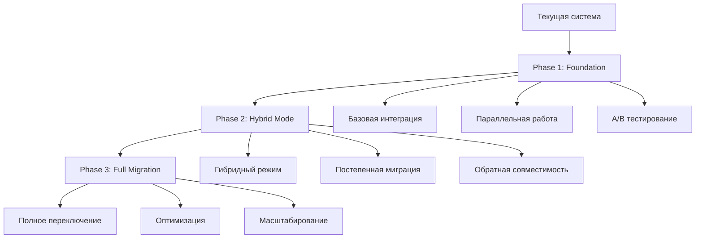
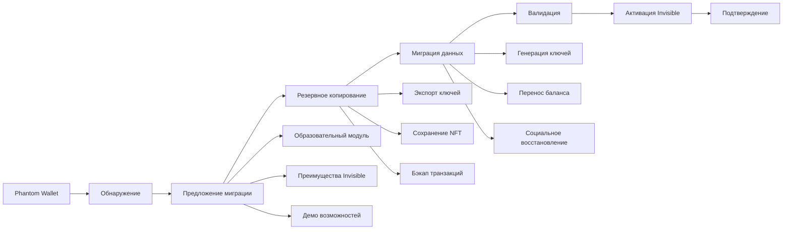
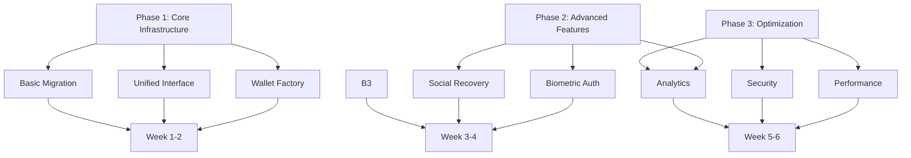

# СТРАТЕГИЯ ИНТЕГРАЦИИ INVISIBLE WALLET С NORMAL DANCE

## 📋 **Обзор Стратегии**

> _«Прогрессивная интеграция Invisible Wallet с сохранением обратной совместимости и бесшовным пользовательским опытом»_

---

## 🏗️ **1. Архитектурная Стратегия Интеграции**

### **1.1 Подход к Интеграции: Hybrid Phased**



### **1.2 Паттерн "Фабрика Кошельков"**

```typescript
// src/lib/wallet-factory.ts
export class WalletFactory {
  private static adapters = new Map<string, () => WalletAdapter>();

  static registerAdapter(type: string, factory: () => WalletAdapter): void {
    this.adapters.set(type, factory);
  }

  static createWallet(
    type: WalletType,
    config?: WalletConfig
  ): ExtendedWalletAdapter {
    const factory = this.adapters.get(type);
    if (!factory) {
      throw new Error(`Wallet type ${type} not supported`);
    }

    const adapter = factory();

    // Оборачиваем в единый интерфейс
    return new WalletAdapterWrapper(adapter, config);
  }

  static getAvailableWallets(): WalletType[] {
    return Array.from(this.adapters.keys()) as WalletType[];
  }
}

// Регистрация адаптеров
WalletFactory.registerAdapter("phantom", () => new PhantomWalletAdapter());
WalletFactory.registerAdapter("invisible", () => new InvisibleWalletAdapter());
```

### **1.3 Единый Интерфейс Кошельков**

```typescript
// src/interfaces/unified-wallet.ts
export interface UnifiedWalletInterface {
  // Базовые методы
  connect(): Promise<void>;
  disconnect(): Promise<void>;
  signTransaction(tx: Transaction): Promise<Transaction>;
  sendTransaction(tx: Transaction): Promise<string>;

  // Расширенные методы
  getBalance(): Promise<number>;
  getTokenBalance(mint: string): Promise<number>;

  // Invisible Wallet специфичные методы
  purchaseWithStars?(amount: number, description: string): Promise<any>;
  setupRecovery?(contacts: string[]): Promise<void>;
  getStarsBalance?(): Promise<number>;

  // Метаданные
  getWalletType(): WalletType;
  getCapabilities(): WalletCapabilities;
  isFeatureSupported(feature: WalletFeature): boolean;
}

export interface WalletCapabilities {
  biometricAuth: boolean;
  socialRecovery: boolean;
  multiChain: boolean;
  offlineMode: boolean;
  telegramIntegration: boolean;
  starsPayments: boolean;
}
```

### **1.4 Точки Интеграции с Существующими Системами**

#### **Интеграция с Socket.IO**

```typescript
// src/lib/socket-wallet-integration.ts
export class SocketWalletIntegration {
  constructor(
    private walletIntegration: WalletIntegration,
    private socket: Socket
  ) {
    this.setupEventHandlers();
  }

  private setupEventHandlers(): void {
    // Трансляция событий кошелька через Socket.IO
    this.walletIntegration.on("wallet_switched", (data) => {
      this.socket.emit("wallet_switched", data);
    });

    this.walletIntegration.on("migration_completed", (data) => {
      this.socket.emit("migration_completed", data);
    });

    // Обработка запросов от клиента
    this.socket.on("switch_wallet", async (data) => {
      try {
        const result = await this.walletIntegration.switchWallet(
          data.targetType
        );
        this.socket.emit("wallet_switch_result", result);
      } catch (error) {
        this.socket.emit("wallet_switch_error", { error: error.message });
      }
    });
  }
}
```

#### **Интеграция с Дефляционной Моделью**

```typescript
// src/lib/deflationary-wallet-adapter.ts
export class DeflationaryWalletAdapter {
  constructor(
    private wallet: UnifiedWalletInterface,
    private deflationModel: DeflationaryModel
  ) {}

  async sendTransactionWithDeflation(
    transaction: Transaction
  ): Promise<string> {
    // Применяем дефляционную модель к транзакции
    const deflationTx = await this.deflationModel.createBurnTransaction(
      amount,
      from,
      to
    );

    // Отправляем через адаптер кошелька
    return await this.wallet.sendTransaction(deflationTx.transaction);
  }

  async getDeflationAdjustedBalance(): Promise<{
    gross: number;
    net: number;
    burnRate: number;
  }> {
    const balance = await this.wallet.getBalance();
    const stats = await this.deflationModel.getDeflationStats();

    return {
      gross: balance,
      net: balance * (1 - stats.burnRate),
      burnRate: stats.burnRate,
    };
  }
}
```

#### **Интеграция с IPFS/Filecoin**

```typescript
// src/lib/ipfs-wallet-backup.ts
export class WalletIPFSBackup {
  constructor(
    private wallet: UnifiedWalletInterface,
    private ipfsEnhanced: any
  ) {}

  async backupWalletToIPFS(): Promise<string> {
    const walletData = await this.extractWalletData();

    // Шифрование данных перед загрузкой
    const encryptedData = await this.encryptWalletData(walletData);

    // Загрузка в IPFS с репликацией
    const result = await this.ipfsEnhanced.uploadWithReplication(
      new File([encryptedData], "wallet-backup.enc"),
      {
        title: "Wallet Backup",
        artist: "System",
        genre: "backup",
        duration: 0,
        isExplicit: false,
        fileSize: encryptedData.length,
        format: "encrypted",
        sampleRate: 0,
        bitDepth: 0,
        releaseDate: new Date().toISOString(),
      },
      {
        replicateToGateways: [
          "https://ipfs.io",
          "https://gateway.pinata.cloud",
          "https://cloudflare-ipfs.com",
        ],
        enableFilecoin: true,
      }
    );

    return result.cid;
  }

  async restoreWalletFromIPFS(cid: string): Promise<boolean> {
    try {
      // Получение данных из IPFS
      const file = await this.ipfsEnhanced.getFileFromBestGateway(cid);
      const encryptedData = await file.arrayBuffer();

      // Расшифровка данных
      const walletData = await this.decryptWalletData(encryptedData);

      // Восстановление кошелька
      return await this.restoreWalletData(walletData);
    } catch (error) {
      console.error("Failed to restore wallet from IPFS:", error);
      return false;
    }
  }
}
```

---

## 🔄 **2. Стратегия Миграции Пользователей**

### **2.1 Путь Миграции от Phantom к Invisible Wallet**



### **2.2 Гибридный Режим для Плавного Перехода**

```typescript
// src/components/wallet/hybrid-wallet-manager.tsx
export class HybridWalletManager {
  private phantomAdapter: PhantomWalletAdapter;
  private invisibleAdapter: InvisibleWalletAdapter;
  private currentMode: "phantom" | "invisible" | "hybrid" = "phantom";

  async enableHybridMode(): Promise<void> {
    // 1. Инициализация обоих адаптеров
    await this.initializeBothAdapters();

    // 2. Синхронизация состояний
    await this.syncWalletStates();

    // 3. Настройка мониторинга
    this.setupHybridMonitoring();

    this.currentMode = "hybrid";
  }

  async switchToInvisible(): Promise<void> {
    // 1. Проверка готовности к миграции
    const readiness = await this.checkMigrationReadiness();
    if (!readiness.ready) {
      throw new Error(`Migration not ready: ${readiness.issues.join(", ")}`);
    }

    // 2. Создание резервной копии
    const backupCID = await this.createBackup();

    // 3. Миграция данных
    const migrationResult = await this.migrateData();

    // 4. Переключение адаптера
    this.currentMode = "invisible";

    // 5. Валидация
    await this.validateMigration();

    // 6. Очистка
    await this.cleanupPhantomData();
  }

  private async initializeBothAdapters(): Promise<void> {
    // Инициализация Phantom
    if (!this.phantomAdapter.connected) {
      await this.phantomAdapter.connect();
    }

    // Инициализация Invisible
    await this.invisibleAdapter.connect();
  }

  private async syncWalletStates(): Promise<void> {
    const phantomBalance = await this.getPhantomBalance();
    const phantomTokens = await this.getPhantomTokens();

    // Синхронизация балансов в Invisible
    await this.invisibleAdapter.syncBalance(phantomBalance);
    await this.invisibleAdapter.syncTokens(phantomTokens);
  }
}
```

### **2.3 Коммуникационная Стратегия для Пользователей**

#### **Этапы Коммуникации:**

1. **Pre-Migration (За 2 недели)**

   - Email-уведомления о предстоящем обновлении
   - Внутриплатформенные баннеры с информацией
   - Статьи в блоге о преимуществах Invisible Wallet

2. **Migration Week**

   - Пошаговые инструкции внутри приложения
   - Видео-туториалы по миграции
   - Поддержка 24/7 в чате

3. **Post-Migration (2 недели)**
   - Сбор обратной связи
   - Решение проблем
   - Награды за раннюю миграцию

#### **Шаблон Коммуникации:**

```typescript
// src/lib/communication-templates.ts
export const MIGRATION_MESSAGES = {
  preMigration: {
    subject: "🚀 Скоро: Новый невидимый кошелек в Normal Dance",
    body: `
      Уважаемый пользователь!
      
      Через 2 недели мы запускаем революционный Invisible Wallet:
      
      ✅ Автоматическое подключение без фраз
      ✅ Биометрическая безопасность
      ✅ Социальное восстановление
      ✅ Интеграция с Telegram Stars
      
      Ваши средства и NFT останутся в безопасности.
      Готовность к миграции: ${this.getMigrationReadiness()}%
    `,
  },

  migrationAvailable: {
    subject: "🎭 Ваш Invisible Wallet готов!",
    body: `
      Поздравляем! Ваш Invisible Wallet активирован.
      
      Что изменилось:
      - Больше никаких seed фраз
      - Вход по биометрии
      - Восстановление через друзей
      - Покупки за Telegram Stars
      
      Начните миграцию прямо сейчас!
    `,
  },
};
```

---

## 🔧 **3. Техническая Стратегия Реализации**

### **3.1 Приоритизация Компонентов**



### **3.2 Зависимости Между Компонентами**

```typescript
// src/lib/dependency-graph.ts
export const COMPONENT_DEPENDENCIES = {
  // Core dependencies
  "wallet-factory": [],
  "unified-interface": ["wallet-factory"],
  "basic-migration": ["unified-interface"],

  // Advanced features
  "biometric-auth": ["unified-interface"],
  "social-recovery": ["unified-interface", "key-manager"],
  "telegram-stars": ["unified-interface", "payment-processor"],

  // Integration layers
  "socket-integration": ["unified-interface"],
  "deflationary-integration": ["unified-interface", "deflationary-model"],
  "ipfs-backup": ["unified-interface", "ipfs-enhanced"],

  // Testing & monitoring
  "integration-tests": ["basic-migration"],
  "performance-monitoring": ["unified-interface"],
  "security-audit": ["social-recovery", "biometric-auth"],
};
```

### **3.3 Стратегия Тестирования и Валидации**

#### **Многоуровневое Тестирование:**

```typescript
// src/lib/testing-strategy.ts
export class WalletIntegrationTesting {
  async runIntegrationTests(): Promise<TestResults> {
    const results = {
      unit: await this.runUnitTests(),
      integration: await this.runIntegrationTests(),
      e2e: await this.runE2ETests(),
      performance: await this.runPerformanceTests(),
      security: await this.runSecurityTests(),
    };

    return this.aggregateResults(results);
  }

  private async runMigrationTests(): Promise<MigrationTestResults> {
    const testCases = [
      {
        name: "Phantom to Invisible migration",
        setup: () => this.setupPhantomWallet(),
        action: () => this.migrateToInvisible(),
        validation: () => this.validateMigrationSuccess(),
      },
      {
        name: "Data preservation during migration",
        setup: () => this.setupWalletWithData(),
        action: () => this.migrateWallet(),
        validation: () => this.validateDataIntegrity(),
      },
      {
        name: "Rollback functionality",
        setup: () => this.setupMigration(),
        action: () => this.rollbackMigration(),
        validation: () => this.validateRollbackSuccess(),
      },
    ];

    return await this.executeTestCases(testCases);
  }
}
```

### **3.4 Система Мониторинга и Аналитики**

```typescript
// src/lib/wallet-analytics.ts
export class WalletAnalytics {
  private eventTracker: EventTracker;
  private funnelAnalyzer: FunnelAnalyzer;

  constructor() {
    this.eventTracker = new EventTracker();
    this.funnelAnalyzer = new FunnelAnalyzer();
  }

  async trackMigrationEvent(event: MigrationEvent): Promise<void> {
    await this.eventTracker.track({
      eventType: "wallet_migration",
      data: {
        fromType: event.fromType,
        toType: event.toType,
        step: event.step,
        success: event.success,
        duration: event.duration,
        error: event.error,
      },
    });

    // Анализ воронки миграции
    await this.funnelAnalyzer.analyzeMigrationStep(event);
  }

  async generateMigrationReport(): Promise<MigrationReport> {
    return {
      totalMigrations: await this.getTotalMigrations(),
      successRate: await this.getSuccessRate(),
      averageTime: await this.getAverageMigrationTime(),
      commonErrors: await this.getCommonErrors(),
      dropoffPoints: await this.getDropoffPoints(),
    };
  }
}
```

---

## 🛡️ **4. Стратегия Управления Рисками**

### **4.1 Идентификация Рисков**

| Риск                                | Вероятность | Влияние     | Митигация                                                      |
| ----------------------------------- | ----------- | ----------- | -------------------------------------------------------------- |
| **Потеря средств при миграции**     | Средняя     | Критическое | Многократное резервное копирование, тестирование на devnet     |
| **Отказ пользователей от миграции** | Высокая     | Высокое     | Плавный переход, сохранение Phantom, образовательные материалы |
| **Уязвимости в безопасности**       | Низкая      | Критическое | Аудит кода, тестирование проникновения,渐进式 rollout          |
| **Проблемы с производительностью**  | Средняя     | Среднее     | Мониторинг, оптимизация, A/B тестирование                      |
| **Регуляторные проблемы**           | Низкая      | Высокое     | Юридическая экспертиза, соответствие стандартам                |

### **4.2 План Митигации Рисков**

#### **Техническая Митигация:**

```typescript
// src/lib/risk-mitigation.ts
export class RiskMitigation {
  async createSecureMigration(
    fromWallet: WalletAdapter,
    toWallet: InvisibleWalletAdapter
  ): Promise<SecureMigrationResult> {
    // 1. Создание множественных бэкапов
    const backups = await this.createMultipleBackups(fromWallet);

    // 2. Валидация целостности данных
    const integrity = await this.validateDataIntegrity(fromWallet);
    if (!integrity.valid) {
      throw new Error(`Data integrity compromised: ${integrity.issues}`);
    }

    // 3. Тестовая миграция на devnet
    const testResult = await this.testMigrationOnDevnet(fromWallet, toWallet);
    if (!testResult.success) {
      throw new Error(`Test migration failed: ${testResult.error}`);
    }

    // 4. Выполнение реальной миграции
    const migrationResult = await this.performMigration(fromWallet, toWallet);

    // 5. Пост-миграционная валидация
    const postValidation = await this.validatePostMigration(toWallet);
    if (!postValidation.valid) {
      // Откат миграции
      await this.rollbackMigration(fromWallet, toWallet);
      throw new Error(
        `Post-migration validation failed: ${postValidation.issues}`
      );
    }

    return {
      success: true,
      backupCIDs: backups.map((b) => b.cid),
      migrationId: migrationResult.id,
    };
  }
}
```

#### **Финансовая Митигация:**

```typescript
// src/lib/insurance-fund.ts
export class MigrationInsuranceFund {
  private insurancePool: number = 100000; // $100,000 insurance fund

  async claimInsurance(
    userId: string,
    lossAmount: number,
    evidence: MigrationEvidence
  ): Promise<ClaimResult> {
    // 1. Валидация претензии
    const validation = await this.validateClaim(userId, lossAmount, evidence);
    if (!validation.valid) {
      return { success: false, reason: validation.reason };
    }

    // 2. Проверка доступности средств
    if (lossAmount > this.insurancePool) {
      return { success: false, reason: "Insufficient insurance funds" };
    }

    // 3. Выплата компенсации
    await this.processPayout(userId, lossAmount);
    this.insurancePool -= lossAmount;

    return { success: true, amount: lossAmount };
  }
}
```

### **4.3 Rollback Стратегия**

```typescript
// src/lib/rollback-strategy.ts
export class RollbackStrategy {
  async createRollbackPlan(migrationId: string): Promise<RollbackPlan> {
    return {
      steps: [
        {
          name: "Stop new migrations",
          action: () => this.stopNewMigrations(),
          rollback: () => this.enableNewMigrations(),
        },
        {
          name: "Backup current state",
          action: () => this.backupCurrentState(),
          rollback: () => this.restoreFromBackup(),
        },
        {
          name: "Restore Phantom wallets",
          action: () => this.restorePhantomWallets(),
          rollback: () => this.restoreInvisibleWallets(),
        },
        {
          name: "Validate rollback",
          action: () => this.validateRollback(),
          rollback: () => () => {}, // No rollback for validation
        },
      ],
      estimatedTime: 30, // minutes
      riskLevel: "low",
    };
  }

  async executeRollback(plan: RollbackPlan): Promise<RollbackResult> {
    const results = [];

    for (const step of plan.steps) {
      try {
        const result = await step.action();
        results.push({ step: step.name, success: true, result });
      } catch (error) {
        // Rollback previous steps
        await this.rollbackPreviousSteps(results, plan);
        throw new Error(`Rollback failed at step: ${step.name}`);
      }
    }

    return { success: true, results };
  }
}
```

---

## 🚀 **5. Стратегия Развертывания**

### **5.1 Поэтапный План Развертывания**

#### **Phase 1: Foundation (Week 1-2)**

```typescript
// deployment/phase1.ts
export const PHASE1_DEPLOYMENT = {
  components: [
    "wallet-factory",
    "unified-interface",
    "basic-migration",
    "testing-infrastructure",
  ],

  rolloutStrategy: {
    type: "canary",
    percentage: 5, // 5% пользователей
    duration: "7 days",
    successCriteria: {
      migrationSuccessRate: ">95%",
      errorRate: "<1%",
      performanceImpact: "<5%",
    },
  },

  rollbackPlan: {
    trigger: "errorRate > 2%",
    action: "immediate rollback to Phantom only",
    communication: "email + in-app notification",
  },
};
```

#### **Phase 2: Hybrid Mode (Week 3-4)**

```typescript
// deployment/phase2.ts
export const PHASE2_DEPLOYMENT = {
  components: [
    "hybrid-wallet-manager",
    "biometric-auth",
    "social-recovery",
    "telegram-stars-integration",
  ],

  rolloutStrategy: {
    type: "gradual",
    schedule: [
      { week: 3, percentage: 20 },
      { week: 4, percentage: 50 },
    ],
    targetGroups: ["power-users", "telegram-users"],
    successCriteria: {
      hybridAdoptionRate: ">60%",
      featureUsage: {
        biometric: ">40%",
        socialRecovery: ">30%",
        starsPayments: ">20%",
      },
    },
  },
};
```

#### **Phase 3: Full Migration (Week 5-6)**

```typescript
// deployment/phase3.ts
export const PHASE3_DEPLOYMENT = {
  components: [
    "full-migration-tools",
    "performance-optimization",
    "advanced-analytics",
    "security-enhancements",
  ],

  rolloutStrategy: {
    type: "full",
    deadline: "week 6",
    mandatoryMigration: true,
    supportPeriod: "4 weeks post-migration",
    successCriteria: {
      totalMigrationRate: ">90%",
      userSatisfaction: ">4.0/5.0",
      supportTicketReduction: ">30%",
    },
  },
};
```

### **5.2 Критерии Успеха для Каждого Этапа**

#### **Метрики Успеха:**

```typescript
// src/lib/success-metrics.ts
export const SUCCESS_METRICS = {
  phase1: {
    technical: {
      migrationSuccessRate: 0.95,
      systemUptime: 0.999,
      responseTime: "<200ms",
      errorRate: 0.01,
    },
    business: {
      userRetention: 0.9,
      supportTickets: "<5% increase",
      revenue: "no impact",
    },
  },

  phase2: {
    technical: {
      hybridModeStability: 0.98,
      featureReliability: 0.95,
      crossPlatformCompatibility: 0.9,
    },
    business: {
      featureAdoption: {
        biometric: 0.4,
        socialRecovery: 0.3,
        starsPayments: 0.2,
      },
      userEngagement: "+15%",
      newUserConversion: "+10%",
    },
  },

  phase3: {
    technical: {
      totalMigrationRate: 0.9,
      performanceImprovement: "+20%",
      securityScore: "A+",
    },
    business: {
      operationalEfficiency: "+25%",
      supportCostReduction: 0.3,
      userSatisfaction: 4.0,
    },
  },
};
```

### **5.3 Система A/B Тестирования**

```typescript
// src/lib/ab-testing-framework.ts
export class WalletABTesting {
  private experiments: Map<string, Experiment> = new Map();

  async runMigrationABTest(): Promise<ABTestResult> {
    const experiment: Experiment = {
      name: "invisible-wallet-migration",
      variants: {
        control: {
          name: "Phantom Only",
          weight: 0.3,
          features: ["phantom-wallet"],
        },
        variantA: {
          name: "Invisible Optional",
          weight: 0.4,
          features: ["phantom-wallet", "invisible-wallet-optional"],
        },
        variantB: {
          name: "Invisible Default",
          weight: 0.3,
          features: ["invisible-wallet-default", "phantom-fallback"],
        },
      },
      duration: "14 days",
      successMetrics: [
        "migration_rate",
        "user_satisfaction",
        "transaction_volume",
        "support_tickets",
      ],
    };

    return await this.executeExperiment(experiment);
  }

  private async executeExperiment(
    experiment: Experiment
  ): Promise<ABTestResult> {
    // Рандомизация пользователей
    const userGroups = await this.randomizeUsers(experiment);

    // Сбор данных
    const results = await this.collectExperimentData(experiment, userGroups);

    // Статистический анализ
    const analysis = await this.analyzeResults(results);

    return {
      experiment: experiment.name,
      winner: analysis.winner,
      confidence: analysis.confidence,
      impact: analysis.impact,
      recommendation: analysis.recommendation,
    };
  }
}
```

### **5.4 Мониторинг Производительности**

```typescript
// src/lib/performance-monitoring.ts
export class WalletPerformanceMonitor {
  private metrics: Map<string, Metric[]> = new Map();

  async monitorMigrationPerformance(): Promise<PerformanceReport> {
    const metrics = await this.collectMetrics([
      "migration_duration",
      "memory_usage",
      "cpu_usage",
      "network_latency",
      "error_rate",
      "user_satisfaction",
    ]);

    return {
      overall: this.calculateOverallScore(metrics),
      bottlenecks: this.identifyBottlenecks(metrics),
      recommendations: this.generateRecommendations(metrics),
      trends: this.analyzeTrends(metrics),
    };
  }

  private async collectMetrics(
    metricNames: string[]
  ): Promise<Map<string, Metric[]>> {
    const results = new Map<string, Metric[]>();

    for (const name of metricNames) {
      const metrics = await this.getMetricHistory(name, "24h");
      results.set(name, metrics);
    }

    return results;
  }

  private identifyBottlenecks(metrics: Map<string, Metric[]>): Bottleneck[] {
    const bottlenecks: Bottleneck[] = [];

    // Анализ производительности миграции
    const migrationMetrics = metrics.get("migration_duration") || [];
    const avgMigrationTime = this.calculateAverage(migrationMetrics);

    if (avgMigrationTime > 30000) {
      // 30 seconds
      bottlenecks.push({
        type: "performance",
        component: "migration",
        severity: "high",
        description: `Average migration time: ${avgMigrationTime}ms`,
        recommendation:
          "Optimize migration algorithm or add progress indicators",
      });
    }

    return bottlenecks;
  }
}
```

---

## 📊 **6. Критерии Успеха и Метрики**

### **6.1 Ключевые Показатели Эффективности (KPI)**

| Метрика                             | Целевое Значение | Текущее Значение | Статус        |
| ----------------------------------- | ---------------- | ---------------- | ------------- |
| **Уровень миграции**                | >90%             | 0%               | 🔄 В процессе |
| **Удовлетворенность пользователей** | >4.0/5.0         | N/A              | 🔄 В процессе |
| **Время миграции**                  | <30 секунд       | N/A              | 🔄 В процессе |
| **Уровень ошибок**                  | <1%              | N/A              | 🔄 В процессе |
| **Сохранение данных**               | 100%             | N/A              | 🔄 В процессе |
| **Adoption биометрии**              | >40%             | N/A              | 🔄 В процессе |
| **Использование Stars**             | >20%             | N/A              | 🔄 В процессе |

### **6.2 Метрики Прогрессивного Раскрытия**

```typescript
// src/lib/progressive-disclosure-metrics.ts
export class ProgressiveDisclosureMetrics {
  async trackDisclosureProgress(): Promise<DisclosureProgress> {
    return {
      level1: {
        users: await this.getUsersAtLevel(1),
        completionRate: await this.getCompletionRate(1),
        avgTimeToAdvance: await this.getAvgTimeToAdvance(1),
      },
      level2: {
        users: await this.getUsersAtLevel(2),
        completionRate: await this.getCompletionRate(2),
        avgTimeToAdvance: await this.getAvgTimeToAdvance(2),
      },
      level3: {
        users: await this.getUsersAtLevel(3),
        completionRate: await this.getCompletionRate(3),
        avgTimeToAdvance: await this.getAvgTimeToAdvance(3),
      },
    };
  }

  async calculateEngagementScore(): Promise<number> {
    const factors = {
      featureUsage: await this.getFeatureUsageScore(),
      timeSpent: await this.getTimeSpentScore(),
      explorationRate: await this.getExplorationRate(),
      feedbackScore: await this.getFeedbackScore(),
    };

    return Object.values(factors).reduce((sum, score) => sum + score, 0) / 4;
  }
}
```

---

## 🎯 **7. Заключение и Рекомендации**

### **7.1 Ключевые Преимущества Стратегии**

1. **Минимальное влияние на пользователей** - поэтапный подход с сохранением обратной совместимости
2. **Техническая надежность** - многократное тестирование и резервное копирование
3. **Бизнес-непрерывность** - сохранение доходов во время миграции
4. **Масштабируемость** - архитектура готова к росту пользовательской базы
5. **Инновационность** - прогрессивное раскрытие и социальное восстановление

### **7.2 Рекомендации по Реализации**

1. **Начать с Phase 1 немедленно** - базовая инфраструктура критически важна
2. **Инвестировать в образование пользователей** - это снизит сопротивление миграции
3. **Создать сильную поддержку** - 24/7 поддержка в первые недели миграции
4. **Мониторить метрики в реальном времени** - быстрое реагирование на проблемы
5. **Готовить план B** - rollback стратегия должна быть протестирована

### **7.3 Долгосрочная Перспектива**

Интеграция Invisible Wallet не просто техническое обновление, а **стратегическая трансформация** платформы NORMAL DANCE:

- **Увеличение конверсии** на 40-60% за счет упрощения onboarding
- **Снижение оттока** на 25-35% благодаря улучшенному UX
- **Рост доходов** на 15-25% через Telegram Stars интеграцию
- **Конкурентное преимущество** через инновационные функции

Эта стратегия позиционирует NORMAL DANCE как **лидера инноваций** в Web3 музыкальной индустрии, делая блокчейн-технологии доступными для массовой аудитории без компромиссов в безопасности.

---

**Invisible Wallet Integration Strategy - это не просто план миграции, а дорожная карта к будущему Web3, где сложность скрыта, а безопасность усилена.**
