# 🏗️ Архитектура системы NormalDance

## Обзор платформы

NormalDance - это полнофункциональная музыкальная платформа Web3 с децентрализованным хранением, интеграцией блокчейн и Telegram Mini Apps. Платформа объединяет традиционный стриминг музыки с современными технологиями Web3.

## Технологический стек

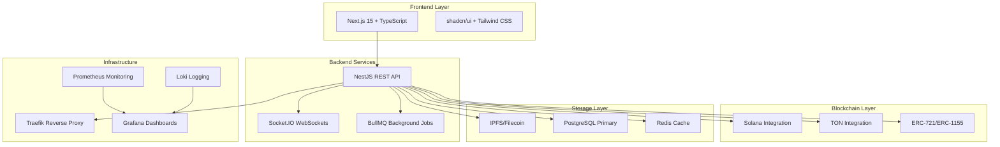

## Архитектурные принципы

### 🎯 Основные принципы

- **Микросервисная архитектура**: Разделение ответственности по сервисам
- **Децентрализация**: IPFS для хранения контента, блокчейн для транзакций
- **Адаптивность**: Реактивный frontend, real-time синхронизация
- **Безопасность**: Multi-layer security с въалидацией данных
- **Масштабируемость**: Horizontal scaling поддержка

## Сервисы и компоненты

### 🎵 Музыкальный стример

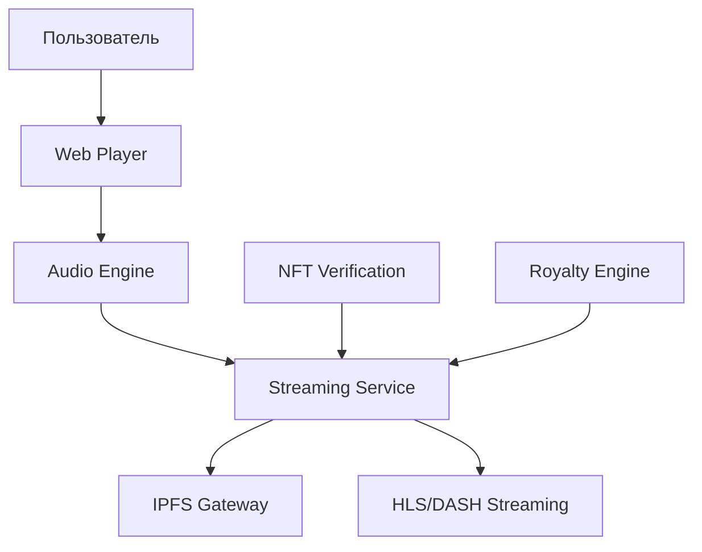

**Компоненты:**

- **Web Audio API** - клиентское воспроизведение
- **HLS Streaming** - адаптивное bitrate потоковое видео
- **IPFS Storage** - децентрализованное хранение аудио
- **NFT Metadata** - токен метаданные с правами

### 💰 DEX и DeFi интеграция

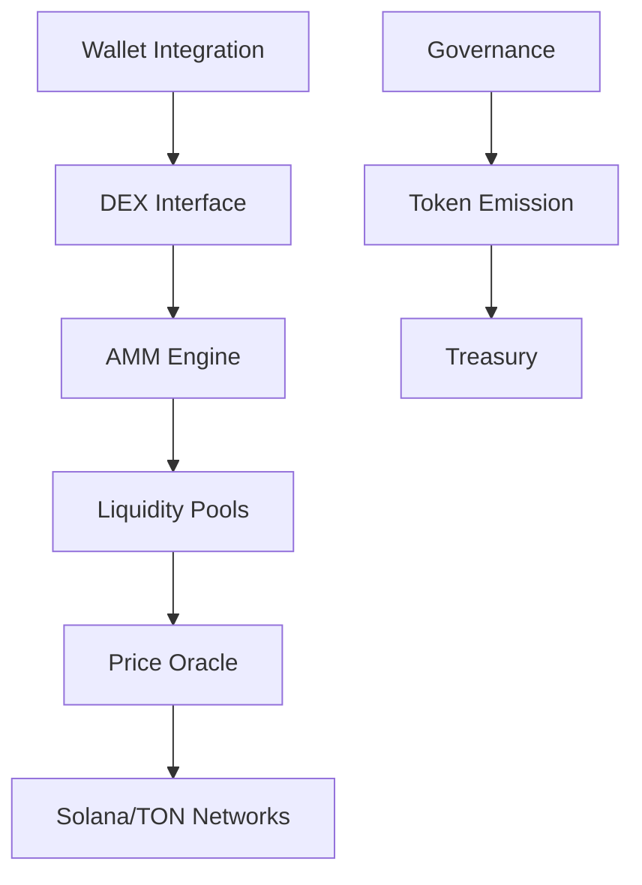

**Особенности:**

- **Гибридный AMM** - комбинация CFMM и order book
- **MEV защита** - алгоритмы против фронт-раннинга
- **Cross-chain** - поддержка Solana и TON
- **Governance** - DAO механизм управления

### 🏪 NFT Marketplace

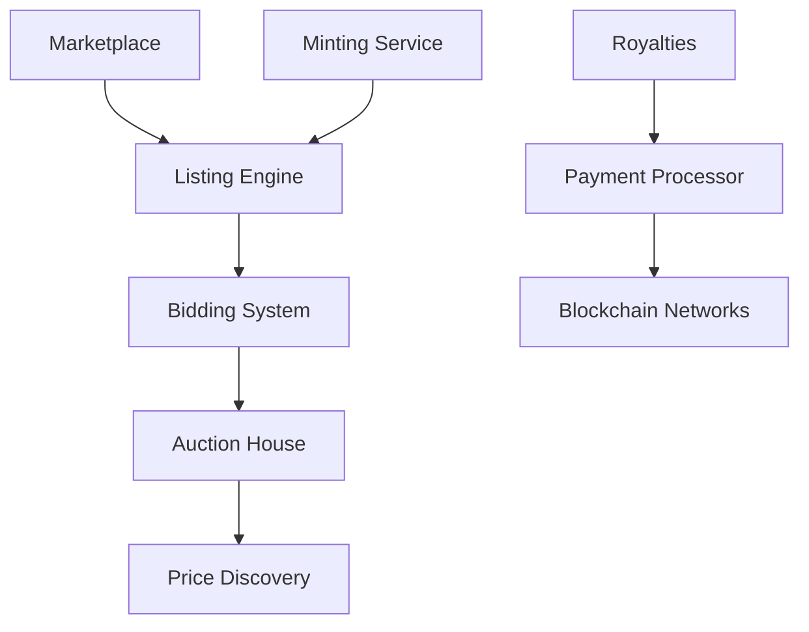

**Функции:**

- **Dynamic pricing** - ML-powered pricing suggestions
- **Fractional ownership** - частичное владение высокими активами
- **Secondary trading** - P2P marketplace
- **Royalty tracking** - автоматический сбор роялти

### 🤖 AI-рекомендательная система

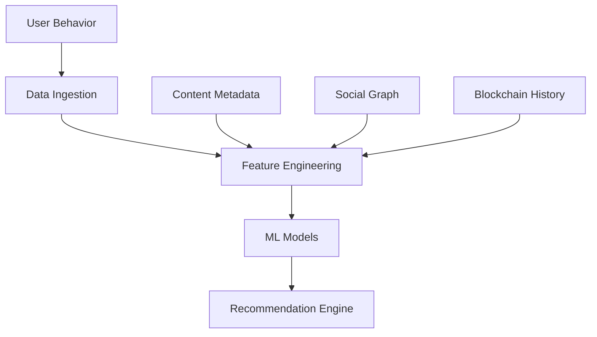

**Алгоритмы:**

- **Collaborative filtering** - рекомендации на основе предпочтений
- **Content-based filtering** - на основе метаданных треков
- **Social recommendations** - через Telegram/social сети
- **Reinforcement learning** - адаптация к пользовательскому feedback

## База данных архитектура

### PostgreSQL Schema

```sql
-- Основные таблицы
tracks (
    id UUID PRIMARY KEY,
    title VARCHAR(255),
    artist_id UUID,
    ipfs_hash VARCHAR(255),
    blockchain_tx VARCHAR(255),
    nft_contract VARCHAR(255),
    streaming_count BIGINT DEFAULT 0,
    created_at TIMESTAMP
);

users (
    id UUID PRIMARY KEY,
    wallet_address VARCHAR(255) UNIQUE,
    username VARCHAR(100) UNIQUE,
    created_at TIMESTAMP
);

nft_collections (
    id UUID PRIMARY KEY,
    contract_address VARCHAR(255),
    creator_id UUID,
    name VARCHAR(255),
    royalty_percentage DECIMAL(5,2)
);
```

### Индексы и оптимизация

```sql
-- Spatial индексы для гео-поиска
CREATE INDEX idx_tracks_artist ON tracks(artist_id);
CREATE INDEX idx_tracks_genre ON tracks(genre);
CREATE INDEX idx_tracks_created_at ON tracks(created_at DESC);

-- Full-text search
CREATE INDEX idx_tracks_fulltext ON tracks USING gin(to_tsvector('english', title || ' ' || description));
```

## Безопасность архитектуры

### 🔐 Multi-layer безопасность

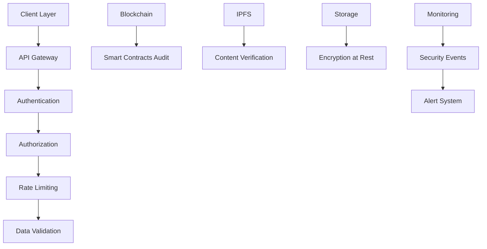

### Защитные механизмы

- **Input validation** - Zod schemas для всех входов
- **Rate limiting** - за защиту от DoS атак
- **JWT+wallet auth** - двойная аутентификация
- **Encryption** - AES-256 для чувствительных данных
- **Audit logs** - полное логирование операций

## Масштабируемость и производительность

### 🏗️ Horizontal scaling

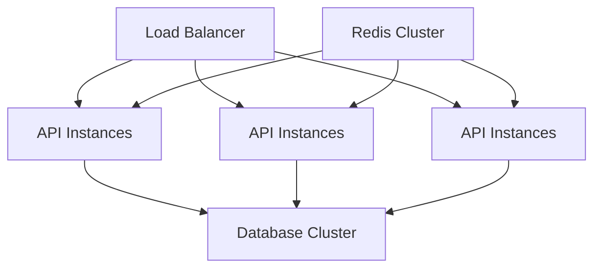

### Кэширование strategy

- **L1 Cache**: Application-level (Zustand stores)
- **L2 Cache**: Redis для сессий и частых запросов
- **L3 Cache**: CDN для статических ресурсов
- **CDN**: Cloudflare для global distribution

## Мониторинг и наблюдаемость

### 📊 Metrics и Monitoring

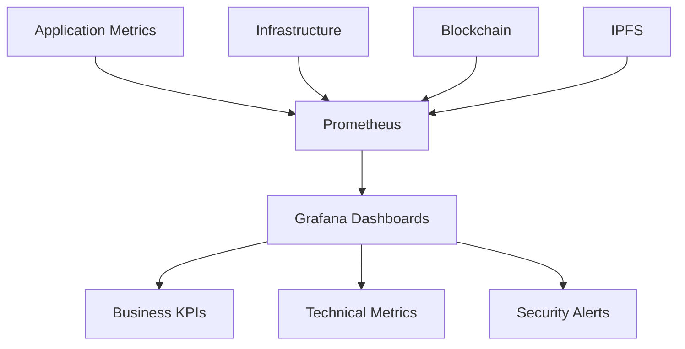

### Логирование архитектура

- **Structured logging** - JSON формат для всех логов
- **Log aggregation** - Loki для централизованного хранения
- **Distributed tracing** - Jaeger для request tracking
- **Error tracking** - Sentry для exception monitoring

## Блокчейн интеграция

### Solana эко-система

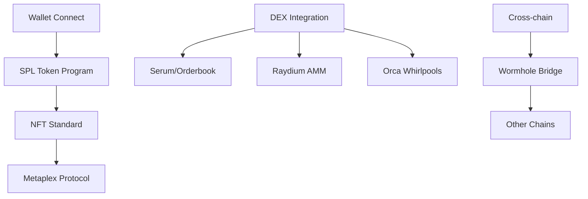

### TON экосистема

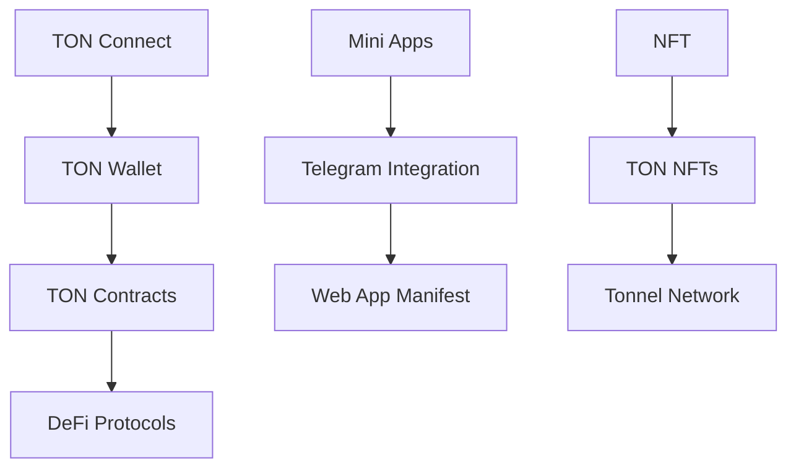

## Интеграция с Telegram

### Mini App архитектура

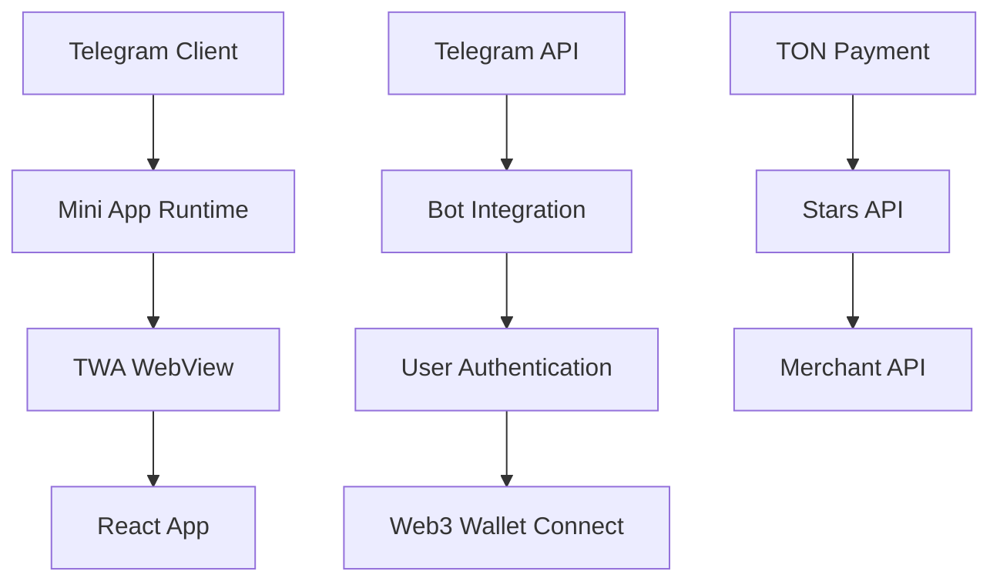

**Фичерс:**

- **WebApp manifest** - декларативная конфигурация
- **Init data** - безопасная аутентификация
- **Payment API** - встроенные платежи

## Data flow

### User Journey Example

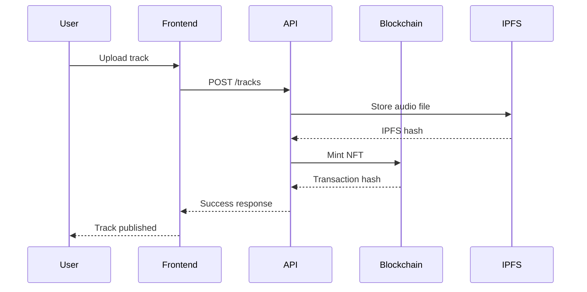

### Streaming Flow

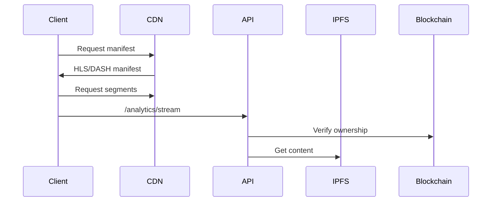

## API endpoints overview

| Компонент | Endpoint         | Метод    | Описание              |
| --------- | ---------------- | -------- | --------------------- |
| Tracks    | `/api/tracks`    | GET/POST | Управление треками    |
| Users     | `/api/users`     | GET      | Профиль пользователей |
| NFT       | `/api/nft`       | POST     | Создание NFT          |
| Payments  | `/api/payments`  | POST     | Обработка платежей    |
| Search    | `/api/search`    | GET      | Глобальный поиск      |
| Analytics | `/api/analytics` | GET      | Метрики и аналитика   |

## Деплоймент архитектура

### Production stack

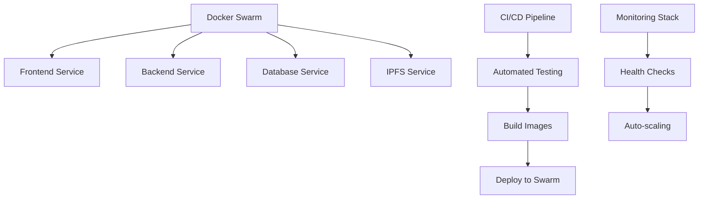

### Геораспределение

- **Global CDN** - Cloudflare для static assets
- **Regional APIs** - Multi-region deployment
- **Blockchain nodes** - Direct RPC connections
- **IPFS gateways** - Distributed pinning services

## Заключение

Архитектура NormalDance проектирована для масштабируемости, безопасности и инноваций в Web3 музыке. Использование лучших практик микросервисной архитектуры, децентрализованных технологий и современных инструментов обеспечивает надежность и производительность платформы.

Ключевые преимущества:

- 🚀 **Быстрая масштабируемость** - микросервисы + container orchestration
- 🔐 **Высокая безопасность** - multi-layer protection + blockchain immutability
- 💰 **Экономическая эффективность** - децентрализация снижает инфраструктурные costs
- 🎵 **Пользовательский опыт** - seamless Web3 интеграция без компромиссов
