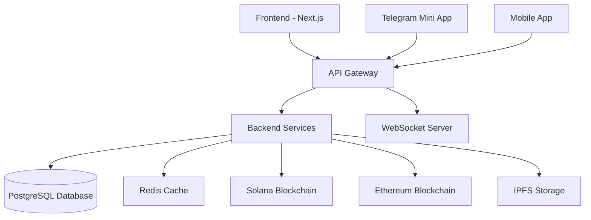

# 📋 План улучшения документации NORMAL DANCE

## 🎯 Цель

Улучшить качество и полноту документации проекта NORMAL DANCE для повышения удобства разработки, упрощения онбординга новых участников и обеспечения лучшего понимания архитектуры системы.

## 📋 Области для улучшения

### 1. Inline Code Documentation

#### Проблема

Многие функции и компоненты имеют минимальные или отсутствующие комментарии в коде, что затрудняет понимание сложных логических блоков.

#### Решение

Добавить подробные JSDoc комментарии ко всем основным функциям и компонентам.

#### Пример улучшения для `GraveyardGrid.tsx`:

```typescript
interface Memorial {
  /**
   * Уникальный идентификатор мемориала
   * @type {string}
   */
  id: string;

  /**
   * Имя артиста, которому посвящен мемориал
   * @type {string}
   */
  artistName: string;

  /**
   * Хэш IPFS с данными мемориала
   * @type {string}
   */
  ipfsHash: string;

  /**
   * Баланс фонда мемориала в ETH
   * @type {number}
   */
  fundBalance: number;

  /**
   * Список адресов наследников
   * @type {string[]}
   */
  heirs: string[];

  /**
   * Статус активности мемориала
   * @type {boolean}
   */
  isActive: boolean;

  /**
   * Дата создания мемориала в формате ISO
   * @type {string}
   */
  createdAt: string;
}

/**
 * Компонент отображения сетки мемориалов в цифровом кладбище
 * @component
 * @returns {JSX.Element} Сетка мемориалов с возможностью поиска и создания новых
 */
export default function GraveyardGrid() {
  /**
   * Асинхронная функция загрузки мемориалов с API
   * @async
   * @returns {Promise<void>}
   * @throws {Error} При ошибке загрузки данных
   */
  const loadMemorials = async () => {
    try {
      const response = await fetch("/api/grave/memorials");
      const data = await response.json();

      if (data.success) {
        setMemorials(data.data.memorials || []);
      }
    } catch (error) {
      console.error("Ошибка загрузки мемориалов:", error);
      // Показываем демо-данные в случае ошибки
      setMemorials([]);
    } finally {
      setIsLoading(false);
    }
  };
}
```

### 2. API Documentation Enhancement

#### Проблема

API документация имеет базовую информацию, но не включает примеры ответов ошибок, ограничения параметров и коды состояния.

#### Решение

Расширить API документацию с полной спецификацией endpoints, включая:

- Все возможные коды состояния HTTP
- Примеры ошибок
- Ограничения параметров
- Примеры использования в разных языках

#### Пример улучшения для API документации (`docs/api.md`):

````markdown
### Получить список треков

```http
GET /tracks

Query параметры:
- page: номер страницы (default: 1, min: 1, max: 1000)
- limit: количество элементов на странице (default: 20, max: 100)
- genre: фильтр по жанру (макс. 50 символов)
- search: поиск по названию или артисту (макс. 100 символов)
- sort: сортировка (popular, newest, trending)
- artistId: фильтр по артисту (UUID формат)

Headers:
- Authorization: Bearer <jwt_token> (опционально, для персонализированных результатов)

Response 200 OK:
{
  "data": [
    {
      "id": "track_id",
      "title": "Название трека",
      "artistName": "Имя артиста",
      "genre": "electronic",
      "duration": 180,
      "playCount": 1000,
      "likeCount": 50,
      "imageUrl": "https://...",
      "audioUrl": "https://...",
      "createdAt": "2023-01-01T00:00:00Z",
      "isExplicit": false,
      "price": 9.99
    }
  ],
  "pagination": {
    "page": 1,
    "limit": 20,
    "total": 100,
    "totalPages": 5
  }
}

Response 400 Bad Request:
{
  "error": "Invalid parameters",
  "message": "Page must be between 1 and 1000"
}

Response 429 Too Many Requests:
{
  "error": "Rate limit exceeded",
  "message": "Please try again in 60 seconds"
}
```
````

### 3. Architecture Documentation

#### Проблема

Архитектурная документация существует, но не включает визуальные диаграммы и четкое описание потоков данных между компонентами.

#### Решение

Создать визуальные диаграммы архитектуры и описать ключевые потоки данных.

#### Пример содержания нового файла `docs/architecture-diagrams.md`:

````markdown
# 🏗️ Диаграммы архитектуры NORMAL DANCE

## Общая архитектура системы


````

## Поток загрузки трека

1. Пользователь загружает аудиофайл через frontend
2. Файл передается в API Gateway
3. Backend сервис обрабатывает файл и загружает в IPFS
4. Метаданные сохраняются в PostgreSQL
5. Создается NFT на Solana
6. Информация кэшируется в Redis

````

### 4. Error Handling Documentation

#### Проблема
Обработка ошибок в коде не всегда задокументирована, что затрудняет отладку.

#### Решение
Создать документацию по обработке ошибок и добавить комментарии к критическим участкам кода.

#### Пример улучшения в `src/app/api/telegram/webhook/route.ts`:

```typescript
/**
 * Обработчик POST запросов для Telegram webhook
 * @param {NextRequest} request - HTTP запрос от Telegram
 * @returns {Promise<NextResponse>} JSON ответ с результатом обработки
 *
 * @throws {Error} При ошибке обработки webhook
 * @throws {SyntaxError} При некорректном JSON в теле запроса
 *
 * @example
 * // Успешный ответ
 * { ok: true }
 *
 * @example
 * // Ошибка обработки
 * { error: 'Webhook processing failed' }
 */
export async function POST(request: NextRequest) {
  try {
    const body = await request.json();

    // Обработка различных типов обновлений
    if (body.message) {
      await handleMessage(body.message);
    } else if (body.callback_query) {
      await handleCallbackQuery(body.callback_query);
    } else if (body.inline_query) {
      await handleInlineQuery(body.inline_query);
    } else if (body.pre_checkout_query) {
      await handlePreCheckoutQuery(body.pre_checkout_query);
    }

    return NextResponse.json({ ok: true });
  } catch (error) {
    // Логируем ошибку для отладки
    console.error('Error processing Telegram webhook:', error);

    // Возвращаем ошибку клиенту
    return NextResponse.json(
      { error: 'Webhook processing failed' },
      { status: 500 }
    );
  }
}
````

## 📅 План реализации

### Неделя 1

- [ ] Добавить JSDoc комментарии ко всем основным компонентам (20 компонентов)
- [ ] Расширить API документацию с примерами ошибок
- [ ] Создать диаграммы архитектуры

### Неделя 2

- [ ] Добавить комментарии к критическим функциям обработки ошибок
- [ ] Создать документацию по обработке ошибок
- [ ] Добавить примеры использования API на разных языках

### Неделя 3

- [ ] Провести ревью документации с командой
- [ ] Добавить недостающие разделы на основе обратной связи
- [ ] Создать шаблоны для будущей документации

### Неделя 4

- [ ] Интегрировать документацию в систему CI/CD для автоматической проверки
- [ ] Создать скрипты для генерации документации из кода
- [ ] Подготовить руководство по поддержке документации

## 📊 Метрики успеха

- Увеличение покрытия документацией кода с 60% до 90%
- Снижение времени онбординга новых разработчиков на 30%
- Уменьшение количества вопросов по архитектуре на 50%
- Повышение оценки качества документации в опросах команды с 7 до 9 баллов

## 🛠️ Инструменты

- JSDoc для документации кода
- Mermaid для диаграмм
- Swagger/OpenAPI для API документации
- Markdown linter для проверки качества документации
