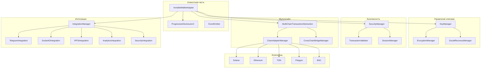
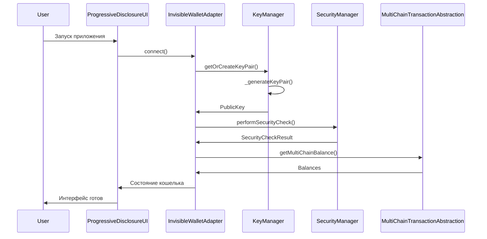
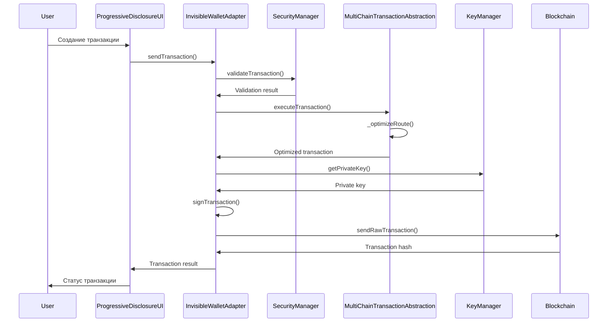
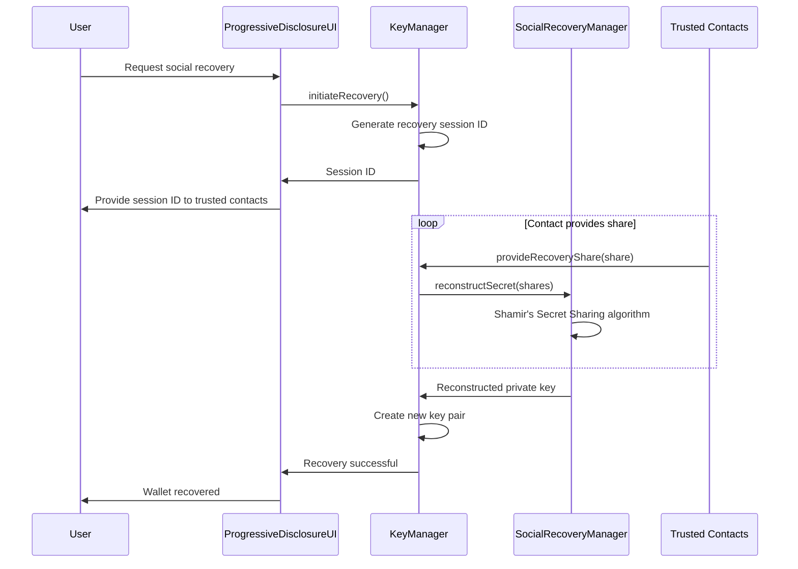

# Техническая спецификация Invisible Wallet

## 1. Введение

### 1.1 Назначение документа

Настоящий документ описывает техническую архитектуру, компоненты и интерфейсы Invisible Wallet - инновационного криптовалютного кошелька, который обеспечивает бесшовное взаимодействие с Web3 без необходимости явного управления приватными ключами.

### 1.2 Обзор системы

Invisible Wallet - это многокомпонентная система, состоящая из клиентской части (браузерное приложение), системы управления ключами, слоя безопасности, мультичейн абстракции и интеграционных компонентов. Архитектура спроектирована с учетом принципов прогрессивного раскрытия сложности, многоуровневой безопасности и кросс-чейн совместимости.

### 1.3 Область применения

- Веб-приложения с Web3 функциональностью
- Telegram Mini Apps
- Мобильные приложения
- Десктопные приложения

## 2. Архитектурная диаграмма



## 3. Компоненты системы

### 3.1 InvisibleWalletAdapter

**Назначение**: Центральный компонент, обеспечивающий взаимодействие с блокчейном и другими компонентами системы.

**Класс**: `InvisibleWalletAdapter`

**Интерфейсы**:
```typescript
interface InvisibleWalletConfig {
  // Telegram интеграция
  telegramUserId?: string;
  telegramInitData?: string;

  // Безопасность
  enableBiometric?: boolean;
  enableSocialRecovery?: boolean;
  trustedContacts?: string[];

  // Multi-chain поддержка
  supportedChains?: ("solana" | "ethereum" | "ton" | "polygon" | "bsc")[];

  // Оффлайн режим
  enableOffline?: boolean;
  cacheDuration?: number;

  // Мониторинг
 enableAnalytics?: boolean;
  analyticsEndpoint?: string;
}

interface InvisibleWalletState {
  isInitialized: boolean;
 isConnected: boolean;
 publicKey: PublicKey | null;
  balance: number;
  tokenBalances: Record<string, number>;
  lastSync: number;
  isOffline: boolean;
  securityLevel: "basic" | "enhanced" | "maximum";
}
```

**Методы**:
- `connect(): Promise<void>` - Инициализация и подключение кошелька
- `disconnect(): Promise<void>` - Отключение от кошелька
- `signTransaction(transaction: Transaction): Promise<Transaction>` - Подпись транзакции
- `sendTransaction(transaction: Transaction): Promise<string>` - Отправка транзакции
- `getBalance(): Promise<number>` - Получение баланса
- `getPublicKey(): PublicKey | null` - Получение публичного ключа
- `on(event: string, listener: Function): void` - Подписка на события
- `off(event: string, listener: Function): void` - Отписка от событий
- `emit(event: string, data?: any): void` - Вызов события

**События**:
- `connect` - Подключение к кошельку
- `disconnect` - Отключение от кошелька
- `balanceChange` - Изменение баланса
- `transaction` - Статус транзакции
- `security` - Событие безопасности
- `error` - Ошибка

### 3.2 KeyManager

**Назначение**: Безопасное управление криптографическими ключами с использованием передовых методов шифрования и социального восстановления.

**Класс**: `KeyManager`

**Интерфейсы**:
```typescript
interface KeyPairData {
  publicKey: string;
  privateKey: string;
 createdAt: number;
  lastUsed: number;
}

interface KeyShare {
  id: string;
  shareData: string;
  contactId: string;
  createdAt: number;
  isUsed: boolean;
}

interface RecoveryMetadata {
  userId: string;
  threshold: number;
  totalShares: number;
  trustedContacts: string[];
  createdAt: number;
  lastBackup: number;
}
```

**Методы**:
- `getOrCreateKeyPair(userId: string, initData?: string): Promise<PublicKey>` - Получение или создание ключевой пары
- `generateRandomKeyPair(): Promise<PublicKey>` - Генерация случайной ключевой пары
- `getPrivateKey(): Promise<Keypair>` - Получение приватного ключа
- `setupSocialRecovery(contacts: string[]): Promise<void>` - Настройка социального восстановления
- `initiateRecovery(): Promise<string>` - Инициация процесса восстановления
- `recoverFromShares(shares: string[]): Promise<PublicKey>` - Восстановление из шаров
- `exportBackup(): Promise<string>` - Экспорт бэкапа
- `importBackup(backupData: string): Promise<PublicKey>` - Импорт бэкапа

### 3.3 SecurityManager

**Назначение**: Комплексная защита транзакций и данных пользователя с использованием многоуровневой системы безопасности.

**Класс**: `SecurityManager`

**Интерфейсы**:
```typescript
interface SecurityCheckResult {
  secure: boolean;
  issues: string[];
  recommendations: string[];
  riskLevel: "low" | "medium" | "high";
}

interface SessionMetadata {
  sessionId: string;
  userId: string;
  deviceFingerprint: string;
  createdAt: number;
  lastActivity: number;
  isActive: boolean;
}
```

**Методы**:
- `validateTransaction(transaction: Transaction, userId: string): Promise<boolean>` - Валидация транзакции
- `performSecurityCheck(): Promise<SecurityCheckResult>` - Выполнение проверки безопасности
- `createSession(userId: string): Promise<string>` - Создание сессии
- `validateSession(sessionId: string): Promise<boolean>` - Валидация сессии
- `clearSession(): Promise<void>` - Очистка сессии
- `checkRateLimit(userId: string): Promise<{ allowed: boolean; resetTime?: number }>` - Проверка ограничений по частоте

### 3.4 MultiChainTransactionAbstraction

**Назначение**: Унификация работы с различными блокчейнами через единый интерфейс с автоматической оптимизацией маршрутов и комиссий.

**Класс**: `MultiChainTransactionAbstraction`

**Интерфейсы**:
```typescript
type SupportedChain = "solana" | "ethereum" | "ton" | "polygon" | "bsc";
type TransactionStatus = "pending" | "confirmed" | "failed" | "expired";
type TransactionType =
  | "transfer"
  | "swap"
  | "stake"
  | "unstake"
  | "mint"
  | "burn";

interface BaseTransaction {
  id: string;
  type: TransactionType;
  fromChain: SupportedChain;
  toChain?: SupportedChain;
  from: string;
  to: string;
  amount: number;
  token?: string;
  status: TransactionStatus;
  timestamp: number;
  confirmations?: number;
  gasUsed?: number;
  gasPrice?: number;
  fee?: number;
  error?: string;
}

interface ChainConfig {
  name: string;
  chainId: number | string;
  rpcUrl: string;
  explorerUrl: string;
  nativeCurrency: string;
  blockTime: number;
  confirmationsRequired: number;
  maxFeePerTransaction: number;
  supportedTokens: string[];
}

interface TransactionResult {
  success: boolean;
  transactionId?: string;
  blockNumber?: number;
  status: TransactionStatus;
  error?: string;
  fee?: number;
}
```

**Методы**:
- `createTransferTransaction(fromChain: SupportedChain, toChain: SupportedChain, from: string, to: string, amount: number, token?: string): Promise<BaseTransaction>` - Создание транзакции перевода
- `createSwapTransaction(chain: SupportedChain, from: string, to: string, amountIn: number, tokenIn: string, tokenOut: string): Promise<BaseTransaction>` - Создание транзакции свопа
- `executeTransaction(transaction: BaseTransaction): Promise<TransactionResult>` - Выполнение транзакции
- `getTransactionStatus(transactionId: string, chain: SupportedChain): Promise<TransactionStatus>` - Получение статуса транзакции
- `getMultiChainBalance(address: string): Promise<Map<SupportedChain, number>>` - Получение баланса на всех цепях
- `getSupportedChains(): SupportedChain[]` - Получение поддерживаемых цепей
- `getChainConfig(chain: SupportedChain): ChainConfig | undefined` - Получение конфигурации цепи
- `optimizeFee(chain: SupportedChain, transactionType: TransactionType, urgency: "low" | "medium" | "high"): Promise<{ optimalFee: number; estimatedTime: number; confidence: number; }>` - Оптимизация комиссии
- `findBestRoute(fromChain: SupportedChain, toChain: SupportedChain, amount: number, token?: string): Promise<{ route: SupportedChain[]; estimatedFee: number; estimatedTime: number; confidence: number; }>` - Поиск лучшего маршрута

### 3.5 ProgressiveDisclosureUI

**Назначение**: Адаптивный пользовательский интерфейс, который постепенно раскрывает сложность в зависимости от уровня пользователя.

**Класс**: `ProgressiveDisclosureUI`

**Интерфейсы**:
```typescript
type DisclosureLevel = "basic" | "intermediate" | "advanced" | "expert";

interface DisclosureConfig {
  level: DisclosureLevel;
  showPrivateKey: boolean;
  showTransactionDetails: boolean;
 showAdvancedSettings: boolean;
  showDeveloperTools: boolean;
  showNetworkInfo: boolean;
  showGasSettings: boolean;
  showSecuritySettings: boolean;
}

interface ProgressiveDisclosureUIProps {
  wallet: InvisibleWalletAdapter;
  initialLevel?: DisclosureLevel;
  onLevelChange?: (level: DisclosureLevel) => void;
  children?: ReactNode;
  className?: string;
}
```

**Методы**:
- `getCurrentLevel(): DisclosureLevel` - Получение текущего уровня
- `changeLevel(newLevel: DisclosureLevel): void` - Изменение уровня
- `canUpgradeTo(level: DisclosureLevel): boolean` - Проверка возможности перехода на уровень
- `getLevelRequirements(level: DisclosureLevel): string[]` - Получение требований к уровню
- `loadUserPreferences(): Promise<void>` - Загрузка пользовательских предпочтений
- `saveUserPreferences(): Promise<void>` - Сохранение пользовательских предпочтений

## 4. Диаграммы взаимодействия компонентов

### 4.1 Инициализация кошелька



### 4.2 Выполнение транзакции



### 4.3 Социальное восстановление



## 5. Описание API и интерфейсов

### 5.1 API для разработчиков

#### 5.1.1 Инициализация кошелька

```typescript
import { InvisibleWalletAdapter } from './src/components/wallet/invisible-wallet-adapter';
import { Connection } from '@solana/web3.js';

const wallet = new InvisibleWalletAdapter(
  {
    telegramUserId: '123456789',
    telegramInitData: 'query_id=xxx&user=xxx&hash=xxx',
    enableBiometric: true,
    enableSocialRecovery: true,
    supportedChains: ['solana', 'ethereum'],
    enableOffline: true,
    cacheDuration: 3000, // 5 minutes
    enableAnalytics: true,
    analyticsEndpoint: 'https://analytics.example.com'
  },
  new Connection('https://api.mainnet-beta.solana.com')
);
```

#### 5.1.2 Подписка на события

```typescript
wallet.on('connect', () => {
  console.log('Wallet connected');
});

wallet.on('disconnect', () => {
  console.log('Wallet disconnected');
});

wallet.on('balanceChange', (data) => {
  console.log('Balance updated:', data.balance);
});

wallet.on('transaction', (data) => {
  console.log('Transaction status:', data.status);
});
```

#### 5.1.3 Выполнение транзакции

```typescript
const executeTransfer = async () => {
  try {
    // Подключение к кошельку
    await wallet.connect();

    // Создание транзакции
    const transaction = new Transaction();
    transaction.add(
      SystemProgram.transfer({
        fromPubkey: wallet.publicKey!,
        toPubkey: new PublicKey('destination_address'),
        lamports: 1000000, // 0.001 SOL
      })
    );

    // Подпись транзакции
    const signedTransaction = await wallet.signTransaction(transaction);

    // Отправка транзакции
    const signature = await wallet.sendTransaction(signedTransaction);

    console.log('Transaction successful:', signature);
  } catch (error) {
    console.error('Transaction failed:', error);
  } finally {
    await wallet.disconnect();
  }
};
```

### 5.2 Внутренние интерфейсы

#### 5.2.1 Интерфейс адаптера цепи

```typescript
interface ChainAdapter {
  initialize(): Promise<void>;
  connect(): Promise<void>;
  disconnect(): Promise<void>;
  getBalance(address: string): Promise<number>;
  sendTransaction(transaction: any): Promise<string>;
  getTransactionStatus(txId: string): Promise<TransactionStatus>;
  estimateFee(transaction: any): Promise<number>;
  getBlockTime(): number;
}
```

#### 5.2.2 Интерфейс интеграции

```typescript
interface IntegrationConfig {
  telegram?: TelegramIntegrationConfig;
  socketio?: SocketIOIntegrationConfig;
  ipfs?: IPFSIntegrationConfig;
  analytics?: AnalyticsIntegrationConfig;
 security?: SecurityIntegrationConfig;
}

interface IntegrationStatus {
  connected: boolean;
  lastSync: number;
  error?: string;
  metrics: IntegrationMetrics;
}
```

## 6. Алгоритмы и протоколы

### 6.1 Алгоритм детерминированной генерации ключей

Invisible Wallet использует детерминированную генерацию ключей на основе данных пользователя Telegram:

1. Извлечение данных пользователя из `telegramInitData`
2. Формирование строки данных: `userId:telegramInitData`
3. Хеширование строки с использованием SHA-256
4. Использование первых 32 байт хеша как seed для генерации ключевой пары

```typescript
private async _deriveSeedFromTelegramData(userId: string, initData: string): Promise<Uint8Array> {
  const encoder = new TextEncoder();
  const data = encoder.encode(`${userId}:${initData}`);

  const hash = await crypto.subtle.digest("SHA-256", data);
  return new Uint8Array(hash.slice(0, 32)); // Первые 32 байта для seed
}
```

### 6.2 Алгоритм социального восстановления (Shamir's Secret Sharing)

Система использует Shamir's Secret Sharing для распределенного хранения ключей:

1. Преобразование приватного ключа в число
2. Генерация случайного полинома степени `t-1`, где `t` - порог для восстановления
3. Вычисление точек полинома для `n` участников (где `n` - общее количество доверенных контактов)
4. Распределение точек между доверенными контактами
5. Для восстановления требуется `t` точек для воссоздания полинома и получения оригинального ключа

### 6.3 Алгоритм оптимизации комиссии

Система анализирует текущую сетевую активность для оптимизации комиссий:

1. Сбор статистики о текущей загрузке сети
2. Анализ истории комиссий за последние 100 блоков
3. Определение оптимальной комиссии на основе приоритета пользователя (низкий, средний, высокий)
4. Расчет времени подтверждения на основе комиссии

```typescript
async optimizeFee(
  chain: SupportedChain,
  transactionType: TransactionType,
  urgency: "low" | "medium" | "high" = "medium"
): Promise<{
  optimalFee: number;
  estimatedTime: number;
  confidence: number;
}> {
  const chainConfig = this._supportedChains.get(chain);
  if (!chainConfig) {
    throw new Error(`Chain ${chain} not supported`);
  }

 // Анализ сетевой активности
  const networkStats = await this._getNetworkStats(chain);

  // Расчет оптимальной комиссии
 const baseFee = networkStats.baseFee;
 const priorityMultiplier = this._getPriorityMultiplier(urgency);
  const optimalFee = baseFee * priorityMultiplier;

  // Оценка времени подтверждения
  const estimatedTime = this._estimateConfirmationTime(
    optimalFee,
    networkStats,
    chainConfig
  );

  return {
    optimalFee,
    estimatedTime,
    confidence: 0.85, // 85% уверенность в оценке
  };
}
```

### 6.4 Алгоритм поиска лучшего маршрута

Для кросс-чейн транзакций система реализует алгоритм поиска оптимального маршрута:

1. Поиск доступных мостов между цепями
2. Оценка комиссий и времени для каждого моста
3. Учет текущей загрузки мостов
4. Выбор маршрута с наилучшим соотношением комиссия/время

```typescript
async findBestRoute(
  fromChain: SupportedChain,
  toChain: SupportedChain,
  amount: number,
  token?: string
): Promise<{
  route: SupportedChain[];
  estimatedFee: number;
  estimatedTime: number;
  confidence: number;
}> {
  // Если та же цепь - прямой маршрут
 if (fromChain === toChain) {
    const fee = await this._calculateDirectFee(fromChain, amount);
    return {
      route: [fromChain],
      estimatedFee: fee,
      estimatedTime: this._supportedChains.get(fromChain)!.blockTime,
      confidence: 0.95,
    };
  }

  // Поиск кросс-чейн мостов
 const bridges = await this._findAvailableBridges(fromChain, toChain);

  if (bridges.length === 0) {
    throw new Error("No available bridges for this route");
  }

  // Выбор лучшего моста
  let bestBridge = bridges[0];
  let minFee = Infinity;
  let minTime = Infinity;

  for (const bridge of bridges) {
    const fee = await this._calculateBridgeFee(bridge, amount);
    const time = bridge.estimatedTime;

    if (fee < minFee || (fee === minFee && time < minTime)) {
      minFee = fee;
      minTime = time;
      bestBridge = bridge;
    }
  }

  return {
    route: [fromChain, toChain], // Упрощенная реализация
    estimatedFee: minFee,
    estimatedTime: minTime,
    confidence: 0.8,
  };
}
```

## 7. Безопасность

### 7.1 Криптографические примитивы

- **Шифрование**: AES-256-GCM для шифрования приватных ключей
- **Хеширование**: SHA-256 для генерации детерминированных ключей
- **Цифровые подписи**: Ed25519 (Solana), secp256k1 (Ethereum)
- **Ключевое соглашение**: ECDH для безопасного обмена ключами

### 7.2 Защита от атак

- **Phishing**: Белые списки адресов и ML-детекция
- **Man-in-the-middle**: Certificate pinning и проверка HTTPS
- **Replay attacks**: Временные метки и nonce
- **Side-channel**: Constant-time операции
- **Brute-force**: Rate limiting и блокировка IP

### 7.3 Управление сессиями

Система использует device fingerprinting для идентификации и проверки подлинности сессий:

```typescript
private _generateDeviceFingerprint(): string {
  const canvas = document.createElement("canvas");
  const ctx = canvas.getContext("2d");
  if (ctx) {
    ctx.textBaseline = "top";
    ctx.font = "14px Arial";
    ctx.fillText("Device fingerprint", 2, 2);
  }

  const fingerprint = [
    navigator.userAgent,
    navigator.language,
    screen.width + "x" + screen.height,
    new Date().getTimezoneOffset(),
    canvas.toDataURL(),
  ].join("|");

  return this._hashString(fingerprint);
}
```

### 7.4 Проверка безопасности устройства

Система выполняет комплексную проверку безопасности устройства пользователя:

- Проверка HTTPS соединения
- Проверка браузера на подозрительные расширения
- Проверка времени сессии
- Проверка геолокации (если доступна)
- Проверка на использование эмуляторов или jailbroken устройств

## 8. Производительность

### 8.1 Метрики производительности

- **Время инициализации**: < 500ms
- **Время подписи транзакции**: < 100ms
- **Время синхронизации баланса**: < 2s
- **Размер хранилища**: < 1MB
- **Потребление памяти**: < 50MB
- **Время проверки транзакции**: < 200ms
- **Время проверки безопасности устройства**: < 100ms
- **Время создания/проверки сессии**: < 50ms

### 8.2 Оптимизация

- Кэширование результатов проверок
- Асинхронные операции для высокой производительности
- Модульная архитектура для легкого расширения
- Поддержка распределенных систем безопасности

## 9. Тестирование

### 9.1 Unit тесты

- Покрытие кода: > 90%
- Тесты критических путей: 100%
- Мокирование внешних зависимостей

### 9.2 Интеграционные тесты

- Тестирование взаимодействия компонентов
- Тестирование с реальными блокчейн сетями
- Тестирование отказоустойчивости

### 9.3 Нагрузочные тесты

- Тестирование производительности под нагрузкой
- Тестирование масштабируемости
- Тестирование лимитов и квот

## 10. Мониторинг и логирование

### 10.1 Метрики

```typescript
interface SecurityMetrics {
  transactionValidationTime: number;
  deviceSecurityCheckTime: number;
  sessionValidationTime: number;
 phishingDetectionRate: number;
  anomalyDetectionRate: number;
  falsePositiveRate: number;
  rateLimitEnforcementRate: number;
  securityBreachAttempts: number;
  sessionSecurityIssues: number;
}

interface MultiChainMetrics {
  transactionCreationTime: number;
  transactionExecutionTime: number;
  routeFindingTime: number;
  feeOptimizationTime: number;
  transactionStatusTime: number;
  crossChainSuccessRate: number;
  bridgeUtilizationRate: number;
  chainAvailabilityRate: number;
  swapSuccessRate: number;
}

interface IntegrationMetrics {
  initializationTime: Record<string, number>;
  connectionTime: Record<string, number>;
  requestSuccessRate: Record<string, number>;
  averageResponseTime: Record<string, number>;
  dataTransferRate: Record<string, number>;
  errorRate: Record<string, number>;
  uptime: Record<string, number>;
}
```

### 10.2 Логирование

Система логирует все операции:
- Создание и выполнение транзакций
- Проверки безопасности
- События аутентификации
- Ошибки исключения
- Метрики производительности

## 11. Заключение

Техническая спецификация Invisible Wallet описывает комплексную архитектуру, обеспечивающую безопасное и удобное взаимодействие с Web3. Система спроектирована с учетом современных требований к безопасности, производительности и пользовательскому опыту, обеспечивая бесшовную интеграцию с существующей экосистемой Web3.

Ключевые особенности архитектуры:
- Модульная структура для легкого расширения
- Многоуровневая безопасность
- Прогрессивное раскрытие сложности
- Мультичейн поддержка
- Интеграция с Telegram
- Социальное восстановление
- Оффлайн функциональность

Архитектура позволяет легко адаптировать систему под различные сценарии использования и требования безопасности.