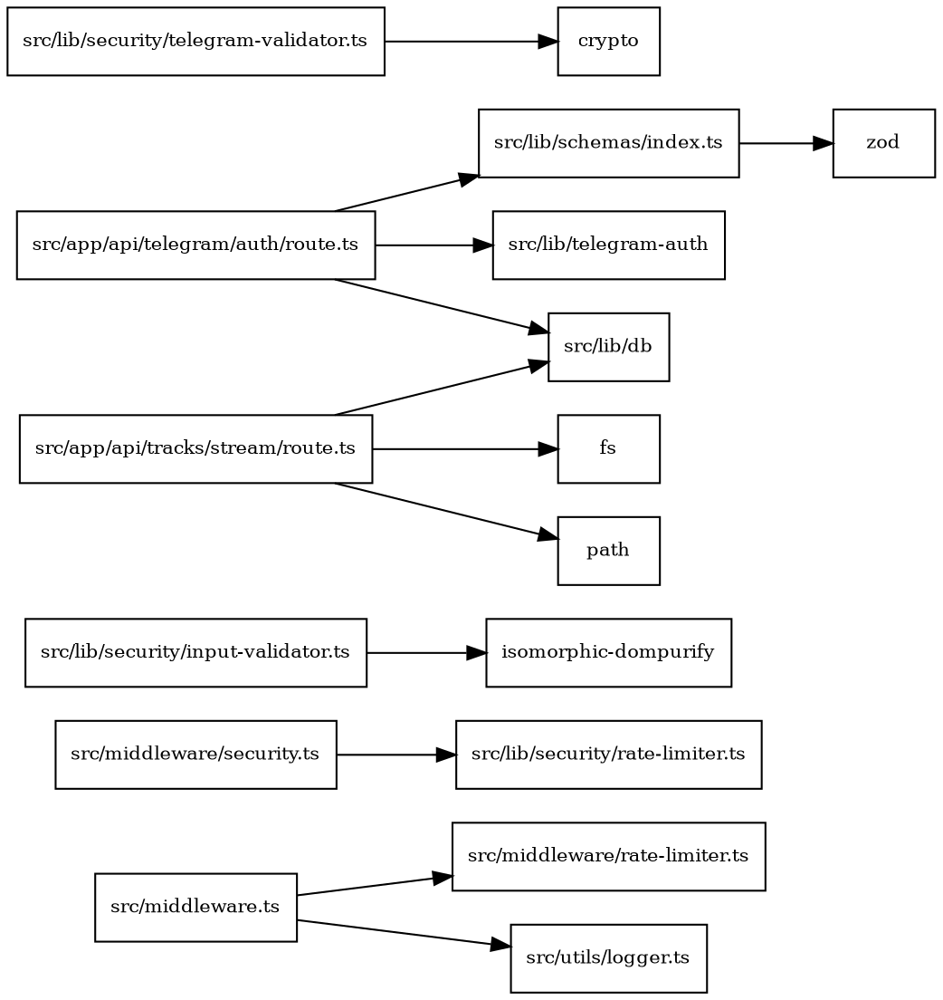

# Инвентаризация модулей безопасности (TypeScript)

Область анализа: src/lib, src/components, src/app/api. Фокус: XSS, CSRF, санитизация, валидаторы, заголовки безопасности, middleware, адаптеры, политики, rate limiting.

Резюме ключевых находок

- Дублирование rate limiting: [src/lib/security/rate-limiter.ts](src/lib/security/rate-limiter.ts) vs [src/middleware/rate-limiter.ts](src/middleware/rate-limiter.ts). Разные API (withRateLimit vs checkRateLimit) и разные политики.
- Дублирование санитизации: утилиты на замене символов [TypeScript.sanitizeHTML()](src/lib/security/input-sanitizer.ts:19) и DOMPurify-ориентированный [TypeScript.InputValidator.sanitizeHtml()](src/lib/security/input-validator.ts:16).
- Многократная установка заголовков безопасности/CSP: [TypeScript.middleware()](src/middleware.ts:78) и [TypeScript.securityMiddleware()](src/middleware/security.ts:10) используют разные наборы директив.
- Telegram-валидация реализована в [TypeScript.validateTelegramInitData()](src/lib/security/telegram-validator.ts:51) и отдельно используется [src/app/api/telegram/auth/route.ts](src/app/api/telegram/auth/route.ts) через verifyTelegramWebAppData (не из этого модуля).
- Поток аудио [src/app/api/tracks/stream/route.ts](src/app/api/tracks/stream/route.ts) устанавливает статичный Content-Type, отсутствуют ETag/Last-Modified и X-Content-Type-Options: nosniff.

Подробная карта модулей

Middleware и заголовки безопасности

- [TypeScript.middleware()](src/middleware.ts:78):
  - Назначение: глобальный CORS, security headers, базовый rate limiting (через [TypeScript.checkRateLimit()](src/middleware/rate-limiter.ts:19)), обнаружение ботов/подозрительных запросов.
  - Публичный API: экспорт функции middleware; конфигурация матчера [src/middleware.ts](src/middleware.ts:186).
  - Заголовки: X-Content-Type-Options, X-Frame-Options, X-XSS-Protection, Referrer-Policy, Permissions-Policy, HSTS; CSP специфичный для Telegram.
  - Зависимости: [src/middleware/rate-limiter.ts](src/middleware/rate-limiter.ts), [src/lib/utils/logger.ts](src/utils/logger.ts:99).
  - Замечания: CSP отличается от другого middleware; CORS allowlist с wildcard 'https://\*.vercel.app'.
- [TypeScript.securityMiddleware()](src/middleware/security.ts:10):
  - Назначение: установка заголовков и rate limiting через [TypeScript.apiRateLimiter](src/lib/security/rate-limiter.ts:91).
  - CSP: включает 'unsafe-eval'/'unsafe-inline' для script/style, что конфликтует с политикой в [src/middleware.ts](src/middleware.ts:166).
  - Публичный API: функция securityMiddleware, возвращает NextResponse.

Rate limiting

- [TypeScript.RateLimiter](src/lib/security/rate-limiter.ts:19): in-memory лимитер с преднастроенными экземплярами [TypeScript.apiRateLimiter](src/lib/security/rate-limiter.ts:91), [TypeScript.authRateLimiter](src/lib/security/rate-limiter.ts:96), [TypeScript.uploadRateLimiter](src/lib/security/rate-limiter.ts:101), плюс декоратор [TypeScript.withRateLimit()](src/lib/security/rate-limiter.ts:106).
- [TypeScript.checkRateLimit()](src/middleware/rate-limiter.ts:19): альтернативная in-memory реализация с категориями auth/tracks/upload/nft/general; интерфейс возвращает успех/лимиты/время сброса.
- Пересечение: два независимых сторожа, разные ключи идентификации, разная модель возврата; требуется консолидация под единый менеджер.

Санитизация и валидация ввода

- [TypeScript.sanitizeHTML()](src/lib/security/input-sanitizer.ts:19), [TypeScript.stripHTML()](src/lib/security/input-sanitizer.ts:44), [TypeScript.sanitizeSQL()](src/lib/security/input-sanitizer.ts:70), [TypeScript.sanitizeURL()](src/lib/security/input-sanitizer.ts:110), [TypeScript.sanitizeFilename()](src/lib/security/input-sanitizer.ts:153), [TypeScript.isValidEmail()](src/lib/security/input-sanitizer.ts:179), [TypeScript.detectSuspiciousPatterns()](src/lib/security/input-sanitizer.ts:351) и др.:
  - Назначение: чистые функции для XSS/SQL/URL/имён файлов, проверки адресов.
  - Типы: строковые входы, возврат строки/boolean/null.
  - Зоны применения: unit-тесты и потенциально API/компоненты.
- [TypeScript.InputValidator](src/lib/security/input-validator.ts:14):
  - Методы: [TypeScript.InputValidator.sanitizeHtml()](src/lib/security/input-validator.ts:16) на DOMPurify, [TypeScript.InputValidator.validateText()](src/lib/security/input-validator.ts:24), [TypeScript.InputValidator.validateEmail()](src/lib/security/input-validator.ts:44), [TypeScript.InputValidator.validateWalletAddress()](src/lib/security/input-validator.ts:58), [TypeScript.InputValidator.validateNumber()](src/lib/security/input-validator.ts:75), [TypeScript.InputValidator.escapeSql()](src/lib/security/input-validator.ts:111), [TypeScript.InputValidator.validateJson()](src/lib/security/input-validator.ts:116).
  - Назначение: комбинация санитизации/валидации, возвращает структурированный ValidationResult.
  - Зависимости: isomorphic-dompurify.
- [src/lib/schemas/index.ts](src/lib/schemas/index.ts): централизованные схемы Zod для API, helper [TypeScript.validateData()](src/lib/schemas/index.ts:258) с типобезопасным результатом.

Telegram и аутентификация

- [TypeScript.validateTelegramInitData()](src/lib/security/telegram-validator.ts:51), [TypeScript.validateTelegramRequest()](src/lib/security/telegram-validator.ts:188), [TypeScript.extractUserId()](src/lib/security/telegram-validator.ts:220), [TypeScript.isInitDataExpired()](src/lib/security/telegram-validator.ts:241):
  - Назначение: верификация подписи HMAC-SHA256, защита от replay, безопасное извлечение user.
  - Типы: ValidationResult, TelegramUser.
- [TypeScript.POST()](src/app/api/telegram/auth/route.ts:15): использует verifyTelegramWebAppData (внешний модуль), затем Zod [TypeScript.telegramUserSchema](src/lib/schemas/index.ts:125), БД, генерацию JWT.
  - Пересечение: два пути валидации initData (встроенный validator и отдельный verifyTelegramWebAppData).

Стриминг аудио

- [TypeScript.GET()](src/app/api/tracks/stream/route.ts:8), [TypeScript.POST()](src/app/api/tracks/stream/route.ts:87), [TypeScript.HEAD()](src/app/api/tracks/stream/route.ts:172):
  - Назначение: поток аудио, учёт прослушиваний, метаданные.
  - Текущие заголовки: Content-Range/Accept-Ranges/Content-Length/Content-Type/Content-Disposition; нет ETag/Last-Modified, If-\* обработок; Content-Type всегда audio/mpeg.
  - Риски: отсутствие X-Content-Type-Options: nosniff, жесткая обработка Range, нет проверок на path traversal (частично компенсировано).

Обнаруженные зоны использования (поиск)

- API: [src/app/api/users/route.ts](src/app/api/users/route.ts), [src/app/api/tracks/route.ts](src/app/api/tracks/route.ts), [src/app/api/rewards/route.ts](src/app/api/rewards/route.ts), [src/app/api/stripe/webhook/route.ts](src/app/api/stripe/webhook/route.ts), [src/app/api/telegram/web3/route.ts](src/app/api/telegram/web3/route.ts).
- Компоненты: многочисленные fetch POST с JSON и без явной санитизации на клиенте.
- Утилиты: [src/lib/utils/validate.ts](src/lib/utils/validate.ts), [src/lib/errors/errorHandler.ts](src/lib/errors/errorHandler.ts:56) для Zod, [src/lib/rbac.ts](src/lib/rbac.ts:2) для NextAuth.

Пересечения ответственности и дублирование

- Rate limiting: два независимых механизма; предложено единое API в SecurityManager.
- Санитизация: смешение чистых утилит и DOMPurify; предложено единый контекстно-зависимый сервис ISecurityService.
- CSP/заголовки: конфликтующие политики между middleware; предложено единый источник (конфиг) и интеграция через SecurityManager.
- Telegram: единый путь проверки initData + адаптер для verifyTelegramWebAppData.
- Валидация: Zod централизован, но часть ручных валидаторов дублирует проверки; предложено унифицировать нормализацию/агрегацию ошибок через BaseValidator.

Публичные API — сводная таблица

- Санитизация: [TypeScript.sanitizeHTML()](src/lib/security/input-sanitizer.ts:19), [TypeScript.InputValidator.sanitizeHtml()](src/lib/security/input-validator.ts:16)
- Валидация: [TypeScript.InputValidator.validateText()](src/lib/security/input-validator.ts:24), [TypeScript.validateData()](src/lib/schemas/index.ts:258)
- Rate limit: [TypeScript.withRateLimit()](src/lib/security/rate-limiter.ts:106), [TypeScript.checkRateLimit()](src/middleware/rate-limiter.ts:19)
- Заголовки: [TypeScript.middleware()](src/middleware.ts:78), [TypeScript.securityMiddleware()](src/middleware/security.ts:10)
- Telegram: [TypeScript.validateTelegramInitData()](src/lib/security/telegram-validator.ts:51), [TypeScript.validateTelegramRequest()](src/lib/security/telegram-validator.ts:188)
- Стриминг: [TypeScript.GET()](src/app/api/tracks/stream/route.ts:8)

Типы данных и ошибки

- Единые коды ошибок рекомендуется ввести в ISecurityService.ResultCode: VALIDATION_ERROR, RATE_LIMIT_EXCEEDED, AUTHENTICATION_ERROR, SECURITY_POLICY_VIOLATION, SANITIZATION_APPLIED, CSRF_FAILED.
- Формат результата валидации: { ok: boolean; errors?: Array<{ code: string; message: string; path?: string[] }>; value?: unknown }.

Рекомендации по реорганизации (высокоуровнево)

- Консолидация rate limiting: перенести логику [src/middleware/rate-limiter.ts](src/middleware/rate-limiter.ts) в [TypeScript.RateLimiter](src/lib/security/rate-limiter.ts:19) и предоставить унифицированный адаптер.
- Единый сервис безопасности [TypeScript.ISecurityService](src/lib/security/ISecurityService.ts): контекстная санитизация (client/server, HTML/attr/URL/filename), экранирование, CSRF (double-submit, cookie+header), заголовки, политики.
- Базовый валидационный класс [TypeScript.BaseValidator<TInput,TOutput>](src/lib/security/BaseValidator.ts:1): композиция правил, нормализация, ленивость/жадность, агрегирование ошибок.
- Централизованный менеджер [TypeScript.SecurityManager](src/lib/security/SecurityManager.ts:1): единые точки входа, плагины/адаптеры, кеширование, интеграция с middleware и API.
- Обновить стриминг: безопасный Range, корректные статусы 200/206/304/416, ETag/Last-Modified, If-\* и X-Content-Type-Options: nosniff; динамический MIME (mp3/aac/flac).

Граф зависимостей (DOT)

Зоны применения (клиент/сервер) и матрица совместимости

- Клиент: безопасная санитизация HTML/атрибутов (DOMPurify), контекстная экранизация; CSRF-токен доступен через cookie и отправляется в заголовке.
- Сервер: строгая валидация Zod, нормализация входа, проверка CSRF, формирование заголовков (CSP/HSTS/X-\*), rate limiting.
- Next.js App Router: интеграция через middleware и обработчики в src/app/api; единый контракт ISecurityService для обоих контекстов.

Наблюдения по стилю и строгому режиму

- В ряде модулей отсутствует единый формат ошибок/результатов; требуется унификация.
- Следовать правилам проекта: Socket.IO путь /api/socketio; глобальный Prisma; форматирование SOL в русском локале; политики CSP синхронизировать с конфигом.

Следующие шаги

1. Спроектировать и создать [TypeScript.ISecurityService](src/lib/security/ISecurityService.ts:1), [TypeScript.BaseValidator](src/lib/security/BaseValidator.ts:1), [TypeScript.SecurityManager](src/lib/security/SecurityManager.ts:1).
2. Реорганизовать XSS/CSRF в [src/lib/security/xss-csrf.ts](src/lib/security/xss-csrf.ts).
3. Унифицировать санитизацию в [src/lib/security/sanitize.ts](src/lib/security/sanitize.ts) и адаптировать текущих потребителей через реэкспорт/прокси.
4. Обновить middleware и API-обработчики для единой политики и подключения SecurityManager.
5. Обеспечить обратную совместимость через адаптеры/прокси-экспорты и депрекейт-предупреждения.
6. Подготовить тесты и документацию миграции.

Приложение: список релевантных тестов

- [src/**tests**/unit/security/input-sanitizer.test.ts](src/__tests__/unit/security/input-sanitizer.test.ts)
- [src/**tests**/unit/security/telegram-validator.test.ts](src/__tests__/unit/security/telegram-validator.test.ts)
- [src/**tests**/integration/api-grave-donations.test.ts](src/__tests__/integration/api-grave-donations.test.ts)

Список потенциально устаревающих API (предложение)

- [TypeScript.checkRateLimit()](src/middleware/rate-limiter.ts:19) — заменить на адаптер к [TypeScript.RateLimiter](src/lib/security/rate-limiter.ts:19) / SecurityManager.
- [TypeScript.InputValidator.sanitizeHtml()](src/lib/security/input-validator.ts:16) — унифицировать с контекстной санитизацией ISecurityService.
- CSP из [TypeScript.securityMiddleware()](src/middleware/security.ts:10) — унифицировать с глобальной политикой.

Конец отчёта
