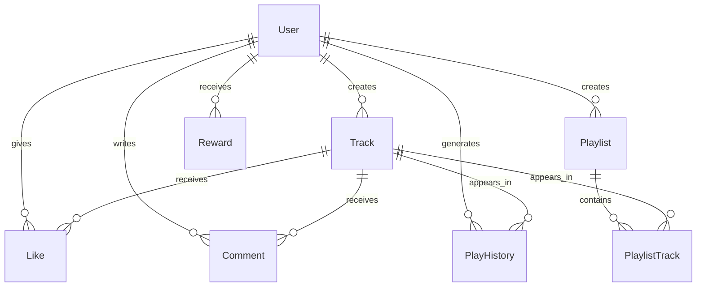

# 🗄️ Схема базы данных NORMALDANCE

## Обзор базы данных

NORMALDANCE использует реляционную базу данных для хранения метаданных, пользовательских данных и бизнес-логики. В разработке используется SQLite через Prisma ORM, в продакшене - PostgreSQL.

## Технологии

- **ORM**: Prisma 5.0.0
- **Development DB**: SQLite (file: ./dev.db)
- **Production DB**: PostgreSQL 15
- **Migration Tool**: Prisma Migrate

## Схема данных

### Основные таблицы

#### 1. Users (Пользователи)

```sql
model User {
  id          String      @id @default(cuid())
  email       String      @unique
  username    String      @unique
  displayName String?
  bio         String?
  avatar      String?
  banner      String?
  wallet      String?     // Web3 wallet address
  level       String      @default("BRONZE") // UserLevel as String
  balance     Float       @default(0) // $NDT token balance
  isArtist    Boolean     @default(false)
  isActive    Boolean     @default(true)
  role        String      @default("LISTENER") // UserRole as String
  createdAt   DateTime    @default(now())
  updatedAt   DateTime    @updatedAt

  // Relations
  tracks      Track[]
  playlists   Playlist[]
  likes       Like[]
  comments    Comment[]
  playHistory PlayHistory[]
  rewards     Reward[]

  @@map("users")
}
```

**Описание полей:**

- `id`: UUID первичный ключ
- `email`: Уникальный email пользователя
- `username`: Уникальный никнейм
- `wallet`: Адрес Web3 кошелька
- `level`: Уровень пользователя (BRONZE, SILVER, GOLD, PLATINUM)
- `balance`: Баланс токенов $NDT
- `role`: Роль (LISTENER, ARTIST, CURATOR, ADMIN)

#### 2. Tracks (Треки)

```sql
model Track {
  id          String   @id @default(cuid())
  title       String
  artistName  String   // Artist name as string
  genre       String
  duration    Int      // Duration in seconds
  playCount   Int      @default(0)
  likeCount   Int      @default(0)
  ipfsHash    String   // IPFS hash for audio file
  metadata    String   @default("{}") // JSON as String
  price       Float?   // Price in $NDT (null = free)
  isExplicit  Boolean  @default(false)
  isPublished Boolean  @default(false)
  status      String   @default("DRAFT") // TrackStatus as String
  publishedAt DateTime?
  createdAt   DateTime @default(now())
  updatedAt   DateTime @updatedAt

  // Relations
  artistId    String
  artist      User     @relation(fields: [artistId], references: [id], onDelete: Cascade)

  @@map("tracks")
}
```

**Описание полей:**

- `ipfsHash`: Хэш IPFS для аудио файла
- `metadata`: JSON строка с дополнительными метаданными (BPM, key, energy)
- `price`: Цена в токенах $NDT (null = бесплатный)
- `status`: Статус трека (DRAFT, PENDING, PUBLISHED, REJECTED)

#### 3. Playlists (Плейлисты)

```sql
model Playlist {
  id          String   @id @default(cuid())
  name        String
  description String?
  isPublic    Boolean  @default(true)
  coverImage  String?
  playCount   Int      @default(0)
  createdAt   DateTime @default(now())
  updatedAt   DateTime @updatedAt

  // Relations
  userId      String
  user        User     @relation(fields: [userId], references: [id], onDelete: Cascade)

  tracks      PlaylistTrack[]

  @@map("playlists")
}
```

#### 4. PlaylistTrack (Связь плейлист-трек)

```sql
model PlaylistTrack {
  id        String @id @default(cuid())
  position  Int    // Order in playlist

  playlistId String
  playlist  Playlist @relation(fields: [playlistId], references: [id], onDelete: Cascade)

  trackId   String
  track     Track    @relation(fields: [trackId], references: [id], onDelete: Cascade)

  @@unique([playlistId, trackId])
  @@map("playlist_tracks")
}
```

#### 5. Like (Лайки)

```sql
model Like {
  id        String   @id @default(cuid())
  createdAt DateTime @default(now())

  // Relations
  userId  String
  user    User     @relation(fields: [userId], references: [id], onDelete: Cascade)

  trackId String
  track   Track    @relation(fields: [trackId], references: [id], onDelete: Cascade)

  @@unique([userId, trackId])
  @@map("likes")
}
```

#### 6. Comment (Комментарии)

```sql
model Comment {
  id        String   @id @default(cuid())
  content   String
  createdAt DateTime @default(now())
  updatedAt DateTime @updatedAt

  // Relations
  userId  String
  user    User     @relation(fields: [userId], references: [id], onDelete: Cascade)

  trackId String
  track   Track    @relation(fields: [trackId], references: [id], onDelete: Cascade)

  @@map("comments")
}
```

#### 7. PlayHistory (История прослушиваний)

```sql
model PlayHistory {
  id        String   @id @default(cuid())
  userId    String
  trackId   String
  duration  Int      // Duration in seconds
  completed Boolean  @default(false)
  createdAt DateTime @default(now())

  // Relations
  user  User  @relation(fields: [userId], references: [id], onDelete: Cascade)

  @@map("play_history")
}
```

#### 8. Reward (Награды)

```sql
model Reward {
  id        String   @id @default(cuid())
  userId    String
  type      String   // Reward type (LISTENING, CONTRIBUTION, etc.)
  amount    Int      // Reward amount
  reason    String   // Reason for reward
  createdAt DateTime @default(now())

  // Relations
  user User @relation(fields: [userId], references: [id], onDelete: Cascade)

  @@map("rewards")
}
```

## Связи между таблицами



## Индексы и оптимизация производительности

### Рекомендуемые индексы

```sql
-- Индексы для поиска и фильтрации треков
CREATE INDEX idx_tracks_artist_id ON tracks(artist_id);
CREATE INDEX idx_tracks_genre ON tracks(genre);
CREATE INDEX idx_tracks_status ON tracks(status);
CREATE INDEX idx_tracks_created_at ON tracks(created_at DESC);
CREATE INDEX idx_tracks_published_at ON tracks(published_at DESC) WHERE published_at IS NOT NULL;

-- Полнотекстовый поиск
CREATE INDEX idx_tracks_fulltext ON tracks USING gin(to_tsvector('english', title || ' ' || artist_name || ' ' || genre));

-- Индексы для пользователей
CREATE INDEX idx_users_wallet ON users(wallet) WHERE wallet IS NOT NULL;
CREATE INDEX idx_users_role ON users(role);
CREATE INDEX idx_users_level ON users(level);
CREATE INDEX idx_users_created_at ON users(created_at DESC);

-- Индексы для аналитики
CREATE INDEX idx_play_history_user_track ON play_history(user_id, track_id);
CREATE INDEX idx_play_history_created_at ON play_history(created_at DESC);
CREATE INDEX idx_likes_track_id ON likes(track_id);
CREATE INDEX idx_comments_track_id ON comments(track_id);

-- Композитные индексы для плейлистов
CREATE INDEX idx_playlist_tracks_playlist_position ON playlist_tracks(playlist_id, position);
```

### Стратегии оптимизации

#### 1. Кэширование часто запрашиваемых данных

- **Redis** для популярных треков, пользовательских профилей
- **Application-level cache** для жанров, настроек

#### 2. Партиционирование

```sql
-- Партиционирование истории прослушиваний по месяцам
CREATE TABLE play_history_y2024m01 PARTITION OF play_history
    FOR VALUES FROM ('2024-01-01') TO ('2024-02-01');

-- Партиционирование наград по типу
CREATE TABLE rewards_listening PARTITION OF rewards
    FOR VALUES IN ('LISTENING');
```

#### 3. Архивация старых данных

- Автоматическая архивация истории прослушиваний старше 1 года
- Перемещение в холодное хранилище для аналитики

#### 4. Оптимизация запросов

- Использование `EXPLAIN ANALYZE` для анализа планов запросов
- Избегание N+1 запросов через `include` в Prisma
- Пагинация для больших наборов данных

## Миграции базы данных

### Структура миграций Prisma

```
prisma/
├── schema.prisma
└── migrations/
    ├── 20240101120000_initial_migration/
    │   └── migration.sql
    ├── 20240115130000_add_nft_support/
    │   └── migration.sql
    └── 20240201140000_add_analytics/
        └── migration.sql
```

### Команды миграций

```bash
# Генерация миграции
npx prisma migrate dev --name add_nft_support

# Применение миграций
npx prisma migrate deploy

# Генерация Prisma клиента
npx prisma generate
```

## Резервное копирование и восстановление

### Стратегия резервного копирования

1. **Ежедневные полные бэкапы** в 02:00 UTC
2. **Инкрементальные бэкапы** каждые 6 часов
3. **Резервное копирование WAL файлов** для Point-in-Time Recovery
4. **Хранение бэкапов** в облаке (AWS S3, Google Cloud Storage)

### Команды PostgreSQL

```bash
# Полный бэкап
pg_dump -U normaldance -h localhost normaldance_db > backup_$(date +%Y%m%d_%H%M%S).sql

# Восстановление
psql -U normaldance -h localhost normaldance_db < backup_file.sql

# Point-in-Time Recovery
pg_basebackup -U replicator -h primary -D /var/lib/postgresql/data -P --wal-method=stream
```

## Мониторинг базы данных

### Ключевые метрики

- **Connection Pool**: Использование пула соединений
- **Query Performance**: Время выполнения запросов
- **Lock Waits**: Время ожидания блокировок
- **Cache Hit Ratio**: Эффективность кэша
- **Replication Lag**: Задержка репликации

### Мониторинг запросов

```sql
-- Медленные запросы
SELECT pid, now() - pg_stat_activity.query_start AS duration, query
FROM pg_stat_activity
WHERE state = 'active' AND now() - pg_stat_activity.query_start > interval '1 second'
ORDER BY duration DESC;

-- Использование индексов
SELECT schemaname, tablename, attname, n_distinct, correlation
FROM pg_stats
WHERE schemaname = 'public'
ORDER BY n_distinct DESC;
```

## Безопасность базы данных

### Меры безопасности

1. **Шифрование данных в покое** (TDE)
2. **SSL/TLS** для соединений
3. **Row Level Security** (RLS) для мульти-тенантности
4. **Аудит логов** для чувствительных операций

### Пример RLS политики

```sql
-- Включение RLS
ALTER TABLE tracks ENABLE ROW LEVEL SECURITY;

-- Политика: пользователи видят только опубликованные треки или свои собственные
CREATE POLICY tracks_policy ON tracks
FOR SELECT USING (
  status = 'PUBLISHED' OR artist_id = current_user_id()
);
```

---

_Схема базы данных разработана для поддержки высоконагруженной Web3 музыкальной платформы с учетом требований масштабируемости, безопасности и производительности._
