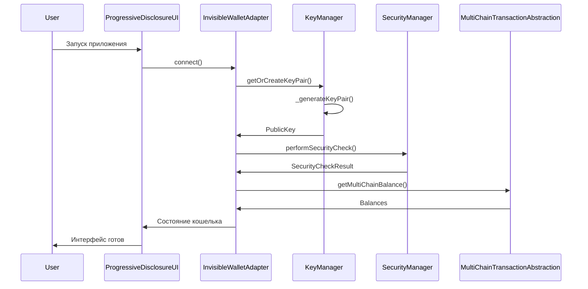
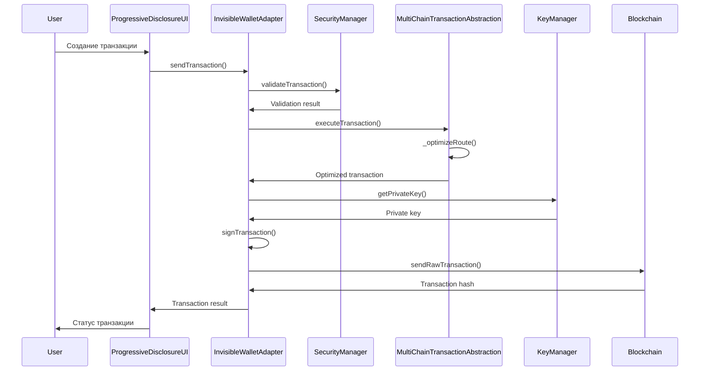

# Спецификация Core Architecture Components для Invisible Wallet

## Обзор

Invisible Wallet - это революционная система управления криптовалютами, которая обеспечивает бесшовное взаимодействие с Web3 без необходимости явного управления приватными ключами. Архитектура построена на принципах прогрессивного раскрытия сложности, многоуровневой безопасности и кросс-чейн совместимости.

## Основные компоненты архитектуры

### 1. InvisibleWalletAdapter - Центральный адаптер

**Назначение**: Основной интерфейс взаимодействия с кошельком, реализующий паттерн адаптера для совместимости с существующими Web3 системами.

**Ключевые особенности**:

- Автоматическая инициализация без явного подключения
- Прогрессивное раскрытие функциональности
- Multi-chain поддержка
- Оффлайн функциональность
- Социальное восстановление
- Интеграция с Telegram Stars

```typescript
interface InvisibleWalletConfig {
  // Telegram интеграция
  telegramUserId?: string;
  telegramInitData?: string;

  // Безопасность
  enableBiometric?: boolean;
  enableSocialRecovery?: boolean;
  trustedContacts?: string[];

  // Multi-chain поддержка
  supportedChains?: ("solana" | "ethereum" | "ton")[];

  // Оффлайн режим
  enableOffline?: boolean;
  cacheDuration?: number;

  // Мониторинг
  enableAnalytics?: boolean;
  analyticsEndpoint?: string;
}

interface InvisibleWalletState {
  isInitialized: boolean;
  isConnected: boolean;
  publicKey: PublicKey | null;
  balance: number;
  tokenBalances: Record<string, number>;
  lastSync: number;
  isOffline: boolean;
  securityLevel: "basic" | "enhanced" | "maximum";
}
```

### 2. KeyManager - Управление ключами

**Назначение**: Безопасное управление криптографическими ключами с использованием передовых методов шифрования и социального восстановления.

**Ключевые особенности**:

- Детерминированная генерация ключей на основе Telegram данных
- AES-GCM шифрование для хранения ключей
- Shamir's Secret Sharing для социального восстановления
- Автоматическое бэкапирование

```typescript
interface KeyPairData {
  publicKey: string;
  privateKey: string;
  createdAt: number;
  lastUsed: number;
}

interface KeyShare {
  id: string;
  shareData: string;
  contactId: string;
  createdAt: number;
  isUsed: boolean;
}

interface RecoveryMetadata {
  userId: string;
  threshold: number;
  totalShares: number;
  trustedContacts: string[];
  createdAt: number;
  lastBackup: number;
}
```

### 3. SecurityManager - Слой безопасности

**Назначение**: Комплексная защита транзакций и данных пользователя с использованием многоуровневой системы безопасности.

**Ключевые особенности**:

- Валидация транзакций на основе ML алгоритмов
- Проверка безопасности устройства
- Управление сессиями с device fingerprinting
- Rate limiting и защита от атак
- Anti-phishing защита

```typescript
interface SecurityCheckResult {
  secure: boolean;
  issues: string[];
  recommendations: string[];
  riskLevel: "low" | "medium" | "high";
}

interface SessionMetadata {
  sessionId: string;
  userId: string;
  deviceFingerprint: string;
  createdAt: number;
  lastActivity: number;
  isActive: boolean;
}
```

### 4. MultiChainTransactionAbstraction - Мультичейн абстракция

**Назначение**: Унификация работы с различными блокчейнами через единый интерфейс с автоматической оптимизацией маршрутов и комиссий.

**Ключевые особенности**:

- Поддержка Solana, Ethereum, TON, Polygon, BSC
- Автоматический выбор оптимальной цепи
- Кросс-чейн мосты
- Оптимизация комиссий на основе сетевой активности
- Очередь транзакций с приоритизацией

```typescript
type SupportedChain = "solana" | "ethereum" | "ton" | "polygon" | "bsc";
type TransactionStatus = "pending" | "confirmed" | "failed" | "expired";
type TransactionType =
  | "transfer"
  | "swap"
  | "stake"
  | "unstake"
  | "mint"
  | "burn";

interface BaseTransaction {
  id: string;
  type: TransactionType;
  fromChain: SupportedChain;
  toChain?: SupportedChain;
  from: string;
  to: string;
  amount: number;
  token?: string;
  status: TransactionStatus;
  timestamp: number;
  confirmations?: number;
  gasUsed?: number;
  gasPrice?: number;
  fee?: number;
  error?: string;
}

interface ChainConfig {
  name: string;
  chainId: number | string;
  rpcUrl: string;
  explorerUrl: string;
  nativeCurrency: string;
  blockTime: number;
  confirmationsRequired: number;
  maxFeePerTransaction: number;
  supportedTokens: string[];
}
```

### 5. ProgressiveDisclosureUI - Прогрессивный интерфейс

**Назначение**: Адаптивный пользовательский интерфейс, который постепенно раскрывает сложность в зависимости от уровня пользователя.

**Ключевые особенности**:

- 4 уровня сложности: basic, intermediate, advanced, expert
- Сохранение пользовательских предпочтений
- Плавные переходы между уровнями
- Контекстные подсказки и обучение

```typescript
type DisclosureLevel = "basic" | "intermediate" | "advanced" | "expert";

interface DisclosureConfig {
  level: DisclosureLevel;
  showPrivateKey: boolean;
  showTransactionDetails: boolean;
  showAdvancedSettings: boolean;
  showDeveloperTools: boolean;
  showNetworkInfo: boolean;
  showGasSettings: boolean;
  showSecuritySettings: boolean;
}
```

### 6. TelegramStarsManager - Интеграция с Telegram Stars

**Назначение**: Бесшовная интеграция с платежной системой Telegram для покупки криптовалют за Stars.

**Ключевые особенности**:

- Прямая интеграция с Telegram Payments API
- Конвертация Stars в SOL/NDT
- Кэширование курсов конвертации
- История транзакций

```typescript
interface PurchaseResult {
  success: boolean;
  transactionId?: string;
  error?: string;
  starsAmount?: number;
  convertedAmount?: number;
}

interface ConversionResult {
  success: boolean;
  fromAmount: number;
  toAmount: number;
  fromCurrency: string;
  toCurrency: string;
  rate: number;
  fee: number;
  error?: string;
}

interface ConversionRate {
  from: string;
  to: string;
  rate: number;
  fee: number;
  timestamp: number;
  source: string;
}
```

## Архитектурные паттерны

### 1. Event-Driven Architecture

Все компоненты используют event-driven подход для слабой связанности и высокой масштабируемости:

```typescript
interface InvisibleWalletEvent {
  type:
    | "connect"
    | "disconnect"
    | "balanceChange"
    | "transaction"
    | "security"
    | "error";
  data?: any;
  timestamp: number;
}

class EventEmitter {
  private _eventListeners: Map<string, Function[]> = new Map();

  on(event: string, listener: Function): void;
  off(event: string, listener: Function): void;
  emit(event: string, data?: any): void;
}
```

### 2. Factory Pattern

Используется для создания экземпляров кошелька с различной конфигурацией:

```typescript
export function createInvisibleWalletAdapter(
  config: InvisibleWalletConfig,
  connection: Connection
): InvisibleWalletAdapter {
  return new InvisibleWalletAdapter(config, connection);
}
```

### 3. Strategy Pattern

Применяется для выбора оптимальной стратегии выполнения транзакций в зависимости от сети и условий.

### 4. Observer Pattern

Используется для уведомления компонентов об изменениях состояния кошелька.

## Диаграмма архитектуры

```mermaid
graph TB
    subgraph "Invisible Wallet Architecture"
        A[InvisibleWalletAdapter] --> B[KeyManager]
        A --> C[SecurityManager]
        A --> D[MultiChainTransactionAbstraction]
        A --> E[TelegramStarsManager]
        A --> F[ProgressiveDisclosureUI]

        B --> G[Encrypted Storage]
        B --> H[Social Recovery]

        C --> I[Device Security]
        C --> J[Transaction Validation]
        C --> K[Session Management]

        D --> L[Chain Adapters]
        D --> M[Cross-chain Bridges]
        D --> N[Fee Optimization]

        E --> O[Telegram Payments API]
        E --> P[Conversion Engine]

        F --> Q[Level Management]
        F --> R[UI Components]
    end

    subgraph "External Systems"
        S[Telegram WebApp]
        T[Blockchain Networks]
        U[IPFS/Filecoin]
        V[Analytics Service]
    end

    A --> S
    D --> T
    B --> U
    A --> V
```



## Потоки данных

### 1. Инициализация кошелька



### 2. Выполнение транзакции



## Интеграция с существующими системами NORMAL DANCE

### 1. Интеграция с DeflationaryModel

```typescript
class InvisibleWalletAdapter {
  private _deflationaryModel: DeflationaryModel;

  async sendTransaction(transaction: Transaction): Promise<string> {
    // Подпись транзакции
    const signedTransaction = await this.signTransaction(transaction);

    // Применение дефляционной модели
    const deflationaryTx = await this._deflationaryModel.applyDeflation(
      signedTransaction
    );

    // Отправка в сеть
    const signature = await this._connection.sendRawTransaction(
      deflationaryTx.serialize()
    );

    return signature;
  }
}
```

### 2. Интеграция с Socket.IO

```typescript
class InvisibleWalletAdapter {
  constructor(config: InvisibleWalletConfig, connection: Connection) {
    // Настройка Socket.IO событий
    this._setupSocketEvents();
  }

  private _setupSocketEvents(): void {
    socket.on("wallet_balance_update", (data) => {
      this._syncBalance();
    });

    socket.on("security_alert", (alert) => {
      this.emit("security", { type: "alert", data: alert });
    });
  }
}
```

### 3. Интеграция с IPFS/Filecoin

```typescript
class KeyManager {
  async backupToIPFS(): Promise<string> {
    const backup = await this.exportBackup();
    const ipfsHash = await ipfsEnhanced.upload(backup);
    return ipfsHash;
  }

  async restoreFromIPFS(ipfsHash: string): Promise<void> {
    const backup = await ipfsEnhanced.download(ipfsHash);
    await this.importBackup(backup);
  }
}
```

## Метрики производительности

### 1. Ключевые метрики

- **Время инициализации**: < 500ms
- **Время подписи транзакции**: < 100ms
- **Время синхронизации баланса**: < 2s
- **Размер хранилища**: < 1MB
- **Потребление памяти**: < 50MB

### 2. Мониторинг

```typescript
interface PerformanceMetrics {
  initializationTime: number;
  transactionSigningTime: number;
  balanceSyncTime: number;
  storageUsage: number;
  memoryUsage: number;
  networkLatency: number;
  cacheHitRate: number;
}
```

## Безопасность

### 1. Уровни безопасности

- **Basic**: Базовая валидация транзакций
- **Enhanced**: Биометрическая аутентификация
- **Maximum**: Многофакторная аутентификация + социальное восстановление

### 2. Криптографические примитивы

- **Шифрование**: AES-256-GCM
- **Хеширование**: SHA-256
- **Ключевое соглашение**: ECDH
- **Цифровые подписи**: Ed25519 (Solana), secp256k1 (Ethereum)

### 3. Защита от атак

- **Phishing**: Белые списки адресов и ML детекция
- **Man-in-the-middle**: Certificate pinning
- **Replay attacks**: Nonce и временные метки
- **Side-channel**: Constant-time операции

## Тестирование

### 1. Unit тесты

- Покрытие кода: > 90%
- Тесты критических путей: 100%
- Мокирование внешних зависимостей

### 2. Интеграционные тесты

- Тестирование взаимодействия компонентов
- Тестирование с реальными блокчейн сетями
- Тестирование отказоустойчивости

### 3. Нагрузочные тесты

- Тестирование производительности под нагрузкой
- Тестирование масштабируемости
- Тестирование лимитов и квот

## Развертывание

### 1. Среды

- **Development**: Локальная разработка с mock данными
- **Staging**: Тестовая сеть с реальными компонентами
- **Production**: Основная сеть с полным мониторингом

### 2. CI/CD

- Автоматическое тестирование при коммите
- Автоматическое развертывание в staging
- Ручное развертывание в production с approval

### 3. Мониторинг

- Логирование всех операций
- Метрики производительности в реальном времени
- Алерты при аномальной активности

## Заключение

Core Architecture Components для Invisible Wallet предоставляют надежную, безопасную и масштабируемую основу для создания следующего поколения Web3 кошельков. Архитектура спроектирована с учетом современных требований к безопасности, производительности и пользовательскому опыту, обеспечивая бесшовную интеграцию с существующей экосистемой NORMAL DANCE.
