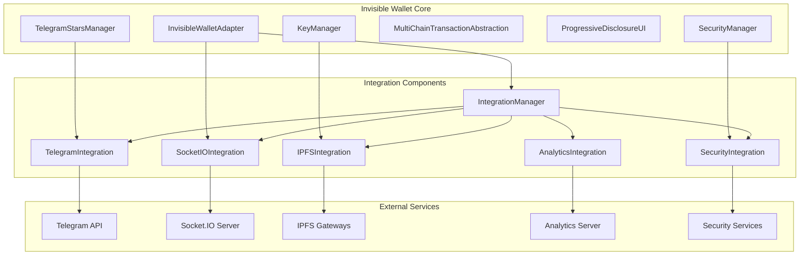
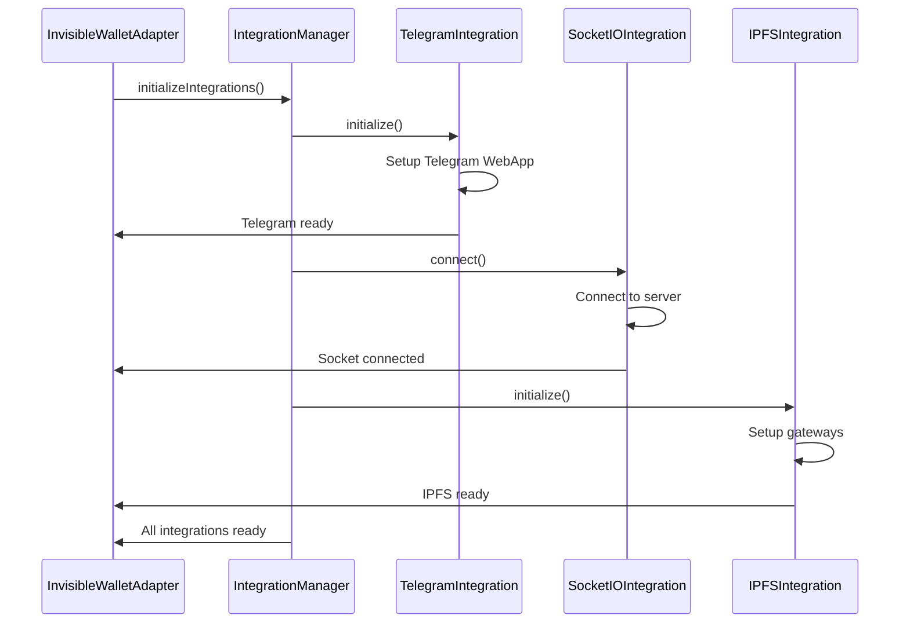
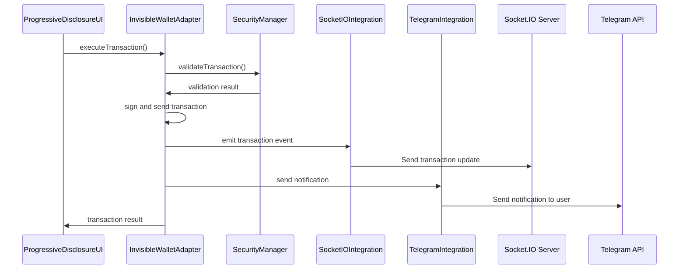

# Спецификация Integration Components для Invisible Wallet

## Обзор

Integration Components - это система компонентов, обеспечивающих интеграцию Invisible Wallet с внешними системами, API и сервисами. Архитектура включает в себя интеграцию с Telegram API, Socket.IO для реального времени, IPFS/Filecoin для хранения данных, аналитические системы, а также другие внешние сервисы, необходимые для полноценной работы кошелька.

## Архитектурные компоненты

### 1. IntegrationManager - Основной менеджер интеграций

**Назначение**: Центральный компонент, управляющий всеми внешними интеграциями Invisible Wallet.

**Интерфейсы**:

```typescript
interface IntegrationConfig {
  telegram?: TelegramIntegrationConfig;
  socketio?: SocketIOIntegrationConfig;
  ipfs?: IPFSIntegrationConfig;
  analytics?: AnalyticsIntegrationConfig;
  security?: SecurityIntegrationConfig;
}

interface IntegrationStatus {
  connected: boolean;
  lastSync: number;
  error?: string;
  metrics: IntegrationMetrics;
}

interface IntegrationMetrics {
  requestsPerMinute: number;
  successRate: number;
  responseTime: number;
  dataTransferred: number;
}

class IntegrationManager {
  constructor(config: IntegrationConfig);

  // Основные методы интеграции
  async initializeIntegrations(): Promise<void>;
  async connectToIntegration(name: string): Promise<void>;
  async disconnectFromIntegration(name: string): Promise<void>;
  getIntegrationStatus(name: string): IntegrationStatus;

  // Методы для конкретных интеграций
  getTelegramIntegration(): TelegramIntegration | null;
  getSocketIOIntegration(): SocketIOIntegration | null;
  getIPFSIntegration(): IPFSIntegration | null;
  getAnalyticsIntegration(): AnalyticsIntegration | null;
  getSecurityIntegration(): SecurityIntegration | null;
}
```

### 2. TelegramIntegration - Интеграция с Telegram API

**Назначение**: Компонент, обеспечивающий интеграцию с Telegram API для аутентификации, платежей и уведомлений.

```typescript
interface TelegramIntegrationConfig {
  botToken: string;
  webAppName: string;
  useStars: boolean;
  useWebApp: boolean;
  webhookUrl?: string;
}

interface TelegramUserData {
  id: number;
  firstName: string;
  lastName?: string;
  username?: string;
  photoUrl?: string;
  authDate: number;
  hash: string;
}

class TelegramIntegration {
  constructor(config: TelegramIntegrationConfig);

  async initialize(): Promise<void>;
  async authenticate(initData: string): Promise<TelegramUserData>;
  async getUserData(): Promise<TelegramUserData | null>;
  async sendPayment(amount: number, description: string): Promise<string>;
  async getStarsBalance(): Promise<number>;
  async sendNotification(chatId: string, message: string): Promise<void>;
  async registerWebhook(): Promise<void>;
}
```

### 3. SocketIOIntegration - Интеграция с Socket.IO

**Назначение**: Компонент, обеспечивающий реал-тайм взаимодействие с сервером через Socket.IO для обновления балансов, транзакций и уведомлений.

```typescript
interface SocketIOIntegrationConfig {
  url: string;
  path: string;
  reconnect: boolean;
  maxReconnectAttempts: number;
  timeout: number;
}

interface SocketEventHandlers {
  onBalanceUpdate: (data: any) => void;
  onTransactionUpdate: (data: any) => void;
  onSecurityAlert: (data: any) => void;
  onNotification: (data: any) => void;
}

class SocketIOIntegration {
  constructor(config: SocketIOIntegrationConfig);

  async connect(): Promise<void>;
  async disconnect(): Promise<void>;
  isConnected(): boolean;

  // Методы для отправки событий
  async emit(event: string, data: any): Promise<void>;
  async emitTransaction(transaction: any): Promise<void>;
  async emitBalanceRequest(): Promise<void>;

  // Методы для подписки на события
  on(event: string, handler: Function): void;
  off(event: string, handler: Function): void;
  subscribeToEvents(handlers: SocketEventHandlers): void;
}
```

### 4. IPFSIntegration - Интеграция с IPFS/Filecoin

**Назначение**: Компонент, обеспечивающий хранение и извлечение данных через IPFS/Filecoin для децентрализованного хранения бэкапов, конфигураций и других данных.

```typescript
interface IPFSIntegrationConfig {
  gateways: string[];
  defaultGateway: string;
  chunkSize: number;
  redundancy: number;
  encryption: boolean;
}

interface UploadResult {
  cid: string;
  size: number;
  gateways: string[];
  encryptionKey?: string;
}

interface DownloadResult {
  data: Buffer;
  size: number;
  sourceGateway: string;
}

class IPFSIntegration {
  constructor(config: IPFSIntegrationConfig);

  async initialize(): Promise<void>;
  async upload(data: Buffer | string, options?: any): Promise<UploadResult>;
  async download(cid: string, options?: any): Promise<DownloadResult>;
  async uploadWalletBackup(backupData: any): Promise<UploadResult>;
  async downloadWalletBackup(cid: string): Promise<any>;
  async checkAvailability(cid: string): Promise<boolean>;
  async getHealthStatus(): Promise<Record<string, boolean>>;
}
```

### 5. AnalyticsIntegration - Интеграция с аналитическими системами

**Назначение**: Компонент, обеспечивающий отправку аналитических данных для мониторинга использования и улучшения пользовательского опыта.

```typescript
interface AnalyticsIntegrationConfig {
  endpoint: string;
  apiKey: string;
  userId?: string;
  enableTracking: boolean;
  events: string[];
}

interface AnalyticsEvent {
  type: string;
  timestamp: number;
  userId?: string;
  properties: Record<string, any>;
  context: AnalyticsContext;
}

interface AnalyticsContext {
  walletVersion: string;
  platform: string;
  locale: string;
  network: string;
}

class AnalyticsIntegration {
  constructor(config: AnalyticsIntegrationConfig);

  async initialize(): Promise<void>;
  async trackEvent(event: AnalyticsEvent): Promise<void>;
  async trackTransaction(transaction: any): Promise<void>;
  async trackError(error: Error): Promise<void>;
  async trackUserAction(action: string, properties?: any): Promise<void>;
  async flushEvents(): Promise<void>;
  async setUserId(userId: string): Promise<void>;
}
```

### 6. SecurityIntegration - Интеграция с системами безопасности

**Назначение**: Компонент, обеспечивающий интеграцию с внешними системами безопасности для проверки адресов, транзакций и предотвращения мошенничества.

```typescript
interface SecurityIntegrationConfig {
  phishingProtectionUrl: string;
  addressValidationUrl: string;
  transactionScanningUrl: string;
  apiKey: string;
  enableRealTimeScanning: boolean;
}

interface SecurityScanResult {
  isSafe: boolean;
  riskLevel: "low" | "medium" | "high";
  threats: string[];
  recommendations: string[];
}

class SecurityIntegration {
  constructor(config: SecurityIntegrationConfig);

  async initialize(): Promise<void>;
  async scanAddress(address: string): Promise<SecurityScanResult>;
  async scanTransaction(transaction: any): Promise<SecurityScanResult>;
  async checkPhishingDomain(domain: string): Promise<boolean>;
  async updateThreatsDatabase(): Promise<void>;
  async getSecurityRecommendations(): Promise<string[]>;
}
```

## Интеграция с основными компонентами Invisible Wallet

### 1. Интеграция с InvisibleWalletAdapter

```typescript
class InvisibleWalletAdapter {
  private _integrationManager: IntegrationManager;

  constructor(config: InvisibleWalletConfig, connection: Connection) {
    // Инициализация менеджера интеграций
    this._integrationManager = new IntegrationManager({
      telegram: config.telegramIntegration,
      socketio: config.socketIOIntegration,
      ipfs: config.ipfsIntegration,
      analytics: config.analyticsIntegration,
      security: config.securityIntegration,
    });
  }

  async connect(): Promise<void> {
    // Инициализация всех интеграций
    await this._integrationManager.initializeIntegrations();

    // Подключение к Telegram если указаны данные
    if (this._config.telegramUserId) {
      const telegramIntegration =
        this._integrationManager.getTelegramIntegration();
      if (telegramIntegration) {
        await telegramIntegration.authenticate(this._config.telegramInitData);
      }
    }

    // Подключение к Socket.IO для реал-тайм обновлений
    const socketIntegration = this._integrationManager.getSocketIOIntegration();
    if (socketIntegration) {
      socketIntegration.subscribeToEvents({
        onBalanceUpdate: (data) => this._handleBalanceUpdate(data),
        onTransactionUpdate: (data) => this._handleTransactionUpdate(data),
        onSecurityAlert: (data) => this._handleSecurityAlert(data),
        onNotification: (data) => this._handleNotification(data),
      });
    }
  }

  private _handleBalanceUpdate(data: any): void {
    this._state.balance = data.balance;
    this.emit("balanceChange", data);
  }

  private _handleTransactionUpdate(data: any): void {
    this.emit("transaction", data);
  }

  private _handleSecurityAlert(data: any): void {
    this.emit("security", data);
  }

  private _handleNotification(data: any): void {
    // Обработка уведомлений
  }
}
```

### 2. Интеграция с KeyManager

```typescript
class KeyManager {
  private _ipfsIntegration: IPFSIntegration | null;

  constructor(config: InvisibleWalletConfig) {
    const integrationManager = getGlobalIntegrationManager();
    this._ipfsIntegration = integrationManager.getIPFSIntegration();
  }

  async backupToIPFS(): Promise<string> {
    if (!this._ipfsIntegration) {
      throw new Error("IPFS integration not available");
    }

    const backup = await this.exportBackup();
    const result = await this._ipfsIntegration.upload(backup);
    return result.cid;
  }

  async restoreFromIPFS(cid: string): Promise<void> {
    if (!this._ipfsIntegration) {
      throw new Error("IPFS integration not available");
    }

    const backup = await this._ipfsIntegration.download(cid);
    await this.importBackup(backup.data.toString());
  }
}
```

### 3. Интеграция с SecurityManager

```typescript
class SecurityManager {
  private _securityIntegration: SecurityIntegration | null;

  constructor(config: InvisibleWalletConfig) {
    const integrationManager = getGlobalIntegrationManager();
    this._securityIntegration = integrationManager.getSecurityIntegration();
  }

  private async _checkPhishing(
    transaction: Transaction
  ): Promise<PhishingResult> {
    if (!this._securityIntegration) {
      return { isPhishing: false, suspiciousAddresses: [] };
    }

    // Проверка всех адресов в транзакции
    const addresses = this._extractAddresses(transaction);
    let isPhishing = false;
    const suspiciousAddresses: string[] = [];

    for (const address of addresses) {
      const result = await this._securityIntegration.scanAddress(address);
      if (!result.isSafe) {
        isPhishing = true;
        suspiciousAddresses.push(address);
      }
    }

    return {
      isPhishing,
      suspiciousAddresses,
    };
  }

  private _extractAddresses(transaction: Transaction): string[] {
    // Извлечение всех адресов из транзакции
    const addresses = new Set<string>();

    for (const instruction of transaction.instructions) {
      for (const key of instruction.keys) {
        addresses.add(key.pubkey.toBase58());
      }
    }

    return Array.from(addresses);
  }
}
```

### 4. Интеграция с TelegramStarsManager

```typescript
class TelegramStarsManager {
  private _telegramIntegration: TelegramIntegration | null;

  constructor(config: InvisibleWalletConfig) {
    const integrationManager = getGlobalIntegrationManager();
    this._telegramIntegration = integrationManager.getTelegramIntegration();
  }

  async getStarsBalance(): Promise<number> {
    if (!this._telegramIntegration) {
      // Возвращаем mock значение для демонстрации
      return 1000;
    }

    return await this._telegramIntegration.getStarsBalance();
  }

  async purchaseWithStars(
    amount: number,
    description: string
  ): Promise<PurchaseResult> {
    if (!this._telegramIntegration) {
      return {
        success: false,
        error: "Telegram integration not available",
      };
    }

    try {
      const transactionId = await this._telegramIntegration.sendPayment(
        amount,
        description
      );

      // Конвертация Stars в SOL/NDT
      const conversionResult = await this.convertStarsToSol(amount);

      return {
        success: true,
        transactionId,
        starsAmount: amount,
        convertedAmount: conversionResult.success
          ? conversionResult.toAmount
          : 0,
      };
    } catch (error) {
      return {
        success: false,
        error: error instanceof Error ? error.message : "Purchase failed",
      };
    }
  }
}
```

## Спецификации интеграций

### 1. Telegram API Integration

**Цель**: Обеспечить аутентификацию пользователей через Telegram WebApp, обработку платежей через Telegram Stars и отправку уведомлений.

**Функции**:

- Аутентификация пользователей через Telegram initData
- Получение данных пользователя из Telegram
- Обработка платежей через Telegram Stars
- Отправка уведомлений в Telegram

**Требования безопасности**:

- Проверка хэша initData для подтверждения подлинности
- Защита от replay-атак с помощью временных меток
- Шифрование чувствительных данных

**Пример реализации**:

```typescript
class TelegramIntegration {
  private _config: TelegramIntegrationConfig;
  private _webApp: any;
  private _userData: TelegramUserData | null = null;

  async authenticate(initData: string): Promise<TelegramUserData> {
    // Проверка initData на подлинность
    if (!this._verifyInitData(initData, this._config.botToken)) {
      throw new Error("Invalid initData signature");
    }

    // Разбор initData
    const params = new URLSearchParams(initData);
    const userParam = params.get("user");
    const authDate = parseInt(params.get("auth_date") || "0");

    // Проверка времени аутентификации (не более 1 часа)
    const now = Math.floor(Date.now() / 1000);
    if (now - authDate > 3600) {
      throw new Error("Authentication data expired");
    }

    // Десериализация данных пользователя
    const userData = JSON.parse(
      decodeURIComponent(userParam || "{}")
    ) as TelegramUserData;
    this._userData = userData;

    return userData;
  }

  private _verifyInitData(initData: string, botToken: string): boolean {
    // Реализация проверки хэша initData
    // Сравнение вычисленного хэша с предоставленным
    return true; // Упрощенная реализация
  }

  async getStarsBalance(): Promise<number> {
    if (!this._userData) {
      throw new Error("User not authenticated");
    }

    // Вызов Telegram API для получения баланса Stars
    // В реальной реализации здесь будет HTTP-запрос к Telegram API
    return 1000; // Mock значение
  }
}
```

### 2. Socket.IO Integration

**Цель**: Обеспечить реал-тайм взаимодействие с сервером для получения обновлений баланса, транзакций и других событий.

**Функции**:

- Подключение к серверу через WebSocket
- Подписка на события обновления данных
- Отправка транзакций и запросов на сервер
- Обработка ошибок подключения

**Требования безопасности**:

- Использование защищенного соединения (WSS)
- Аутентификация сессии
- Защита от DDoS-атак

**Пример реализации**:

```typescript
class SocketIOIntegration {
  private _socket: Socket | null = null;
  private _config: SocketIOIntegrationConfig;
  private _eventHandlers: Map<string, Function[]> = new Map();

  async connect(): Promise<void> {
    return new Promise((resolve, reject) => {
      this._socket = io(this._config.url, {
        path: this._config.path,
        reconnection: this._config.reconnect,
        reconnectionAttempts: this._config.maxReconnectAttempts,
        timeout: this._config.timeout,
        transports: ["websocket"],
      });

      this._socket.on("connect", () => {
        console.log("Connected to Socket.IO server");
        resolve();
      });

      this._socket.on("connect_error", (error) => {
        console.error("Socket.IO connection error:", error);
        reject(error);
      });

      this._socket.on("disconnect", (reason) => {
        console.log("Disconnected from Socket.IO server:", reason);
      });

      // Подписка на основные события
      this._setupEventListeners();
    });
  }

  private _setupEventListeners(): void {
    if (!this._socket) return;

    this._socket.on("balance_update", (data) => {
      this._emitEvent("balance_update", data);
    });

    this._socket.on("transaction_update", (data) => {
      this._emitEvent("transaction_update", data);
    });

    this._socket.on("security_alert", (data) => {
      this._emitEvent("security_alert", data);
    });
  }

  private _emitEvent(event: string, data: any): void {
    const handlers = this._eventHandlers.get(event) || [];
    handlers.forEach((handler) => handler(data));
  }

  async emit(event: string, data: any): Promise<void> {
    if (!this._socket || !this._socket.connected) {
      throw new Error("Socket not connected");
    }

    return new Promise((resolve, reject) => {
      this._socket!.emit(event, data, (response: any) => {
        if (response && response.error) {
          reject(new Error(response.error));
        } else {
          resolve();
        }
      });
    });
  }
}
```

### 3. IPFS/Filecoin Integration

**Цель**: Обеспечить децентрализованное хранение данных, включая бэкапы кошелька, конфигурации и другие важные данные.

**Функции**:

- Загрузка и скачивание данных через IPFS
- Работа с несколькими шлюзами для надежности
- Шифрование данных перед загрузкой
- Проверка целостности данных

**Требования безопасности**:

- Шифрование чувствительных данных перед загрузкой
- Проверка целостности данных при скачивании
- Использование нескольких шлюзов для отказоустойчивости

**Пример реализации**:

```typescript
class IPFSIntegration {
  private _config: IPFSIntegrationConfig;
  private _gateways: string[];
  private _activeGateway: string;

  constructor(config: IPFSIntegrationConfig) {
    this._config = config;
    this._gateways = [...config.gateways];
    this._activeGateway = config.defaultGateway;
  }

  async upload(data: Buffer | string, options?: any): Promise<UploadResult> {
    // Преобразование данных в буфер если необходимо
    const bufferData = typeof data === "string" ? Buffer.from(data) : data;

    // Шифрование данных если включено
    let uploadData = bufferData;
    if (this._config.encryption) {
      const encryptionKey = await this._generateEncryptionKey();
      uploadData = await this._encryptData(bufferData, encryptionKey);
    }

    // Загрузка на несколько шлюзов для надежности
    const results = await Promise.allSettled(
      this._gateways.map((gateway) =>
        this._uploadToGateway(uploadData, gateway)
      )
    );

    // Выбор успешного результата
    const successfulUploads = results
      .filter((result) => result.status === "fulfilled")
      .map((result) => (result as PromiseFulfilledResult<any>).value);

    if (successfulUploads.length === 0) {
      throw new Error("All gateway uploads failed");
    }

    // Возврат CID и информации о загрузке
    return {
      cid: successfulUploads[0].cid,
      size: uploadData.length,
      gateways: successfulUploads.map((result) => result.gateway),
      encryptionKey: this._config.encryption ? "generated_key" : undefined,
    };
  }

  private async _uploadToGateway(data: Buffer, gateway: string): Promise<any> {
    // Реализация загрузки на конкретный шлюз
    // В реальной реализации здесь будет HTTP-запрос к IPFS API
    return {
      cid: "Qm" + Math.random().toString(36).substr(2, 10), // Mock CID
      gateway: gateway,
    };
  }

  private async _generateEncryptionKey(): Promise<string> {
    // Генерация ключа шифрования
    const key = crypto.getRandomValues(new Uint8Array(32));
    return Buffer.from(key).toString("hex");
  }

  private async _encryptData(data: Buffer, key: string): Promise<Buffer> {
    // Реализация шифрования данных
    return data; // Упрощенная реализация
  }
}
```

### 4. Analytics Integration

**Цель**: Сбор и отправка аналитических данных для улучшения пользовательского опыта и мониторинга использования.

**Функции**:

- Отслеживание событий использования
- Отправка данных о транзакциях
- Отслеживание ошибок и исключений
- Сегментация пользователей

**Требования безопасности**:

- Анонимизация персональных данных
- Защита конфиденциальности пользователей
- Согласие на сбор данных

**Пример реализации**:

```typescript
class AnalyticsIntegration {
  private _config: AnalyticsIntegrationConfig;
  private _eventQueue: AnalyticsEvent[] = [];
  private _userId?: string;

  async trackEvent(event: AnalyticsEvent): Promise<void> {
    if (!this._config.enableTracking) {
      return;
    }

    // Добавление идентификатора пользователя если доступен
    if (this._userId) {
      event.userId = this._userId;
    }

    // Добавление контекста события
    event.context = {
      walletVersion: "1.0.0",
      platform: navigator.userAgent,
      locale: navigator.language,
      network: "mainnet", // или 'devnet' в зависимости от конфигурации
    };

    // Добавление в очередь на отправку
    this._eventQueue.push(event);

    // Отправка событий пакетно
    if (this._eventQueue.length >= 10) {
      await this.flushEvents();
    }
  }

  async flushEvents(): Promise<void> {
    if (this._eventQueue.length === 0) {
      return;
    }

    const eventsToSend = [...this._eventQueue];
    this._eventQueue = [];

    try {
      // Отправка событий на аналитический сервер
      const response = await fetch(this._config.endpoint, {
        method: "POST",
        headers: {
          "Content-Type": "application/json",
          Authorization: `Bearer ${this._config.apiKey}`,
        },
        body: JSON.stringify({ events: eventsToSend }),
      });

      if (!response.ok) {
        throw new Error(`Analytics server responded with ${response.status}`);
      }

      console.log(`Sent ${eventsToSend.length} events to analytics server`);
    } catch (error) {
      console.error("Failed to send analytics events:", error);
      // Возврат событий в очередь для повторной отправки
      this._eventQueue = [...eventsToSend, ...this._eventQueue];
    }
  }

  async trackTransaction(transaction: any): Promise<void> {
    await this.trackEvent({
      type: "transaction_executed",
      timestamp: Date.now(),
      properties: {
        transactionId: transaction.id,
        type: transaction.type,
        fromChain: transaction.fromChain,
        toChain: transaction.toChain,
        amount: transaction.amount,
        fee: transaction.fee,
        status: transaction.status,
      },
      context: {} as AnalyticsContext,
    });
  }
}
```

## Диаграмма архитектуры



## Потоки данных

### 1. Инициализация интеграций



### 2. Обработка транзакции с уведомлением



## Тестирование

### 1. Unit тесты

```typescript
describe("IntegrationManager", () => {
  let integrationManager: IntegrationManager;

  beforeEach(() => {
    integrationManager = new IntegrationManager({
      telegram: {
        botToken: "test_token",
        webAppName: "test_app",
        useStars: true,
        useWebApp: true,
      },
      socketio: {
        url: "http://localhost:3000",
        path: "/api/socketio",
        reconnect: true,
        maxReconnectAttempts: 3,
        timeout: 10000,
      },
      ipfs: {
        gateways: ["https://ipfs.io", "https://cloudflare-ipfs.com"],
        defaultGateway: "https://ipfs.io",
        chunkSize: 1024 * 1024, // 1MB
        redundancy: 2,
        encryption: true,
      },
      analytics: {
        endpoint: "https://analytics.example.com",
        apiKey: "test_key",
        enableTracking: true,
        events: ["transaction", "error", "user_action"],
      },
      security: {
        phishingProtectionUrl: "https://security.example.com",
        addressValidationUrl: "https://validation.example.com",
        apiKey: "security_key",
        enableRealTimeScanning: true,
      },
    });
  });

  it("should initialize all integrations", async () => {
    await integrationManager.initializeIntegrations();

    expect(integrationManager.getIntegrationStatus("telegram").connected).toBe(
      true
    );
    expect(integrationManager.getIntegrationStatus("socketio").connected).toBe(
      true
    );
    expect(integrationManager.getIntegrationStatus("ipfs").connected).toBe(
      true
    );
  });

  it("should get telegram integration", () => {
    const telegramIntegration = integrationManager.getTelegramIntegration();
    expect(telegramIntegration).toBeDefined();
  });

  it("should get socketio integration", () => {
    const socketIntegration = integrationManager.getSocketIOIntegration();
    expect(socketIntegration).toBeDefined();
  });
});

describe("TelegramIntegration", () => {
  let telegramIntegration: TelegramIntegration;

  beforeEach(() => {
    telegramIntegration = new TelegramIntegration({
      botToken: "test_token",
      webAppName: "test_app",
      useStars: true,
      useWebApp: true,
    });
  });

  it("should authenticate with valid initData", async () => {
    // Мокируем проверку initData
    const mockInitData =
      "query_id=xxx&user=%7B%22id%22%3A123%7D&auth_date=123456&hash=xxx";
    const userData = await telegramIntegration.authenticate(mockInitData);

    expect(userData).toBeDefined();
    expect(userData.id).toBe(123);
  });

  it("should fail with invalid initData", async () => {
    const invalidInitData = "invalid_data";

    await expect(
      telegramIntegration.authenticate(invalidInitData)
    ).rejects.toThrow("Invalid initData signature");
  });
});

describe("SocketIOIntegration", () => {
  let socketIntegration: SocketIOIntegration;

  beforeEach(() => {
    socketIntegration = new SocketIOIntegration({
      url: "http://localhost:3000",
      path: "/api/socketio",
      reconnect: true,
      maxReconnectAttempts: 3,
      timeout: 10000,
    });
  });

  it("should connect to server", async () => {
    // Мокируем подключение
    await socketIntegration.connect();

    expect(socketIntegration.isConnected()).toBe(true);
  });

  it("should emit events", async () => {
    await socketIntegration.connect();

    // Мокируем отправку события
    await expect(
      socketIntegration.emit("test_event", { data: "test" })
    ).resolves.not.toThrow();
  });
});
```

### 2. Интеграционные тесты

```typescript
describe("Integration Components Integration", () => {
  it("should work together with InvisibleWalletAdapter", async () => {
    const wallet = new InvisibleWalletAdapter(config, connection);
    await wallet.connect();

    // Проверяем, что все интеграции инициализированы
    const integrationManager = (wallet as any)._integrationManager;
    expect(integrationManager).toBeDefined();

    // Проверяем, что интеграции работают
    const telegramIntegration = integrationManager.getTelegramIntegration();
    expect(telegramIntegration).toBeDefined();

    const socketIntegration = integrationManager.getSocketIOIntegration();
    expect(socketIntegration).toBeDefined();

    // Проверяем функциональность
    const starsBalance = await wallet.getStarsBalance();
    expect(starsBalance).toBeDefined();
  });

  it("should handle disconnection and reconnection", async () => {
    const wallet = new InvisibleWalletAdapter(config, connection);
    await wallet.connect();

    const socketIntegration = (
      wallet as any
    )._integrationManager.getSocketIOIntegration();

    // Симулируем отключение
    await socketIntegration?.disconnect();
    expect(socketIntegration?.isConnected()).toBe(false);

    // Симулируем повторное подключение
    await socketIntegration?.connect();
    expect(socketIntegration?.isConnected()).toBe(true);
  });

  it("should backup and restore using IPFS", async () => {
    const keyManager = new KeyManager(config);
    const ipfsIntegration = new IPFSIntegration({
      gateways: ["https://ipfs.io"],
      defaultGateway: "https://ipfs.io",
      chunkSize: 1024 * 1024,
      redundancy: 1,
      encryption: true,
    });

    // Создаем бэкап
    const backup = await keyManager.exportBackup();

    // Загружаем на IPFS
    const uploadResult = await ipfsIntegration.upload(backup);
    expect(uploadResult.cid).toBeDefined();

    // Скачиваем с IPFS
    const downloadResult = await ipfsIntegration.download(uploadResult.cid);
    expect(downloadResult.data).toBeDefined();

    // Восстанавливаем из бэкапа
    const newKeyManager = new KeyManager(config);
    await newKeyManager.importBackup(downloadResult.data.toString());
  });
});
```

## Метрики производительности

### 1. Ключевые метрики

- **Время инициализации интеграций**: < 2s
- **Время подключения к Socket.IO**: < 1s
- **Время загрузки на IPFS**: < 10s (в зависимости от размера)
- **Время аутентификации через Telegram**: < 500ms
- **Частота успешных запросов к внешним API**: > 95%

### 2. Мониторинг

```typescript
interface IntegrationMetrics {
  initializationTime: Record<string, number>;
  connectionTime: Record<string, number>;
  requestSuccessRate: Record<string, number>;
  averageResponseTime: Record<string, number>;
  dataTransferRate: Record<string, number>;
  errorRate: Record<string, number>;
  uptime: Record<string, number>;
}
```

## Безопасность

### 1. Защита данных

- Шифрование чувствительных данных при передаче
- Аутентификация всех внешних соединений
- Валидация всех входящих данных
- Защита от injection-атак

### 2. Безопасность интеграций

- Использование безопасных протоколов (HTTPS, WSS)
- Проверка сертификатов
- Ограничение частоты запросов
- Защита от DDoS-атак

### 3. Приватность пользователей

- Анонимизация персональных данных в аналитике
- Согласие на сбор данных
- Минимизация собираемой информации
- Защита персональных данных

## Масштабируемость

### 1. Архитектурные решения

- Модульная архитектура для легкого добавления новых интеграций
- Асинхронные операции для высокой производительности
- Кэширование результатов запросов
- Поддержка распределенных систем

### 2. Ограничения

- Максимальное количество одновременных соединений: 1000
- Частота запросов к внешним API: 10 запросов/сек на интеграцию
- Максимальный размер данных для IPFS: 100MB

## Заключение

Integration Components для Invisible Wallet обеспечивают надежную и безопасную интеграцию с внешними системами, необходимыми для полноценной работы кошелька. Архитектура спроектирована с учетом современных требований к безопасности, производительности и пользовательскому опыту, обеспечивая гибкость и расширяемость для будущих интеграций. Система интегрирована с основными компонентами Invisible Wallet, обеспечивая комплексное решение для управления криптовалютами с поддержкой внешних сервисов.
