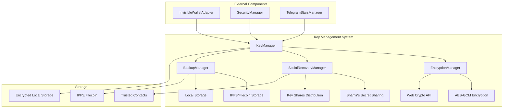
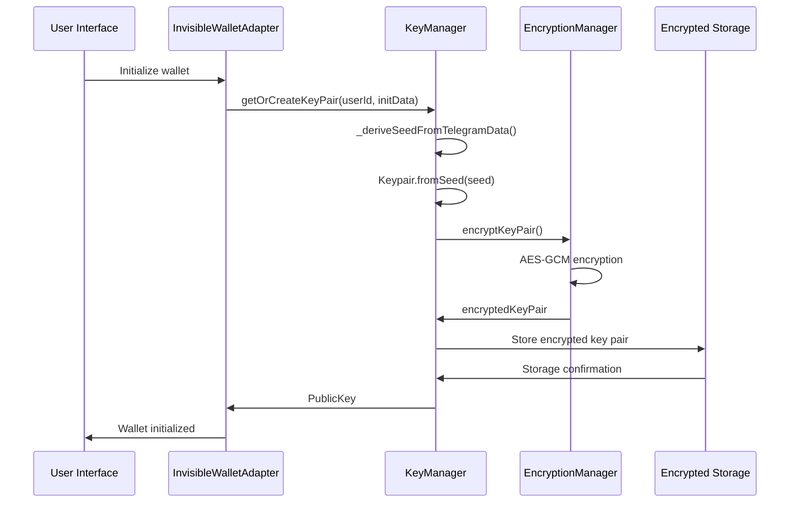
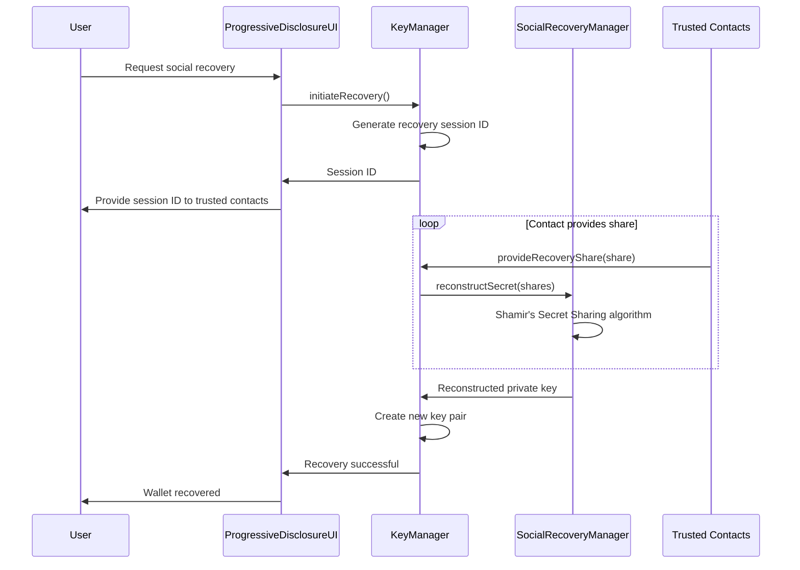

# Спецификация Key Management System для Invisible Wallet

## Обзор

Key Management System (KMS) - это критический компонент Invisible Wallet, отвечающий за безопасное создание, хранение и управление криптографическими ключами пользователей. Система реализует передовые методы защиты, включая детерминированную генерацию ключей на основе Telegram данных, AES-GCM шифрование, Shamir's Secret Sharing для социального восстановления и автоматическое резервное копирование.

## Архитектурные компоненты

### 1. KeyManager - Основной класс управления ключами

**Назначение**: Центральный компонент, обеспечивающий все операции с криптографическими ключами.

**Интерфейсы**:

```typescript
interface KeyPairData {
  publicKey: string;
  privateKey: string;
  createdAt: number;
  lastUsed: number;
}

interface KeyShare {
  id: string;
  shareData: string;
  contactId: string;
  createdAt: number;
  isUsed: boolean;
}

interface RecoveryMetadata {
  userId: string;
  threshold: number;
  totalShares: number;
  trustedContacts: string[];
  createdAt: number;
  lastBackup: number;
}

class KeyManager {
  constructor(config: InvisibleWalletConfig);

  // Основные методы
  async getOrCreateKeyPair(
    userId: string,
    initData?: string
  ): Promise<PublicKey>;
  async generateRandomKeyPair(): Promise<PublicKey>;
  async getPrivateKey(): Promise<Keypair>;

  // Методы социального восстановления
  async setupSocialRecovery(contacts: string[]): Promise<void>;
  async initiateRecovery(): Promise<string>;
  async recoverFromShares(shares: string[]): Promise<PublicKey>;

  // Методы бэкапа и восстановления
  async exportBackup(): Promise<string>;
  async importBackup(backupData: string): Promise<PublicKey>;
}
```

### 2. EncryptionManager - Менеджер шифрования

**Назначение**: Обеспечивает шифрование и дешифрование приватных ключей с использованием Web Crypto API.

```typescript
class EncryptionManager {
  private _encryptionKey: CryptoKey | null;

  async getEncryptionKey(): Promise<CryptoKey>;
  async encryptKeyPair(keyPair: KeyPairData): Promise<string>;
  async decryptKeyPair(encryptedData: string): Promise<KeyPairData>;
  private deriveKeyFromTelegramData(initData: string): Promise<Uint8Array>;
}
```

### 3. SocialRecoveryManager - Менеджер социального восстановления

**Назначение**: Реализует Shamir's Secret Sharing для распределенного хранения ключей среди доверенных контактов.

```typescript
class SocialRecoveryManager {
  private _secretShares: KeyShare[];
  private _recoveryMetadata: RecoveryMetadata;

  async createSecretShares(
    secret: string,
    totalShares: number,
    threshold: number
  ): Promise<string[]>;
  async reconstructSecret(shares: string[]): Promise<string>;
  async storeKeyShares(shares: KeyShare[]): Promise<void>;
  async retrieveKeyShares(userId: string): Promise<KeyShare[]>;
}
```

## Ключевые функции

### 1. Детерминированная генерация ключей

Система использует данные Telegram (userId и initData) для детерминированной генерации ключевой пары, что позволяет пользователю восстановить доступ к кошельку без хранения приватного ключа.

```typescript
async _generateKeyPair(userId: string, initData?: string): Promise<KeyPairData> {
  let keyPair: Keypair;

  if (initData) {
    // Использование Telegram данных для детерминированной генерации
    const seed = await this._deriveSeedFromTelegramData(userId, initData);
    keyPair = Keypair.fromSeed(seed);
  } else {
    // Генерация случайной ключевой пары
    keyPair = Keypair.generate();
  }

  return {
    publicKey: keyPair.publicKey.toBase58(),
    privateKey: Buffer.from(keyPair.secretKey).toString("base64"),
    createdAt: Date.now(),
    lastUsed: Date.now(),
  };
}

private async _deriveSeedFromTelegramData(userId: string, initData: string): Promise<Uint8Array> {
  const encoder = new TextEncoder();
  const data = encoder.encode(`${userId}:${initData}`);

  const hash = await crypto.subtle.digest("SHA-256", data);
  return new Uint8Array(hash.slice(0, 32)); // Первые 32 байта для seed
}
```

### 2. AES-GCM шифрование

Приватные ключи шифруются с использованием AES-GCM с 256-битным ключом и 96-битным IV:

```typescript
private async _encryptKeyPair(keyPair: KeyPairData): Promise<string> {
  const encryptionKey = await this._getEncryptionKey();
  const encoder = new TextEncoder();
  const data = encoder.encode(JSON.stringify(keyPair));

  const iv = crypto.getRandomValues(new Uint8Array(12));
  const encrypted = await crypto.subtle.encrypt(
    {
      name: "AES-GCM",
      iv,
    },
    encryptionKey,
    data
  );

  return JSON.stringify({
    encrypted: Array.from(new Uint8Array(encrypted)),
    iv: Array.from(iv),
  });
}

private async _decryptKeyPair(encryptedData: string): Promise<KeyPairData> {
 const encryptionKey = await this._getEncryptionKey();
  const parsed = JSON.parse(encryptedData);

  const decrypted = await crypto.subtle.decrypt(
    {
      name: "AES-GCM",
      iv: new Uint8Array(parsed.iv),
    },
    encryptionKey,
    new Uint8Array(parsed.encrypted)
  );

  const decoder = new TextDecoder();
  const keyPairData = JSON.parse(decoder.decode(decrypted));
  return keyPairData;
}
```

### 3. Shamir's Secret Sharing

Реализация социального восстановления с использованием Shamir's Secret Sharing:

```typescript
async setupSocialRecovery(contacts: string[]): Promise<void> {
  const userId = this._config.telegramUserId || "default";
  const keyPairData = await this._retrieveKeyPair(userId);

  if (!keyPairData) {
    throw new Error("No key pair found for social recovery setup");
  }

 // Создание shares с помощью Shamir's Secret Sharing
 const shares = await this._createSecretShares(
    keyPairData.privateKey,
    contacts.length,
    Math.ceil(contacts.length * 0.6) // 60% threshold
  );

  // Распределение shares контактам
  const keyShares: KeyShare[] = [];
  for (let i = 0; i < contacts.length && i < shares.length; i++) {
    keyShares.push({
      id: `share_${i}`,
      shareData: shares[i],
      contactId: contacts[i],
      createdAt: Date.now(),
      isUsed: false,
    });
  }

 // Сохранение метаданных восстановления
  const recoveryMetadata: RecoveryMetadata = {
    userId,
    threshold: Math.ceil(contacts.length * 0.6),
    totalShares: contacts.length,
    trustedContacts: contacts,
    createdAt: Date.now(),
    lastBackup: Date.now(),
  };

  await this._storeRecoveryMetadata(recoveryMetadata);
  await this._storeKeyShares(keyShares);
}
```

## Безопасность

### 1. Защита от кражи ключей

- Приватные ключи никогда не хранятся в открытом виде
- Использование Web Crypto API для криптографических операций
- Изоляция ключей в защищенном контексте браузера

### 2. Защита от утери ключей

- Социальное восстановление через Shamir's Secret Sharing
- Автоматическое резервное копирование на IPFS/Filecoin
- Многоуровневая система бэкапов

### 3. Защита от несанкционированного доступа

- Биометрическая аутентификация для доступа к ключам
- Сессионное управление с device fingerprinting
- Ограничение количества попыток доступа

## Интеграция с другими компонентами

### 1. Интеграция с InvisibleWalletAdapter

```typescript
class InvisibleWalletAdapter {
  private _keyManager: KeyManager;

  async connect(): Promise<void> {
    // Инициализация ключевой пары
    await this._initializeKeyPair();
  }

  private async _initializeKeyPair(): Promise<void> {
    if (this._config.telegramUserId) {
      this._publicKey = await this._keyManager.getOrCreateKeyPair(
        this._config.telegramUserId,
        this._config.telegramInitData
      );
    } else {
      this._publicKey = await this._keyManager.generateRandomKeyPair();
    }

    this._state.publicKey = this._publicKey;
  }

  async signTransaction(transaction: Transaction): Promise<Transaction> {
    // Получение приватного ключа для подписи
    const privateKey = await this._keyManager.getPrivateKey();
    transaction.sign(privateKey);
    return transaction;
  }
}
```

### 2. Интеграция с SecurityManager

```typescript
class SecurityManager {
  async validateTransaction(
    transaction: Transaction,
    userId: string
  ): Promise<boolean> {
    // Проверка, что транзакция подписана владельцем ключа
    return await this._verifyTransactionSignature(transaction, userId);
  }
}
```

### 3. Интеграция с TelegramStarsManager

```typescript
class TelegramStarsManager {
  async convertStarsToSol(starsAmount: number): Promise<ConversionResult> {
    // Использование ключей для подписи транзакции конвертации
    const keyPair = await this._keyManager.getPrivateKey();
    // ... выполнение конвертации с использованием ключа
  }
}
```

## Диаграмма архитектуры



## Потоки данных

### 1. Создание ключевой пары



### 2. Восстановление через социальное восстановление



## Тестирование

### 1. Unit тесты

```typescript
describe("KeyManager", () => {
  let keyManager: KeyManager;

  beforeEach(() => {
    keyManager = new KeyManager(mockConfig);
  });

  describe("getOrCreateKeyPair", () => {
    it("should generate deterministic key pair from Telegram data", async () => {
      const key1 = await keyManager.getOrCreateKeyPair("user1", "initData1");
      const key2 = await keyManager.getOrCreateKeyPair("user1", "initData1");

      expect(key1.toBase58()).toBe(key2.toBase58());
    });

    it("should encrypt and decrypt private key correctly", async () => {
      const keyPair = await keyManager.generateRandomKeyPair();
      const privateKey = await keyManager.getPrivateKey();

      expect(privateKey.publicKey.toBase58()).toBe(keyPair.toBase58());
    });
  });

  describe("social recovery", () => {
    it("should create and reconstruct shares correctly", async () => {
      const contacts = ["contact1", "contact2", "contact3"];
      await keyManager.setupSocialRecovery(contacts);

      // Симуляция получения shares от контактов
      const shares = await getRecoveryShares();
      const recoveredKey = await keyManager.recoverFromShares(shares);

      expect(recoveredKey).toBeDefined();
    });
  });
});
```

### 2. Интеграционные тесты

```typescript
describe("KeyManager Integration", () => {
  it("should work with InvisibleWalletAdapter", async () => {
    const wallet = new InvisibleWalletAdapter(config, connection);
    await wallet.connect();

    expect(wallet.connected).toBe(true);
    expect(wallet.publicKey).toBeDefined();

    const transaction = new Transaction();
    const signedTx = await wallet.signTransaction(transaction);

    expect(signedTx).toBeDefined();
  });

  it("should handle backup and restore", async () => {
    const keyManager = new KeyManager(config);
    const originalKey = await keyManager.generateRandomKeyPair();
    const backup = await keyManager.exportBackup();

    const newKeyManager = new KeyManager(config);
    const restoredKey = await newKeyManager.importBackup(backup);

    expect(originalKey.toBase58()).toBe(restoredKey.toBase58());
  });
});
```

## Метрики производительности

### 1. Ключевые метрики

- **Время генерации ключей**: < 100ms
- **Время шифрования/дешифрования**: < 50ms
- **Размер зашифрованных данных**: < 512 bytes
- **Время восстановления через социальное восстановление**: < 5s

### 2. Мониторинг

```typescript
interface KeyManagementMetrics {
  keyGenerationTime: number;
  encryptionTime: number;
  decryptionTime: number;
  storageSize: number;
  recoveryTime: number;
  backupSuccessRate: number;
  shareDistributionSuccessRate: number;
  reconstructionSuccessRate: number;
}
```

## Безопасность

### 1. Криптографические стандарты

- **Алгоритм шифрования**: AES-256-GCM
- **Хеширование**: SHA-256
- **Генерация случайных чисел**: Web Crypto API
- **Подпись**: Ed25519 (Solana), secp256k1 (Ethereum)

### 2. Защита от атак

- **Side-channel атаки**: Использование constant-time операций
- **Phishing**: Валидация происхождения Telegram данных
- **Replay атаки**: Использование уникальных IV для каждого шифрования
- **Brute-force**: Ограничение попыток доступа к ключам

### 3. Рекомендации по безопасности

- Минимальный порог для социального восстановления: 3 контакта
- Рекомендуемый порог: 60% от общего числа контактов
- Регулярное обновление бэкапов (ежедневно)
- Проверка достоверности доверенных контактов

## Масштабируемость

### 1. Архитектурные решения

- Модульная архитектура для легкого расширения
- Асинхронные операции для высокой производительности
- Кэширование часто используемых ключей
- Поддержка нескольких пользовательских профилей

### 2. Ограничения

- Максимальное количество доверенных контактов: 10
- Максимальный размер бэкапа: 1MB
- Частота обновления бэкапов: 1 раз в час

## Заключение

Key Management System для Invisible Wallet обеспечивает надежную, безопасную и удобную систему управления криптографическими ключами. Архитектура спроектирована с учетом современных требований к безопасности и пользовательскому опыту, обеспечивая высокий уровень защиты при минимальной сложности для пользователя. Система реализует передовые методы шифрования и восстановления, обеспечивая сохранность активов пользователей даже в случае потери доступа к устройству.
