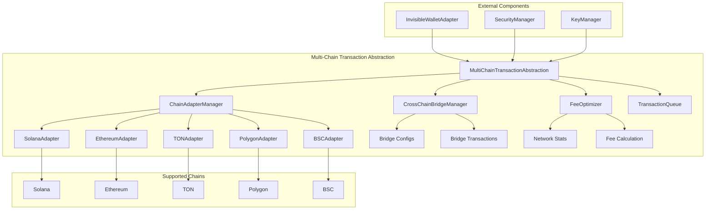
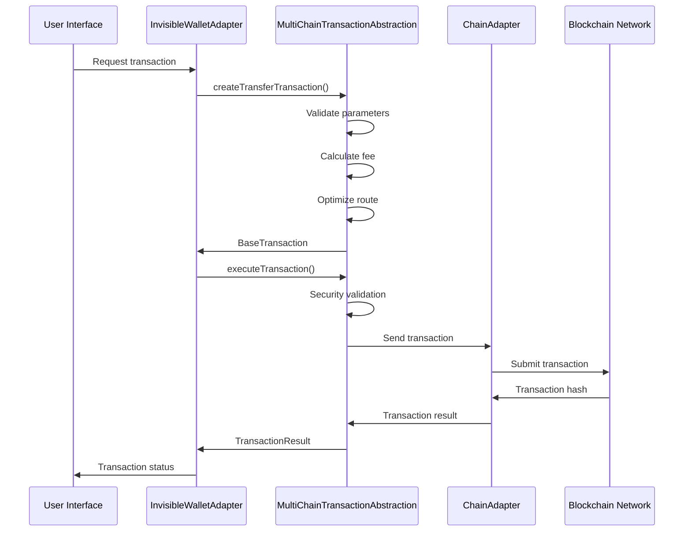
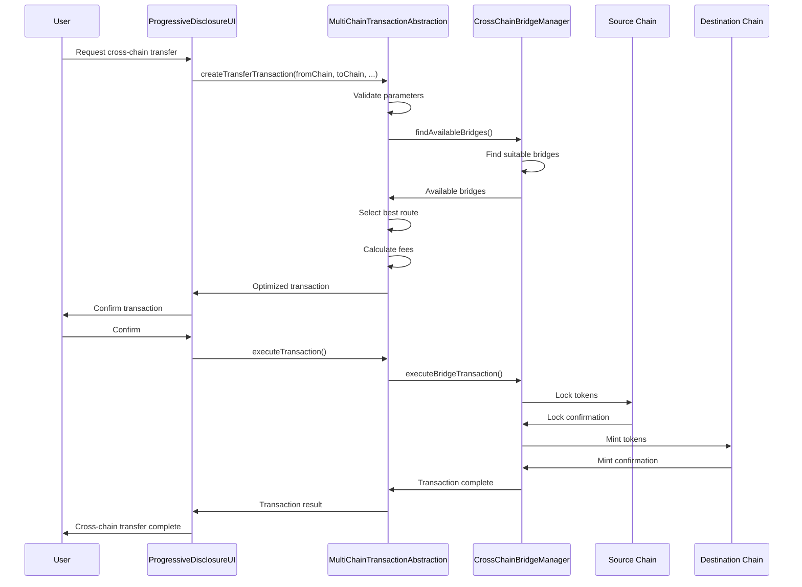

# Спецификация Multi-Chain Transaction Abstraction для Invisible Wallet

## Обзор

Multi-Chain Transaction Abstraction - это система, обеспечивающая унификацию работы с различными блокчейнами через единый интерфейс. Архитектура позволяет пользователям выполнять транзакции, свопы и другие операции на различных блокчейнах (Solana, Ethereum, TON, Polygon, BSC) без необходимости переключения между разными кошельками или понимания различий в протоколах.

## Архитектурные компоненты

### 1. MultiChainTransactionAbstraction - Основной класс абстракции

**Назначение**: Центральный компонент, обеспечивающий унификацию работы с различными блокчейнами.

**Интерфейсы**:

```typescript
type SupportedChain = "solana" | "ethereum" | "ton" | "polygon" | "bsc";
type TransactionStatus = "pending" | "confirmed" | "failed" | "expired";
type TransactionType =
  | "transfer"
  | "swap"
  | "stake"
  | "unstake"
  | "mint"
  | "burn";

interface BaseTransaction {
  id: string;
  type: TransactionType;
  fromChain: SupportedChain;
  toChain?: SupportedChain;
  from: string;
  to: string;
  amount: number;
  token?: string;
  status: TransactionStatus;
  timestamp: number;
  confirmations?: number;
  gasUsed?: number;
  gasPrice?: number;
  fee?: number;
  error?: string;
}

interface ChainConfig {
  name: string;
  chainId: number | string;
  rpcUrl: string;
  explorerUrl: string;
  nativeCurrency: string;
  blockTime: number;
  confirmationsRequired: number;
  maxFeePerTransaction: number;
  supportedTokens: string[];
}

interface TransactionResult {
  success: boolean;
  transactionId?: string;
  blockNumber?: number;
  status: TransactionStatus;
  error?: string;
  fee?: number;
}

class MultiChainTransactionAbstraction {
  constructor(config: InvisibleWalletConfig);

  // Основные методы транзакций
  async createTransferTransaction(
    fromChain: SupportedChain,
    toChain: SupportedChain,
    from: string,
    to: string,
    amount: number,
    token?: string
  ): Promise<BaseTransaction>;

  async createSwapTransaction(
    chain: SupportedChain,
    from: string,
    to: string,
    amountIn: number,
    tokenIn: string,
    tokenOut: string
  ): Promise<BaseTransaction>;

  async executeTransaction(
    transaction: BaseTransaction
  ): Promise<TransactionResult>;
  async getTransactionStatus(
    transactionId: string,
    chain: SupportedChain
  ): Promise<TransactionStatus>;

  // Методы получения информации
  async getMultiChainBalance(
    address: string
  ): Promise<Map<SupportedChain, number>>;
  async getSupportedChains(): SupportedChain[];
  getChainConfig(chain: SupportedChain): ChainConfig | undefined;

  // Методы оптимизации
  async optimizeFee(
    chain: SupportedChain,
    transactionType: TransactionType,
    urgency: "low" | "medium" | "high"
  ): Promise<{
    optimalFee: number;
    estimatedTime: number;
    confidence: number;
  }>;

  // Методы маршрутизации
  async findBestRoute(
    fromChain: SupportedChain,
    toChain: SupportedChain,
    amount: number,
    token?: string
  ): Promise<{
    route: SupportedChain[];
    estimatedFee: number;
    estimatedTime: number;
    confidence: number;
  }>;
}
```

### 2. ChainAdapterManager - Адаптеры блокчейнов

**Назначение**: Компоненты, обеспечивающие взаимодействие с конкретными блокчейнами.

```typescript
interface ChainAdapter {
  initialize(): Promise<void>;
  connect(): Promise<void>;
  disconnect(): Promise<void>;
  getBalance(address: string): Promise<number>;
  sendTransaction(transaction: any): Promise<string>;
  getTransactionStatus(txId: string): Promise<TransactionStatus>;
  estimateFee(transaction: any): Promise<number>;
  getBlockTime(): number;
}

class SolanaChainAdapter implements ChainAdapter {
  // Реализация для Solana
}

class EthereumChainAdapter implements ChainAdapter {
  // Реализация для Ethereum
}

class TonChainAdapter implements ChainAdapter {
  // Реализация для TON
}

class PolygonChainAdapter implements ChainAdapter {
  // Реализация для Polygon
}

class BscChainAdapter implements ChainAdapter {
  // Реализация для BSC
}
```

### 3. CrossChainBridgeManager - Менеджер кросс-чейн мостов

**Назначение**: Компонент, управляющий кросс-чейн мостами для перевода активов между различными блокчейнами.

```typescript
interface BridgeConfig {
  name: string;
  fromChain: SupportedChain;
  toChain: SupportedChain;
  contractAddress: string;
  fee: number;
  estimatedTime: number;
  supportedTokens: string[];
}

interface BridgeTransaction {
  id: string;
  bridge: string;
  fromChain: SupportedChain;
  toChain: SupportedChain;
  fromToken: string;
  toToken: string;
  amount: number;
  fromAddress: string;
  toAddress: string;
  status: TransactionStatus;
  timestamp: number;
}

class CrossChainBridgeManager {
  async findAvailableBridges(
    fromChain: SupportedChain,
    toChain: SupportedChain
  ): Promise<BridgeConfig[]>;
  async executeBridgeTransaction(
    bridgeTx: BridgeTransaction
  ): Promise<TransactionResult>;
  async getBridgeStatus(bridgeTxId: string): Promise<TransactionStatus>;
}
```

### 4. FeeOptimizer - Оптимизатор комиссий

**Назначение**: Компонент, оптимизирующий комиссии за транзакции на основе текущей сетевой активности.

```typescript
class FeeOptimizer {
  async calculateOptimalFee(
    chain: SupportedChain,
    transactionType: TransactionType,
    urgency: "low" | "medium" | "high"
  ): Promise<{
    optimalFee: number;
    estimatedTime: number;
    confidence: number;
  }>;

  private async getNetworkStats(chain: SupportedChain): Promise<NetworkStats>;
  private getPriorityMultiplier(urgency: "low" | "medium" | "high"): number;
  private estimateConfirmationTime(
    fee: number,
    networkStats: NetworkStats,
    chainConfig: ChainConfig
  ): number;
}

interface NetworkStats {
  baseFee: number;
  networkLoad: number;
  averageBlockTime: number;
  transactionQueue: number;
}
```

## Ключевые функции

### 1. Создание транзакции перевода

Система позволяет создавать транзакции перевода между различными блокчейнами:

```typescript
async createTransferTransaction(
  fromChain: SupportedChain,
  toChain: SupportedChain,
  from: string,
  to: string,
  amount: number,
  token?: string
): Promise<BaseTransaction> {
  try {
    const transaction: BaseTransaction = {
      id: this._generateTransactionId(),
      type: "transfer",
      fromChain,
      toChain,
      from,
      to,
      amount,
      token,
      status: "pending",
      timestamp: Date.now(),
    };

    // Валидация параметров
    await this._validateTransaction(transaction);

    // Расчет комиссии
    transaction.fee = await this._calculateFee(transaction);

    // Оптимизация маршрута
    const optimizedRoute = await this._optimizeRoute(transaction);
    if (optimizedRoute) {
      transaction.toChain = optimizedRoute.toChain;
      transaction.fee = optimizedRoute.fee;
    }

    logger.info("Transfer transaction created", {
      id: transaction.id,
      fromChain,
      toChain,
      amount,
      fee: transaction.fee,
    });

    return transaction;
  } catch (error) {
    logger.error("Failed to create transfer transaction", error);
    throw error;
  }
}
```

### 2. Создание транзакции свопа

Система поддерживает создание транзакций обмена токенов на различных блокчейнах:

```typescript
async createSwapTransaction(
  chain: SupportedChain,
  from: string,
  to: string,
  amountIn: number,
  tokenIn: string,
  tokenOut: string
): Promise<BaseTransaction> {
  try {
    const transaction: BaseTransaction = {
      id: this._generateTransactionId(),
      type: "swap",
      fromChain: chain,
      toChain: chain,
      from,
      to,
      amount: amountIn,
      token: tokenIn,
      status: "pending",
      timestamp: Date.now(),
    };

    // Получение курса свопа
    const swapQuote = await this._getSwapQuote(
      chain,
      tokenIn,
      tokenOut,
      amountIn
    );

    if (!swapQuote) {
      throw new Error("Swap quote not available");
    }

    transaction.amount = swapQuote.amountOut;
    transaction.fee = swapQuote.fee;

    logger.info("Swap transaction created", {
      id: transaction.id,
      chain,
      tokenIn,
      tokenOut,
      amountIn,
      amountOut: swapQuote.amountOut,
      fee: swapQuote.fee,
    });

    return transaction;
  } catch (error) {
    logger.error("Failed to create swap transaction", error);
    throw error;
 }
}
```

### 3. Оптимизация комиссий

Система анализирует текущую сетевую активность для оптимизации комиссий:

```typescript
async optimizeFee(
  chain: SupportedChain,
  transactionType: TransactionType,
  urgency: "low" | "medium" | "high" = "medium"
): Promise<{
  optimalFee: number;
  estimatedTime: number;
  confidence: number;
}> {
  try {
    const chainConfig = this._supportedChains.get(chain);
    if (!chainConfig) {
      throw new Error(`Chain ${chain} not supported`);
    }

    // Анализ сетевой активности
    const networkStats = await this._getNetworkStats(chain);

    // Расчет оптимальной комиссии
    const baseFee = networkStats.baseFee;
    const priorityMultiplier = this._getPriorityMultiplier(urgency);
    const optimalFee = baseFee * priorityMultiplier;

    // Оценка времени подтверждения
    const estimatedTime = this._estimateConfirmationTime(
      optimalFee,
      networkStats,
      chainConfig
    );

    return {
      optimalFee,
      estimatedTime,
      confidence: 0.85, // 85% уверенность в оценке
    };
  } catch (error) {
    logger.error("Fee optimization failed", error);
    return {
      optimalFee: 0.001,
      estimatedTime: 30000, // 30 секунд
      confidence: 0.5,
    };
  }
}
```

### 4. Поиск лучшего маршрута

Система автоматически находит оптимальный маршрут для кросс-чейн транзакций:

```typescript
async findBestRoute(
  fromChain: SupportedChain,
  toChain: SupportedChain,
  amount: number,
  token?: string
): Promise<{
  route: SupportedChain[];
  estimatedFee: number;
 estimatedTime: number;
  confidence: number;
}> {
  try {
    // Если та же цепь - прямой маршрут
    if (fromChain === toChain) {
      const fee = await this._calculateDirectFee(fromChain, amount);
      return {
        route: [fromChain],
        estimatedFee: fee,
        estimatedTime: this._supportedChains.get(fromChain)!.blockTime,
        confidence: 0.95,
      };
    }

    // Поиск кросс-чейн мостов
    const bridges = await this._findAvailableBridges(fromChain, toChain);

    if (bridges.length === 0) {
      throw new Error("No available bridges for this route");
    }

    // Выбор лучшего моста
    let bestBridge = bridges[0];
    let minFee = Infinity;
    let minTime = Infinity;

    for (const bridge of bridges) {
      const fee = await this._calculateBridgeFee(bridge, amount);
      const time = bridge.estimatedTime;

      if (fee < minFee || (fee === minFee && time < minTime)) {
        minFee = fee;
        minTime = time;
        bestBridge = bridge;
      }
    }

    return {
      route: bestBridge.route,
      estimatedFee: minFee,
      estimatedTime: minTime,
      confidence: 0.8,
    };
 } catch (error) {
    logger.error("Route finding failed", error);
    throw error;
  }
}
```

## Поддерживаемые блокчейны

### 1. Solana

```typescript
// Конфигурация Solana
const solanaConfig: ChainConfig = {
  name: "Solana",
  chainId: "mainnet-beta",
  rpcUrl: "https://api.mainnet-beta.solana.com",
  explorerUrl: "https://explorer.solana.com",
  nativeCurrency: "SOL",
  blockTime: 400,
  confirmationsRequired: 1,
  maxFeePerTransaction: 0.01,
  supportedTokens: ["SOL", "USDC", "USDT", "NDT"],
};
```

### 2. Ethereum

```typescript
// Конфигурация Ethereum
const ethereumConfig: ChainConfig = {
  name: "Ethereum",
  chainId: 1,
  rpcUrl: "https://mainnet.infura.io/v3/YOUR_PROJECT_ID",
  explorerUrl: "https://etherscan.io",
  nativeCurrency: "ETH",
  blockTime: 12000,
  confirmationsRequired: 12,
  maxFeePerTransaction: 0.1,
  supportedTokens: ["ETH", "USDC", "USDT", "NDT"],
};
```

### 3. TON

```typescript
// Конфигурация TON
const tonConfig: ChainConfig = {
  name: "TON",
  chainId: "mainnet",
  rpcUrl: "https://toncenter.io/api/v2/jsonRPC",
  explorerUrl: "https://tonscan.org",
  nativeCurrency: "TON",
  blockTime: 5000,
  confirmationsRequired: 3,
  maxFeePerTransaction: 0.1,
  supportedTokens: ["TON", "USDT", "NDT"],
};
```

### 4. Polygon

```typescript
// Конфигурация Polygon
const polygonConfig: ChainConfig = {
  name: "Polygon",
  chainId: 137,
  rpcUrl: "https://polygon-rpc.com",
  explorerUrl: "https://polygonscan.com",
  nativeCurrency: "MATIC",
  blockTime: 2000,
  confirmationsRequired: 5,
  maxFeePerTransaction: 0.01,
  supportedTokens: ["MATIC", "USDC", "USDT", "NDT"],
};
```

### 5. BSC

```typescript
// Конфигурация BSC
const bscConfig: ChainConfig = {
  name: "Binance Smart Chain",
  chainId: 56,
  rpcUrl: "https://bsc-dataseed.binance.org",
  explorerUrl: "https://bscscan.com",
  nativeCurrency: "BNB",
  blockTime: 3000,
  confirmationsRequired: 3,
  maxFeePerTransaction: 0.01,
  supportedTokens: ["BNB", "USDC", "USDT", "NDT"],
};
```

## Интеграция с другими компонентами

### 1. Интеграция с InvisibleWalletAdapter

```typescript
class InvisibleWalletAdapter {
  private _multiChainTransaction: MultiChainTransactionAbstraction;

  async getBalance(): Promise<number> {
    // Получение баланса на всех цепях
    const multiChainBalances =
      await this._multiChainTransaction.getMultiChainBalance(
        this._publicKey.toBase58()
      );

    // Суммирование балансов
    let totalBalance = 0;
    for (const [chain, balance] of multiChainBalances) {
      if (chain === "solana") {
        // Основная цепь для отображения
        totalBalance = balance;
        break;
      }
    }

    return totalBalance;
  }

  async signTransaction(transaction: Transaction): Promise<Transaction> {
    // Проверка безопасности транзакции через SecurityManager
    await this._securityManager.validateTransaction(
      transaction,
      this._publicKey.toBase58()
    );

    // Подпись транзакции
    const privateKey = await this._keyManager.getPrivateKey();
    transaction.sign(privateKey);

    return transaction;
  }
}
```

### 2. Интеграция с SecurityManager

```typescript
class MultiChainTransactionAbstraction {
  private _securityManager: SecurityManager;

  async executeTransaction(
    transaction: BaseTransaction
  ): Promise<TransactionResult> {
    // Проверка безопасности транзакции
    if (!(await this._securityManager.validateTransaction(transaction))) {
      return {
        success: false,
        status: "failed",
        error: "Transaction failed security check",
      };
    }

    // Проверка лимитов
    const rateLimit = await this._securityManager.checkRateLimit(
      transaction.from
    );
    if (!rateLimit.allowed) {
      return {
        success: false,
        status: "failed",
        error: "Rate limit exceeded",
      };
    }

    // Выполнение транзакции
    return await this._executeSingleTransaction(transaction);
  }
}
```

### 3. Интеграция с KeyManager

```typescript
class MultiChainTransactionAbstraction {
  private _keyManager: KeyManager;

  private async _signTransactionForChain(
    transaction: BaseTransaction,
    chain: SupportedChain
  ): Promise<any> {
    // Получение приватного ключа для подписи транзакции
    const keypair = await this._keyManager.getPrivateKey();

    // Создание транзакции для конкретной цепи
    switch (chain) {
      case "solana":
        return this._signSolanaTransaction(transaction, keypair);
      case "ethereum":
        return this._signEthereumTransaction(transaction, keypair);
      case "ton":
        return this._signTonTransaction(transaction, keypair);
      default:
        throw new Error(`Unsupported chain: ${chain}`);
    }
  }
}
```

## Диаграмма архитектуры



## Потоки данных

### 1. Выполнение транзакции



### 2. Кросс-чейн транзакция



## Тестирование

### 1. Unit тесты

```typescript
describe("MultiChainTransactionAbstraction", () => {
  let multiChainTx: MultiChainTransactionAbstraction;

  beforeEach(() => {
    multiChainTx = new MultiChainTransactionAbstraction(mockConfig);
  });

  describe("transaction creation", () => {
    it("should create transfer transaction correctly", async () => {
      const transaction = await multiChainTx.createTransferTransaction(
        "solana",
        "ethereum",
        "address1",
        "address2",
        1.0,
        "SOL"
      );

      expect(transaction).toBeDefined();
      expect(transaction.fromChain).toBe("solana");
      expect(transaction.toChain).toBe("ethereum");
      expect(transaction.amount).toBe(1.0);
      expect(transaction.token).toBe("SOL");
    });

    it("should create swap transaction correctly", async () => {
      const transaction = await multiChainTx.createSwapTransaction(
        "solana",
        "address1",
        "address2",
        1.0,
        "SOL",
        "USDC"
      );

      expect(transaction).toBeDefined();
      expect(transaction.type).toBe("swap");
      expect(transaction.token).toBe("SOL");
    });
  });

  describe("fee optimization", () => {
    it("should calculate optimal fee", async () => {
      const feeResult = await multiChainTx.optimizeFee(
        "solana",
        "transfer",
        "medium"
      );

      expect(feeResult).toBeDefined();
      expect(feeResult.optimalFee).toBeGreaterThan(0);
      expect(feeResult.confidence).toBeGreaterThan(0);
    });
  });

  describe("route finding", () => {
    it("should find best route for cross-chain transfer", async () => {
      const routeResult = await multiChainTx.findBestRoute(
        "solana",
        "ethereum",
        1.0,
        "SOL"
      );

      expect(routeResult).toBeDefined();
      expect(routeResult.route.length).toBeGreaterThan(0);
      expect(routeResult.estimatedFee).toBeGreaterThan(0);
    });
  });
});
```

### 2. Интеграционные тесты

```typescript
describe("Multi-Chain Transaction Integration", () => {
  it("should work with InvisibleWalletAdapter", async () => {
    const wallet = new InvisibleWalletAdapter(config, connection);
    const multiChainTx = new MultiChainTransactionAbstraction(config);

    // Создаем транзакцию перевода
    const transaction = await multiChainTx.createTransferTransaction(
      "solana",
      "solana",
      wallet.publicKey!.toBase58(),
      Keypair.generate().publicKey.toBase58(),
      0.1,
      "SOL"
    );

    // Выполняем транзакцию
    const result = await multiChainTx.executeTransaction(transaction);

    expect(result.success).toBe(true);
    expect(result.status).toBe("confirmed");
  });

  it("should handle cross-chain transactions", async () => {
    const multiChainTx = new MultiChainTransactionAbstraction(config);

    // Ищем лучший маршрут
    const route = await multiChainTx.findBestRoute(
      "solana",
      "ethereum",
      1.0,
      "SOL"
    );

    expect(route.route.length).toBeGreaterThan(0);

    // Создаем транзакцию с найденным маршрутом
    const transaction = await multiChainTx.createTransferTransaction(
      "solana",
      "ethereum",
      "source_address",
      "destination_address",
      1.0,
      "SOL"
    );

    expect(transaction.toChain).toBe("ethereum");
  });
});
```

## Метрики производительности

### 1. Ключевые метрики

- **Время создания транзакции**: < 100ms
- **Время выполнения транзакции**: < 5s (для внутренних цепей)
- **Время поиска маршрута**: < 200ms
- **Время оптимизации комиссии**: < 150ms
- **Время получения статуса транзакции**: < 100ms

### 2. Мониторинг

```typescript
interface MultiChainMetrics {
  transactionCreationTime: number;
  transactionExecutionTime: number;
  routeFindingTime: number;
  feeOptimizationTime: number;
  transactionStatusTime: number;
  crossChainSuccessRate: number;
  bridgeUtilizationRate: number;
  chainAvailabilityRate: number;
  swapSuccessRate: number;
}
```

## Безопасность

### 1. Защита транзакций

- Валидация транзакций через SecurityManager
- Проверка адресов получателей
- Ограничение сумм транзакций
- Rate limiting для предотвращения атак

### 2. Безопасность мостов

- Проверка доверенных мостов
- Валидация транзакций моста
- Мониторинг аномальной активности
- Защита от повторных транзакций

### 3. Криптографические стандарты

- Подписи транзакций с использованием соответствующих алгоритмов для каждой цепи
- Шифрование чувствительных данных
- Защита от replay-атак с помощью nonce и временных меток

## Масштабируемость

### 1. Архитектурные решения

- Модульная архитектура для легкого добавления новых цепей
- Асинхронные операции для высокой производительности
- Кэширование конфигураций цепей и курсов
- Поддержка распределенных систем

### 2. Ограничения

- Максимальное количество одновременных транзакций: 1000
- Частота обновления курсов: 1 раз в 30 секунд
- Максимальное время ожидания транзакции: 10 минут

## Заключение

Multi-Chain Transaction Abstraction для Invisible Wallet обеспечивает унифицированный интерфейс для работы с различными блокчейнами, обеспечивая высокую производительность, безопасность и удобство использования. Архитектура спроектирована с учетом современных требований к кросс-чейн взаимодействию и обеспечивает надежную основу для расширения функциональности в будущем. Система интегрирована с другими компонентами Invisible Wallet, обеспечивая комплексное решение для управления активами на различных блокчейнах.
