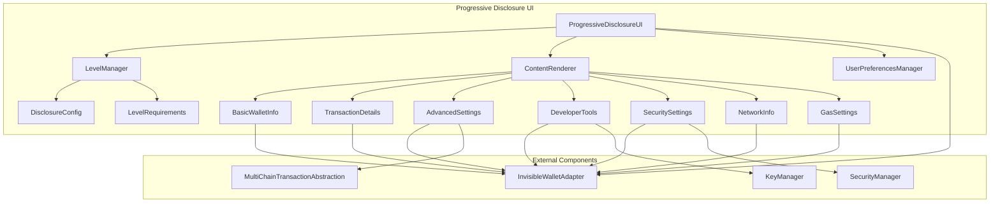
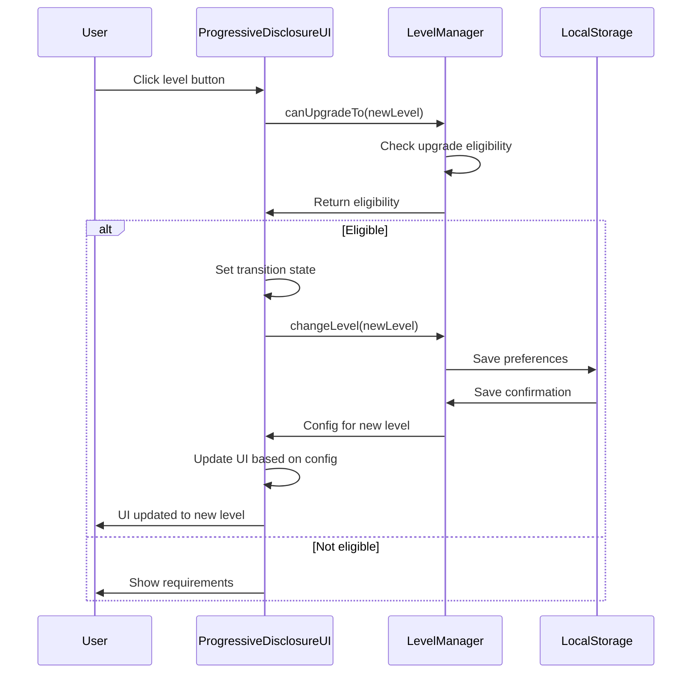
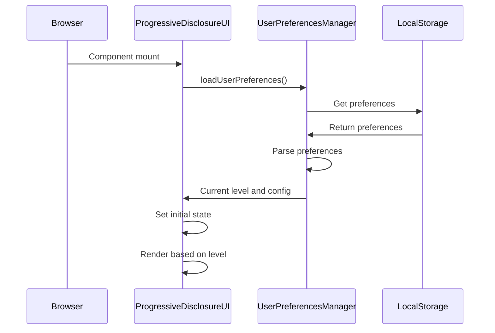

# Спецификация Progressive Disclosure UI для Invisible Wallet

## Обзор

Progressive Disclosure UI - это адаптивный пользовательский интерфейс, который постепенно раскрывает сложность функциональности в зависимости от уровня опыта пользователя. Архитектура обеспечивает интуитивное взаимодействие для новичков и расширенные возможности для опытных пользователей, сохраняя при этом безопасность и простоту использования.

## Архитектурные компоненты

### 1. ProgressiveDisclosureUI - Основной компонент интерфейса

**Назначение**: Центральный компонент, управляющий уровнем сложности интерфейса и отображением соответствующих элементов.

**Интерфейсы**:

```typescript
type DisclosureLevel = "basic" | "intermediate" | "advanced" | "expert";

interface DisclosureConfig {
  level: DisclosureLevel;
  showPrivateKey: boolean;
  showTransactionDetails: boolean;
  showAdvancedSettings: boolean;
  showDeveloperTools: boolean;
  showNetworkInfo: boolean;
  showGasSettings: boolean;
  showSecuritySettings: boolean;
}

interface ProgressiveDisclosureUIProps {
  wallet: InvisibleWalletAdapter;
  initialLevel?: DisclosureLevel;
  onLevelChange?: (level: DisclosureLevel) => void;
  children?: ReactNode;
  className?: string;
}

const ProgressiveDisclosureUI: React.FC<ProgressiveDisclosureUIProps> = ({
  wallet,
  initialLevel = "basic",
  onLevelChange,
  children,
  className = "",
}) => {
  // Реализация компонента
};
```

### 2. LevelManager - Менеджер уровней сложности

**Назначение**: Компонент, управляющий переключением между уровнями сложности и сохранением предпочтений пользователя.

```typescript
class LevelManager {
  private _currentLevel: DisclosureLevel;
  private _config: DisclosureConfig;
  private _userPreferences: any;

  constructor(initialLevel: DisclosureLevel = "basic");

  getCurrentLevel(): DisclosureLevel;
  getConfig(): DisclosureConfig;
  changeLevel(newLevel: DisclosureLevel): void;
  canUpgradeTo(level: DisclosureLevel): boolean;
  loadUserPreferences(): Promise<void>;
  saveUserPreferences(): Promise<void>;
  getLevelRequirements(level: DisclosureLevel): string[];
}
```

### 3. ContentRenderer - Рендерер контента

**Назначение**: Компонент, отвечающий за отображение соответствующего контента в зависимости от уровня сложности.

```typescript
interface ContentRendererProps {
  config: DisclosureConfig;
  wallet: InvisibleWalletAdapter;
}

const ContentRenderer: React.FC<ContentRendererProps> = ({
  config,
  wallet,
}) => {
  return (
    <div className="content-area">
      {/* Базовая информация - всегда видна */}
      <BasicWalletInfo wallet={wallet} />

      {/* Промежуточный уровень */}
      {config.showTransactionDetails && <TransactionDetails wallet={wallet} />}

      {/* Продвинутый уровень */}
      {config.showAdvancedSettings && <AdvancedSettings wallet={wallet} />}

      {/* Экспертный уровень */}
      {config.showDeveloperTools && <DeveloperTools wallet={wallet} />}

      {/* Настройки безопасности */}
      {config.showSecuritySettings && <SecuritySettings wallet={wallet} />}

      {/* Сетевая информация */}
      {config.showNetworkInfo && <NetworkInfo wallet={wallet} />}

      {/* Настройки газа */}
      {config.showGasSettings && <GasSettings wallet={wallet} />}
    </div>
  );
};
```

## Уровни сложности

### 1. Basic (Базовый) уровень

**Назначение**: Для новичков в криптовалютах, обеспечивает простой интерфейс с минимальными настройками.

**Конфигурация**:

```typescript
const basicConfig: DisclosureConfig = {
  level: "basic",
  showPrivateKey: false,
  showTransactionDetails: false,
  showAdvancedSettings: false,
  showDeveloperTools: false,
  showNetworkInfo: false,
  showGasSettings: false,
  showSecuritySettings: false,
};
```

**Отображаемые компоненты**:

- Базовая информация о кошельке
- Баланс
- Адрес кошелька
- Простая форма отправки

### 2. Intermediate (Промежуточный) уровень

**Назначение**: Для пользователей с базовыми знаниями, открывающий доступ к деталям транзакций и основным настройкам.

**Конфигурация**:

```typescript
const intermediateConfig: DisclosureConfig = {
  level: "intermediate",
  showPrivateKey: false,
  showTransactionDetails: true,
  showAdvancedSettings: false,
  showDeveloperTools: false,
  showNetworkInfo: true,
  showGasSettings: false,
  showSecuritySettings: true,
};
```

**Отображаемые компоненты**:

- Все компоненты Basic уровня
- Детали транзакций
- Настройки безопасности
- Информация о сети

### 3. Advanced (Продвинутый) уровень

**Назначение**: Для опытных пользователей, предоставляющий расширенные настройки и оптимизацию транзакций.

**Конфигурация**:

```typescript
const advancedConfig: DisclosureConfig = {
  level: "advanced",
  showPrivateKey: false,
  showTransactionDetails: true,
  showAdvancedSettings: true,
  showDeveloperTools: false,
  showNetworkInfo: true,
  showGasSettings: true,
  showSecuritySettings: true,
};
```

**Отображаемые компоненты**:

- Все компоненты Intermediate уровня
- Продвинутые настройки
- Настройки газа
- Оптимизация комиссий

### 4. Expert (Экспертный) уровень

**Назначение**: Для разработчиков и экспертов, предоставляющий полный доступ ко всем функциям и инструментам.

**Конфигурация**:

```typescript
const expertConfig: DisclosureConfig = {
  level: "expert",
  showPrivateKey: true,
  showTransactionDetails: true,
  showAdvancedSettings: true,
  showDeveloperTools: true,
  showNetworkInfo: true,
  showGasSettings: true,
  showSecuritySettings: true,
};
```

**Отображаемые компоненты**:

- Все компоненты Advanced уровня
- Инструменты разработчика
- Отображение приватного ключа
- Отладочная информация

## Ключевые компоненты UI

### 1. BasicWalletInfo - Базовая информация о кошельке

```tsx
const BasicWalletInfo: React.FC<{ wallet: InvisibleWalletAdapter }> = ({
  wallet,
}) => {
  const [balance, setBalance] = useState<number>(0);
  const [address, setAddress] = useState<string>("");

  useEffect(() => {
    const loadBasicInfo = async () => {
      try {
        const bal = await wallet.getBalance();
        setBalance(bal);

        if (wallet.publicKey) {
          setAddress(wallet.publicKey.toBase58());
        }
      } catch (error) {
        logger.error("Failed to load basic wallet info", error);
      }
    };

    loadBasicInfo();
    const interval = setInterval(loadBasicInfo, 30000); // Обновление каждые 30 секунд

    return () => clearInterval(interval);
  }, [wallet]);

  return (
    <div className="basic-wallet-info">
      <div className="balance-card">
        <h4>Баланс</h4>
        <div className="balance-amount">{balance.toFixed(4)} SOL</div>
      </div>

      <div className="address-card">
        <h4>Адрес кошелька</h4>
        <div className="address-display">
          {address
            ? `${address.slice(0, 6)}...${address.slice(-4)}`
            : "Загрузка..."}
        </div>
        <button
          className="copy-button"
          onClick={() => address && navigator.clipboard.writeText(address)}
        >
          Копировать
        </button>
      </div>
    </div>
  );
};
```

### 2. TransactionDetails - Детали транзакций

```tsx
const TransactionDetails: React.FC<{ wallet: InvisibleWalletAdapter }> = ({
  wallet,
}) => {
  const [transactions, setTransactions] = useState<any[]>([]);
  const [loading, setLoading] = useState(false);

  useEffect(() => {
    const loadTransactions = async () => {
      setLoading(true);
      try {
        // В реальной реализации здесь должна быть загрузка транзакций
        setTransactions([]);
      } catch (error) {
        logger.error("Failed to load transactions", error);
      } finally {
        setLoading(false);
      }
    };

    loadTransactions();
  }, [wallet]);

  return (
    <div className="transaction-details">
      <h4>Последние транзакции</h4>
      {loading ? (
        <div>Загрузка...</div>
      ) : (
        <div className="transaction-list">
          {transactions.length === 0 ? (
            <div className="empty-state">Нет транзакций</div>
          ) : (
            transactions.map((tx, index) => (
              <div key={index} className="transaction-item">
                <div className="transaction-info">
                  <div className="transaction-type">{tx.type}</div>
                  <div className="transaction-amount">{tx.amount} SOL</div>
                </div>
                <div className="transaction-status">{tx.status}</div>
              </div>
            ))
          )}
        </div>
      )}
    </div>
  );
};
```

### 3. AdvancedSettings - Продвинутые настройки

```tsx
const AdvancedSettings: React.FC<{ wallet: InvisibleWalletAdapter }> = ({
  wallet,
}) => {
  const [settings, setSettings] = useState({
    autoSign: false,
    maxFee: 0.001,
    slippage: 1.0,
  });

  const handleSettingChange = (key: string, value: any) => {
    setSettings((prev) => ({ ...prev, [key]: value }));
  };

  return (
    <div className="advanced-settings">
      <h4>Продвинутые настройки</h4>

      <div className="setting-group">
        <label>
          <input
            type="checkbox"
            checked={settings.autoSign}
            onChange={(e) => handleSettingChange("autoSign", e.target.checked)}
          />
          Автоматическая подпись транзакций
        </label>
      </div>

      <div className="setting-group">
        <label>Максимальная комиссия (SOL)</label>
        <input
          type="number"
          step="0.0001"
          value={settings.maxFee}
          onChange={(e) =>
            handleSettingChange("maxFee", parseFloat(e.target.value))
          }
        />
      </div>

      <div className="setting-group">
        <label>Проскальзывание (%)</label>
        <input
          type="number"
          step="0.1"
          value={settings.slippage}
          onChange={(e) =>
            handleSettingChange("slippage", parseFloat(e.target.value))
          }
        />
      </div>
    </div>
  );
};
```

### 4. DeveloperTools - Инструменты разработчика

```tsx
const DeveloperTools: React.FC<{ wallet: InvisibleWalletAdapter }> = ({
  wallet,
}) => {
  const [privateKey, setPrivateKey] = useState<string>("");
  const [showPrivateKey, setShowPrivateKey] = useState(false);

  const exportPrivateKey = async () => {
    try {
      // В реальной реализации здесь должен быть экспорт приватного ключа
      setPrivateKey("••••");
    } catch (error) {
      logger.error("Failed to export private key", error);
    }
  };

  return (
    <div className="developer-tools">
      <h4>Инструменты разработчика</h4>

      <div className="tool-section">
        <h5>Экспорт приватного ключа</h5>
        <button onClick={exportPrivateKey}>Показать приватный ключ</button>
        {showPrivateKey && (
          <div className="private-key-display">
            <code>{privateKey}</code>
            <button onClick={() => navigator.clipboard.writeText(privateKey)}>
              Копировать
            </button>
          </div>
        )}
      </div>

      <div className="tool-section">
        <h5>Отладочная информация</h5>
        <div className="debug-info">
          <div>Network: {wallet.connected ? "Connected" : "Disconnected"}</div>
          <div>Public Key: {wallet.publicKey?.toBase58()}</div>
        </div>
      </div>
    </div>
  );
};
```

### 5. SecuritySettings - Настройки безопасности

```tsx
const SecuritySettings: React.FC<{ wallet: InvisibleWalletAdapter }> = ({
  wallet,
}) => {
  const [biometricAvailable, setBiometricAvailable] = useState(false);
  const [biometricEnabled, setBiometricEnabled] = useState(false);

  useEffect(() => {
    const checkBiometric = async () => {
      const available = await BiometricAuthUtils.isSupported();
      setBiometricAvailable(available);
    };
    checkBiometric();
  }, []);

  const toggleBiometric = async () => {
    // В реальной реализации здесь должно быть включение/выключение биометрии
    setBiometricEnabled(!biometricEnabled);
  };

  return (
    <div className="security-settings">
      <h4>Настройки безопасности</h4>

      {biometricAvailable && (
        <div className="setting-group">
          <label>
            <input
              type="checkbox"
              checked={biometricEnabled}
              onChange={toggleBiometric}
            />
            Биометрическая аутентификация
          </label>
        </div>
      )}

      <div className="setting-group">
        <button>Настроить социальное восстановление</button>
      </div>

      <div className="setting-group">
        <button>Экспортировать бэкап</button>
      </div>
    </div>
  );
};
```

### 6. NetworkInfo - Информация о сети

```tsx
const NetworkInfo: React.FC<{ wallet: InvisibleWalletAdapter }> = ({
  wallet,
}) => {
  return (
    <div className="network-info">
      <h4>Информация о сети</h4>
      <div className="network-details">
        <div>Сеть: Solana Devnet</div>
        <div>RPC: https://api.devnet.solana.com</div>
        <div>Статус: {wallet.connected ? "Подключено" : "Отключено"}</div>
      </div>
    </div>
  );
};
```

### 7. GasSettings - Настройки газа

```tsx
const GasSettings: React.FC<{ wallet: InvisibleWalletAdapter }> = ({
  wallet,
}) => {
  const [gasSettings, setGasSettings] = useState({
    priorityFee: 0.0001,
    computeLimit: 200000,
    skipPreflight: false,
  });

  return (
    <div className="gas-settings">
      <h4>Настройки газа</h4>

      <div className="setting-group">
        <label>Приоритетная комиссия (SOL)</label>
        <input
          type="number"
          step="0.00001"
          value={gasSettings.priorityFee}
          onChange={(e) =>
            setGasSettings((prev) => ({
              ...prev,
              priorityFee: parseFloat(e.target.value),
            }))
          }
        />
      </div>

      <div className="setting-group">
        <label>Лимит compute units</label>
        <input
          type="number"
          value={gasSettings.computeLimit}
          onChange={(e) =>
            setGasSettings((prev) => ({
              ...prev,
              computeLimit: parseInt(e.target.value),
            }))
          }
        />
      </div>

      <div className="setting-group">
        <label>
          <input
            type="checkbox"
            checked={gasSettings.skipPreflight}
            onChange={(e) =>
              setGasSettings((prev) => ({
                ...prev,
                skipPreflight: e.target.checked,
              }))
            }
          />
          Пропустить preflight проверку
        </label>
      </div>
    </div>
  );
};
```

## Управление уровнями

### 1. Переключение уровней

Система реализует ограничения на переключение между уровнями для обеспечения плавного перехода:

```tsx
const canUpgradeTo = (level: DisclosureLevel): boolean => {
  const levels: DisclosureLevel[] = [
    "basic",
    "intermediate",
    "advanced",
    "expert",
  ];
  const currentIndex = levels.indexOf(currentLevel);
  const targetIndex = levels.indexOf(level);
  return targetIndex <= currentIndex + 1;
};
```

### 2. Требования к уровням

Каждый уровень имеет свои требования для перехода:

```tsx
const getLevelRequirements = (level: DisclosureLevel): string[] => {
  const requirements: Record<DisclosureLevel, string[]> = {
    basic: [],
    intermediate: ["Базовое понимание криптовалют"],
    advanced: ["Опыт использования DeFi", "Понимание газовых комиссий"],
    expert: ["Технические знания", "Опыт разработки"],
  };
  return requirements[level];
};
```

### 3. Сохранение предпочтений

Предпочтения пользователя сохраняются в локальном хранилище:

```tsx
const loadUserPreferences = async () => {
  try {
    const stored = localStorage.getItem("wallet_disclosure_preferences");
    if (stored) {
      const preferences = JSON.parse(stored);
      setUserPreferences(preferences);
      if (preferences.disclosureLevel) {
        setCurrentLevel(preferences.disclosureLevel);
      }
    }
  } catch (error) {
    logger.error("Failed to load user preferences", error);
  }
};

const saveUserPreferences = async (preferences: any) => {
  try {
    localStorage.setItem(
      "wallet_disclosure_preferences",
      JSON.stringify(preferences)
    );
  } catch (error) {
    logger.error("Failed to save user preferences", error);
  }
};
```

## Интеграция с другими компонентами

### 1. Интеграция с InvisibleWalletAdapter

```tsx
const ProgressiveDisclosureUI: React.FC<ProgressiveDisclosureUIProps> = ({
  wallet,
  initialLevel = "basic",
  onLevelChange,
  children,
  className = "",
}) => {
  // Компонент использует InvisibleWalletAdapter для получения данных
  // и выполнения операций в зависимости от уровня сложности
};
```

### 2. Интеграция с SecurityManager

```tsx
const SecuritySettings: React.FC<{ wallet: InvisibleWalletAdapter }> = ({
  wallet,
}) => {
  // Компонент использует SecurityManager для настройки параметров безопасности
  // в зависимости от уровня сложности
};
```

### 3. Интеграция с KeyManager

```tsx
const DeveloperTools: React.FC<{ wallet: InvisibleWalletAdapter }> = ({
  wallet,
}) => {
  // Компонент может использовать KeyManager для экспорта приватного ключа
  // только на экспертном уровне и с дополнительной аутентификацией
};
```

## Диаграмма архитектуры



## Потоки данных

### 1. Изменение уровня сложности



### 2. Загрузка предпочтений пользователя



## Тестирование

### 1. Unit тесты

```tsx
describe("ProgressiveDisclosureUI", () => {
  const mockWallet = {
    getBalance: jest.fn().mockResolvedValue(10.5),
    publicKey: { toBase58: () => "mockPublicKey" },
    connected: true,
  } as unknown as InvisibleWalletAdapter;

  it("should render basic level components", () => {
    const { getByText } = render(
      <ProgressiveDisclosureUI wallet={mockWallet} initialLevel="basic" />
    );

    expect(getByText("Баланс")).toBeInTheDocument();
    expect(getByText("Адрес кошелька")).toBeInTheDocument();
  });

  it("should render transaction details at intermediate level", () => {
    const { getByText, queryByText } = render(
      <ProgressiveDisclosureUI
        wallet={mockWallet}
        initialLevel="intermediate"
      />
    );

    expect(getByText("Последние транзакции")).toBeInTheDocument();
    expect(queryByText("Продвинутые настройки")).not.toBeInTheDocument();
  });

  it("should render advanced settings at advanced level", () => {
    const { getByText } = render(
      <ProgressiveDisclosureUI wallet={mockWallet} initialLevel="advanced" />
    );

    expect(getByText("Продвинутые настройки")).toBeInTheDocument();
    expect(getByText("Настройки газа")).toBeInTheDocument();
  });

  it("should render developer tools at expert level", () => {
    const { getByText } = render(
      <ProgressiveDisclosureUI wallet={mockWallet} initialLevel="expert" />
    );

    expect(getByText("Инструменты разработчика")).toBeInTheDocument();
    expect(getByText("Отладочная информация")).toBeInTheDocument();
  });

  it("should prevent upgrading more than one level at a time", () => {
    const { getByTestId } = render(
      <ProgressiveDisclosureUI wallet={mockWallet} initialLevel="basic" />
    );

    // Попытка перейти сразу на expert уровень (не должно быть возможно)
    const expertButton = getByTestId("expert-button");
    expect(expertButton).toBeDisabled();
  });
});
```

### 2. Интеграционные тесты

```tsx
describe("Progressive Disclosure UI Integration", () => {
  it("should work with InvisibleWalletAdapter", async () => {
    const wallet = new InvisibleWalletAdapter(config, connection);
    await wallet.connect();

    const { getByText, findByText } = render(
      <ProgressiveDisclosureUI wallet={wallet} />
    );

    // Проверяем, что баланс загружается корректно
    const balanceElement = await findByText(/SOL/);
    expect(balanceElement).toBeInTheDocument();

    // Проверяем переключение уровней
    const levelButtons = screen.getAllByRole("button", { name: /level/ });
    expect(levelButtons.length).toBeGreaterThan(0);
  });

  it("should save and load user preferences", async () => {
    const wallet = new InvisibleWalletAdapter(config, connection);

    // Устанавливаем уровень в advanced
    render(<ProgressiveDisclosureUI wallet={wallet} initialLevel="advanced" />);

    // Перезапускаем компонент без указания уровня
    render(<ProgressiveDisclosureUI wallet={wallet} />);

    // Проверяем, что уровень остался advanced
    expect(screen.getByText("Продвинутые настройки")).toBeInTheDocument();
  });
});
```

## Метрики пользовательского опыта

### 1. Ключевые метрики

- **Время перехода между уровнями**: < 300ms
- **Время загрузки компонентов**: < 50ms
- **Процент пользователей, переходящих на следующий уровень**: > 20%
- **Время нахождения на каждом уровне**: от 1-2 недель
- **Частота использования компонентов на каждом уровне**: отслеживание

### 2. Мониторинг

```typescript
interface UXMetrics {
  levelTransitionTime: number;
  componentLoadTime: number;
  levelUpgradeRate: number;
  componentUsageFrequency: Record<string, number>;
  userEngagementTimePerLevel: Record<DisclosureLevel, number>;
  featureDiscoveryRate: number;
  userSatisfactionScore: number;
}
```

## Безопасность

### 1. Ограничения доступа

- Отображение приватного ключа только на экспертном уровне
- Дополнительная аутентификация для критических операций
- Логирование попыток доступа к чувствительным функциям

### 2. Защита от ошибок пользователей

- Подтверждение критических действий
- Контекстные подсказки и предупреждения
- Постепенное раскрытие сложных функций

### 3. Обучение пользователей

- Объяснение функций на каждом уровне
- Рекомендации по безопасности
- Контекстные справки

## Масштабируемость

### 1. Архитектурные решения

- Модульная архитектура компонентов
- Возможность добавления новых уровней
- Конфигурируемые компоненты
- Поддержка локализации

### 2. Ограничения

- Максимальное количество уровней: 10
- Максимальное количество компонентов на уровне: 20
- Частота обновления интерфейса: 60 FPS

## Заключение

Progressive Disclosure UI для Invisible Wallet обеспечивает гибкий и безопасный интерфейс, адаптирующийся к уровню опыта пользователя. Архитектура спроектирована с учетом современных требований к пользовательскому опыту и безопасности, обеспечивая плавный переход от простых функций к продвинутым возможностям. Система интегрирована с другими компонентами Invisible Wallet, обеспечивая комплексное решение для управления криптовалютами с учетом уровня опыта пользователя.
