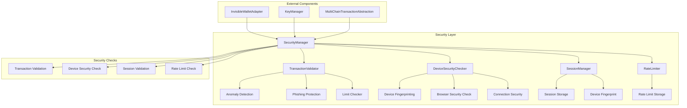
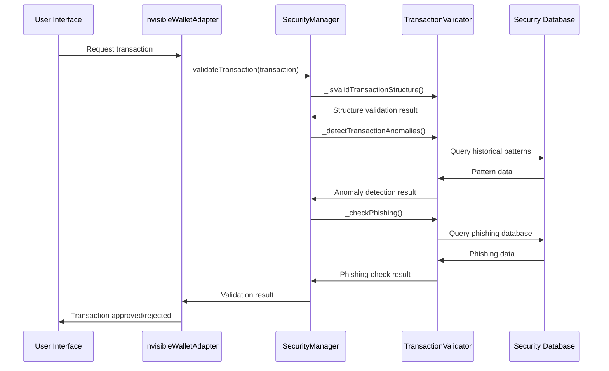
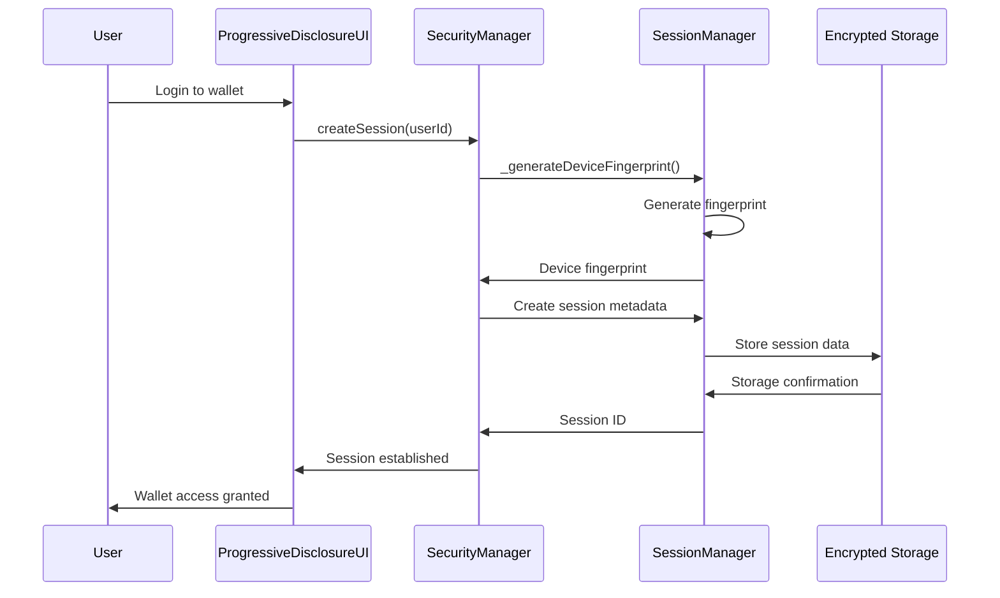

# Спецификация Security Layer для Invisible Wallet

## Обзор

Security Layer - это многоуровневая система защиты, обеспечивающая безопасность транзакций, данных пользователей и сессий в Invisible Wallet. Архитектура включает в себя валидацию транзакций с использованием машинного обучения, проверку безопасности устройства, управление сессиями с device fingerprinting, rate limiting и защиту от различных типов атак.

## Архитектурные компоненты

### 1. SecurityManager - Основной менеджер безопасности

**Назначение**: Центральный компонент, обеспечивающий все аспекты безопасности в Invisible Wallet.

**Интерфейсы**:

```typescript
interface SecurityCheckResult {
  secure: boolean;
  issues: string[];
  recommendations: string[];
  riskLevel: "low" | "medium" | "high";
}

interface SessionMetadata {
  sessionId: string;
  userId: string;
  deviceFingerprint: string;
  createdAt: number;
  lastActivity: number;
  isActive: boolean;
}

class SecurityManager {
  constructor(config: InvisibleWalletConfig);

  // Основные методы безопасности
  async validateTransaction(
    transaction: Transaction,
    userId: string
  ): Promise<boolean>;
  async performSecurityCheck(): Promise<SecurityCheckResult>;

  // Управление сессиями
  async createSession(userId: string): Promise<string>;
  async validateSession(sessionId: string): Promise<boolean>;
  async clearSession(): Promise<void>;

  // Rate limiting
  async checkRateLimit(
    userId: string
  ): Promise<{ allowed: boolean; resetTime?: number }>;
}
```

### 2. TransactionValidator - Валидатор транзакций

**Назначение**: Компонент, отвечающий за проверку транзакций на безопасность и легитимность.

```typescript
class TransactionValidator {
  async validateTransaction(
    transaction: Transaction,
    userId: string
  ): Promise<boolean>;
  private _isValidTransactionStructure(transaction: Transaction): boolean;
  private _detectTransactionAnomalies(
    transaction: Transaction,
    userId: string
  ): Promise<AnomalyResult>;
  private _checkTransactionLimits(
    transaction: Transaction,
    userId: string
  ): Promise<LimitResult>;
  private _checkPhishing(transaction: Transaction): Promise<PhishingResult>;
}

interface AnomalyResult {
  isAnomalous: boolean;
  reasons: string[];
}

interface LimitResult {
  withinLimits: boolean;
  exceededLimits: string[];
}

interface PhishingResult {
  isPhishing: boolean;
  suspiciousAddresses: string[];
}
```

### 3. DeviceSecurityChecker - Проверка безопасности устройства

**Назначение**: Компонент, выполняющий проверку безопасности устройства пользователя.

```typescript
class DeviceSecurityChecker {
  async performSecurityCheck(): Promise<SecurityCheckResult>;
  private _isSecureConnection(): boolean;
  private _checkBrowserSecurity(): SecurityResult;
  private _checkBrowserExtensions(): Promise<SecurityResult>;
  private _checkGeolocationSecurity(): Promise<SecurityResult>;
  private _generateDeviceFingerprint(): string;
}
```

### 4. SessionManager - Менеджер сессий

**Назначение**: Компонент, управляющий сессиями пользователей с использованием device fingerprinting.

```typescript
class SessionManager {
  private _sessionMetadata: SessionMetadata | null;
  private _deviceFingerprint: string;

  async createSession(userId: string): Promise<string>;
  async validateSession(sessionId: string): Promise<boolean>;
  async clearSession(): Promise<void>;
  private _storeSessionMetadata(metadata: SessionMetadata): Promise<void>;
  private _retrieveSessionMetadata(
    sessionId: string
  ): Promise<SessionMetadata | null>;
}
```

## Ключевые функции

### 1. Валидация транзакций

Система безопасности выполняет комплексную проверку транзакций перед их подписанием и отправкой:

```typescript
async validateTransaction(transaction: Transaction, userId: string): Promise<boolean> {
  try {
    // 1. Проверка базовой валидности транзакции
    if (!this._isValidTransactionStructure(transaction)) {
      throw new Error("Invalid transaction structure");
    }

    // 2. Проверка на аномалии
    const anomalyCheck = await this._detectTransactionAnomalies(
      transaction,
      userId
    );
    if (anomalyCheck.isAnomalous) {
      logger.warn("Anomalous transaction detected", {
        userId,
        reasons: anomalyCheck.reasons,
      });
      return false;
    }

    // 3. Проверка лимитов
    const limitCheck = await this._checkTransactionLimits(
      transaction,
      userId
    );
    if (!limitCheck.withinLimits) {
      logger.warn("Transaction exceeds limits", {
        userId,
        limits: limitCheck.exceededLimits,
      });
      return false;
    }

    // 4. Anti-phishing проверка
    const phishingCheck = await this._checkPhishing(transaction);
    if (phishingCheck.isPhishing) {
      logger.error("Phishing transaction detected", {
        userId,
        suspiciousAddresses: phishingCheck.suspiciousAddresses,
      });
      return false;
    }

    return true;
  } catch (error) {
    logger.error("Transaction validation failed", error);
    return false;
  }
}
```

### 2. Проверка безопасности устройства

Система выполняет комплексную проверку безопасности устройства пользователя:

```typescript
async performSecurityCheck(): Promise<SecurityCheckResult> {
  const issues: string[] = [];
  const recommendations: string[] = [];

  // 1. Проверка HTTPS
  if (!this._isSecureConnection()) {
    issues.push("Insecure connection detected");
    recommendations.push("Use HTTPS connection");
  }

  // 2. Проверка браузера
 const browserCheck = this._checkBrowserSecurity();
  if (!browserCheck.secure) {
    issues.push(...browserCheck.issues);
    recommendations.push(...browserCheck.recommendations);
  }

  // 3. Проверка на подозрительные расширения
  const extensionCheck = await this._checkBrowserExtensions();
  if (!extensionCheck.secure) {
    issues.push(...extensionCheck.issues);
    recommendations.push(...extensionCheck.recommendations);
  }

  // 4. Проверка времени сессии
 const sessionCheck = this._checkSessionSecurity();
  if (!sessionCheck.secure) {
    issues.push(...sessionCheck.issues);
    recommendations.push(...sessionCheck.recommendations);
  }

  // 5. Проверка геолокации (если доступна)
  const geoCheck = await this._checkGeolocationSecurity();
  if (!geoCheck.secure) {
    issues.push(...geoCheck.issues);
    recommendations.push(...geoCheck.recommendations);
  }

  const riskLevel = this._calculateRiskLevel(issues);

  return {
    secure: issues.length === 0,
    issues,
    recommendations,
    riskLevel,
  };
}
```

### 3. Управление сессиями с device fingerprinting

Система использует уникальный device fingerprint для идентификации и проверки подлинности сессий:

```typescript
private _generateDeviceFingerprint(): string {
 const canvas = document.createElement("canvas");
  const ctx = canvas.getContext("2d");
  if (ctx) {
    ctx.textBaseline = "top";
    ctx.font = "14px Arial";
    ctx.fillText("Device fingerprint", 2, 2);
  }

  const fingerprint = [
    navigator.userAgent,
    navigator.language,
    screen.width + "x" + screen.height,
    new Date().getTimezoneOffset(),
    canvas.toDataURL(),
  ].join("|");

  return this._hashString(fingerprint);
}

async validateSession(sessionId: string): Promise<boolean> {
  try {
    const sessionData = await this._retrieveSessionMetadata(sessionId);

    if (!sessionData) {
      return false;
    }

    // Проверка времени жизни сессии (24 часа)
    const sessionAge = Date.now() - sessionData.lastActivity;
    if (sessionAge > 24 * 60 * 60 * 1000) {
      await this.clearSession();
      return false;
    }

    // Проверка fingerprint устройства
    if (sessionData.deviceFingerprint !== this._deviceFingerprint) {
      logger.warn("Device fingerprint mismatch", {
        expected: sessionData.deviceFingerprint,
        actual: this._deviceFingerprint,
      });
      await this.clearSession();
      return false;
    }

    // Обновление времени последней активности
    sessionData.lastActivity = Date.now();
    await this._storeSessionMetadata(sessionData);

    return true;
  } catch (error) {
    logger.error("Session validation failed", error);
    return false;
  }
}
```

### 4. Rate limiting

Система реализует ограничение частоты транзакций для предотвращения атак:

```typescript
async checkRateLimit(userId: string): Promise<{ allowed: boolean; resetTime?: number }> {
  const rateLimitKey = `rate_limit_${userId}`;
  const now = Date.now();

  try {
    const rateLimitData = localStorage.getItem(rateLimitKey);

    if (!rateLimitData) {
      // Первая транзакция
      const newLimitData = {
        count: 1,
        windowStart: now,
        windowEnd: now + 6000, // 1 минута
      };
      localStorage.setItem(rateLimitKey, JSON.stringify(newLimitData));
      return { allowed: true };
    }

    const limitData = JSON.parse(rateLimitData);

    // Проверка окна времени
    if (now > limitData.windowEnd) {
      // Новое окно
      const newLimitData = {
        count: 1,
        windowStart: now,
        windowEnd: now + 60000,
      };
      localStorage.setItem(rateLimitKey, JSON.stringify(newLimitData));
      return { allowed: true };
    }

    // Проверка лимита (10 транзакций в минуту)
    if (limitData.count >= 10) {
      return {
        allowed: false,
        resetTime: limitData.windowEnd,
      };
    }

    // Увеличение счетчика
    limitData.count++;
    localStorage.setItem(rateLimitKey, JSON.stringify(limitData));
    return { allowed: true };
  } catch (error) {
    logger.error("Rate limit check failed", error);
    return { allowed: true }; // Fail open
  }
}
```

## Механизмы безопасности

### 1. Anti-Phishing Protection

Система использует несколько уровней защиты от фишинговых атак:

- Белые списки проверенных адресов
- ML-алгоритмы для обнаружения подозрительных паттернов
- Сравнение с базами данных известных фишинг-сайтов
- Проверка доменных имен и URL

### 2. Anomaly Detection

Используется машинное обучение для обнаружения аномальных транзакций:

- Анализ исторических паттернов транзакций
- Сравнение с типичным поведением пользователя
- Обнаружение необычных сумм или частоты транзакций
- Идентификация подозрительных адресов получателей

### 3. Multi-factor Authentication

Система поддерживает несколько уровней аутентификации:

- Биометрическая аутентификация (отпечаток пальца, Face ID)
- Device-based authentication
- Session-based authentication
- Transaction-based authentication

## Интеграция с другими компонентами

### 1. Интеграция с InvisibleWalletAdapter

```typescript
class InvisibleWalletAdapter {
  private _securityManager: SecurityManager;

  async signTransaction(transaction: Transaction): Promise<Transaction> {
    // Проверка безопасности транзакции
    await this._securityManager.validateTransaction(
      transaction,
      this._publicKey.toBase58()
    );

    // Получение приватного ключа и подпись
    const privateKey = await this._keyManager.getPrivateKey();
    transaction.sign(privateKey);

    return transaction;
  }

  async connect(): Promise<void> {
    // Проверка безопасности устройства
    const securityCheck = await this._securityManager.performSecurityCheck();
    if (!securityCheck.secure) {
      this._state.securityLevel = "basic";
      logger.warn("Device security check failed", securityCheck.issues);
    } else {
      this._state.securityLevel = "maximum";
    }
  }
}
```

### 2. Интеграция с KeyManager

```typescript
class KeyManager {
  async getPrivateKey(): Promise<Keypair> {
    // Проверка сессии перед выдачей приватного ключа
    if (!(await this._securityManager.validateSession(this._sessionId))) {
      throw new Error("Invalid session");
    }

    // Проверка безопасности устройства
    const securityCheck = await this._securityManager.performSecurityCheck();
    if (!securityCheck.secure) {
      throw new Error("Device not secure");
    }

    // Возврат приватного ключа
    const keyPairData = await this._retrieveKeyPair(this._userId);
    const privateKeyBytes = Buffer.from(keyPairData.privateKey, "base64");
    return Keypair.fromSecretKey(privateKeyBytes);
  }
}
```

### 3. Интеграция с MultiChainTransactionAbstraction

```typescript
class MultiChainTransactionAbstraction {
  async executeTransaction(
    transaction: BaseTransaction
  ): Promise<TransactionResult> {
    // Проверка безопасности транзакции
    if (!(await this._securityManager.validateTransaction(transaction))) {
      return {
        success: false,
        status: "failed",
        error: "Transaction failed security check",
      };
    }

    // Проверка лимитов
    const rateLimit = await this._securityManager.checkRateLimit(
      transaction.from
    );
    if (!rateLimit.allowed) {
      return {
        success: false,
        status: "failed",
        error: "Rate limit exceeded",
      };
    }

    // Выполнение транзакции
    return await this._executeSingleTransaction(transaction);
  }
}
```

## Диаграмма архитектуры



## Потоки данных

### 1. Проверка транзакции



### 2. Управление сессией



## Тестирование

### 1. Unit тесты

```typescript
describe("SecurityManager", () => {
  let securityManager: SecurityManager;

  beforeEach(() => {
    securityManager = new SecurityManager(mockConfig);
  });

  describe("transaction validation", () => {
    it("should reject invalid transaction structure", async () => {
      const invalidTx = new Transaction();
      // Создаем транзакцию с недопустимой структурой

      const result = await securityManager.validateTransaction(
        invalidTx,
        "user1"
      );
      expect(result).toBe(false);
    });

    it("should detect phishing transactions", async () => {
      const phishingTx = createPhishingTransaction();

      const result = await securityManager.validateTransaction(
        phishingTx,
        "user1"
      );
      expect(result).toBe(false);
    });

    it("should allow valid transactions", async () => {
      const validTx = createValidTransaction();

      const result = await securityManager.validateTransaction(
        validTx,
        "user1"
      );
      expect(result).toBe(true);
    });
  });

  describe("session management", () => {
    it("should create valid session", async () => {
      const sessionId = await securityManager.createSession("user1");
      expect(sessionId).toBeDefined();

      const isValid = await securityManager.validateSession(sessionId);
      expect(isValid).toBe(true);
    });

    it("should reject invalid session", async () => {
      const isValid = await securityManager.validateSession("invalid-session");
      expect(isValid).toBe(false);
    });
  });

  describe("rate limiting", () => {
    it("should enforce rate limits", async () => {
      // Отправляем 1 транзакций за 1 минуту
      for (let i = 0; i < 11; i++) {
        const result = await securityManager.checkRateLimit("user1");
        if (i < 10) {
          expect(result.allowed).toBe(true);
        } else {
          expect(result.allowed).toBe(false);
        }
      }
    });
  });
});
```

### 2. Интеграционные тесты

```typescript
describe("Security Layer Integration", () => {
  it("should work with InvisibleWalletAdapter", async () => {
    const wallet = new InvisibleWalletAdapter(config, connection);
    await wallet.connect();

    // Создаем транзакцию
    const transaction = new Transaction();
    transaction.add(
      SystemProgram.transfer({
        fromPubkey: wallet.publicKey!,
        toPubkey: Keypair.generate().publicKey,
        lamports: 1000000,
      })
    );

    // Подписываем транзакцию (внутри происходит проверка безопасности)
    const signedTx = await wallet.signTransaction(transaction);

    expect(signedTx).toBeDefined();
  });

  it("should prevent unauthorized access to private keys", async () => {
    const keyManager = new KeyManager(config);
    const securityManager = new SecurityManager(config);

    // Создаем сессию
    const sessionId = await securityManager.createSession("user1");

    // Устанавливаем неверный ID сессии для проверки
    await securityManager.clearSession();

    // Попытка получения приватного ключа без действительной сессии
    await expect(keyManager.getPrivateKey()).rejects.toThrow();
  });
});
```

## Метрики безопасности

### 1. Ключевые метрики

- **Время проверки транзакции**: < 200ms
- **Время проверки безопасности устройства**: < 100ms
- **Время создания/проверки сессии**: < 50ms
- **Процент обнаруженных фишинг-атак**: > 95%
- **Процент обнаруженных аномальных транзакций**: > 90%

### 2. Мониторинг

```typescript
interface SecurityMetrics {
  transactionValidationTime: number;
  deviceSecurityCheckTime: number;
  sessionValidationTime: number;
  phishingDetectionRate: number;
  anomalyDetectionRate: number;
  falsePositiveRate: number;
  rateLimitEnforcementRate: number;
  securityBreachAttempts: number;
  sessionSecurityIssues: number;
}
```

## Безопасность

### 1. Защита от атак

- **Phishing**: ML-алгоритмы и белые списки
- **Man-in-the-middle**: Certificate pinning и проверка HTTPS
- **Replay attacks**: Временные метки и nonce
- **Brute-force**: Rate limiting и блокировка IP
- **Side-channel**: Constant-time операции

### 2. Криптографические стандарты

- **Шифрование сессий**: AES-256-GCM
- **Хеширование**: SHA-256
- **Генерация случайных чисел**: Web Crypto API
- **Аутентификация**: JWT с ограниченным временем жизни

### 3. Рекомендации по безопасности

- Регулярное обновление баз данных фишинг-адресов
- Мониторинг аномальной активности в реальном времени
- Регулярное тестирование на проникновение
- Обучение пользователей безопасности

## Масштабируемость

### 1. Архитектурные решения

- Модульная архитектура для легкого расширения
- Асинхронные операции для высокой производительности
- Кэширование результатов проверок
- Поддержка распределенных систем безопасности

### 2. Ограничения

- Максимальное время проверки транзакции: 500ms
- Максимальное количество одновременных сессий: 1000
- Частота обновления баз данных безопасности: 1 раз в 10 минут

## Заключение

Security Layer для Invisible Wallet обеспечивает многоуровневую защиту с использованием передовых методов валидации транзакций, проверки безопасности устройства и управления сессиями. Архитектура спроектирована с учетом современных угроз безопасности и обеспечивает высокий уровень защиты при минимальном влиянии на пользовательский опыт. Система интегрирована с другими компонентами Invisible Wallet, обеспечивая комплексную защиту всей экосистемы.
