# Спецификация Testing Infrastructure для Invisible Wallet

## Обзор

Testing Infrastructure - это комплексная система тестирования, обеспечивающая высокое качество кода, надежность и безопасность Invisible Wallet. Архитектура включает в себя unit тесты, интеграционные тесты, e2e тесты, нагрузочные тесты, тесты безопасности и другие виды тестирования, необходимые для обеспечения стабильной работы всех компонентов кошелька.

## Архитектурные компоненты

### 1. TestRunner - Центральный тестовый раннер

**Назначение**: Компонент, управляющий выполнением всех видов тестов в системе.

**Интерфейсы**:

```typescript
interface TestConfig {
  unitTests: boolean;
  integrationTests: boolean;
  e2eTests: boolean;
  performanceTests: boolean;
  securityTests: boolean;
  coverage: boolean;
  timeout: number;
  maxConcurrency: number;
}

interface TestResult {
  success: boolean;
  duration: number;
  error?: string;
  coverage?: CoverageReport;
  metrics?: TestMetrics;
}

interface CoverageReport {
  lines: number;
  functions: number;
  branches: number;
  statements: number;
}

interface TestMetrics {
  performance: PerformanceMetrics;
  security: SecurityMetrics;
  reliability: ReliabilityMetrics;
}

class TestRunner {
  constructor(config: TestConfig);

  async runAllTests(): Promise<TestResult[]>;
  async runUnitTests(): Promise<TestResult[]>;
  async runIntegrationTests(): Promise<TestResult[]>;
  async runE2ETests(): Promise<TestResult[]>;
  async runPerformanceTests(): Promise<TestResult[]>;
  async runSecurityTests(): Promise<TestResult[]>;
  async generateCoverageReport(): Promise<CoverageReport>;
  async generateTestReport(results: TestResult[]): Promise<TestReport>;
}
```

### 2. UnitTestFramework - Фреймворк для unit тестов

**Назначение**: Компонент для написания и выполнения unit тестов для отдельных модулей и функций.

```typescript
interface UnitTestConfig {
  include: string[];
  exclude: string[];
  coverage: boolean;
  timeout: number;
}

class UnitTestFramework {
  constructor(config: UnitTestConfig);

  describe(suiteName: string, suiteFn: () => void): void;
  it(testName: string, testFn: () => Promise<void> | void): void;
  beforeAll(fn: () => Promise<void> | void): void;
  afterAll(fn: () => Promise<void> | void): void;
  beforeEach(fn: () => Promise<void> | void): void;
  afterEach(fn: () => Promise<void> | void): void;
  expect<T>(value: T): Expectation<T>;
}

interface Expectation<T> {
  toBe(expected: T): void;
  toEqual(expected: T): void;
  toBeTruthy(): void;
  toBeFalsy(): void;
  toBeNull(): void;
  toBeUndefined(): void;
  toContain(expected: any): void;
  toMatch(pattern: string | RegExp): void;
  toThrow(error?: string | Error | RegExp): void;
  toBeCloseTo(expected: number, precision?: number): void;
  toBeGreaterThan(expected: number): void;
  toBeLessThan(expected: number): void;
}
```

### 3. IntegrationTestFramework - Фреймворк для интеграционных тестов

**Назначение**: Компонент для тестирования взаимодействия между различными модулями и компонентами.

```typescript
interface IntegrationTestConfig {
  mockExternalServices: boolean;
  useRealServices: boolean;
  testEnvironment: "dev" | "staging" | "test";
  dataCleanup: boolean;
}

class IntegrationTestFramework {
  constructor(config: IntegrationTestConfig);

  async setupTestEnvironment(): Promise<void>;
  async teardownTestEnvironment(): Promise<void>;
  async runWithMockedServices(testFn: () => Promise<void>): Promise<void>;
  async runWithRealServices(testFn: () => Promise<void>): Promise<void>;
  async createTestData(): Promise<void>;
  async cleanupTestData(): Promise<void>;
}
```

### 4. E2ETestFramework - Фреймворк для e2e тестов

**Назначение**: Компонент для тестирования пользовательских сценариев от начала до конца.

```typescript
interface E2ETestConfig {
  browser: "chrome" | "firefox" | "safari" | "edge";
  headless: boolean;
  viewport: { width: number; height: number };
  baseURL: string;
  timeout: number;
}

class E2ETestFramework {
  constructor(config: E2ETestConfig);

  async launchBrowser(): Promise<Browser>;
  async createPage(): Promise<Page>;
  async navigateTo(path: string): Promise<void>;
  async waitForSelector(
    selector: string,
    options?: any
  ): Promise<ElementHandle>;
  async click(selector: string): Promise<void>;
  async type(selector: string, text: string): Promise<void>;
  async screenshot(options?: any): Promise<Buffer>;
  async close(): Promise<void>;
}
```

### 5. PerformanceTestFramework - Фреймворк для нагрузочных тестов

**Назначение**: Компонент для тестирования производительности и масштабируемости системы.

```typescript
interface PerformanceTestConfig {
  maxConcurrentUsers: number;
  testDuration: number; // in seconds
  rampUpTime: number; // in seconds
  targetRPS: number; // requests per second
  metrics: string[];
}

interface PerformanceMetrics {
  avgResponseTime: number;
  p95ResponseTime: number;
  p99ResponseTime: number;
  requestsPerSecond: number;
  errorRate: number;
  throughput: number;
  memoryUsage: number;
  cpuUsage: number;
}

class PerformanceTestFramework {
  constructor(config: PerformanceTestConfig);

  async runLoadTest(testFn: () => Promise<void>): Promise<PerformanceMetrics>;
  async runStressTest(testFn: () => Promise<void>): Promise<PerformanceMetrics>;
  async runSoakTest(testFn: () => Promise<void>): Promise<PerformanceMetrics>;
  async generatePerformanceReport(
    metrics: PerformanceMetrics
  ): Promise<PerformanceReport>;
}
```

### 6. SecurityTestFramework - Фреймворк для тестов безопасности

**Назначение**: Компонент для тестирования безопасности системы на уязвимости и атаки.

```typescript
interface SecurityTestConfig {
  scanForVulnerabilities: boolean;
  testForCommonAttacks: boolean;
  checkPermissions: boolean;
  validateInputs: boolean;
}

interface SecurityMetrics {
  vulnerabilitiesFound: number;
  attackSuccessRate: number;
  permissionIssues: number;
  inputValidationFailures: number;
}

class SecurityTestFramework {
  constructor(config: SecurityTestConfig);

  async runVulnerabilityScan(): Promise<SecurityMetrics>;
  async testForPhishing(): Promise<SecurityMetrics>;
  async testForReplayAttacks(): Promise<SecurityMetrics>;
  async testForBruteForce(): Promise<SecurityMetrics>;
  async testForXSS(): Promise<SecurityMetrics>;
  async testForCSRF(): Promise<SecurityMetrics>;
  async generateSecurityReport(
    metrics: SecurityMetrics
  ): Promise<SecurityReport>;
}
```

## Тестирование ключевых компонентов

### 1. Тестирование InvisibleWalletAdapter

```typescript
describe("InvisibleWalletAdapter", () => {
  let wallet: InvisibleWalletAdapter;
  let mockConnection: Connection;

  beforeEach(async () => {
    mockConnection = new Connection("https://api.devnet.solana.com");
    wallet = new InvisibleWalletAdapter(
      {
        telegramUserId: "test_user",
        telegramInitData: "test_init_data",
        enableBiometric: false,
        enableSocialRecovery: true,
        supportedChains: ["solana"],
        enableOffline: true,
        cacheDuration: 300000,
        enableAnalytics: true,
      },
      mockConnection
    );
  });

  afterEach(async () => {
    if (wallet.connected) {
      await wallet.disconnect();
    }
  });

  describe("connect", () => {
    it("should connect successfully with valid configuration", async () => {
      await wallet.connect();

      expect(wallet.connected).toBe(true);
      expect(wallet.publicKey).toBeDefined();
      expect(wallet.autoConnect).toBeDefined();
    });

    it("should generate deterministic key pair from Telegram data", async () => {
      await wallet.connect();
      const publicKey1 = wallet.publicKey;

      // Создаем второй кошелек с теми же данными
      const wallet2 = new InvisibleWalletAdapter(
        {
          telegramUserId: "test_user",
          telegramInitData: "test_init_data",
          enableBiometric: false,
        },
        mockConnection
      );

      await wallet2.connect();
      const publicKey2 = wallet2.publicKey;

      expect(publicKey1?.toBase58()).toBe(publicKey2?.toBase58());
    });

    it("should emit connect event", async () => {
      const connectSpy = jest.fn();
      wallet.on("connect", connectSpy);

      await wallet.connect();

      expect(connectSpy).toHaveBeenCalled();
    });
  });

  describe("disconnect", () => {
    it("should disconnect successfully", async () => {
      await wallet.connect();
      expect(wallet.connected).toBe(true);

      await wallet.disconnect();
      expect(wallet.connected).toBe(false);
      expect(wallet.publicKey).toBeNull();
    });

    it("should emit disconnect event", async () => {
      await wallet.connect();

      const disconnectSpy = jest.fn();
      wallet.on("disconnect", disconnectSpy);

      await wallet.disconnect();

      expect(disconnectSpy).toHaveBeenCalled();
    });
  });

  describe("signTransaction", () => {
    it("should sign transaction successfully", async () => {
      await wallet.connect();

      const transaction = new Transaction();
      transaction.add(
        SystemProgram.transfer({
          fromPubkey: wallet.publicKey!,
          toPubkey: Keypair.generate().publicKey,
          lamports: 1000000,
        })
      );

      const signedTransaction = await wallet.signTransaction(transaction);

      expect(signedTransaction).toBeDefined();
      expect(signedTransaction.signature).not.toBeNull();
    });

    it("should fail to sign transaction when not connected", async () => {
      const transaction = new Transaction();
      transaction.add(
        SystemProgram.transfer({
          fromPubkey: Keypair.generate().publicKey,
          toPubkey: Keypair.generate().publicKey,
          lamports: 1000000,
        })
      );

      await expect(wallet.signTransaction(transaction)).rejects.toThrow(
        "Wallet not connected"
      );
    });
  });

  describe("sendTransaction", () => {
    it("should send transaction successfully", async () => {
      await wallet.connect();

      const transaction = new Transaction();
      transaction.add(
        SystemProgram.transfer({
          fromPubkey: wallet.publicKey!,
          toPubkey: Keypair.generate().publicKey,
          lamports: 1000000,
        })
      );

      // Мокаем отправку транзакции
      jest
        .spyOn(mockConnection, "sendRawTransaction")
        .mockResolvedValue("mock_signature");

      const signature = await wallet.sendTransaction(transaction);

      expect(signature).toBe("mock_signature");
    });
  });

  describe("getBalance", () => {
    it("should return cached balance when fresh", async () => {
      await wallet.connect();

      // Устанавливаем кэшированный баланс
      (wallet as any)._state.balance = 5.5;
      (wallet as any)._state.lastSync = Date.now();

      const balance = await wallet.getBalance();

      expect(balance).toBe(5.5);
    });

    it("should sync balance when cache is stale", async () => {
      await wallet.connect();

      // Устанавливаем устаревший кэш
      (wallet as any)._state.balance = 0;
      (wallet as any)._state.lastSync = Date.now() - 600000; // 10 минут назад

      // Мокаем получение баланса
      jest.spyOn(mockConnection, "getBalance").mockResolvedValue(1000000); // 1 SOL

      const balance = await wallet.getBalance();

      expect(balance).toBe(1);
    });
  });
});
```

### 2. Тестирование KeyManager

```typescript
describe("KeyManager", () => {
  let keyManager: KeyManager;
  const mockConfig: InvisibleWalletConfig = {
    telegramUserId: "test_user",
    telegramInitData: "test_init_data",
    enableSocialRecovery: true,
  };

  beforeEach(() => {
    keyManager = new KeyManager(mockConfig);
  });

  afterEach(() => {
    // Очищаем localStorage
    localStorage.clear();
  });

  describe("getOrCreateKeyPair", () => {
    it("should generate deterministic key pair from Telegram data", async () => {
      const key1 = await keyManager.getOrCreateKeyPair("user1", "init1");
      const key2 = await keyManager.getOrCreateKeyPair("user1", "init1");

      expect(key1.toBase58()).toBe(key2.toBase58());
    });

    it("should generate different key pairs for different users", async () => {
      const key1 = await keyManager.getOrCreateKeyPair("user1", "init1");
      const key2 = await keyManager.getOrCreateKeyPair("user2", "init1");

      expect(key1.toBase58()).not.toBe(key2.toBase58());
    });

    it("should generate different key pairs for different init data", async () => {
      const key1 = await keyManager.getOrCreateKeyPair("user1", "init1");
      const key2 = await keyManager.getOrCreateKeyPair("user1", "init2");

      expect(key1.toBase58()).not.toBe(key2.toBase58());
    });
  });

  describe("encryption/decryption", () => {
    it("should encrypt and decrypt private key correctly", async () => {
      const keyPair = await keyManager.generateRandomKeyPair();
      const privateKey = await keyManager.getPrivateKey();

      expect(privateKey.publicKey.toBase58()).toBe(keyPair.toBase58());
    });

    it("should handle encrypted storage properly", async () => {
      const userId = "test_user_encryption";
      const keyPair = await keyManager.getOrCreateKeyPair(userId, "test_init");

      // Проверяем, что ключ сохранен в зашифрованном виде
      const storageKey = `invisible_wallet_keys_${userId}`;
      const storageData = localStorage.getItem(storageKey);
      expect(storageData).not.toBeNull();

      // Создаем новый KeyManager и проверяем восстановление
      const newKeyManager = new KeyManager(mockConfig);
      const restoredKey = await newKeyManager.getOrCreateKeyPair(
        userId,
        "test_init"
      );

      expect(restoredKey.toBase58()).toBe(keyPair.toBase58());
    });
  });

  describe("social recovery", () => {
    it("should setup social recovery with trusted contacts", async () => {
      const contacts = ["contact1", "contact2", "contact3"];
      await keyManager.setupSocialRecovery(contacts);

      // Проверяем создание shares
      const shares = await keyManager["_retrieveKeyShares"]("test_user");
      expect(shares).toBeDefined();
      expect(shares.length).toBe(3);
    });

    it("should recover from shares", async () => {
      const contacts = ["contact1", "contact2", "contact3"];
      await keyManager.setupSocialRecovery(contacts);

      // В реальной реализации здесь будет получение shares от контактов
      // и восстановление ключа
      const originalKey = await keyManager.getOrCreateKeyPair(
        "test_user",
        "test_init_data"
      );

      // Мокируем восстановление (в реальной реализации это будет сложнее)
      const recoveredKey = await keyManager.recoverFromShares([
        "mock_share1",
        "mock_share2",
        "mock_share3",
      ]);

      expect(recoveredKey.toBase58()).toBe(originalKey.toBase58());
    });
  });

  describe("backup/restore", () => {
    it("should export and import backup correctly", async () => {
      const originalKey = await keyManager.getOrCreateKeyPair(
        "backup_user",
        "backup_init"
      );
      const backup = await keyManager.exportBackup();

      // Создаем новый KeyManager и импортируем бэкап
      const newKeyManager = new KeyManager({
        telegramUserId: "backup_user",
        telegramInitData: "backup_init",
      });
      const restoredKey = await newKeyManager.importBackup(backup);

      expect(restoredKey.toBase58()).toBe(originalKey.toBase58());
    });
  });
});
```

### 3. Тестирование SecurityManager

```typescript
describe("SecurityManager", () => {
  let securityManager: SecurityManager;
  const mockConfig: InvisibleWalletConfig = {
    enableBiometric: true,
    enableSocialRecovery: true,
  };

  beforeEach(() => {
    securityManager = new SecurityManager(mockConfig);
  });

  describe("transaction validation", () => {
    it("should validate valid transaction successfully", async () => {
      const transaction = new Transaction();
      transaction.add(
        SystemProgram.transfer({
          fromPubkey: Keypair.generate().publicKey,
          toPubkey: Keypair.generate().publicKey,
          lamports: 1000000,
        })
      );

      const isValid = await securityManager.validateTransaction(
        transaction,
        "test_user"
      );

      expect(isValid).toBe(true);
    });

    it("should reject invalid transaction structure", async () => {
      // Мокаем транзакцию с недопустимой структурой
      const invalidTransaction = {
        instructions: "not_an_array",
        feePayer: undefined,
      } as unknown as Transaction;

      const isValid = await securityManager.validateTransaction(
        invalidTransaction,
        "test_user"
      );

      expect(isValid).toBe(false);
    });

    it("should detect phishing addresses", async () => {
      // Мокаем проверку фишинга
      jest.spyOn(securityManager as any, "_checkPhishing").mockResolvedValue({
        isPhishing: true,
        suspiciousAddresses: ["phishing_address"],
      });

      const transaction = new Transaction();
      transaction.add(
        SystemProgram.transfer({
          fromPubkey: Keypair.generate().publicKey,
          toPubkey: new PublicKey("phishing_address"),
          lamports: 10000,
        })
      );

      const isValid = await securityManager.validateTransaction(
        transaction,
        "test_user"
      );

      expect(isValid).toBe(false);
    });
  });

  describe("security check", () => {
    it("should perform security check successfully", async () => {
      const result = await securityManager.performSecurityCheck();

      expect(result).toBeDefined();
      expect(result.secure).toBeDefined();
      expect(result.issues).toBeDefined();
      expect(result.recommendations).toBeDefined();
      expect(result.riskLevel).toBeDefined();
    });

    it("should detect insecure connection", async () => {
      // Мокаем проверку соединения
      Object.defineProperty(window, "location", {
        value: { protocol: "http:" },
        writable: true,
      });

      const result = await securityManager.performSecurityCheck();

      expect(result.secure).toBe(false);
      expect(result.issues).toContain("Insecure connection detected");
    });
  });

  describe("session management", () => {
    it("should create and validate session", async () => {
      const sessionId = await securityManager.createSession("test_user");
      expect(sessionId).toBeDefined();

      const isValid = await securityManager.validateSession(sessionId);
      expect(isValid).toBe(true);
    });

    it("should reject invalid session", async () => {
      const isValid = await securityManager.validateSession(
        "invalid_session_id"
      );
      expect(isValid).toBe(false);
    });

    it("should reject expired session", async () => {
      const sessionId = await securityManager.createSession("test_user");

      // Устанавливаем прошедшее время для сессии
      const sessionData = JSON.parse(
        localStorage.getItem(`session_${sessionId}`)!
      );
      sessionData.lastActivity = Date.now() - 25 * 60 * 60 * 1000; // 25 часов назад
      localStorage.setItem(`session_${sessionId}`, JSON.stringify(sessionData));

      const isValid = await securityManager.validateSession(sessionId);
      expect(isValid).toBe(false);
    });
  });

  describe("rate limiting", () => {
    it("should allow transactions within rate limit", async () => {
      const result = await securityManager.checkRateLimit("test_user");
      expect(result.allowed).toBe(true);
    });

    it("should block transactions exceeding rate limit", async () => {
      // Отправляем 11 транзакций за 1 минуту (лимит 10)
      for (let i = 0; i < 11; i++) {
        await securityManager.checkRateLimit("test_user");
      }

      const result = await securityManager.checkRateLimit("test_user");
      expect(result.allowed).toBe(false);
    });
  });
});
```

### 4. Тестирование MultiChainTransactionAbstraction

```typescript
describe("MultiChainTransactionAbstraction", () => {
  let multiChainTx: MultiChainTransactionAbstraction;
  const mockConfig: InvisibleWalletConfig = {
    supportedChains: ["solana", "ethereum"],
  };

  beforeEach(() => {
    multiChainTx = new MultiChainTransactionAbstraction(mockConfig);
  });

  describe("transfer transaction", () => {
    it("should create transfer transaction correctly", async () => {
      const transaction = await multiChainTx.createTransferTransaction(
        "solana",
        "solana",
        "source_address",
        "destination_address",
        1.0,
        "SOL"
      );

      expect(transaction).toBeDefined();
      expect(transaction.type).toBe("transfer");
      expect(transaction.fromChain).toBe("solana");
      expect(transaction.toChain).toBe("solana");
      expect(transaction.amount).toBe(1.0);
      expect(transaction.token).toBe("SOL");
      expect(transaction.status).toBe("pending");
    });

    it("should calculate fee for transfer transaction", async () => {
      const transaction = await multiChainTx.createTransferTransaction(
        "solana",
        "solana",
        "source_address",
        "destination_address",
        1.0,
        "SOL"
      );

      expect(transaction.fee).toBeDefined();
      expect(transaction.fee).toBeGreaterThan(0);
    });
  });

  describe("swap transaction", () => {
    it("should create swap transaction correctly", async () => {
      const transaction = await multiChainTx.createSwapTransaction(
        "solana",
        "source_address",
        "destination_address",
        1.0,
        "SOL",
        "USDC"
      );

      expect(transaction).toBeDefined();
      expect(transaction.type).toBe("swap");
      expect(transaction.fromChain).toBe("solana");
      expect(transaction.toChain).toBe("solana");
      expect(transaction.token).toBe("SOL");
    });
  });

  describe("fee optimization", () => {
    it("should optimize fee based on network conditions", async () => {
      const result = await multiChainTx.optimizeFee(
        "solana",
        "transfer",
        "medium"
      );

      expect(result).toBeDefined();
      expect(result.optimalFee).toBeGreaterThan(0);
      expect(result.estimatedTime).toBeGreaterThan(0);
      expect(result.confidence).toBeGreaterThan(0);
    });

    it("should return different fees for different urgency levels", async () => {
      const lowFee = await multiChainTx.optimizeFee(
        "solana",
        "transfer",
        "low"
      );
      const highFee = await multiChainTx.optimizeFee(
        "solana",
        "transfer",
        "high"
      );

      expect(highFee.optimalFee).toBeGreaterThan(lowFee.optimalFee);
    });
  });

  describe("route finding", () => {
    it("should find best route for same chain transfer", async () => {
      const result = await multiChainTx.findBestRoute(
        "solana",
        "solana",
        1.0,
        "SOL"
      );

      expect(result.route).toEqual(["solana"]);
      expect(result.estimatedFee).toBeGreaterThan(0);
      expect(result.estimatedTime).toBeGreaterThan(0);
    });

    it("should find route for cross-chain transfer", async () => {
      // Мокаем поиск мостов
      jest
        .spyOn(multiChainTx as any, "_findAvailableBridges")
        .mockResolvedValue([
          {
            route: ["solana", "ethereum"] as SupportedChain[],
            estimatedTime: 3000, // 5 минут
            fee: 0.01,
          },
        ]);

      const result = await multiChainTx.findBestRoute(
        "solana",
        "ethereum",
        1.0,
        "SOL"
      );

      expect(result.route).toEqual(["solana", "ethereum"]);
      expect(result.estimatedFee).toBeGreaterThan(0);
    });
  });

  describe("multi-chain balance", () => {
    it("should get balance on all supported chains", async () => {
      const address = "test_address";
      const balances = await multiChainTx.getMultiChainBalance(address);

      expect(balances).toBeInstanceOf(Map);
      expect(balances.size).toBeGreaterThan(0);

      for (const [chain, balance] of balances) {
        expect(chain).toBeDefined();
        expect(typeof balance).toBe("number");
      }
    });
  });
});
```

### 5. Тестирование ProgressiveDisclosureUI

```tsx
describe("ProgressiveDisclosureUI", () => {
  const mockWallet = {
    getBalance: jest.fn().mockResolvedValue(10.5),
    publicKey: { toBase58: () => "mockPublicKey" },
    connected: true,
    on: jest.fn(),
    off: jest.fn(),
    emit: jest.fn(),
  } as unknown as InvisibleWalletAdapter;

  it("should render basic level components", () => {
    const { getByText } = render(
      <ProgressiveDisclosureUI wallet={mockWallet} initialLevel="basic" />
    );

    expect(getByText("Баланс")).toBeInTheDocument();
    expect(getByText("Адрес кошелька")).toBeInTheDocument();
  });

  it("should render transaction details at intermediate level", () => {
    const { getByText, queryByText } = render(
      <ProgressiveDisclosureUI
        wallet={mockWallet}
        initialLevel="intermediate"
      />
    );

    expect(getByText("Последние транзакции")).toBeInTheDocument();
    expect(queryByText("Продвинутые настройки")).not.toBeInTheDocument();
  });

  it("should render advanced settings at advanced level", () => {
    const { getByText } = render(
      <ProgressiveDisclosureUI wallet={mockWallet} initialLevel="advanced" />
    );

    expect(getByText("Продвинутые настройки")).toBeInTheDocument();
    expect(getByText("Настройки газа")).toBeInTheDocument();
  });

  it("should render developer tools at expert level", () => {
    const { getByText } = render(
      <ProgressiveDisclosureUI wallet={mockWallet} initialLevel="expert" />
    );

    expect(getByText("Инструменты разработчика")).toBeInTheDocument();
    expect(getByText("Отладочная информация")).toBeInTheDocument();
  });

  it("should prevent upgrading more than one level at a time", () => {
    const { getByTestId } = render(
      <ProgressiveDisclosureUI wallet={mockWallet} initialLevel="basic" />
    );

    // Попытка перейти сразу на expert уровень (не должно быть возможно)
    const expertButton = getByTestId("expert-button");
    expect(expertButton).toBeDisabled();
  });

  it("should change level when button is clicked", () => {
    const onLevelChange = jest.fn();
    const { getByText } = render(
      <ProgressiveDisclosureUI
        wallet={mockWallet}
        initialLevel="basic"
        onLevelChange={onLevelChange}
      />
    );

    // Переход на intermediate уровень
    const intermediateButton = getByText("Промежуточный");
    fireEvent.click(intermediateButton);

    expect(onLevelChange).toHaveBeenCalledWith("intermediate");
  });

  it("should save user preferences to localStorage", () => {
    render(
      <ProgressiveDisclosureUI wallet={mockWallet} initialLevel="advanced" />
    );

    // Проверяем, что предпочтения сохранены
    const preferences = localStorage.getItem("wallet_disclosure_preferences");
    expect(preferences).not.toBeNull();

    const parsedPreferences = JSON.parse(preferences!);
    expect(parsedPreferences.disclosureLevel).toBe("advanced");
  });

  it("should load user preferences from localStorage", () => {
    // Сохраняем предпочтения
    localStorage.setItem(
      "wallet_disclosure_preferences",
      JSON.stringify({
        disclosureLevel: "expert",
        lastAccess: Date.now(),
      })
    );

    const { getByText } = render(
      <ProgressiveDisclosureUI wallet={mockWallet} />
    );

    // Проверяем, что уровень загружен из localStorage
    expect(getByText("Инструменты разработчика")).toBeInTheDocument();
  });

  it("should handle wallet balance updates", async () => {
    const { getByText, findByText } = render(
      <ProgressiveDisclosureUI wallet={mockWallet} />
    );

    // Проверяем начальный баланс
    const initialBalance = await findByText("10.5000 SOL");
    expect(initialBalance).toBeInTheDocument();

    // Мокаем обновление баланса
    (mockWallet.getBalance as jest.Mock).mockResolvedValue(15.75);

    // Имитируем обновление баланса (через 30 сек интервал)
    act(() => {
      jest.advanceTimersByTime(3000);
    });

    // Проверяем обновленный баланс
    const updatedBalance = await findByText("15.7500 SOL");
    expect(updatedBalance).toBeInTheDocument();
  });
});
```

### 6. Тестирование Integration Components

```typescript
describe("IntegrationManager", () => {
  let integrationManager: IntegrationManager;

  beforeEach(() => {
    integrationManager = new IntegrationManager({
      telegram: {
        botToken: "test_token",
        webAppName: "test_app",
        useStars: true,
        useWebApp: true,
      },
      socketio: {
        url: "http://localhost:3000",
        path: "/api/socketio",
        reconnect: true,
        maxReconnectAttempts: 3,
        timeout: 100,
      },
      ipfs: {
        gateways: ["https://ipfs.io"],
        defaultGateway: "https://ipfs.io",
        chunkSize: 1024 * 1024,
        redundancy: 1,
        encryption: true,
      },
      analytics: {
        endpoint: "https://analytics.example.com",
        apiKey: "test_key",
        enableTracking: true,
        events: ["transaction", "error", "user_action"],
      },
      security: {
        phishingProtectionUrl: "https://security.example.com",
        addressValidationUrl: "https://validation.example.com",
        apiKey: "security_key",
        enableRealTimeScanning: true,
      },
    });
  });

  describe("initialization", () => {
    it("should initialize all integrations", async () => {
      await integrationManager.initializeIntegrations();

      expect(
        integrationManager.getIntegrationStatus("telegram").connected
      ).toBe(true);
      expect(
        integrationManager.getIntegrationStatus("socketio").connected
      ).toBe(true);
      expect(integrationManager.getIntegrationStatus("ipfs").connected).toBe(
        true
      );
      expect(
        integrationManager.getIntegrationStatus("analytics").connected
      ).toBe(true);
      expect(
        integrationManager.getIntegrationStatus("security").connected
      ).toBe(true);
    });
  });

  describe("telegram integration", () => {
    it("should authenticate with valid initData", async () => {
      const telegramIntegration = integrationManager.getTelegramIntegration();
      expect(telegramIntegration).toBeDefined();

      // Мокируем проверку initData
      const mockInitData =
        "query_id=xxx&user=%7B%22id%22%3A123%7D&auth_date=123456&hash=xxx";
      const userData = await telegramIntegration!.authenticate(mockInitData);

      expect(userData).toBeDefined();
      expect(userData.id).toBe(123);
    });

    it("should get stars balance", async () => {
      const telegramIntegration = integrationManager.getTelegramIntegration();
      expect(telegramIntegration).toBeDefined();

      const balance = await telegramIntegration!.getStarsBalance();
      expect(balance).toBe(1000); // mock значение
    });
  });

  describe("socketio integration", () => {
    it("should connect to server", async () => {
      const socketIntegration = integrationManager.getSocketIOIntegration();
      expect(socketIntegration).toBeDefined();

      await socketIntegration!.connect();
      expect(socketIntegration!.isConnected()).toBe(true);
    });

    it("should emit events", async () => {
      const socketIntegration = integrationManager.getSocketIOIntegration();
      expect(socketIntegration).toBeDefined();

      await socketIntegration!.connect();

      // Мокируем отправку события
      await expect(
        socketIntegration!.emit("test_event", { data: "test" })
      ).resolves.not.toThrow();
    });
  });

  describe("ipfs integration", () => {
    it("should upload and download data", async () => {
      const ipfsIntegration = integrationManager.getIPFSIntegration();
      expect(ipfsIntegration).toBeDefined();

      const testData = "Test data for IPFS upload";
      const uploadResult = await ipfsIntegration!.upload(testData);

      expect(uploadResult.cid).toBeDefined();
      expect(uploadResult.size).toBe(testData.length);

      const downloadResult = await ipfsIntegration!.download(uploadResult.cid);
      expect(downloadResult.data.toString()).toBe(testData);
    });
  });

  describe("analytics integration", () => {
    it("should track events", async () => {
      const analyticsIntegration = integrationManager.getAnalyticsIntegration();
      expect(analyticsIntegration).toBeDefined();

      const event: AnalyticsEvent = {
        type: "test_event",
        timestamp: Date.now(),
        properties: { test: "value" },
        context: {
          walletVersion: "1.0.0",
          platform: "test",
          locale: "en-US",
          network: "mainnet",
        },
      };

      await analyticsIntegration!.trackEvent(event);
      // Проверяем, что событие добавлено в очередь
      expect(true).toBe(true); // В реальной реализации здесь будет проверка очереди
    });
  });

  describe("security integration", () => {
    it("should scan addresses for security", async () => {
      const securityIntegration = integrationManager.getSecurityIntegration();
      expect(securityIntegration).toBeDefined();

      const result = await securityIntegration!.scanAddress("test_address");
      expect(result).toBeDefined();
      expect(result.isSafe).toBeDefined();
      expect(result.riskLevel).toBeDefined();
      expect(result.threats).toBeDefined();
    });
  });
});
```

## Нагрузочные тесты

### 1. Тест производительности KeyManager

```typescript
describe("KeyManager Performance Tests", () => {
  let performanceTestFramework: PerformanceTestFramework;

  beforeAll(() => {
    performanceTestFramework = new PerformanceTestFramework({
      maxConcurrentUsers: 100,
      testDuration: 60, // 60 seconds
      rampUpTime: 10, // 10 seconds
      targetRPS: 10,
      metrics: ["response_time", "throughput", "error_rate"],
    });
  });

  it("should handle high load for key generation", async () => {
    const metrics = await performanceTestFramework.runLoadTest(async () => {
      const keyManager = new KeyManager({
        telegramUserId: `user_${Math.random()}`,
        telegramInitData: `init_${Math.random()}`,
      });

      await keyManager.getOrCreateKeyPair(
        `user_${Math.random()}`,
        `init_${Math.random()}`
      );
    });

    expect(metrics.avgResponseTime).toBeLessThan(100); // ms
    expect(metrics.errorRate).toBeLessThan(0.01); // < 1%
    expect(metrics.requestsPerSecond).toBeGreaterThan(5);
  });

  it("should handle concurrent encryption/decryption", async () => {
    const metrics = await performanceTestFramework.runLoadTest(async () => {
      const keyManager = new KeyManager({
        telegramUserId: `user_${Math.random()}`,
        telegramInitData: `init_${Math.random()}`,
      });

      const keyPair = await keyManager.generateRandomKeyPair();
      const privateKey = await keyManager.getPrivateKey();

      expect(privateKey.publicKey.toBase58()).toBe(keyPair.toBase58());
    });

    expect(metrics.avgResponseTime).toBeLessThan(150); // ms
    expect(metrics.errorRate).toBeLessThan(0.01); // < 1%
  });
});
```

### 2. Тест производительности SecurityManager

```typescript
describe("SecurityManager Performance Tests", () => {
  let performanceTestFramework: PerformanceTestFramework;

  beforeAll(() => {
    performanceTestFramework = new PerformanceTestFramework({
      maxConcurrentUsers: 50,
      testDuration: 60,
      rampUpTime: 5,
      targetRPS: 5,
      metrics: ["response_time", "throughput", "error_rate"],
    });
  });

  it("should validate transactions efficiently under load", async () => {
    const metrics = await performanceTestFramework.runLoadTest(async () => {
      const securityManager = new SecurityManager({});

      const transaction = new Transaction();
      transaction.add(
        SystemProgram.transfer({
          fromPubkey: Keypair.generate().publicKey,
          toPubkey: Keypair.generate().publicKey,
          lamports: 1000000,
        })
      );

      const isValid = await securityManager.validateTransaction(
        transaction,
        `user_${Math.random()}`
      );
      expect(isValid).toBeDefined();
    });

    expect(metrics.avgResponseTime).toBeLessThan(200); // ms
    expect(metrics.errorRate).toBeLessThan(0.01); // < 1%
  });

  it("should handle concurrent session creation", async () => {
    const metrics = await performanceTestFramework.runLoadTest(async () => {
      const securityManager = new SecurityManager({});

      const sessionId = await securityManager.createSession(
        `user_${Math.random()}`
      );
      expect(sessionId).toBeDefined();

      const isValid = await securityManager.validateSession(sessionId);
      expect(isValid).toBe(true);
    });

    expect(metrics.avgResponseTime).toBeLessThan(100); // ms
    expect(metrics.errorRate).toBeLessThan(0.01); // < 1%
  });
});
```

## Тесты безопасности

### 1. Тестирование защиты от фишинга

```typescript
describe("Security Tests - Phishing Protection", () => {
  let securityTestFramework: SecurityTestFramework;

  beforeAll(() => {
    securityTestFramework = new SecurityTestFramework({
      scanForVulnerabilities: true,
      testForCommonAttacks: true,
      checkPermissions: true,
      validateInputs: true,
    });
  });

  it("should detect phishing addresses", async () => {
    const securityManager = new SecurityManager({});

    // Мокаем проверку фишинга для поддельного адреса
    jest.spyOn(securityManager as any, "_checkPhishing").mockResolvedValue({
      isPhishing: true,
      suspiciousAddresses: ["fake_phishing_address"],
    });

    const transaction = new Transaction();
    transaction.add(
      SystemProgram.transfer({
        fromPubkey: Keypair.generate().publicKey,
        toPubkey: new PublicKey("fake_phishing_address"),
        lamports: 10000,
      })
    );

    const isValid = await securityManager.validateTransaction(
      transaction,
      "test_user"
    );
    expect(isValid).toBe(false);
  });

  it("should prevent replay attacks", async () => {
    const wallet = new InvisibleWalletAdapter(
      {},
      new Connection("https://api.devnet.solana.com")
    );
    await wallet.connect();

    const transaction = new Transaction();
    transaction.add(
      SystemProgram.transfer({
        fromPubkey: wallet.publicKey!,
        toPubkey: Keypair.generate().publicKey,
        lamports: 100000,
      })
    );

    // Подписываем транзакцию
    const signedTx = await wallet.signTransaction(transaction);

    // Повторная попытка использования той же подписи (в реальной системе это будет отслеживаться)
    // В тестах проверяем, что система может обнаружить повторные транзакции
    expect(signedTx).toBeDefined();
  });
});
```

### 2. Тестирование валидации входных данных

```typescript
describe("Security Tests - Input Validation", () => {
  let securityTestFramework: SecurityTestFramework;

  beforeAll(() => {
    securityTestFramework = new SecurityTestFramework({
      scanForVulnerabilities: true,
      testForCommonAttacks: true,
      checkPermissions: true,
      validateInputs: true,
    });
  });

  it("should validate transaction amounts", async () => {
    const multiChainTx = new MultiChainTransactionAbstraction({});

    // Попытка создать транзакцию с отрицательной суммой
    await expect(
      multiChainTx.createTransferTransaction(
        "solana",
        "solana",
        "source",
        "destination",
        -1.0,
        "SOL"
      )
    ).rejects.toThrow();

    // Попытка создать транзакцию с нулевой суммой
    await expect(
      multiChainTx.createTransferTransaction(
        "solana",
        "solana",
        "source",
        "destination",
        0,
        "SOL"
      )
    ).rejects.toThrow();
  });

  it("should validate chain parameters", async () => {
    const multiChainTx = new MultiChainTransactionAbstraction({});

    // Попытка создать транзакцию с неподдерживаемой цепью
    await expect(
      multiChainTx.createTransferTransaction(
        "unsupported_chain" as any,
        "solana",
        "source",
        "destination",
        1.0,
        "SOL"
      )
    ).rejects.toThrow();
  });

  it("should validate Telegram initData", async () => {
    const telegramIntegration = new TelegramIntegration({
      botToken: "test_token",
      webAppName: "test_app",
      useStars: true,
      useWebApp: true,
    });

    // Попытка аутентификации с недопустимыми данными
    await expect(
      telegramIntegration.authenticate("invalid_data")
    ).rejects.toThrow();

    // Попытка аутентификации с просроченными данными
    const expiredInitData = `query_id=xxx&user=%7B%22id%22%3A123%7D&auth_date=${
      Math.floor(Date.now() / 1000) - 7200
    }&hash=xxx`; // 2 часа назад
    await expect(
      telegramIntegration.authenticate(expiredInitData)
    ).rejects.toThrow("Authentication data expired");
  });
});
```

## Отчеты и мониторинг тестов

### 1. Генерация отчетов

```typescript
interface TestReport {
  timestamp: number;
  duration: number;
  totalTests: number;
  passedTests: number;
  failedTests: number;
  skippedTests: number;
  coverage: CoverageReport;
  performance: PerformanceMetrics;
  security: SecurityMetrics;
  reliability: ReliabilityMetrics;
  details: TestResult[];
}

class TestReportGenerator {
  async generateReport(results: TestResult[]): Promise<TestReport> {
    const passedTests = results.filter((r) => r.success).length;
    const failedTests = results.filter((r) => !r.success).length;
    const totalTests = results.length;

    // Вычисление метрик
    const totalDuration = results.reduce((sum, r) => sum + r.duration, 0);

    return {
      timestamp: Date.now(),
      duration: totalDuration,
      totalTests,
      passedTests,
      failedTests,
      skippedTests: 0, // В данном примере не реализовано
      coverage: this._calculateCoverage(results),
      performance: this._calculatePerformanceMetrics(results),
      security: this._calculateSecurityMetrics(results),
      reliability: this._calculateReliabilityMetrics(results),
      details: results,
    };
  }

  private _calculateCoverage(results: TestResult[]): CoverageReport {
    // В реальной реализации это будет вычислено из покрытия кода
    return {
      lines: 95, // Пример значения
      functions: 90,
      branches: 85,
      statements: 93,
    };
  }

  private _calculatePerformanceMetrics(
    results: TestResult[]
  ): PerformanceMetrics {
    // Вычисление производительности из результатов тестов
    return {
      avgResponseTime: 150,
      p95ResponseTime: 300,
      p99ResponseTime: 500,
      requestsPerSecond: 10,
      errorRate: 0.005,
      throughput: 1000,
      memoryUsage: 50, // MB
      cpuUsage: 20, // %
    };
  }

  private _calculateSecurityMetrics(results: TestResult[]): SecurityMetrics {
    // Вычисление метрик безопасности
    return {
      vulnerabilitiesFound: 0,
      attackSuccessRate: 0,
      permissionIssues: 0,
      inputValidationFailures: 0,
    };
  }

  private _calculateReliabilityMetrics(
    results: TestResult[]
  ): ReliabilityMetrics {
    // Вычисление метрик надежности
    return {
      uptime: 99.9,
      failureRate: 0.001,
      mtbf: 1000, // среднее время между отказами в часах
      mttr: 0.5, // среднее время восстановления в часах
    };
  }
}
```

### 2. CI/CD интеграция

```yaml
# .github/workflows/test.yml
name: Run Tests

on:
  push:
    branches: [main, develop]
  pull_request:
    branches: [main]

jobs:
  test:
    runs-on: ubuntu-latest

    strategy:
      matrix:
        node-version: [16.x, 18.x]

    steps:
      - uses: actions/checkout@v3

      - name: Use Node.js ${{ matrix.node-version }}
        uses: actions/setup-node@v3
        with:
          node-version: ${{ matrix.node-version }}
          cache: "npm"

      - name: Install dependencies
        run: npm ci

      - name: Run unit tests
        run: npm run test:unit
        env:
          CI: true

      - name: Run integration tests
        run: npm run test:integration
        env:
          CI: true

      - name: Run e2e tests
        run: npm run test:e2e
        env:
          CI: true

      - name: Generate coverage report
        run: npm run test:coverage

      - name: Upload coverage to Codecov
        uses: codecov/codecov-action@v3
        with:
          file: ./coverage/lcov.info
          flags: unittests
          name: codecov-umbrella
```

## Диаграмма архитектуры тестирования

```mermaid
graph TB
    subgraph "Testing Infrastructure"
        A[TestRunner] --> B[UnitTestFramework]
        A --> C[IntegrationTestFramework]
        A --> D[E2ETestFramework]
        A --> E[PerformanceTestFramework]
        A --> F[SecurityTestFramework]
        A --> G[TestReportGenerator]

        B --> H[Jest]
        C --> I[Sinon/Mock]
        D --> J[Playwright]
        E --> K[K6/Artillery]
        F --> L[OWASP ZAP]
    end

    subgraph "Test Targets"
        M[InvisibleWalletAdapter]
        N[KeyManager]
        O[SecurityManager]
        P[MultiChainTransactionAbstraction]
        Q[ProgressiveDisclosureUI]
        R[Integration Components]
    end

    B --> M
    B --> N
    B --> O
    B --> P
    B --> Q
    B --> R

    C --> M
    C --> N
    C --> O
    C --> P
    C --> Q
    C --> R

    D --> Q

    E --> M
    E --> N
    E --> O
    E --> P
    E --> R

    F --> M
    F --> N
    F --> O
    F --> P
    F --> R
```



## Заключение

Testing Infrastructure для Invisible Wallet обеспечивает всестороннее тестирование всех компонентов системы, включая unit тесты, интеграционные тесты, e2e тесты, нагрузочные тесты и тесты безопасности. Архитектура спроектирована с учетом современных требований к качеству кода, надежности и безопасности, обеспечивая высокий уровень покрытия и автоматизацию процессов тестирования.

Система включает в себя фреймворки для всех видов тестирования, интегрированные с CI/CD процессами, что позволяет выявлять проблемы на ранних стадиях разработки и обеспечивать стабильную работу кошелька в продакшене. Все компоненты системы тестируются комплексно, включая критические аспекты безопасности и производительности.
