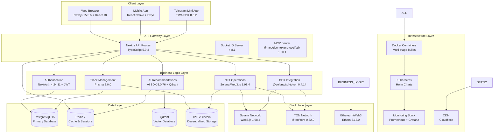
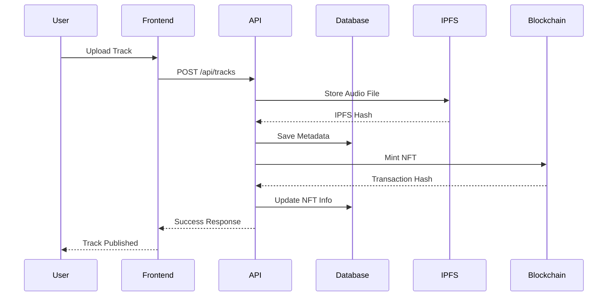

# 🏗️ Диаграмма системы NORMALDANCE

## Обзор архитектуры

NORMALDANCE - это полнофункциональная Web3 музыкальная платформа, объединяющая традиционный стриминг с децентрализованными технологиями блокчейн и IPFS.

## Технологический стек

### Frontend Layer

- **Next.js**: 15.5.6 - React фреймворк для SSR/SSG
- **React**: 18.0.0 - UI библиотека
- **TypeScript**: 5.9.3 - Типизированный JavaScript
- **Tailwind CSS**: 4.1.13 - CSS фреймворк
- **shadcn/ui**: @radix-ui компоненты для UI
- **Three.js**: 0.160.0 - 3D визуализации (@react-three/fiber, @react-three/drei)
- **Socket.IO Client**: 4.8.1 - Real-time коммуникации

### Backend Services

- **Next.js API Routes**: Встроенные API роуты
- **Prisma**: 5.0.0 - ORM для базы данных
- **Socket.IO**: 4.8.1 - WebSocket сервер
- **Winston**: 3.17.0 - Логирование
- **Redis**: ioredis 5.3.2 - Кэширование и сессии
- **JWT**: jsonwebtoken 9.0.0 - Аутентификация

### Blockchain Layer

- **Solana Web3.js**: 1.98.4 - Solana блокчейн интеграция
- **@solana/wallet-adapter**: 0.15.39 - Wallet интеграция
- **@solana/spl-token**: 0.4.14 - SPL токены
- **TON Core**: @ton/core 0.62.0 - TON блокчейн
- **TON Connect**: @tonconnect/sdk 3.3.1 - TON wallet интеграция
- **Ethers**: 6.15.0 - Ethereum/Web3 utilities

### Storage Layer

- **SQLite**: Через Prisma (dev), PostgreSQL (prod)
- **IPFS/Helia**: @helia/unixfs 6.0.1 - Децентрализованное хранение
- **Filecoin**: Интеграция через IPFS
- **Redis**: 7-alpine (demo) - Кэш и сессии

### AI/ML Layer

- **AI SDK**: ai 5.0.76 - Универсальный AI интерфейс
- **Qdrant**: @qdrant/js-client-rest 1.15.1 - Векторная база данных
- **Upstash Vector**: 1.2.2 - Векторные операции

### DevOps & Infrastructure

- **Docker**: Multi-stage builds (Node 20-alpine)
- **PostgreSQL**: 15-alpine (demo/prod)
- **Redis**: 7-alpine
- **Prometheus**: Мониторинг
- **Grafana**: Дашборды
- **Traefik**: Reverse proxy (из существующих docs)

### Testing & Quality

- **Jest**: 29.0.0 - Unit/Integration тесты
- **Playwright**: 1.55.0 - E2E тесты
- **Testing Library**: React testing utilities
- **Husky**: 9.0.0 - Git hooks
- **ESLint**: 8.0.0 - Линтинг (отключен по правилам)

### Security & Monitoring

- **Helmet**: 8.0.0 - Security headers
- **Sentry**: @sentry/nextjs 10.11.0 - Error tracking
- **bcryptjs**: 3.0.2 - Password hashing
- **Mixpanel**: 2.48.0 - Analytics

## Архитектурная диаграмма

## Компоненты системы

### 1. Frontend Applications

- **Web App**: Next.js SPA с SSR для SEO и производительности
- **Mobile App**: React Native с Expo для кросс-платформенности
- **Telegram Mini App**: Веб-приложение в Telegram экосистеме

### 2. API Services

- **REST API**: Next.js API routes для CRUD операций
- **WebSocket**: Real-time обновления через Socket.IO
- **MCP Server**: Model Context Protocol для AI интеграций

### 3. Core Services

- **Authentication**: JWT + wallet-based auth
- **Track Management**: Upload, storage, streaming
- **NFT Operations**: Minting, trading, royalties
- **DEX Integration**: Token swaps, liquidity
- **AI Engine**: Recommendations, content analysis

### 4. Data Storage

- **Primary DB**: PostgreSQL для реляционных данных
- **Cache**: Redis для сессий и частых запросов
- **Vector DB**: Qdrant для AI embeddings
- **Decentralized Storage**: IPFS/Filecoin для контента

### 5. Blockchain Networks

- **Solana**: Основная сеть для быстрых транзакций
- **TON**: Для Telegram интеграции и платежей
- **Ethereum**: Для совместимости с DeFi протоколами

### 6. Infrastructure

- **Containerization**: Docker для изоляции сервисов
- **Orchestration**: Kubernetes для масштабирования
- **Monitoring**: Prometheus/Grafana для observability
- **CDN**: Cloudflare для глобального распределения

## Data Flow

## Безопасность

- **Multi-layer Security**: Input validation, rate limiting, encryption
- **Wallet Authentication**: Cryptographic signatures для Web3
- **API Security**: JWT tokens, CORS, Helmet headers
- **Blockchain Security**: Smart contract audits, secure key management

## Масштабируемость

- **Horizontal Scaling**: Stateless services, container orchestration
- **CDN Integration**: Global content distribution
- **Database Sharding**: Для больших объемов данных
- **Microservices**: Независимое масштабирование компонентов

## Мониторинг и Observability

- **Application Metrics**: Response times, error rates
- **Infrastructure Monitoring**: CPU, memory, disk usage
- **Blockchain Monitoring**: Transaction confirmations, gas usage
- **User Analytics**: Mixpanel для behavioral insights

---

_Диаграмма основана на анализе package.json, Prisma схемы, Docker конфигураций и исходного кода проекта NORMALDANCE._
