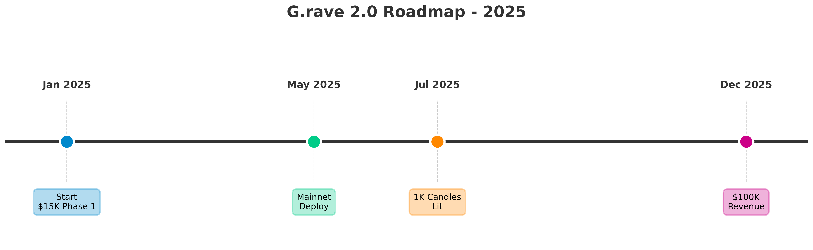

# 📸 Visual Assets Guide for Executive Summary

## Required Visual Elements

### 1. 🎬 3D Vinyl GIF (3 seconds loop)

**Purpose**: Show the killer feature immediately  
**Specs**: 800x600px, <2MB, looping GIF  
**Content**: Eternal spinning vinyl with glow effects

#### How to Create:

**Option A: Screen Recording (Easiest)**
```bash
1. Open http://localhost:3000/grave/demo
2. Use OBS Studio or ScreenToGif
3. Record 3 seconds of vinyl spinning
4. Export as GIF, optimize with ezgif.com
5. Save as: grave_vinyl_demo.gif
```

**Option B: Three.js Export**
```bash
# Install gif.js library
npm install gif.js

# Add to GraveVinyl component:
import GIF from 'gif.js';

const captureGif = () => {
  const gif = new GIF({
    workers: 2,
    quality: 10,
    width: 800,
    height: 600
  });
  
  // Capture 90 frames (3 sec at 30fps)
  for (let i = 0; i < 90; i++) {
    setTimeout(() => {
      gif.addFrame(canvas, {delay: 33});
    }, i * 33);
  }
  
  gif.render();
  gif.on('finished', (blob) => {
    // Download blob as grave_vinyl_demo.gif
  });
};
```

**Option C: Figma Animation**
```bash
1. Screenshot vinyl from /grave/demo
2. Import to Figma
3. Use Figma plugin "Rotato" or "Jitter"
4. Animate 360° rotation
5. Export as GIF
```

---

### 2. 📊 Budget Pie Chart

**Purpose**: Visual budget allocation  
**Specs**: 400x400px, PNG with transparency  
**Content**: 80% Dev / 13% Marketing / 7% Legal

#### How to Create:

**Option A: Online Tool (Fastest)**
```
1. Go to: https://www.meta-chart.com/pie
2. Input data:
   - Development: 80 ($12,000)
   - Marketing: 13 ($2,000)
   - Legal/Professional: 7 ($1,000)
3. Customize:
   - Colors: Blue (#0088CC), Green (#00CC88), Orange (#FF8800)
   - Style: 3D with shadow
   - Labels: Show percentages + amounts
4. Export as PNG
5. Save as: budget_breakdown.png
```

**Option B: Google Sheets**
```
1. Create spreadsheet:
   | Category        | Amount | Percentage |
   |-----------------|--------|------------|
   | Development     | 12000  | 80%        |
   | Marketing       | 2000   | 13%        |
   | Legal/Prof      | 1000   | 7%         |

2. Insert → Chart → Pie chart
3. Customize colors (TON blue theme)
4. Download as image
```

**Option C: Python (matplotlib)**
```python
import matplotlib.pyplot as plt

labels = ['Development\n80%', 'Marketing\n13%', 'Legal\n7%']
sizes = [12000, 2000, 1000]
colors = ['#0088CC', '#00CC88', '#FF8800']
explode = (0.1, 0, 0)  # explode 1st slice

plt.pie(sizes, explode=explode, labels=labels, colors=colors,
        autopct='$%1.0fK', shadow=True, startangle=90)
plt.axis('equal')
plt.savefig('budget_breakdown.png', transparent=True, dpi=300)
```

**Option D: Canva**
```
1. Go to: canva.com
2. Search template: "Pie Chart"
3. Edit data and colors
4. Download as PNG
```

---

### 3. 📈 Timeline Roadmap Graph

**Purpose**: Show clear milestones  
**Specs**: 1200x300px, PNG  
**Content**: Jan → May → Jul → Dec milestones

#### How to Create:

**Option A: Figma Timeline**
```
1. Open Figma
2. Create 1200x300 canvas
3. Draw horizontal line (timeline)
4. Add vertical markers at:
   - Jan 2025: "Start - $15K Phase 1"
   - May 2025: "Mainnet Deploy"
   - Jul 2025: "1K Candles Lit 🕯️"
   - Dec 2025: "$100K Revenue 💰"
5. Add icons (rocket, check, candle, money)
6. Export as PNG
```

**Option B: PowerPoint/Keynote**
```
1. Insert → SmartArt → Process → Basic Timeline
2. Edit text for each milestone
3. Format with TON blue colors
4. Add icons from flaticon.com
5. Export as PNG
```

**Option C: Online Tool**
```
Website: timeline.knightlab.com or venngage.com/timeline

1. Input milestones:
   - Jan 2025: Grant Approved
   - May 2025: Mainnet Launch
   - Jul 2025: 1000 Candles
   - Dec 2025: $100K Revenue
2. Customize style
3. Export image
```

**Option D: ASCII Art (Already in document)**
```
Keep the ASCII version for markdown, add visual for PDF
```

---

### 4. 🔲 QR Code to Demo

**Purpose**: Direct access to working demo  
**Specs**: 300x300px, PNG  
**Content**: Link to demo.normaldance.com/grave/demo

#### How to Create:

**Option A: Online Generator (Easiest)**
```
1. Go to: https://www.qr-code-generator.com/
2. Input URL: https://demo.normaldance.com/grave/demo
   (or your actual demo URL)
3. Customize:
   - Add logo in center (NORMALDANCE logo)
   - Colors: Black/TON blue
   - Style: Rounded corners
4. Download PNG (high resolution)
5. Save as: demo_qr_code.png
```

**Option B: QR Code Monkey**
```
Website: https://www.qrcode-monkey.com/

1. Enter URL
2. Set colors (TON blue #0088CC)
3. Upload logo (optional)
4. Download as PNG (300 DPI)
```

**Option C: Command Line**
```bash
# Install qrencode
npm install -g qrcode

# Generate QR code
qrcode -o demo_qr_code.png "https://demo.normaldance.com/grave/demo"
```

**Option D: Python**
```python
import qrcode

qr = qrcode.QRCode(version=1, box_size=10, border=5)
qr.add_data('https://demo.normaldance.com/grave/demo')
qr.make(fit=True)

img = qr.make_image(fill_color="#0088CC", back_color="white")
img.save('demo_qr_code.png')
```

---

## File Organization

```
grants/assets/
├── grave_vinyl_demo.gif      (3-sec looping animation)
├── budget_breakdown.png       (pie chart)
├── timeline_roadmap.png       (milestone graph)
└── demo_qr_code.png          (QR to demo)
```

---

## Inserting into PDF

### Method 1: Markdown with Images
```markdown




```

### Method 2: Manual PDF Editing
```
1. Convert markdown to PDF (pandoc)
2. Open in Adobe Acrobat or similar
3. Insert images at marked placeholders
4. Adjust size/position
5. Save final PDF
```

### Method 3: Google Docs
```
1. Convert markdown to Google Doc
2. Insert → Image → Upload from computer
3. Position at placeholders
4. Resize to fit
5. File → Download → PDF
```

---

## Quality Checklist

Before finalizing visuals:

- [ ] **3D Vinyl GIF**
  - [ ] Loops smoothly (no jump)
  - [ ] Shows glow effect clearly
  - [ ] File size < 2MB
  - [ ] Readable at 800x600
  
- [ ] **Budget Pie Chart**
  - [ ] Percentages add to 100%
  - [ ] Colors match TON branding
  - [ ] Labels are readable
  - [ ] Shows dollar amounts
  
- [ ] **Timeline Graph**
  - [ ] All dates correct
  - [ ] Milestones are specific
  - [ ] Icons are professional
  - [ ] Not too cluttered
  
- [ ] **QR Code**
  - [ ] Scans correctly on phone
  - [ ] Links to working demo
  - [ ] High resolution (no pixelation)
  - [ ] Includes call-to-action text

---

## Alternative: Figma Template

I can create a Figma template with all 4 visuals pre-designed:

```
1. Open Figma template: figma.com/file/xxx
2. Replace placeholder GIF with your recording
3. Update timeline dates if needed
4. Export all as PNG/GIF
5. Insert into Executive Summary
```

**Would you like me to create this Figma template?**

---

## Quick Command: Create All Assets

```bash
# Create assets directory
mkdir -p grants/assets

# Placeholder for now (replace with actual generation)
echo "Record GIF from http://localhost:3000/grave/demo" > grants/assets/README.txt
```

---

## Priority Order

**Must-Have (for submission):**
1. ✅ QR Code (5 min to generate)
2. ✅ Budget Pie Chart (10 min)

**Nice-to-Have:**
3. ⏳ Timeline Graph (15 min)
4. ⏳ 3D Vinyl GIF (30 min if need screen recording)

**Total time: 30-60 minutes to create all 4 visuals**

---

## Next Steps

1. ✅ Decide which creation method to use
2. ✅ Generate all 4 assets
3. ✅ Test QR code scans on phone
4. ✅ Insert into Executive Summary PDF
5. ✅ Review final document
6. ✅ Submit to TON Foundation

**Ready to create these visuals?** Let me know which method you prefer and I can guide you through it step-by-step.
